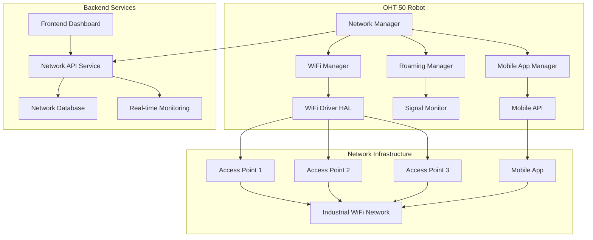

# 🔌 **NETWORK MANAGEMENT SPECIFICATION - OHT-50**

**Phiên bản:** v1.0  
**Ngày tạo:** 2025-01-28  
**Mục tiêu:** Khắc phục Critical Issue #142 - OHT-50 Robot WiFi Connectivity  
**Trạng thái:** DRAFT - Cần review và approve

---

## 📋 **TỔNG QUAN**

### **Vấn đề cần giải quyết:**
OHT-50 robots là **mobile robots** di chuyển trên đường ray overhead trong môi trường công nghiệp. Hiện tại thiếu khả năng quản lý mạng WiFi, gây cản trở việc di chuyển đáng tin cậy.

### **Mục tiêu:**
- ✅ **WiFi Connection Management** - Kết nối/ngắt kết nối WiFi
- ✅ **Network Scanning** - Quét mạng WiFi có sẵn
- ✅ **Roaming Support** - Handover giữa các access points
- ✅ **Mobile App Support** - Hỗ trợ kết nối mobile app
- ✅ **Performance Monitoring** - Giám sát hiệu suất mạng
- ✅ **Real-time Status** - Trạng thái mạng thời gian thực

---

## 🏗️ **KIẾN TRÚC HỆ THỐNG**

### **System Architecture Diagram:**


### **Component Responsibilities:**

#### **1. Network Manager (Core)**
- **Chức năng:** Điều phối toàn bộ network management system
- **Trách nhiệm:** Quản lý trạng thái, cấu hình, điều phối sub-managers
- **Interface:** REST API + WebSocket cho real-time updates

#### **2. WiFi Manager**
- **Chức năng:** Quản lý kết nối WiFi
- **Trách nhiệm:** Scan, connect, disconnect, monitor signal strength
- **Interface:** HAL layer với WiFi driver

#### **3. Roaming Manager**
- **Chức năng:** Quản lý handover giữa các access points
- **Trách nhiệm:** Monitor signal quality, trigger handover, maintain connectivity
- **Interface:** Signal monitoring + WiFi Manager integration

#### **4. Mobile App Manager**
- **Chức năng:** Hỗ trợ kết nối mobile app
- **Trách nhiệm:** Enable/disable mobile connectivity, manage mobile sessions
- **Interface:** Mobile API endpoints

---

## 🔧 **TECHNICAL IMPLEMENTATION**

### **Backend Implementation:**

#### **1. Network Manager Service**
```python
# app/managers/network_manager.py
class NetworkManager:
    def __init__(self):
        self.wifi_manager = WiFiManager()
        self.roaming_manager = RoamingManager()
        self.mobile_manager = MobileManager()
        self.status = NetworkStatus()
        
    async def get_network_status(self) -> NetworkStatus:
        """Get current network status"""
        pass
        
    async def connect_wifi(self, ssid: str, password: str) -> bool:
        """Connect to WiFi network"""
        pass
        
    async def disconnect_wifi(self) -> bool:
        """Disconnect from WiFi"""
        pass
        
    async def scan_networks(self) -> List[WiFiNetwork]:
        """Scan for available WiFi networks"""
        pass
        
    async def enable_roaming(self, enabled: bool) -> bool:
        """Enable/disable roaming support"""
        pass
        
    async def enable_mobile_app(self, enabled: bool) -> bool:
        """Enable/disable mobile app support"""
        pass
```

#### **2. WiFi Manager Service**
```python
# app/managers/wifi_manager.py
class WiFiManager:
    def __init__(self):
        self.connection_status = WiFiConnectionStatus.DISCONNECTED
        self.signal_strength = 0
        self.current_ssid = None
        
    async def scan_networks(self) -> List[WiFiNetwork]:
        """Scan for available WiFi networks"""
        pass
        
    async def connect(self, ssid: str, password: str) -> bool:
        """Connect to WiFi network"""
        pass
        
    async def disconnect(self) -> bool:
        """Disconnect from current WiFi"""
        pass
        
    async def get_signal_strength(self) -> int:
        """Get current signal strength in dBm"""
        pass
        
    async def get_connection_status(self) -> WiFiConnectionStatus:
        """Get current connection status"""
        pass
```

#### **3. Roaming Manager Service**
```python
# app/managers/roaming_manager.py
class RoamingManager:
    def __init__(self):
        self.roaming_enabled = False
        self.signal_threshold = -70  # dBm
        self.handover_in_progress = False
        
    async def enable_roaming(self, enabled: bool) -> bool:
        """Enable/disable roaming support"""
        pass
        
    async def monitor_signal_quality(self) -> SignalQuality:
        """Monitor signal quality and trigger handover if needed"""
        pass
        
    async def trigger_handover(self, target_ap: AccessPoint) -> bool:
        """Trigger handover to target access point"""
        pass
        
    async def get_roaming_status(self) -> RoamingStatus:
        """Get current roaming status"""
        pass
```

#### **4. Mobile App Manager Service**
```python
# app/managers/mobile_manager.py
class MobileManager:
    def __init__(self):
        self.mobile_enabled = False
        self.mobile_port = 8080
        self.active_sessions = []
        
    async def enable_mobile_app(self, enabled: bool) -> bool:
        """Enable/disable mobile app support"""
        pass
        
    async def get_mobile_status(self) -> MobileStatus:
        """Get mobile app status"""
        pass
        
    async def manage_mobile_session(self, session_id: str) -> bool:
        """Manage mobile app session"""
        pass
```

### **Firmware Implementation:**

#### **1. Network Manager (C)**
```c
// firmware/managers/network_manager.c
typedef struct {
    bool wifi_enabled;
    char wifi_ssid[32];
    char wifi_password[64];
    int wifi_security_type;
    int signal_strength;
    bool roaming_enabled;
    bool mobile_app_enabled;
} network_config_t;

// Network Manager Functions
int network_manager_init(void);
int network_manager_connect_wifi(const char *ssid, const char *password);
int network_manager_disconnect_wifi(void);
int network_manager_scan_networks(wifi_network_t *networks, int max_count);
int network_manager_get_status(network_status_t *status);
int network_manager_enable_roaming(bool enable);
int network_manager_enable_mobile_app(bool enable);
```

#### **2. WiFi Manager (C)**
```c
// firmware/managers/wifi_manager.c
typedef struct {
    char ssid[32];
    char bssid[18];
    int signal_strength;
    int frequency;
    int channel;
    char security[16];
    bool hidden;
} wifi_network_t;

// WiFi Management Functions
int wifi_manager_init(void);
int wifi_manager_scan_networks(wifi_network_t *networks, int max_count);
int wifi_manager_connect(const char *ssid, const char *password);
int wifi_manager_disconnect(void);
int wifi_manager_get_signal_strength(void);
int wifi_manager_get_connection_status(void);
```

#### **3. WiFi HAL (C)**
```c
// firmware/hal/hal_wifi.c
typedef struct {
    int wifi_fd;
    char interface_name[16];
    bool initialized;
    int signal_strength;
    char current_ssid[32];
} wifi_hal_t;

// WiFi HAL Functions
int hal_wifi_init(wifi_hal_t *wifi);
int hal_wifi_scan(wifi_hal_t *wifi, wifi_network_t *networks, int max_count);
int hal_wifi_connect(wifi_hal_t *wifi, const char *ssid, const char *password);
int hal_wifi_disconnect(wifi_hal_t *wifi);
int hal_wifi_get_signal_strength(wifi_hal_t *wifi);
int hal_wifi_get_status(wifi_hal_t *wifi, wifi_status_t *status);
```

---

## 📊 **API SPECIFICATION**

### **Network Status API**
```http
GET /api/v1/network/status
Authorization: None (Public access)
Response: NetworkStatus
```

### **WiFi Management APIs**
```http
GET /api/v1/network/wifi/scan
Authorization: None (Public access)
Response: List<WiFiNetwork>

POST /api/v1/network/wifi/connect
Authorization: Bearer token (Operator level)
Request: {"ssid": "string", "password": "string", "security_type": "WPA2"}
Response: {"success": boolean, "message": "string"}

POST /api/v1/network/wifi/disconnect
Authorization: Bearer token (Operator level)
Response: {"success": boolean, "message": "string"}
```

### **Roaming Management APIs**
```http
POST /api/v1/network/roaming/enable
Authorization: Bearer token (Admin level)
Request: {"enabled": boolean, "threshold": -70}
Response: {"success": boolean, "message": "string"}

GET /api/v1/network/roaming/status
Authorization: None (Public access)
Response: RoamingStatus
```

### **Mobile App APIs**
```http
POST /api/v1/network/mobile/enable
Authorization: Bearer token (Admin level)
Request: {"enabled": boolean, "port": 8080}
Response: {"success": boolean, "message": "string"}

GET /api/v1/network/mobile/status
Authorization: None (Public access)
Response: MobileStatus
```

### **Performance Monitoring APIs**
```http
GET /api/v1/network/performance
Authorization: None (Public access)
Response: NetworkPerformance

GET /api/v1/network/health
Authorization: None (Public access)
Response: NetworkHealth
```

---

## 🗄️ **DATABASE SCHEMA**

### **Network Configuration Table**
```sql
CREATE TABLE network_config (
    id INTEGER PRIMARY KEY AUTOINCREMENT,
    robot_id VARCHAR(50) NOT NULL,
    wifi_enabled BOOLEAN DEFAULT FALSE,
    wifi_ssid VARCHAR(32),
    wifi_password_encrypted TEXT,
    wifi_security_type VARCHAR(16),
    roaming_enabled BOOLEAN DEFAULT FALSE,
    roaming_threshold INTEGER DEFAULT -70,
    mobile_enabled BOOLEAN DEFAULT FALSE,
    mobile_port INTEGER DEFAULT 8080,
    created_at TIMESTAMP DEFAULT CURRENT_TIMESTAMP,
    updated_at TIMESTAMP DEFAULT CURRENT_TIMESTAMP
);
```

### **WiFi Networks Table**
```sql
CREATE TABLE wifi_networks (
    id INTEGER PRIMARY KEY AUTOINCREMENT,
    robot_id VARCHAR(50) NOT NULL,
    ssid VARCHAR(32) NOT NULL,
    bssid VARCHAR(18) NOT NULL,
    signal_strength INTEGER,
    frequency INTEGER,
    channel INTEGER,
    security VARCHAR(16),
    hidden BOOLEAN DEFAULT FALSE,
    last_seen TIMESTAMP DEFAULT CURRENT_TIMESTAMP
);
```

### **Network Performance Table**
```sql
CREATE TABLE network_performance (
    id INTEGER PRIMARY KEY AUTOINCREMENT,
    robot_id VARCHAR(50) NOT NULL,
    signal_strength INTEGER,
    latency_ms INTEGER,
    throughput_mbps DECIMAL(5,2),
    packet_loss_percent DECIMAL(5,2),
    timestamp TIMESTAMP DEFAULT CURRENT_TIMESTAMP
);
```

---

## 🔒 **SECURITY REQUIREMENTS**

### **Authentication Levels:**
- **Read Operations:** No auth required (public access)
- **Write Operations:** Bearer token required (Operator level)
- **Admin Operations:** Bearer token required (Admin level)

### **Security Implementation:**
- **WiFi Credentials:** Encrypted storage using AES-256
- **API Security:** JWT token-based authentication
- **Network Security:** WPA2/WPA3 support only
- **Input Validation:** Comprehensive parameter validation
- **Rate Limiting:** 1000 requests/minute per IP

---

## 📊 **PERFORMANCE REQUIREMENTS**

### **Response Time Targets:**
- **Network Status:** < 100ms
- **WiFi Scan:** < 10 seconds
- **WiFi Connect:** < 5 seconds
- **Network Performance:** < 200ms
- **Network Health:** < 100ms

### **Network Performance:**
- **Signal Strength:** > -70 dBm (reliable connection)
- **Latency:** < 10ms (local network)
- **Throughput:** > 50Mbps (sustained)
- **Roaming Time:** < 2 seconds (handover)

---

## 🧪 **TESTING REQUIREMENTS**

### **Unit Tests:**
- Network Manager functions
- WiFi Manager functions
- Roaming Manager functions
- Mobile Manager functions
- API endpoint validation
- Error handling scenarios

### **Integration Tests:**
- End-to-end network connectivity
- Roaming functionality
- Mobile app integration
- Performance testing
- Security validation

### **System Tests:**
- Real-world network scenarios
- Stress testing
- Long-running stability tests
- Multi-robot coordination

---

## 📚 **DOCUMENTATION REQUIREMENTS**

### **Technical Documentation:**
1. **API Documentation** - Complete endpoint specifications
2. **Firmware HAL Documentation** - Hardware abstraction layer
3. **Integration Guide** - System integration procedures
4. **Testing Procedures** - Test execution guidelines

### **User Documentation:**
1. **Network Configuration Guide** - Setup and configuration
2. **Troubleshooting Guide** - Common issues and solutions
3. **Mobile App Usage Guide** - Mobile app integration
4. **Performance Monitoring Guide** - Monitoring and optimization

---

## 🚀 **IMPLEMENTATION TIMELINE**

### **Week 1: Core Implementation**
- **Day 1-2:** Backend Network Manager + Database Schema
- **Day 3-4:** Firmware WiFi HAL + Basic Network Manager
- **Day 5-7:** API Integration + Basic Testing

### **Week 2: Advanced Features**
- **Day 1-3:** Roaming Manager Implementation
- **Day 4-5:** Mobile App Manager
- **Day 6-7:** Performance Monitoring

### **Week 3: Testing & Documentation**
- **Day 1-3:** Comprehensive Testing
- **Day 4-5:** Documentation Update
- **Day 6-7:** Final Integration & Validation

---

## 🎯 **ACCEPTANCE CRITERIA**

### **✅ Must Have Features:**
- [ ] **WiFi Connection Management** - Connect/disconnect to WiFi networks
- [ ] **Network Scanning** - Scan for available WiFi networks
- [ ] **Network Status Monitoring** - Real-time network status
- [ ] **Roaming Support** - Seamless handover between access points
- [ ] **Mobile App Support** - Enable mobile app connectivity
- [ ] **Performance Monitoring** - Signal strength, latency, throughput
- [ ] **Authentication** - Proper token validation for write operations
- [ ] **Error Handling** - Comprehensive error responses
- [ ] **Testing** - Unit and integration tests
- [ ] **Documentation** - Complete API documentation

### **🎯 Success Metrics:**
- **API Response Time:** < 200ms for all endpoints
- **WiFi Connection Time:** < 5 seconds
- **Roaming Time:** < 2 seconds
- **Signal Strength:** > -70 dBm
- **Test Coverage:** > 90% for new functions
- **Error Rate:** < 1% for valid requests

---

## 🔗 **RELATED DOCUMENTS**

- **Critical Issue #142:** [GitHub Issue](https://github.com/kimlam2010/OHT_V2/issues/142)
- **OHT-50 Architecture:** `docs/03-ARCHITECTURE/`
- **Backend Development Rules:** `docs/BACKEND_DEVELOPMENT_RULES.md`
- **Firmware Development Guide:** `docs/EMBED_COMPLETE_GUIDE.md`

---

**📝 Changelog:**
- **v1.0 (2025-01-28):** Initial specification creation
- **Next:** Review and approval by CTO and team leads

---

**🏷️ Labels:** `critical`, `network`, `wifi`, `oht50-robot`, `connectivity`  
**👥 Reviewers:** CTO, Backend Team Lead, Firmware Team Lead  
**📅 Due Date:** 2025-02-04 (1 week)  
**🎯 Milestone:** OHT-50 Robot Connectivity Complete
