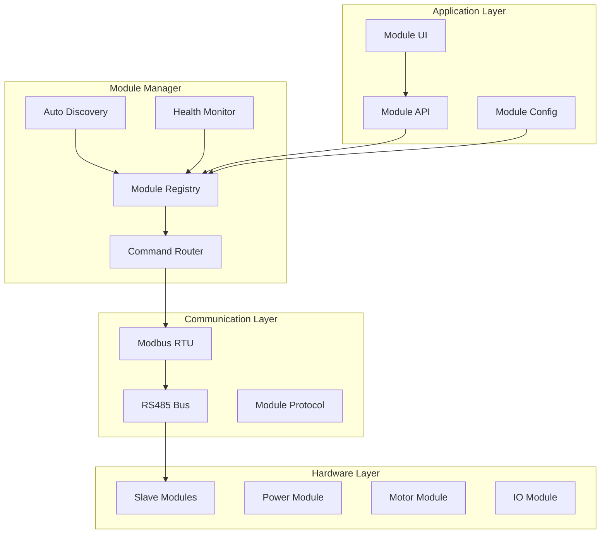
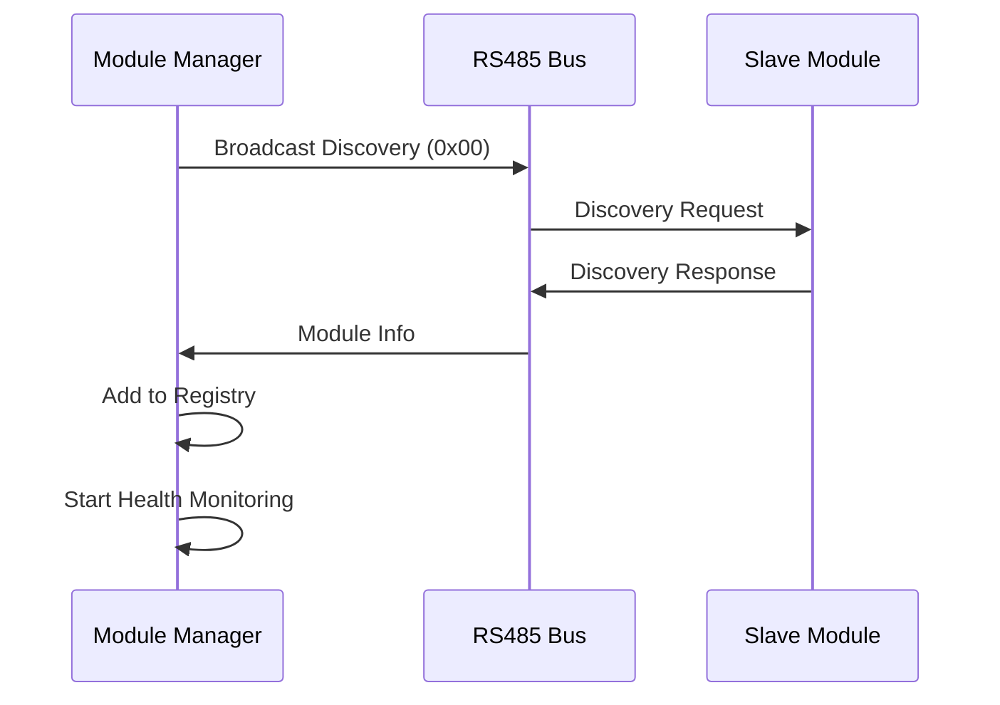

# MODULE MANAGEMENT SPECIFICATION - OHT-50 Master Module

**Phiên bản:** v2.0  
**Ngày tạo:** 2025-01-28  
**Team:** FW Team  
**Trạng thái:** 🔧 PRODUCTION READY

---

## 🎯 **TỔNG QUAN**

Đặc tả này định nghĩa hệ thống quản lý module cho OHT-50 Master Module, bao gồm auto-discovery, health monitoring, command routing và configuration management.

---

## 🔧 **MODULE MANAGEMENT ARCHITECTURE**

### **Module Management Layers:**


---

## 📋 **MODULE REGISTRY**

### **Module Information Structure:**
```c
// Module Information
typedef struct {
    uint8_t address;           // Module address (0x02-0xFF)
    uint8_t type;              // Module type
    uint8_t status;            // Module status
    uint8_t version[4];        // Firmware version
    uint32_t last_seen;        // Last seen timestamp
    uint16_t error_count;      // Error count
    uint16_t success_count;    // Success count
    uint32_t response_time_avg; // Average response time
    uint8_t config_valid;      // Configuration valid
    void *config_data;         // Configuration data
    uint16_t config_size;      // Configuration size
} module_info_t;

// Module Status
typedef enum {
    MODULE_STATUS_OFFLINE = 0,
    MODULE_STATUS_ONLINE = 1,
    MODULE_STATUS_ERROR = 2,
    MODULE_STATUS_WARNING = 3,
    MODULE_STATUS_MAINTENANCE = 4
} module_status_t;

// Module Types
typedef enum {
    MODULE_TYPE_UNKNOWN = 0,
    MODULE_TYPE_POWER = 1,     // 0x02 - Power module
    MODULE_TYPE_MOTOR = 2,     // 0x03 - Motor module
    MODULE_TYPE_IO = 3,        // 0x04 - IO module
    MODULE_TYPE_DOCK = 4,      // 0x05 - Dock module
    MODULE_TYPE_DIDO = 5,      // 0x06 - DI/DO module
    MODULE_TYPE_AI = 6,        // 0x07 - AI module
    MODULE_TYPE_CUSTOM = 7     // 0x08+ - Custom modules
} module_type_t;
```

### **Module Registry Functions:**
```c
// Module Registry Functions
int module_registry_init(void);
int module_registry_add_module(module_info_t *module);
int module_registry_remove_module(uint8_t address);
int module_registry_get_module(uint8_t address, module_info_t *module);
int module_registry_get_all_modules(module_info_t *modules, uint8_t *count);
int module_registry_update_module(module_info_t *module);
int module_registry_clear(void);
```

---

## 🔍 **AUTO DISCOVERY**

### **Discovery Process:**


### **Discovery Configuration:**
```c
// Discovery Configuration
typedef struct {
    uint32_t discovery_timeout_ms;      // Discovery timeout
    uint8_t discovery_retry_count;      // Retry count
    uint32_t discovery_interval_ms;     // Discovery interval
    uint8_t auto_discovery_enabled;     // Auto discovery
    uint8_t broadcast_address;          // Broadcast address (0x00)
} discovery_config_t;

// Discovery Functions
int discovery_init(discovery_config_t *config);
int discovery_start(void);
int discovery_stop(void);
int discovery_broadcast(void);
int discovery_scan_address(uint8_t address);
int discovery_get_results(module_info_t *modules, uint8_t *count);
```

---

## 🧭 **MODULE ADDRESS MAP & IDENTIFICATION**

### **Địa chỉ mặc định (RS485/Modbus RTU):**

| Module | Address (hex) | Ghi chú |
|--------|---------------|---------|
| Power | 0x02 | Nguồn & đo lường |
| Motor | 0x03 | Điều khiển chuyển động |
| IO | 0x04 | Digital/Analog I/O |
| Dock | 0x05 | Cơ cấu docking |
| DI/DO | 0x06 | Module DI/DO rời |
| AI | 0x07 | Thị giác/ML/Planning |

- **Broadcast address:** `0x00` (dùng cho khung DISCOVERY)
- **Phạm vi quét địa chỉ tuần tự:** `0x02` → `0x07` (fallback nếu broadcast không đủ phản hồi)

### **Khung phản hồi DISCOVERY (chuẩn hoá):**
```c
typedef struct {
    uint8_t address;             // Địa chỉ slave hiện tại
    uint8_t module_type;         // Theo module_type_t
    uint8_t version_major;       // Phiên bản FW
    uint8_t version_minor;
    uint8_t version_patch;
    uint32_t capabilities;       // Bitmask năng lực
} discovery_info_t;
```

### **Thuật toán AUTO-DISCOVERY (FW triển khai):**
1. Gửi broadcast `CMD_TYPE_DISCOVERY` tới `0x00`.
2. Thu phản hồi trong `discovery_timeout_ms`; thêm vào Registry các module hợp lệ.
3. Nếu thiếu module mong đợi, quét tuần tự `0x02`→`0x07` (DISCOVERY/STATUS) để bổ sung.
4. Nếu trùng địa chỉ: ghi log lỗi, chọn phản hồi đầu tiên (first-response-wins), đánh dấu cảnh báo `MODULE_STATUS_WARNING` cho địa chỉ trùng.
5. Khởi động Health Monitoring cho các module ONLINE.

### **Phân công trách nhiệm:**
- **FW Team:** Implement `discovery_*`, cập nhật `module_registry_*`, xử lý trùng địa chỉ, lưu cấu hình bền vững.
- **EMBED Team:** Đảm bảo mỗi module flash đúng địa chỉ mặc định trên bus (0x02–0x07) và không trùng.
- **PM:** Lên kế hoạch ưu tiên: discovery → registry → health monitor; checklist HIL cho kịch bản thiếu/trùng module.

> Tham chiếu: `docs/FIRMWARE/02_ARCHITECTURE/MODULES/module_architecture.md` (Module Types) và `docs/FIRMWARE/02_ARCHITECTURE/MODULES/register_map_summary.md` (bảng register tổng hợp).

---

## 💓 **HEALTH MONITORING**

### **Health Monitoring System:**
```c
// Health Monitoring Configuration
typedef struct {
    uint32_t heartbeat_interval_ms;     // Heartbeat interval
    uint32_t health_timeout_ms;         // Health timeout
    uint8_t health_check_enabled;       // Health check enabled
    uint8_t auto_recovery_enabled;      // Auto recovery
    uint16_t max_error_count;           // Max error count
} health_monitor_config_t;

// Health Status
typedef enum {
    HEALTH_STATUS_UNKNOWN = 0,
    HEALTH_STATUS_GOOD = 1,
    HEALTH_STATUS_WARNING = 2,
    HEALTH_STATUS_ERROR = 3,
    HEALTH_STATUS_CRITICAL = 4
} health_status_t;

// Health Monitoring Functions
int health_monitor_init(health_monitor_config_t *config);
int health_monitor_start(void);
int health_monitor_stop(void);
int health_monitor_check_module(uint8_t address);
int health_monitor_get_status(uint8_t address, health_status_t *status);
int health_monitor_register_callback(void (*callback)(uint8_t, health_status_t));
```

---

## 📡 **COMMAND ROUTING**

### **Command Structure:**
```c
// Module Command
typedef struct {
    uint8_t address;           // Target module address
    uint8_t command_type;      // Command type
    uint16_t command_id;       // Command ID
    uint8_t *data;            // Command data
    uint16_t data_length;     // Data length
    uint32_t timeout_ms;      // Command timeout
} module_command_t;

// Command Response
typedef struct {
    uint8_t address;           // Source module address
    uint8_t command_type;      // Command type
    uint16_t command_id;       // Command ID
    uint8_t status;           // Response status
    uint8_t *data;            // Response data
    uint16_t data_length;     // Data length
    uint32_t response_time_ms; // Response time
} module_response_t;

// Command Types
typedef enum {
    CMD_TYPE_READ = 0x01,      // Read data
    CMD_TYPE_WRITE = 0x02,     // Write data
    CMD_TYPE_EXECUTE = 0x03,   // Execute command
    CMD_TYPE_STATUS = 0x04,    // Get status
    CMD_TYPE_CONFIG = 0x05,    // Configuration
    CMD_TYPE_RESET = 0x06,     // Reset module
    CMD_TYPE_DISCOVERY = 0x07  // Discovery
} command_type_t;
```

### **Command Routing Functions:**
```c
// Command Routing Functions
int command_router_init(void);
int command_router_send_command(module_command_t *command);
int command_router_send_broadcast(module_command_t *command);
int command_router_register_handler(uint8_t command_type, void (*handler)(module_response_t *));
int command_router_get_response(uint16_t command_id, module_response_t *response);
int command_router_cancel_command(uint16_t command_id);
```

---

## 🔧 **MODULE CONFIGURATION**

### **Configuration Management:**
```c
// Module Configuration
typedef struct {
    uint8_t address;           // Module address
    uint8_t type;              // Module type
    uint8_t config_version;    // Configuration version
    uint32_t config_timestamp; // Configuration timestamp
    void *config_data;         // Configuration data
    uint16_t config_size;      // Configuration size
    uint8_t config_valid;      // Configuration valid
} module_config_t;

// Configuration Functions
int module_config_init(void);
int module_config_load(uint8_t address, module_config_t *config);
int module_config_save(uint8_t address, module_config_t *config);
int module_config_validate(uint8_t address, module_config_t *config);
int module_config_reset(uint8_t address);
int module_config_backup(void);
int module_config_restore(void);
```

---

## 📊 **MODULE STATISTICS**

### **Statistics Tracking:**
```c
// Module Statistics
typedef struct {
    uint8_t address;           // Module address
    uint32_t uptime_ms;        // Module uptime
    uint32_t command_count;    // Total commands
    uint32_t success_count;    // Successful commands
    uint32_t error_count;      // Error count
    uint32_t response_time_avg; // Average response time
    uint32_t response_time_min; // Minimum response time
    uint32_t response_time_max; // Maximum response time
    uint32_t last_command_time; // Last command time
    uint32_t last_response_time; // Last response time
} module_statistics_t;

// Statistics Functions
int module_stats_init(void);
int module_stats_update(uint8_t address, module_response_t *response);
int module_stats_get(uint8_t address, module_statistics_t *stats);
int module_stats_reset(uint8_t address);
int module_stats_export(const char *filename);
```

---

## 🚨 **ERROR HANDLING**

### **Error Types:**
```c
// Module Error Types
typedef enum {
    MODULE_ERROR_NONE = 0,
    MODULE_ERROR_TIMEOUT = 1,      // Communication timeout
    MODULE_ERROR_CRC = 2,          // CRC error
    MODULE_ERROR_INVALID_RESPONSE = 3, // Invalid response
    MODULE_ERROR_CONFIG_INVALID = 4,   // Invalid configuration
    MODULE_ERROR_HARDWARE_FAULT = 5,   // Hardware fault
    MODULE_ERROR_COMMUNICATION = 6     // Communication error
} module_error_type_t;

// Error Handling Functions
int module_error_init(void);
int module_error_handle(uint8_t address, module_error_type_t error_type);
int module_error_get_count(uint8_t address, uint16_t *count);
int module_error_clear(uint8_t address);
int module_error_register_handler(void (*handler)(uint8_t, module_error_type_t));
```

---

## 🔄 **SAFETY INTEGRATION**

### **Safety Event Integration:**
```c
// Safety Event Types
typedef enum {
    SAFETY_EVENT_MODULE_OFFLINE = 0,
    SAFETY_EVENT_MODULE_TIMEOUT = 1,
    SAFETY_EVENT_MODULE_FAULT = 2,
    SAFETY_EVENT_CRITICAL_MODULE_LOST = 3
} safety_event_type_t;

// Safety Integration Functions
int safety_integration_init(void);
int safety_integration_emit_event(safety_event_type_t event_type, uint8_t module_address);
int safety_integration_register_handler(void (*handler)(safety_event_type_t, uint8_t));
```

---

## 📡 **COMMUNICATION LED INTEGRATION**

### **COMM LED Patterns:**
```c
// COMM LED States
typedef enum {
    COMM_LED_OFF = 0,          // No communication
    COMM_LED_BLINK_SLOW = 1,   // Scanning/Discovery
    COMM_LED_ON = 2,           // Communication active
    COMM_LED_BLINK_FAST = 3,   // Warning/Error
    COMM_LED_PULSE = 4         // Critical error
} comm_led_state_t;

// COMM LED Functions
int comm_led_init(void);
int comm_led_set_state(comm_led_state_t state);
int comm_led_update_based_on_modules(uint8_t online_count, uint8_t total_count);
```

---

## 📋 **PERFORMANCE REQUIREMENTS**

### **Performance Metrics:**
```c
// Performance Requirements
#define MODULE_DISCOVERY_TIMEOUT_MS      10000   // Discovery timeout
#define MODULE_HEARTBEAT_INTERVAL_MS     1000    // Heartbeat interval
#define MODULE_COMMAND_TIMEOUT_MS        5000    // Command timeout
#define MODULE_MAX_RETRY_COUNT           3       // Max retry count
#define MODULE_MAX_MODULES               254     // Max modules
#define MODULE_RESPONSE_TIME_TARGET_MS   100     // Target response time
```

---

## 📋 **TASK MAPPING CHO PM**

### **Firmware Team Tasks:**
- [ ] Implement module registry
- [ ] Implement auto discovery
- [ ] Implement health monitoring
- [ ] Implement command routing
- [ ] Implement configuration management
- [ ] Implement statistics tracking
- [ ] Implement error handling
- [ ] Implement safety integration
- [ ] Implement COMM LED integration
- [ ] Unit tests cho module management

### **Backend Team Tasks:**
- [ ] Implement module API
- [ ] Implement module monitoring
- [ ] Implement module configuration API
- [ ] Module management integration testing

### **Frontend Team Tasks:**
- [ ] Implement module status UI
- [ ] Implement module configuration UI
- [ ] Implement module statistics display
- [ ] Real-time module monitoring

### **System Integration Tasks:**
- [ ] Module management integration testing
- [ ] End-to-end module testing
- [ ] Performance testing
- [ ] Stress testing

---

## 📚 **REFERENCES**

### **Related Documents:**
- `GPIO_PIN_MAPPING_SPEC.md` - GPIO pin mapping
- `STARTUP_SEQUENCE_SPEC.md` - Startup sequence
- `SAFETY_SPEC.md` - Safety system specification
- `../02_ARCHITECTURE/module_architecture.md` - Module architecture

### **Standards:**
- Modbus RTU Protocol
- RS485 Communication Standards
- Module Communication Protocol

---

## 📝 **CHANGELOG**

### **v2.0 (2025-01-28):**
- ✅ Updated for new module architecture
- ✅ Added safety integration
- ✅ Added COMM LED integration
- ✅ Added performance requirements
- ✅ Added comprehensive error handling
- ✅ Added statistics tracking
- ✅ Added configuration management
- ✅ Added task mapping for PM

### **v1.0 (2025-01-27):**
- ✅ Initial module management specification
- ✅ Basic auto-discovery design

---

**🚨 Lưu ý:** Module management phải đảm bảo tính ổn định và khả năng mở rộng cho nhiều loại module.


