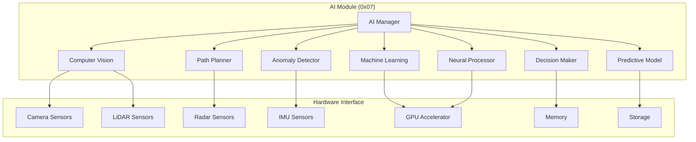

# AI Module Specification - OHT-50 Master Module (Phiên bản 1.0)

**Phiên bản:** v1.0  
**Ngày tạo:** 2025-01-28  
**Team:** FW Team  
**Trạng thái:** 🤖 PRODUCTION READY

---

## 🎯 **TỔNG QUAN AI MODULE**

### **Module Information:**
- **Address:** 0x07
- **Type:** MODULE_TYPE_AI
- **Function:** Artificial Intelligence và machine learning
- **Protocol:** Modbus RTU
- **Baudrate:** 115200 bps

### **Mục tiêu:**
- Computer vision và image processing
- Object detection và recognition
- Path planning và navigation
- Predictive maintenance
- Anomaly detection
- Decision making support

---

## 🤖 **AI MODULE ARCHITECTURE**

### **Module Structure:**


---

## 📊 **AI MODULE REGISTERS**

### **Modbus Register Map:**
```c
// AI Module Register Map (0x07)
#define AI_REG_STATUS                0x0000  // Module status
#define AI_REG_AI_STATUS             0x0001  // AI processing status
#define AI_REG_OBJECT_COUNT          0x0002  // Detected object count
#define AI_REG_OBJECT_DATA           0x0003  // Object data (16 objects)
#define AI_REG_PATH_STATUS           0x0013  // Path planning status
#define AI_REG_PATH_DATA             0x0014  // Path data (32 points)
#define AI_REG_PREDICTION_STATUS     0x0034  // Prediction status
#define AI_REG_PREDICTION_DATA       0x0035  // Prediction data
#define AI_REG_ANOMALY_STATUS        0x0036  // Anomaly detection status
#define AI_REG_ANOMALY_SCORE         0x0037  // Anomaly score
#define AI_REG_DECISION_STATUS       0x0038  // Decision status
#define AI_REG_DECISION_DATA         0x0039  // Decision data
#define AI_REG_GPU_STATUS            0x003A  // GPU status
#define AI_REG_MEMORY_USAGE          0x003B  // Memory usage
#define AI_REG_FAULT_STATUS          0x003C  // Fault status
#define AI_REG_FAULT_CODE            0x003D  // Fault code
#define AI_REG_UPTIME                0x003E  // Module uptime (hours)
#define AI_REG_VERSION               0x003F  // Firmware version
```

### **Register Data Types:**
```c
// AI Module Data Types
typedef struct {
    uint16_t status;              // Module status
    uint8_t ai_status;            // AI processing status
    uint8_t object_count;         // Detected object count
    object_data_t objects[16];    // Object data (16 objects)
    uint8_t path_status;          // Path planning status
    path_point_t path[32];        // Path data (32 points)
    uint8_t prediction_status;    // Prediction status
    prediction_data_t prediction; // Prediction data
    uint8_t anomaly_status;       // Anomaly detection status
    uint16_t anomaly_score;       // Anomaly score (0-1000)
    uint8_t decision_status;      // Decision status
    decision_data_t decision;     // Decision data
    uint8_t gpu_status;           // GPU status
    uint16_t memory_usage;        // Memory usage (%)
    uint16_t fault_status;        // Fault status
    uint16_t fault_code;          // Fault code
    uint32_t uptime;              // Uptime (hours)
    uint32_t version;             // Firmware version
} ai_module_data_t;
```

---

## 🔧 **AI MODULE COMMANDS**

### **Command Set:**
```c
// AI Module Commands
#define AI_CMD_GET_STATUS            0x01    // Get module status
#define AI_CMD_GET_OBJECTS           0x02    // Get detected objects
#define AI_CMD_GET_PATH              0x03    // Get path data
#define AI_CMD_GET_PREDICTION        0x04    // Get prediction data
#define AI_CMD_GET_ANOMALY           0x05    // Get anomaly data
#define AI_CMD_GET_DECISION          0x06    // Get decision data
#define AI_CMD_GET_FAULTS            0x07    // Get fault status
#define AI_CMD_START_VISION          0x08    // Start computer vision
#define AI_CMD_STOP_VISION           0x09    // Stop computer vision
#define AI_CMD_START_PATH_PLANNING   0x0A    // Start path planning
#define AI_CMD_STOP_PATH_PLANNING    0x0B    // Stop path planning
#define AI_CMD_START_PREDICTION      0x0C    // Start prediction
#define AI_CMD_STOP_PREDICTION       0x0D    // Stop prediction
#define AI_CMD_START_ANOMALY_DETECT  0x0E    // Start anomaly detection
#define AI_CMD_STOP_ANOMALY_DETECT   0x0F    // Stop anomaly detection
#define AI_CMD_UPDATE_MODEL          0x10    // Update AI model
#define AI_CMD_TRAIN_MODEL           0x11    // Train AI model
#define AI_CMD_RESET_FAULTS          0x12    // Reset faults
#define AI_CMD_CALIBRATE_SENSORS     0x13    // Calibrate sensors
#define AI_CMD_UPDATE_FIRMWARE       0x14    // Update firmware
#define AI_CMD_GET_CONFIG            0x15    // Get configuration
#define AI_CMD_SET_CONFIG            0x16    // Set configuration
```

### **Command Structure:**
```c
// AI Module Command
typedef struct {
    uint8_t address;           // Module address (0x07)
    uint8_t command;           // Command code
    uint16_t data_length;      // Data length
    uint8_t data[64];          // Command data (larger for AI)
    uint16_t crc;              // CRC checksum
} ai_module_command_t;

// AI Module Response
typedef struct {
    uint8_t address;           // Module address (0x07)
    uint8_t command;           // Command code
    uint8_t status;            // Response status
    uint16_t data_length;      // Data length
    uint8_t data[64];          // Response data
    uint16_t crc;              // CRC checksum
} ai_module_response_t;
```

---

## ⚠️ **AI MODULE FAULTS**

### **Fault Types:**
```c
// AI Module Fault Codes
typedef enum {
    AI_FAULT_NONE = 0x0000,                 // No fault
    AI_FAULT_CAMERA_FAULT = 0x0001,        // Camera fault
    AI_FAULT_LIDAR_FAULT = 0x0002,         // LiDAR fault
    AI_FAULT_RADAR_FAULT = 0x0003,         // Radar fault
    AI_FAULT_IMU_FAULT = 0x0004,           // IMU fault
    AI_FAULT_GPU_FAULT = 0x0005,           // GPU fault
    AI_FAULT_MEMORY_FAULT = 0x0006,        // Memory fault
    AI_FAULT_STORAGE_FAULT = 0x0007,       // Storage fault
    AI_FAULT_MODEL_FAULT = 0x0008,         // AI model fault
    AI_FAULT_INFERENCE_FAULT = 0x0009,     // Inference fault
    AI_FAULT_TRAINING_FAULT = 0x000A,      // Training fault
    AI_FAULT_SENSOR_CALIBRATION = 0x000B,  // Sensor calibration fault
    AI_FAULT_ALGORITHM_FAULT = 0x000C,     // Algorithm fault
    AI_FAULT_OVERTEMPERATURE = 0x000D,     // Overtemperature
    AI_FAULT_OVERCURRENT = 0x000E,         // Overcurrent
    AI_FAULT_COMMUNICATION = 0x000F,       // Communication fault
    AI_FAULT_FIRMWARE = 0x0010,            // Firmware fault
    AI_FAULT_HARDWARE = 0x0011,            // Hardware fault
    AI_FAULT_WATCHDOG = 0x0012,            // Watchdog timeout
    AI_FAULT_UNKNOWN = 0x00FF              // Unknown fault
} ai_fault_code_t;
```

### **Fault Handling:**
```c
// Fault Handling Functions
int ai_fault_detect(void);
int ai_fault_handle(ai_fault_code_t fault_code);
int ai_fault_clear(void);
int ai_fault_get_status(ai_fault_code_t *fault_code);
int ai_fault_get_history(ai_fault_code_t *faults, uint8_t *count);
```

---

## 👁️ **COMPUTER VISION**

### **Vision Configuration:**
```c
// Computer Vision Configuration
typedef struct {
    uint8_t camera_count;                   // Number of cameras
    uint8_t camera_resolution[4];           // Camera resolution
    uint8_t camera_fps[4];                  // Camera FPS
    uint8_t camera_format[4];               // Camera format
    uint8_t lidar_enabled;                  // LiDAR enabled
    uint8_t radar_enabled;                  // Radar enabled
    uint8_t object_detection_enabled;       // Object detection enabled
    uint8_t face_recognition_enabled;       // Face recognition enabled
    uint8_t text_recognition_enabled;       // Text recognition enabled
    uint16_t detection_confidence;          // Detection confidence threshold
    uint16_t processing_interval_ms;        // Processing interval
} vision_config_t;

// Object Data Structure
typedef struct {
    uint16_t object_id;                     // Object ID
    uint8_t object_type;                    // Object type
    uint16_t confidence;                    // Detection confidence
    int16_t position_x;                     // Position X (mm)
    int16_t position_y;                     // Position Y (mm)
    int16_t position_z;                     // Position Z (mm)
    uint16_t size_x;                        // Size X (mm)
    uint16_t size_y;                        // Size Y (mm)
    uint16_t size_z;                        // Size Z (mm)
    uint16_t velocity_x;                    // Velocity X (mm/s)
    uint16_t velocity_y;                    // Velocity Y (mm/s)
    uint16_t velocity_z;                    // Velocity Z (mm/s)
    uint32_t timestamp;                     // Detection timestamp
} object_data_t;

// Object Types
typedef enum {
    OBJECT_TYPE_UNKNOWN = 0x00,         // Unknown object
    OBJECT_TYPE_PERSON = 0x01,          // Person
    OBJECT_TYPE_VEHICLE = 0x02,         // Vehicle
    OBJECT_TYPE_OBSTACLE = 0x03,        // Obstacle
    OBJECT_TYPE_SIGN = 0x04,            // Sign
    OBJECT_TYPE_LINE = 0x05,            // Line
    OBJECT_TYPE_DOOR = 0x06,            // Door
    OBJECT_TYPE_WINDOW = 0x07,          // Window
    OBJECT_TYPE_UNKNOWN_2 = 0xFF        // Unknown type
} object_type_t;
```

### **Vision Functions:**
```c
// Computer Vision Functions
int vision_init(vision_config_t *config);
int vision_start_processing(void);
int vision_stop_processing(void);
int vision_get_objects(object_data_t *objects, uint8_t *count);
int vision_detect_objects(void);
int vision_recognize_faces(void);
int vision_recognize_text(void);
int vision_get_camera_status(uint8_t camera, uint8_t *status);
int vision_calibrate_cameras(void);
```

---

## 🧠 **MACHINE LEARNING**

### **ML Configuration:**
```c
// Machine Learning Configuration
typedef struct {
    uint8_t model_count;                    // Number of models
    uint8_t model_types[8];                 // Model types
    uint8_t model_enabled[8];               // Model enabled flags
    uint16_t inference_interval_ms;         // Inference interval
    uint8_t training_enabled;               // Training enabled
    uint16_t training_interval_ms;          // Training interval
    uint8_t online_learning_enabled;        // Online learning enabled
    uint16_t learning_rate;                 // Learning rate
    uint32_t model_memory_size;             // Model memory size
} ml_config_t;

// Model Types
typedef enum {
    MODEL_TYPE_OBJECT_DETECTION = 0x01,  // Object detection model
    MODEL_TYPE_CLASSIFICATION = 0x02,     // Classification model
    MODEL_TYPE_REGRESSION = 0x03,         // Regression model
    MODEL_TYPE_SEGMENTATION = 0x04,       // Segmentation model
    MODEL_TYPE_PREDICTION = 0x05,         // Prediction model
    MODEL_TYPE_ANOMALY = 0x06,            // Anomaly detection model
    MODEL_TYPE_UNKNOWN = 0xFF             // Unknown type
} model_type_t;
```

### **ML Functions:**
```c
// Machine Learning Functions
int ml_init(ml_config_t *config);
int ml_load_model(uint8_t model_id, const char *model_path);
int ml_unload_model(uint8_t model_id);
int ml_run_inference(uint8_t model_id, void *input, void *output);
int ml_train_model(uint8_t model_id, void *training_data);
int ml_update_model(uint8_t model_id, void *update_data);
int ml_get_model_status(uint8_t model_id, uint8_t *status);
int ml_save_model(uint8_t model_id, const char *model_path);
```

---

## 🛤️ **PATH PLANNING**

### **Path Planning Configuration:**
```c
// Path Planning Configuration
typedef struct {
    uint8_t planning_enabled;              // Path planning enabled
    uint8_t algorithm_type;                // Planning algorithm
    uint16_t planning_horizon;             // Planning horizon (steps)
    uint16_t update_interval_ms;           // Update interval
    uint8_t obstacle_avoidance_enabled;    // Obstacle avoidance enabled
    uint16_t safety_margin;                // Safety margin (mm)
    uint8_t dynamic_planning_enabled;      // Dynamic planning enabled
    uint16_t replanning_threshold;         // Replanning threshold
} path_planning_config_t;

// Path Point Structure
typedef struct {
    int16_t x;                             // X coordinate (mm)
    int16_t y;                             // Y coordinate (mm)
    int16_t z;                             // Z coordinate (mm)
    uint16_t velocity;                     // Velocity (mm/s)
    uint16_t acceleration;                 // Acceleration (mm/s²)
    uint8_t action;                        // Action type
    uint32_t timestamp;                    // Timestamp
} path_point_t;

// Planning Algorithms
typedef enum {
    PLANNING_ALGO_A_STAR = 0x01,          // A* algorithm
    PLANNING_ALGO_RRT = 0x02,             // RRT algorithm
    PLANNING_ALGO_PRM = 0x03,             // PRM algorithm
    PLANNING_ALGO_DIJKSTRA = 0x04,        // Dijkstra algorithm
    PLANNING_ALGO_UNKNOWN = 0xFF          // Unknown algorithm
} planning_algorithm_t;
```

### **Path Planning Functions:**
```c
// Path Planning Functions
int path_planning_init(path_planning_config_t *config);
int path_planning_start(void);
int path_planning_stop(void);
int path_planning_set_goal(int16_t x, int16_t y, int16_t z);
int path_planning_get_path(path_point_t *path, uint8_t *count);
int path_planning_update_obstacles(object_data_t *obstacles, uint8_t count);
int path_planning_replan(void);
int path_planning_get_status(uint8_t *status);
```

---

## 🔮 **PREDICTIVE MAINTENANCE**

### **Prediction Configuration:**
```c
// Predictive Maintenance Configuration
typedef struct {
    uint8_t prediction_enabled;            // Prediction enabled
    uint8_t model_type;                    // Prediction model type
    uint16_t prediction_horizon;           // Prediction horizon (hours)
    uint16_t update_interval_ms;           // Update interval
    uint8_t feature_count;                 // Number of features
    uint16_t anomaly_threshold;            // Anomaly threshold
    uint8_t alert_enabled;                 // Alert enabled
} prediction_config_t;

// Prediction Data Structure
typedef struct {
    uint32_t timestamp;                    // Prediction timestamp
    uint16_t remaining_life;               // Remaining life (hours)
    uint16_t health_score;                 // Health score (0-1000)
    uint16_t failure_probability;          // Failure probability (0-1000)
    uint16_t maintenance_recommendation;   // Maintenance recommendation
    uint16_t confidence;                   // Prediction confidence
    uint16_t features[16];                 // Feature values
} prediction_data_t;
```

### **Prediction Functions:**
```c
// Predictive Maintenance Functions
int prediction_init(prediction_config_t *config);
int prediction_start(void);
int prediction_stop(void);
int prediction_get_data(prediction_data_t *data);
int prediction_update_features(uint16_t *features, uint8_t count);
int prediction_train_model(void);
int prediction_get_status(uint8_t *status);
```

---

## 🚨 **ANOMALY DETECTION**

### **Anomaly Detection Configuration:**
```c
// Anomaly Detection Configuration
typedef struct {
    uint8_t detection_enabled;             // Detection enabled
    uint8_t algorithm_type;                // Detection algorithm
    uint16_t window_size;                  // Detection window size
    uint16_t threshold;                    // Anomaly threshold
    uint8_t feature_count;                 // Number of features
    uint16_t update_interval_ms;           // Update interval
    uint8_t alert_enabled;                 // Alert enabled
} anomaly_detection_config_t;

// Anomaly Detection Algorithms
typedef enum {
    ANOMALY_ALGO_ISOLATION_FOREST = 0x01, // Isolation Forest
    ANOMALY_ALGO_ONE_CLASS_SVM = 0x02,     // One-Class SVM
    ANOMALY_ALGO_AUTOENCODER = 0x03,       // Autoencoder
    ANOMALY_ALGO_LSTM = 0x04,              // LSTM
    ANOMALY_ALGO_UNKNOWN = 0xFF            // Unknown algorithm
} anomaly_algorithm_t;
```

### **Anomaly Detection Functions:**
```c
// Anomaly Detection Functions
int anomaly_detection_init(anomaly_detection_config_t *config);
int anomaly_detection_start(void);
int anomaly_detection_stop(void);
int anomaly_detection_get_score(uint16_t *score);
int anomaly_detection_update_data(uint16_t *data, uint8_t count);
int anomaly_detection_train_model(void);
int anomaly_detection_get_status(uint8_t *status);
```

---

## 🎯 **DECISION MAKING**

### **Decision Configuration:**
```c
// Decision Making Configuration
typedef struct {
    uint8_t decision_enabled;              // Decision making enabled
    uint8_t algorithm_type;                // Decision algorithm
    uint8_t rule_count;                    // Number of rules
    uint16_t confidence_threshold;         // Confidence threshold
    uint8_t action_count;                  // Number of actions
    uint16_t update_interval_ms;           // Update interval
} decision_config_t;

// Decision Data Structure
typedef struct {
    uint32_t timestamp;                    // Decision timestamp
    uint8_t decision_type;                 // Decision type
    uint16_t confidence;                   // Decision confidence
    uint8_t action;                        // Recommended action
    uint16_t priority;                     // Action priority
    uint16_t parameters[8];                // Action parameters
} decision_data_t;

// Decision Types
typedef enum {
    DECISION_TYPE_NONE = 0x00,            // No decision
    DECISION_TYPE_MOVE = 0x01,            // Move decision
    DECISION_TYPE_STOP = 0x02,            // Stop decision
    DECISION_TYPE_AVOID = 0x03,           // Avoid decision
    DECISION_TYPE_WAIT = 0x04,            // Wait decision
    DECISION_TYPE_EMERGENCY = 0x05,       // Emergency decision
    DECISION_TYPE_UNKNOWN = 0xFF          // Unknown decision
} decision_type_t;
```

### **Decision Making Functions:**
```c
// Decision Making Functions
int decision_init(decision_config_t *config);
int decision_start(void);
int decision_stop(void);
int decision_get_data(decision_data_t *data);
int decision_update_inputs(void *inputs, uint8_t count);
int decision_evaluate(void);
int decision_get_status(uint8_t *status);
```

---

## 🔧 **AI MODULE CONFIGURATION**

### **Module Configuration:**
```c
// AI Module Configuration
typedef struct {
    uint16_t module_id;                    // Module ID
    uint8_t module_type;                   // Module type
    uint8_t firmware_version[4];           // Firmware version
    uint32_t serial_number;                // Serial number
    vision_config_t vision_config;         // Vision config
    ml_config_t ml_config;                 // ML config
    path_planning_config_t path_config;    // Path planning config
    prediction_config_t prediction_config; // Prediction config
    anomaly_detection_config_t anomaly_config; // Anomaly detection config
    decision_config_t decision_config;     // Decision config
    uint8_t module_enabled;                // Module enabled
    uint8_t gpu_enabled;                   // GPU enabled
    uint32_t memory_limit;                 // Memory limit (bytes)
    uint16_t processing_priority;          // Processing priority
} ai_module_config_t;
```

### **Configuration Functions:**
```c
// Configuration Functions
int ai_config_init(void);
int ai_config_load(ai_module_config_t *config);
int ai_config_save(ai_module_config_t *config);
int ai_config_validate(ai_module_config_t *config);
int ai_config_reset(void);
int ai_config_backup(void);
int ai_config_restore(void);
```

---

## 📋 **TASK MAPPING CHO PM**

### **EMBED Team Tasks:**
- [ ] Implement AI module hardware
- [ ] Implement camera interface
- [ ] Implement LiDAR interface
- [ ] Implement radar interface
- [ ] Implement IMU interface
- [ ] Implement GPU accelerator
- [ ] Hardware validation tests
- [ ] AI performance optimization

### **Firmware Team Tasks:**
- [ ] Implement AI module firmware
- [ ] Implement Modbus RTU protocol
- [ ] Implement computer vision
- [ ] Implement machine learning
- [ ] Implement path planning
- [ ] Implement predictive maintenance
- [ ] Implement anomaly detection
- [ ] Implement decision making
- [ ] Implement fault detection
- [ ] Unit tests cho AI module

### **System Integration Tasks:**
- [ ] AI module integration testing
- [ ] End-to-end AI testing
- [ ] Performance testing
- [ ] Accuracy testing
- [ ] Fault injection testing

---

## 📚 **REFERENCES**

### **Related Documents:**
- `../module_architecture.md` - Module architecture overview
- `../communication_architecture.md` - Communication protocol
- `../interfaces.md` - Interface definitions

### **Standards:**
- Modbus RTU Protocol
- Computer Vision Standards
- Machine Learning Standards
- AI Safety Standards

---

## 📝 **CHANGELOG**

### **v1.0 (2025-01-28):**
- ✅ Added comprehensive AI module specification
- ✅ Added Modbus register map
- ✅ Added command set
- ✅ Added fault handling
- ✅ Added computer vision
- ✅ Added machine learning
- ✅ Added path planning
- ✅ Added predictive maintenance
- ✅ Added anomaly detection
- ✅ Added decision making
- ✅ Added configuration management
- ✅ Added task mapping for PM

---

**🚨 Lưu ý:** AI module phải đảm bảo độ chính xác cao và khả năng xử lý real-time.
