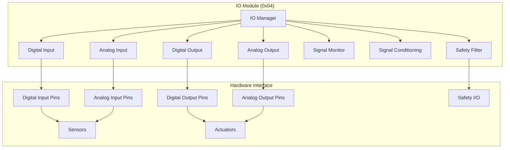

# IO Module Specification - OHT-50 Master Module (Phiên bản 1.0)

**Phiên bản:** v1.0  
**Ngày tạo:** 2025-01-28  
**Team:** FW Team  
**Trạng thái:** 🔌 PRODUCTION READY

---

## 🎯 **TỔNG QUAN IO MODULE**

### **Module Information:**
- **Address:** 0x04
- **Type:** MODULE_TYPE_IO
- **Function:** Digital I/O và analog I/O management
- **Protocol:** Modbus RTU
- **Baudrate:** 115200 bps

### **Mục tiêu:**
- Quản lý digital input/output (DI/DO)
- Quản lý analog input/output (AI/AO)
- Sensor interface và signal conditioning
- Actuator control và monitoring
- Safety I/O và interlock management

---

## 🔌 **IO MODULE ARCHITECTURE**

### **Module Structure:**


---

## 📊 **IO MODULE REGISTERS**

### **Modbus Register Map:**
```c
// IO Module Register Map (0x04)
#define IO_REG_STATUS                0x0000  // Module status
#define IO_REG_DI_STATUS             0x0001  // Digital input status
#define IO_REG_DO_STATUS             0x0002  // Digital output status
#define IO_REG_AI_VALUES             0x0003  // Analog input values (4 channels)
#define IO_REG_AO_VALUES             0x0007  // Analog output values (4 channels)
#define IO_REG_DI_COUNT              0x000B  // Digital input count
#define IO_REG_DO_COUNT              0x000C  // Digital output count
#define IO_REG_AI_COUNT              0x000D  // Analog input count
#define IO_REG_AO_COUNT              0x000E  // Analog output count
#define IO_REG_FAULT_STATUS          0x000F  // Fault status
#define IO_REG_FAULT_CODE            0x0010  // Fault code
#define IO_REG_CONFIG_STATUS         0x0011  // Configuration status
#define IO_REG_UPTIME                0x0012  // Module uptime (hours)
#define IO_REG_VERSION               0x0013  // Firmware version
```

### **Register Data Types:**
```c
// IO Module Data Types
typedef struct {
    uint16_t status;              // Module status
    uint16_t di_status;           // Digital input status (16 bits)
    uint16_t do_status;           // Digital output status (16 bits)
    uint16_t ai_values[4];        // Analog input values (4 channels)
    uint16_t ao_values[4];        // Analog output values (4 channels)
    uint8_t di_count;             // Digital input count
    uint8_t do_count;             // Digital output count
    uint8_t ai_count;             // Analog input count
    uint8_t ao_count;             // Analog output count
    uint16_t fault_status;        // Fault status
    uint16_t fault_code;          // Fault code
    uint16_t config_status;       // Configuration status
    uint32_t uptime;              // Uptime (hours)
    uint32_t version;             // Firmware version
} io_module_data_t;
```

---

## 🔧 **IO MODULE COMMANDS**

### **Command Set:**
```c
// IO Module Commands
#define IO_CMD_GET_STATUS            0x01    // Get module status
#define IO_CMD_GET_DI_STATUS         0x02    // Get digital input status
#define IO_CMD_GET_DO_STATUS         0x03    // Get digital output status
#define IO_CMD_GET_AI_VALUES         0x04    // Get analog input values
#define IO_CMD_GET_AO_VALUES         0x05    // Get analog output values
#define IO_CMD_GET_FAULTS            0x06    // Get fault status
#define IO_CMD_SET_DO                0x07    // Set digital output
#define IO_CMD_SET_AO                0x08    // Set analog output
#define IO_CMD_SET_DO_MASK           0x09    // Set digital output mask
#define IO_CMD_GET_DI_HISTORY        0x0A    // Get digital input history
#define IO_CMD_GET_AI_HISTORY        0x0B    // Get analog input history
#define IO_CMD_RESET_FAULTS          0x0C    // Reset faults
#define IO_CMD_CALIBRATE_AI          0x0D    // Calibrate analog input
#define IO_CMD_CALIBRATE_AO          0x0E    // Calibrate analog output
#define IO_CMD_UPDATE_FIRMWARE       0x0F    // Update firmware
#define IO_CMD_GET_CONFIG            0x10    // Get configuration
#define IO_CMD_SET_CONFIG            0x11    // Set configuration
```

### **Command Structure:**
```c
// IO Module Command
typedef struct {
    uint8_t address;           // Module address (0x04)
    uint8_t command;           // Command code
    uint16_t data_length;      // Data length
    uint8_t data[32];          // Command data
    uint16_t crc;              // CRC checksum
} io_module_command_t;

// IO Module Response
typedef struct {
    uint8_t address;           // Module address (0x04)
    uint8_t command;           // Command code
    uint8_t status;            // Response status
    uint16_t data_length;      // Data length
    uint8_t data[32];          // Response data
    uint16_t crc;              // CRC checksum
} io_module_response_t;
```

---

## ⚠️ **IO MODULE FAULTS**

### **Fault Types:**
```c
// IO Module Fault Codes
typedef enum {
    IO_FAULT_NONE = 0x0000,                 // No fault
    IO_FAULT_DI_OVERVOLTAGE = 0x0001,      // Digital input overvoltage
    IO_FAULT_DI_UNDERVOLTAGE = 0x0002,     // Digital input undervoltage
    IO_FAULT_DO_OVERCURRENT = 0x0003,      // Digital output overcurrent
    IO_FAULT_DO_SHORT_CIRCUIT = 0x0004,    // Digital output short circuit
    IO_FAULT_AI_OVERVOLTAGE = 0x0005,      // Analog input overvoltage
    IO_FAULT_AI_UNDERVOLTAGE = 0x0006,     // Analog input undervoltage
    IO_FAULT_AO_OVERCURRENT = 0x0007,      // Analog output overcurrent
    IO_FAULT_AO_SHORT_CIRCUIT = 0x0008,    // Analog output short circuit
    IO_FAULT_SENSOR_FAULT = 0x0009,        // Sensor fault
    IO_FAULT_ACTUATOR_FAULT = 0x000A,      // Actuator fault
    IO_FAULT_CALIBRATION_FAULT = 0x000B,   // Calibration fault
    IO_FAULT_COMMUNICATION = 0x000C,       // Communication fault
    IO_FAULT_FIRMWARE = 0x000D,            // Firmware fault
    IO_FAULT_HARDWARE = 0x000E,            // Hardware fault
    IO_FAULT_WATCHDOG = 0x000F,            // Watchdog timeout
    IO_FAULT_UNKNOWN = 0x00FF              // Unknown fault
} io_fault_code_t;
```

### **Fault Handling:**
```c
// Fault Handling Functions
int io_fault_detect(void);
int io_fault_handle(io_fault_code_t fault_code);
int io_fault_clear(void);
int io_fault_get_status(io_fault_code_t *fault_code);
int io_fault_get_history(io_fault_code_t *faults, uint8_t *count);
```

---

## 🔌 **DIGITAL I/O**

### **Digital Input Configuration:**
```c
// Digital Input Configuration
typedef struct {
    uint8_t di_count;                      // Number of digital inputs
    uint8_t di_pins[16];                   // Digital input pin numbers
    uint8_t di_pull_up[16];                // Pull-up configuration
    uint8_t di_debounce_time[16];          // Debounce time (ms)
    uint8_t di_invert[16];                 // Input inversion
    uint8_t di_safety[16];                 // Safety input flag
    uint16_t di_alarm_threshold[16];       // Alarm threshold
} digital_input_config_t;

// Digital Input Status
typedef struct {
    uint16_t di_status;                    // Digital input status
    uint16_t di_changed;                   // Changed inputs
    uint32_t di_timestamp[16];             // Last change timestamp
    uint16_t di_count[16];                 // Input count
} digital_input_status_t;
```

### **Digital Output Configuration:**
```c
// Digital Output Configuration
typedef struct {
    uint8_t do_count;                      // Number of digital outputs
    uint8_t do_pins[16];                   // Digital output pin numbers
    uint8_t do_invert[16];                 // Output inversion
    uint8_t do_safety[16];                 // Safety output flag
    uint16_t do_current_limit[16];         // Current limit (mA)
    uint8_t do_pwm_enabled[16];            // PWM enabled
    uint16_t do_pwm_frequency[16];         // PWM frequency (Hz)
} digital_output_config_t;

// Digital Output Status
typedef struct {
    uint16_t do_status;                    // Digital output status
    uint16_t do_requested;                 // Requested outputs
    uint32_t do_timestamp[16];             // Last change timestamp
    uint16_t do_count[16];                 // Output count
} digital_output_status_t;
```

### **Digital I/O Functions:**
```c
// Digital Input Functions
int digital_input_init(digital_input_config_t *config);
int digital_input_get_status(digital_input_status_t *status);
int digital_input_get_pin(uint8_t pin, uint8_t *value);
int digital_input_get_all(uint16_t *status);
int digital_input_set_debounce(uint8_t pin, uint8_t debounce_time);
int digital_input_set_pull_up(uint8_t pin, uint8_t pull_up);

// Digital Output Functions
int digital_output_init(digital_output_config_t *config);
int digital_output_set_pin(uint8_t pin, uint8_t value);
int digital_output_set_all(uint16_t status);
int digital_output_get_status(digital_output_status_t *status);
int digital_output_set_pwm(uint8_t pin, uint16_t frequency, uint8_t duty_cycle);
int digital_output_get_pin(uint8_t pin, uint8_t *value);
```

---

## 📊 **ANALOG I/O**

### **Analog Input Configuration:**
```c
// Analog Input Configuration
typedef struct {
    uint8_t ai_count;                      // Number of analog inputs
    uint8_t ai_pins[8];                    // Analog input pin numbers
    uint8_t ai_resolution[8];              // ADC resolution (bits)
    uint16_t ai_reference_voltage[8];      // Reference voltage (mV)
    uint8_t ai_filter_enabled[8];          // Filter enabled
    uint16_t ai_filter_time[8];            // Filter time constant (ms)
    uint8_t ai_calibration_enabled[8];     // Calibration enabled
    uint16_t ai_calibration_offset[8];     // Calibration offset
    uint16_t ai_calibration_gain[8];       // Calibration gain
} analog_input_config_t;

// Analog Input Status
typedef struct {
    uint16_t ai_values[8];                 // Analog input values
    uint16_t ai_raw_values[8];             // Raw ADC values
    uint32_t ai_timestamp[8];              // Last update timestamp
    uint8_t ai_valid[8];                   // Valid flag
    uint16_t ai_min[8];                    // Minimum value
    uint16_t ai_max[8];                    // Maximum value
} analog_input_status_t;
```

### **Analog Output Configuration:**
```c
// Analog Output Configuration
typedef struct {
    uint8_t ao_count;                      // Number of analog outputs
    uint8_t ao_pins[8];                    // Analog output pin numbers
    uint8_t ao_resolution[8];              // DAC resolution (bits)
    uint16_t ao_reference_voltage[8];      // Reference voltage (mV)
    uint8_t ao_calibration_enabled[8];     // Calibration enabled
    uint16_t ao_calibration_offset[8];     // Calibration offset
    uint16_t ao_calibration_gain[8];       // Calibration gain
    uint16_t ao_current_limit[8];          // Current limit (mA)
} analog_output_config_t;

// Analog Output Status
typedef struct {
    uint16_t ao_values[8];                 // Analog output values
    uint16_t ao_requested[8];              // Requested values
    uint32_t ao_timestamp[8];              // Last update timestamp
    uint8_t ao_valid[8];                   // Valid flag
} analog_output_status_t;
```

### **Analog I/O Functions:**
```c
// Analog Input Functions
int analog_input_init(analog_input_config_t *config);
int analog_input_get_value(uint8_t channel, uint16_t *value);
int analog_input_get_all(uint16_t *values);
int analog_input_calibrate(uint8_t channel);
int analog_input_set_filter(uint8_t channel, uint8_t enabled, uint16_t time);
int analog_input_get_status(analog_input_status_t *status);

// Analog Output Functions
int analog_output_init(analog_output_config_t *config);
int analog_output_set_value(uint8_t channel, uint16_t value);
int analog_output_set_all(uint16_t *values);
int analog_output_calibrate(uint8_t channel);
int analog_output_get_value(uint8_t channel, uint16_t *value);
int analog_output_get_status(analog_output_status_t *status);
```

---

## 🔍 **SIGNAL CONDITIONING**

### **Signal Conditioning Configuration:**
```c
// Signal Conditioning Configuration
typedef struct {
    uint8_t sc_enabled;                    // Signal conditioning enabled
    uint8_t sc_input_type[8];              // Input type (voltage/current)
    uint16_t sc_input_range[8];            // Input range
    uint8_t sc_output_type[8];             // Output type (voltage/current)
    uint16_t sc_output_range[8];           // Output range
    uint8_t sc_filter_type[8];             // Filter type
    uint16_t sc_filter_parameters[8];      // Filter parameters
} signal_conditioning_config_t;
```

### **Signal Conditioning Functions:**
```c
// Signal Conditioning Functions
int signal_conditioning_init(signal_conditioning_config_t *config);
int signal_conditioning_process(uint8_t channel, uint16_t input, uint16_t *output);
int signal_conditioning_calibrate(uint8_t channel);
int signal_conditioning_set_filter(uint8_t channel, uint8_t type, uint16_t parameters);
```

---

## 🛡️ **SAFETY I/O**

### **Safety I/O Configuration:**
```c
// Safety I/O Configuration
typedef struct {
    uint8_t safety_enabled;                // Safety I/O enabled
    uint8_t safety_input_pins[8];          // Safety input pins
    uint8_t safety_output_pins[8];         // Safety output pins
    uint8_t safety_interlock_enabled;      // Interlock enabled
    uint16_t safety_timeout_ms;            // Safety timeout
    uint8_t safety_monitoring_enabled;     // Safety monitoring enabled
} safety_io_config_t;
```

### **Safety I/O Functions:**
```c
// Safety I/O Functions
int safety_io_init(safety_io_config_t *config);
int safety_io_get_input_status(uint8_t *status);
int safety_io_set_output_status(uint8_t status);
int safety_io_check_interlock(uint8_t *status);
int safety_io_monitor_safety(uint8_t *status);
```

---

## 🔧 **IO MODULE CONFIGURATION**

### **Module Configuration:**
```c
// IO Module Configuration
typedef struct {
    uint16_t module_id;                    // Module ID
    uint8_t module_type;                   // Module type
    uint8_t firmware_version[4];           // Firmware version
    uint32_t serial_number;                // Serial number
    digital_input_config_t di_config;      // Digital input config
    digital_output_config_t do_config;     // Digital output config
    analog_input_config_t ai_config;       // Analog input config
    analog_output_config_t ao_config;      // Analog output config
    signal_conditioning_config_t sc_config; // Signal conditioning config
    safety_io_config_t safety_config;      // Safety I/O config
    uint8_t module_enabled;                // Module enabled
    uint8_t monitoring_enabled;            // Monitoring enabled
} io_module_config_t;
```

### **Configuration Functions:**
```c
// Configuration Functions
int io_config_init(void);
int io_config_load(io_module_config_t *config);
int io_config_save(io_module_config_t *config);
int io_config_validate(io_module_config_t *config);
int io_config_reset(void);
int io_config_backup(void);
int io_config_restore(void);
```

---

## 📋 **TASK MAPPING CHO PM**

### **EMBED Team Tasks:**
- [ ] Implement IO module hardware
- [ ] Implement digital I/O interface
- [ ] Implement analog I/O interface
- [ ] Implement signal conditioning
- [ ] Implement safety I/O
- [ ] Hardware validation tests
- [ ] Signal quality optimization

### **Firmware Team Tasks:**
- [ ] Implement IO module firmware
- [ ] Implement Modbus RTU protocol
- [ ] Implement digital I/O management
- [ ] Implement analog I/O management
- [ ] Implement signal conditioning
- [ ] Implement safety I/O
- [ ] Implement fault detection
- [ ] Unit tests cho IO module

### **System Integration Tasks:**
- [ ] IO module integration testing
- [ ] End-to-end I/O testing
- [ ] Performance testing
- [ ] Safety testing
- [ ] Fault injection testing

---

## 📚 **REFERENCES**

### **Related Documents:**
- `../module_architecture.md` - Module architecture overview
- `../communication_architecture.md` - Communication protocol
- `../interfaces.md` - Interface definitions

### **Standards:**
- Modbus RTU Protocol
- Digital I/O Standards
- Analog I/O Standards
- Signal Conditioning Standards
- Safety I/O Standards

---

## 📝 **CHANGELOG**

### **v1.0 (2025-01-28):**
- ✅ Added comprehensive IO module specification
- ✅ Added Modbus register map
- ✅ Added command set
- ✅ Added fault handling
- ✅ Added digital I/O management
- ✅ Added analog I/O management
- ✅ Added signal conditioning
- ✅ Added safety I/O
- ✅ Added configuration management
- ✅ Added task mapping for PM

---

**🚨 Lưu ý:** IO module phải đảm bảo độ tin cậy cao và khả năng xử lý tín hiệu chính xác.
