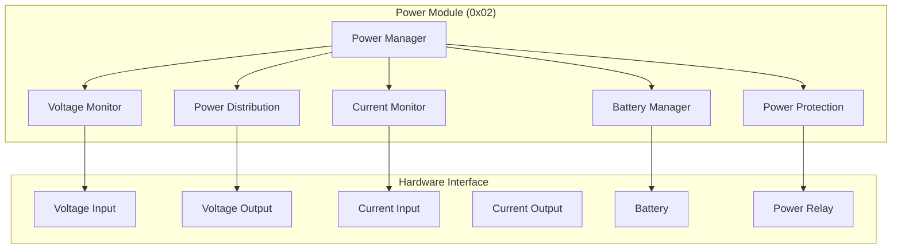

# Power Module Specification - OHT-50 Master Module (Phiên bản 1.0)

**Phiên bản:** v1.0  
**Ngày tạo:** 2025-01-28  
**Team:** FW Team  
**Trạng thái:** ⚡ PRODUCTION READY

---

## 🎯 **TỔNG QUAN POWER MODULE**

### **Module Information:**
- **Address:** 0x02
- **Type:** MODULE_TYPE_POWER
- **Function:** Power management và monitoring
- **Protocol:** Modbus RTU
- **Baudrate:** 115200 bps

### **Mục tiêu:**
- Quản lý nguồn điện cho toàn bộ hệ thống
- Monitoring voltage, current, power consumption
- Battery management (nếu có)
- Power distribution control
- Fault detection và protection

---

## ⚡ **POWER MODULE ARCHITECTURE**

### **Module Structure:**


---

## 📊 **POWER MODULE REGISTERS**

### **Modbus Register Map:**
```c
// Power Module Register Map (0x02)
#define POWER_REG_STATUS              0x0000  // Module status
#define POWER_REG_VOLTAGE_IN          0x0001  // Input voltage (V)
#define POWER_REG_VOLTAGE_OUT         0x0002  // Output voltage (V)
#define POWER_REG_CURRENT_IN          0x0003  // Input current (A)
#define POWER_REG_CURRENT_OUT         0x0004  // Output current (A)
#define POWER_REG_POWER_IN            0x0005  // Input power (W)
#define POWER_REG_POWER_OUT           0x0006  // Output power (W)
#define POWER_REG_TEMPERATURE         0x0007  // Module temperature (°C)
#define POWER_REG_BATTERY_VOLTAGE     0x0008  // Battery voltage (V)
#define POWER_REG_BATTERY_CURRENT     0x0009  // Battery current (A)
#define POWER_REG_BATTERY_SOC         0x000A  // Battery state of charge (%)
#define POWER_REG_BATTERY_SOH         0x000B  // Battery state of health (%)
#define POWER_REG_FAULT_STATUS        0x000C  // Fault status
#define POWER_REG_FAULT_CODE          0x000D  // Fault code
#define POWER_REG_UPTIME              0x000E  // Module uptime (hours)
#define POWER_REG_VERSION             0x000F  // Firmware version
```

### **Register Data Types:**
```c
// Power Module Data Types
typedef struct {
    uint16_t status;              // Module status
    uint16_t voltage_in;          // Input voltage (0.1V resolution)
    uint16_t voltage_out;         // Output voltage (0.1V resolution)
    uint16_t current_in;          // Input current (0.01A resolution)
    uint16_t current_out;         // Output current (0.01A resolution)
    uint16_t power_in;            // Input power (0.1W resolution)
    uint16_t power_out;           // Output power (0.1W resolution)
    uint16_t temperature;         // Temperature (0.1°C resolution)
    uint16_t battery_voltage;     // Battery voltage (0.1V resolution)
    uint16_t battery_current;     // Battery current (0.01A resolution)
    uint16_t battery_soc;         // Battery SOC (0.1% resolution)
    uint16_t battery_soh;         // Battery SOH (0.1% resolution)
    uint16_t fault_status;        // Fault status
    uint16_t fault_code;          // Fault code
    uint32_t uptime;              // Uptime (hours)
    uint32_t version;             // Firmware version
} power_module_data_t;
```

---

## 🔧 **POWER MODULE COMMANDS**

### **Command Set:**
```c
// Power Module Commands
#define POWER_CMD_GET_STATUS          0x01    // Get module status
#define POWER_CMD_GET_VOLTAGE         0x02    // Get voltage readings
#define POWER_CMD_GET_CURRENT         0x03    // Get current readings
#define POWER_CMD_GET_POWER           0x04    // Get power readings
#define POWER_CMD_GET_BATTERY         0x05    // Get battery status
#define POWER_CMD_GET_TEMPERATURE     0x06    // Get temperature
#define POWER_CMD_GET_FAULTS          0x07    // Get fault status
#define POWER_CMD_SET_OUTPUT          0x08    // Set output state
#define POWER_CMD_SET_VOLTAGE         0x09    // Set output voltage
#define POWER_CMD_SET_CURRENT         0x0A    // Set output current
#define POWER_CMD_RESET_FAULTS        0x0B    // Reset faults
#define POWER_CMD_CALIBRATE           0x0C    // Calibrate sensors
#define POWER_CMD_UPDATE_FIRMWARE     0x0D    // Update firmware
#define POWER_CMD_GET_CONFIG          0x0E    // Get configuration
#define POWER_CMD_SET_CONFIG          0x0F    // Set configuration
```

### **Command Structure:**
```c
// Power Module Command
typedef struct {
    uint8_t address;           // Module address (0x02)
    uint8_t command;           // Command code
    uint16_t data_length;      // Data length
    uint8_t data[32];          // Command data
    uint16_t crc;              // CRC checksum
} power_module_command_t;

// Power Module Response
typedef struct {
    uint8_t address;           // Module address (0x02)
    uint8_t command;           // Command code
    uint8_t status;            // Response status
    uint16_t data_length;      // Data length
    uint8_t data[32];          // Response data
    uint16_t crc;              // CRC checksum
} power_module_response_t;
```

---

## ⚠️ **POWER MODULE FAULTS**

### **Fault Types:**
```c
// Power Module Fault Codes
typedef enum {
    POWER_FAULT_NONE = 0x0000,             // No fault
    POWER_FAULT_OVERVOLTAGE = 0x0001,      // Overvoltage
    POWER_FAULT_UNDERVOLTAGE = 0x0002,     // Undervoltage
    POWER_FAULT_OVERCURRENT = 0x0003,      // Overcurrent
    POWER_FAULT_OVERTEMPERATURE = 0x0004,  // Overtemperature
    POWER_FAULT_SHORT_CIRCUIT = 0x0005,    // Short circuit
    POWER_FAULT_OPEN_CIRCUIT = 0x0006,     // Open circuit
    POWER_FAULT_BATTERY_LOW = 0x0007,      // Battery low
    POWER_FAULT_BATTERY_FAULT = 0x0008,    // Battery fault
    POWER_FAULT_COMMUNICATION = 0x0009,    // Communication fault
    POWER_FAULT_SENSOR_FAULT = 0x000A,     // Sensor fault
    POWER_FAULT_CALIBRATION = 0x000B,      // Calibration fault
    POWER_FAULT_FIRMWARE = 0x000C,         // Firmware fault
    POWER_FAULT_HARDWARE = 0x000D,         // Hardware fault
    POWER_FAULT_WATCHDOG = 0x000E,         // Watchdog timeout
    POWER_FAULT_UNKNOWN = 0x00FF           // Unknown fault
} power_fault_code_t;
```

### **Fault Handling:**
```c
// Fault Handling Functions
int power_fault_detect(void);
int power_fault_handle(power_fault_code_t fault_code);
int power_fault_clear(void);
int power_fault_get_status(power_fault_code_t *fault_code);
int power_fault_get_history(power_fault_code_t *faults, uint8_t *count);
```

---

## 🔋 **BATTERY MANAGEMENT**

### **Battery Configuration:**
```c
// Battery Configuration
typedef struct {
    uint16_t nominal_voltage;      // Nominal voltage (V)
    uint16_t max_voltage;          // Maximum voltage (V)
    uint16_t min_voltage;          // Minimum voltage (V)
    uint16_t max_current;          // Maximum current (A)
    uint16_t capacity;             // Battery capacity (Ah)
    uint8_t battery_type;          // Battery type
    uint8_t cell_count;            // Number of cells
    uint16_t charge_current;       // Charge current (A)
    uint16_t discharge_current;    // Discharge current (A)
} battery_config_t;

// Battery Types
typedef enum {
    BATTERY_TYPE_LITHIUM_ION = 0x01,    // Lithium-ion
    BATTERY_TYPE_LITHIUM_POLYMER = 0x02, // Lithium-polymer
    BATTERY_TYPE_LEAD_ACID = 0x03,       // Lead-acid
    BATTERY_TYPE_NICKEL_METAL = 0x04,    // Nickel-metal hydride
    BATTERY_TYPE_UNKNOWN = 0xFF          // Unknown type
} battery_type_t;
```

### **Battery Management Functions:**
```c
// Battery Management Functions
int battery_init(battery_config_t *config);
int battery_get_status(battery_status_t *status);
int battery_start_charging(void);
int battery_stop_charging(void);
int battery_start_discharging(void);
int battery_stop_discharging(void);
int battery_get_soc(uint8_t *soc);
int battery_get_soh(uint8_t *soh);
int battery_calibrate(void);
```

---

## 📊 **POWER MONITORING**

### **Monitoring Configuration:**
```c
// Power Monitoring Configuration
typedef struct {
    uint32_t sampling_rate_ms;     // Sampling rate (ms)
    uint8_t voltage_monitoring;    // Voltage monitoring enabled
    uint8_t current_monitoring;    // Current monitoring enabled
    uint8_t power_monitoring;      // Power monitoring enabled
    uint8_t temperature_monitoring; // Temperature monitoring enabled
    uint8_t battery_monitoring;    // Battery monitoring enabled
    uint16_t alarm_thresholds[8];  // Alarm thresholds
} power_monitoring_config_t;
```

### **Monitoring Functions:**
```c
// Power Monitoring Functions
int power_monitor_init(power_monitoring_config_t *config);
int power_monitor_start(void);
int power_monitor_stop(void);
int power_monitor_get_data(power_module_data_t *data);
int power_monitor_set_alarm_threshold(uint8_t index, uint16_t threshold);
int power_monitor_get_alarm_status(uint8_t *alarms);
```

---

## 🔧 **POWER MODULE CONFIGURATION**

### **Module Configuration:**
```c
// Power Module Configuration
typedef struct {
    uint16_t module_id;                    // Module ID
    uint8_t module_type;                   // Module type
    uint8_t firmware_version[4];           // Firmware version
    uint32_t serial_number;                // Serial number
    power_monitoring_config_t monitoring;  // Monitoring config
    battery_config_t battery;              // Battery config
    uint16_t output_voltage;               // Output voltage setting
    uint16_t output_current;               // Output current setting
    uint8_t output_enabled;                // Output enabled
    uint8_t auto_restart;                  // Auto restart enabled
    uint16_t restart_delay;                // Restart delay (s)
} power_module_config_t;
```

### **Configuration Functions:**
```c
// Configuration Functions
int power_config_init(void);
int power_config_load(power_module_config_t *config);
int power_config_save(power_module_config_t *config);
int power_config_validate(power_module_config_t *config);
int power_config_reset(void);
int power_config_backup(void);
int power_config_restore(void);
```

---

## 📋 **TASK MAPPING CHO PM**

### **EMBED Team Tasks:**
- [ ] Implement power module hardware
- [ ] Implement voltage/current sensors
- [ ] Implement battery management hardware
- [ ] Hardware validation tests
- [ ] Power efficiency optimization

### **Firmware Team Tasks:**
- [ ] Implement power module firmware
- [ ] Implement Modbus RTU protocol
- [ ] Implement power monitoring
- [ ] Implement battery management
- [ ] Implement fault detection
- [ ] Unit tests cho power module

### **System Integration Tasks:**
- [ ] Power module integration testing
- [ ] End-to-end power testing
- [ ] Performance testing
- [ ] Fault injection testing

---

## 📚 **REFERENCES**

### **Related Documents:**
- `../module_architecture.md` - Module architecture overview
- `../communication_architecture.md` - Communication protocol
- `../interfaces.md` - Interface definitions

### **Standards:**
- Modbus RTU Protocol
- Power Management Standards
- Battery Management Standards

---

## 📝 **CHANGELOG**

### **v1.0 (2025-01-28):**
- ✅ Added comprehensive power module specification
- ✅ Added Modbus register map
- ✅ Added command set
- ✅ Added fault handling
- ✅ Added battery management
- ✅ Added power monitoring
- ✅ Added configuration management
- ✅ Added task mapping for PM

---

**🚨 Lưu ý:** Power module phải đảm bảo an toàn và hiệu quả năng lượng cao.
