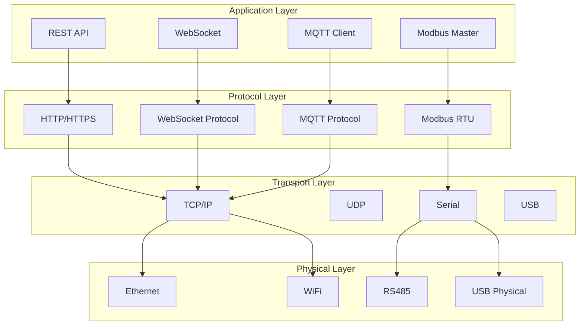

# Communication Architecture - OHT-50 Master Module (Phiên bản 2.0)

**Phiên bản:** v2.0  
**Ngày tạo:** 2025-01-28  
**Team:** FW Team  
**Trạng thái:** 📡 PRODUCTION READY

---

## 🎯 **TỔNG QUAN COMMUNICATION ARCHITECTURE**

### **Mục tiêu:**
- Hỗ trợ đa giao thức communication: RS485, Ethernet, WiFi, USB
- Đảm bảo độ tin cậy và hiệu suất cao
- Hỗ trợ failover và redundancy
- Tích hợp với module management và safety system

### **Communication Protocols:**
- RS485 Modbus RTU (Slave modules)
- Ethernet TCP/IP (Center connection)
- WiFi 802.11ac (Backup connection)
- USB 2.0 (Debug console)

---

## 📡 **COMMUNICATION ARCHITECTURE OVERVIEW**

### **Communication Layers:**


---

## 🔌 **RS485 COMMUNICATION**

### **RS485 Configuration:**
```c
// RS485 Configuration
typedef struct {
    uint32_t baudrate;         // Baudrate (115200)
    uint8_t data_bits;         // Data bits (8)
    uint8_t stop_bits;         // Stop bits (1)
    uint8_t parity;            // Parity (NONE)
    uint8_t flow_control;      // Flow control (NONE)
    uint8_t de_pin;            // DE pin (GPIO1_D1)
    uint8_t re_pin;            // RE pin (GPIO1_D0)
    uint32_t timeout_ms;       // Communication timeout
    uint8_t retry_count;       // Retry count
    uint8_t termination;       // Termination resistor
} rs485_config_t;

// RS485 Status
typedef enum {
    RS485_STATUS_DISABLED = 0,
    RS485_STATUS_ENABLED = 1,
    RS485_STATUS_ERROR = 2,
    RS485_STATUS_BUSY = 3
} rs485_status_t;

// RS485 Functions
int rs485_init(rs485_config_t *config);
int rs485_enable(void);
int rs485_disable(void);
int rs485_send(uint8_t *data, uint16_t length);
int rs485_receive(uint8_t *data, uint16_t *length);
int rs485_set_de(uint8_t state);
int rs485_set_re(uint8_t state);
int rs485_get_status(rs485_status_t *status);
```

### **Modbus RTU Implementation:**
```c
// Modbus RTU Frame
typedef struct {
    uint8_t address;           // Slave address
    uint8_t function_code;     // Function code
    uint8_t *data;            // Data payload
    uint16_t data_length;     // Data length
    uint16_t crc;             // CRC checksum
} modbus_frame_t;

// Modbus Functions
int modbus_init(void);
int modbus_send_request(modbus_frame_t *request);
int modbus_receive_response(modbus_frame_t *response);
int modbus_calculate_crc(uint8_t *data, uint16_t length);
int modbus_validate_crc(modbus_frame_t *frame);
int modbus_set_slave_address(uint8_t address);
```

---

## 🌐 **NETWORK COMMUNICATION**

### **Ethernet Configuration:**
```c
// Ethernet Configuration
typedef struct {
    char ip_address[16];       // IP address
    char netmask[16];          // Netmask
    char gateway[16];          // Gateway
    char dns[16];              // DNS server
    uint8_t dhcp_enabled;      // DHCP enabled
    uint16_t port;             // Port number
    uint32_t timeout_ms;       // Connection timeout
    uint8_t auto_reconnect;    // Auto reconnect
} ethernet_config_t;

// Ethernet Functions
int ethernet_init(ethernet_config_t *config);
int ethernet_connect(void);
int ethernet_disconnect(void);
int ethernet_send(uint8_t *data, uint16_t length);
int ethernet_receive(uint8_t *data, uint16_t *length);
int ethernet_get_status(uint8_t *status);
int ethernet_set_config(ethernet_config_t *config);
```

### **WiFi Configuration:**
```c
// WiFi Configuration
typedef struct {
    char ssid[32];             // WiFi SSID
    char password[64];         // WiFi password
    uint8_t security_type;     // Security type
    uint8_t auto_connect;      // Auto connect
    uint32_t timeout_ms;       // Connection timeout
    uint8_t power_save;        // Power save mode
} wifi_config_t;

// WiFi Functions
int wifi_init(wifi_config_t *config);
int wifi_connect(void);
int wifi_disconnect(void);
int wifi_send(uint8_t *data, uint16_t length);
int wifi_receive(uint8_t *data, uint16_t *length);
int wifi_get_status(uint8_t *status);
int wifi_scan_networks(void);
```

---

## 🔄 **COMMUNICATION MANAGER**

### **Communication Manager Architecture:**
```c
// Communication Protocol
typedef enum {
    COMM_PROTOCOL_RS485 = 0,
    COMM_PROTOCOL_ETHERNET = 1,
    COMM_PROTOCOL_WIFI = 2,
    COMM_PROTOCOL_USB = 3
} comm_protocol_t;

// Communication Status
typedef enum {
    COMM_STATUS_DISCONNECTED = 0,
    COMM_STATUS_CONNECTING = 1,
    COMM_STATUS_CONNECTED = 2,
    COMM_STATUS_ERROR = 3,
    COMM_STATUS_TIMEOUT = 4
} comm_status_t;

// Communication Manager Configuration
typedef struct {
    comm_protocol_t primary_protocol;    // Primary protocol
    comm_protocol_t backup_protocol;     // Backup protocol
    uint32_t failover_timeout_ms;        // Failover timeout
    uint8_t auto_failover_enabled;       // Auto failover
    uint8_t load_balancing_enabled;      // Load balancing
} comm_manager_config_t;

// Communication Manager Functions
int comm_manager_init(comm_manager_config_t *config);
int comm_manager_send(comm_protocol_t protocol, uint8_t *data, uint16_t length);
int comm_manager_receive(comm_protocol_t protocol, uint8_t *data, uint16_t *length);
int comm_manager_get_status(comm_protocol_t protocol, comm_status_t *status);
int comm_manager_switch_protocol(comm_protocol_t protocol);
int comm_manager_register_handler(comm_protocol_t protocol, void (*handler)(uint8_t *, uint16_t));
```

---

## 🔄 **FAILOVER & REDUNDANCY**

### **Failover Configuration:**
```c
// Failover Configuration
typedef struct {
    comm_protocol_t primary_protocol;    // Primary protocol
    comm_protocol_t backup_protocol;     // Backup protocol
    uint32_t failover_timeout_ms;        // Failover timeout
    uint8_t auto_failover_enabled;       // Auto failover
    uint8_t health_check_enabled;        // Health check
    uint32_t health_check_interval_ms;   // Health check interval
} failover_config_t;

// Failover Functions
int failover_init(failover_config_t *config);
int failover_start(void);
int failover_stop(void);
int failover_switch_to_backup(void);
int failover_switch_to_primary(void);
int failover_get_current_protocol(comm_protocol_t *protocol);
int failover_register_callback(void (*callback)(comm_protocol_t));
```

### **Load Balancing:**
```c
// Load Balancing Configuration
typedef struct {
    uint8_t load_balancing_enabled;      // Load balancing enabled
    uint8_t algorithm;                   // Load balancing algorithm
    uint32_t health_check_interval_ms;   // Health check interval
    uint8_t max_connections;             // Max connections
} load_balancing_config_t;

// Load Balancing Functions
int load_balancing_init(load_balancing_config_t *config);
int load_balancing_start(void);
int load_balancing_stop(void);
int load_balancing_add_protocol(comm_protocol_t protocol);
int load_balancing_remove_protocol(comm_protocol_t protocol);
int load_balancing_get_next_protocol(comm_protocol_t *protocol);
```

---

## 📊 **COMMUNICATION MONITORING**

### **Communication Statistics:**
```c
// Communication Statistics
typedef struct {
    comm_protocol_t protocol;            // Protocol
    uint32_t bytes_sent;                 // Bytes sent
    uint32_t bytes_received;             // Bytes received
    uint32_t packets_sent;               // Packets sent
    uint32_t packets_received;           // Packets received
    uint32_t errors;                     // Error count
    uint32_t timeouts;                   // Timeout count
    uint32_t uptime_ms;                  // Uptime
    float throughput_bps;                // Throughput (bits per second)
    float error_rate;                    // Error rate
} comm_statistics_t;

// Statistics Functions
int comm_stats_init(void);
int comm_stats_update(comm_protocol_t protocol, uint32_t bytes_sent, uint32_t bytes_received);
int comm_stats_get(comm_protocol_t protocol, comm_statistics_t *stats);
int comm_stats_reset(comm_protocol_t protocol);
int comm_stats_export(const char *filename);
```

### **Health Monitoring:**
```c
// Health Monitoring Configuration
typedef struct {
    uint32_t health_check_interval_ms;   // Health check interval
    uint32_t health_timeout_ms;         // Health timeout
    uint8_t health_check_enabled;       // Health check enabled
    uint8_t auto_recovery_enabled;      // Auto recovery
} health_monitor_config_t;

// Health Monitoring Functions
int health_monitor_init(health_monitor_config_t *config);
int health_monitor_start(void);
int health_monitor_stop(void);
int health_monitor_check_protocol(comm_protocol_t protocol);
int health_monitor_get_status(comm_protocol_t protocol, uint8_t *status);
int health_monitor_register_callback(void (*callback)(comm_protocol_t, uint8_t));
```

---

## 🔧 **PROTOCOL HANDLERS**

### **Protocol Handler Interface:**
```c
// Protocol Handler
typedef struct {
    comm_protocol_t protocol;            // Protocol type
    int (*init)(void *config);           // Initialize function
    int (*connect)(void);                // Connect function
    int (*disconnect)(void);             // Disconnect function
    int (*send)(uint8_t *data, uint16_t length); // Send function
    int (*receive)(uint8_t *data, uint16_t *length); // Receive function
    int (*get_status)(uint8_t *status);  // Get status function
} protocol_handler_t;

// Protocol Handler Functions
int protocol_handler_register(protocol_handler_t *handler);
int protocol_handler_unregister(comm_protocol_t protocol);
int protocol_handler_get(comm_protocol_t protocol, protocol_handler_t *handler);
int protocol_handler_init_all(void);
int protocol_handler_cleanup_all(void);
```

---

## 🚨 **ERROR HANDLING**

### **Communication Error Types:**
```c
// Communication Error Types
typedef enum {
    COMM_ERROR_NONE = 0,
    COMM_ERROR_TIMEOUT = 1,          // Communication timeout
    COMM_ERROR_CONNECTION_LOST = 2,  // Connection lost
    COMM_ERROR_INVALID_DATA = 3,     // Invalid data
    COMM_ERROR_PROTOCOL_ERROR = 4,   // Protocol error
    COMM_ERROR_HARDWARE_FAULT = 5,   // Hardware fault
    COMM_ERROR_BUFFER_OVERFLOW = 6   // Buffer overflow
} comm_error_type_t;

// Error Handling Functions
int comm_error_init(void);
int comm_error_handle(comm_protocol_t protocol, comm_error_type_t error_type);
int comm_error_get_count(comm_protocol_t protocol, uint16_t *count);
int comm_error_clear(comm_protocol_t protocol);
int comm_error_register_handler(void (*handler)(comm_protocol_t, comm_error_type_t));
```

---

## 📋 **TASK MAPPING CHO PM**

### **EMBED Team Tasks:**
- [ ] Implement RS485 hardware interface
- [ ] Implement Ethernet hardware interface
- [ ] Implement WiFi hardware interface
- [ ] Hardware communication validation tests
- [ ] Communication timing measurements

### **Firmware Team Tasks:**
- [ ] Implement RS485 communication driver
- [ ] Implement Modbus RTU protocol
- [ ] Implement communication manager
- [ ] Implement failover system
- [ ] Implement load balancing
- [ ] Implement communication monitoring
- [ ] Unit tests cho communication

### **Backend Team Tasks:**
- [ ] Implement network services
- [ ] Implement communication API
- [ ] Implement monitoring API
- [ ] Communication integration testing

### **Frontend Team Tasks:**
- [ ] Implement communication status UI
- [ ] Implement network configuration UI
- [ ] Implement communication statistics display
- [ ] Real-time communication monitoring

### **System Integration Tasks:**
- [ ] Communication system integration testing
- [ ] End-to-end communication testing
- [ ] Performance testing
- [ ] Stress testing

---

## 📚 **REFERENCES**

### **Related Documents:**
- `../architecture.md` - Overall firmware architecture
- `../interfaces.md` - Interface definitions
- `../safety_architecture.md` - Safety system design
- `../state_machine.md` - State machine design
- `../system_design.md` - System design details
- `../MODULES/module_architecture.md` - Module architecture

### **Standards:**
- Modbus RTU Protocol
- RS485 Communication Standards
- Ethernet Standards
- WiFi Standards
- USB Standards

---

## 📝 **CHANGELOG**

### **v2.0 (2025-01-28):**
- ✅ Added comprehensive communication architecture
- ✅ Added RS485 communication design
- ✅ Added network communication design
- ✅ Added communication manager
- ✅ Added failover & redundancy
- ✅ Added communication monitoring
- ✅ Added protocol handlers
- ✅ Added error handling
- ✅ Added task mapping for PM

### **v1.0 (2025-01-27):**
- ✅ Initial communication architecture document
- ✅ Basic communication design

---

**🚨 Lưu ý:** Communication architecture phải đảm bảo độ tin cậy cao và khả năng failover tự động.
