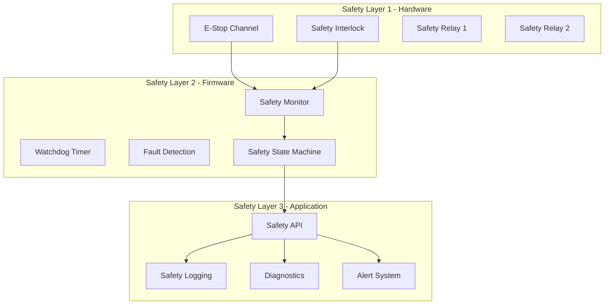
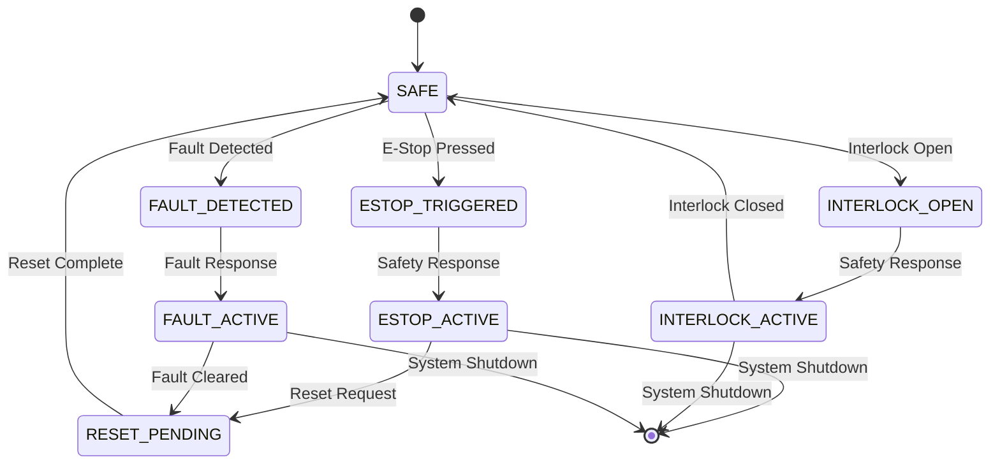
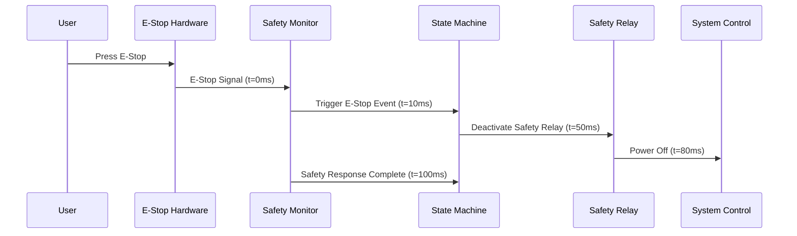

# Safety Architecture - OHT-50 Master Module (Phiên bản 2.0)

**Phiên bản:** v2.0  
**Ngày tạo:** 2025-01-28  
**Team:** Safety Team  
**Trạng thái:** 🛡️ PRODUCTION READY

---

## 🎯 **TỔNG QUAN HỆ THỐNG AN TOÀN**

### **Mục tiêu:**
- Đảm bảo an toàn SIL2 theo tiêu chuẩn IEC 61508
- Hệ thống E-Stop single-channel với response time < 100ms
- Monitoring liên tục và fault detection
- Fail-safe design với redundancy

### **Tiêu chuẩn tuân thủ:**
- IEC 61508 Functional Safety
- SIL2 Safety Integrity Level
- ISO 13849-1 Safety of machinery
- EN 60204-1 Safety of machinery

---

## 🛡️ **SAFETY SYSTEM ARCHITECTURE**

### **Safety Layers:**


---

## 🔌 **HARDWARE SAFETY DESIGN**

### **1. E-Stop Single-Channel System**
```c
// E-Stop Hardware Configuration
typedef struct {
    uint8_t estop_pin;         // E-Stop Channel (GPIO1_D3)
    uint8_t estop_led_pin;     // E-Stop LED indicator
    uint8_t estop_buzzer_pin;  // E-Stop buzzer
    uint32_t debounce_time;    // Debounce time (ms)
    uint32_t timeout_ms;       // Safety timeout
} estop_hw_config_t;

// E-Stop Status
typedef enum {
    ESTOP_STATUS_SAFE = 0,     // E-Stop not triggered
    ESTOP_STATUS_TRIGGERED = 1, // E-Stop triggered
    ESTOP_STATUS_FAULT = 2,    // E-Stop fault detected
    ESTOP_STATUS_RESET = 3     // E-Stop reset in progress
} estop_status_t;
```

### **2. Safety Interlock System**
```c
// Interlock Configuration
typedef struct {
    uint8_t interlock_pin;     // Interlock input pin
    uint8_t interlock_led_pin; // Interlock LED
    uint8_t interlock_relay;   // Interlock relay output
    uint32_t check_interval;   // Check interval (ms)
} interlock_config_t;

// Interlock Status
typedef enum {
    INTERLOCK_SAFE = 0,        // Interlock safe
    INTERLOCK_OPEN = 1,        // Interlock open
    INTERLOCK_FAULT = 2        // Interlock fault
} interlock_status_t;
```

### **3. Safety Relay Control**
```c
// Safety Relay Configuration
typedef struct {
    uint8_t relay1_pin;        // Safety Relay 1 (GPIO1_D3)
    uint8_t relay2_pin;        // Safety Relay 2 (GPIO1_D2)
    uint8_t relay_feedback1;   // Relay 1 feedback
    uint8_t relay_feedback2;   // Relay 2 feedback
    uint32_t test_interval;    // Test interval (ms)
} safety_relay_config_t;
```

---

## 🔄 **SAFETY STATE MACHINE**

### **Safety States:**


### **Safety State Definitions:**
```c
// Safety States
typedef enum {
    SAFETY_STATE_SAFE = 0,           // System safe
    SAFETY_STATE_ESTOP_TRIGGERED = 1, // E-Stop triggered
    SAFETY_STATE_ESTOP_ACTIVE = 2,   // E-Stop active
    SAFETY_STATE_INTERLOCK_OPEN = 3, // Interlock open
    SAFETY_STATE_INTERLOCK_ACTIVE = 4, // Interlock active
    SAFETY_STATE_FAULT_DETECTED = 5, // Fault detected
    SAFETY_STATE_FAULT_ACTIVE = 6,   // Fault active
    SAFETY_STATE_RESET_PENDING = 7   // Reset pending
} safety_state_t;
```

---

## ⏱️ **SAFETY TIMING REQUIREMENTS**

### **Critical Timing:**
```c
// Safety Timing Requirements
#define SAFETY_ESTOP_RESPONSE_TIME_MS    100    // E-Stop response time
#define SAFETY_INTERLOCK_RESPONSE_TIME_MS 150   // Interlock response time
#define SAFETY_FAULT_RESPONSE_TIME_MS    200    // Fault response time
#define SAFETY_WATCHDOG_TIMEOUT_MS       500    // Watchdog timeout
#define SAFETY_DEBOUNCE_TIME_MS          50     // Input debounce time
#define SAFETY_TEST_INTERVAL_MS          1000   // Safety test interval
```

### **Safety Response Sequence:**


---

## 🔍 **FAULT DETECTION & DIAGNOSTICS**

### **1. Fault Types:**
```c
// Fault Categories
typedef enum {
    FAULT_TYPE_NONE = 0,
    FAULT_TYPE_ESTOP_FAULT = 1,            // E-Stop fault
    FAULT_TYPE_INTERLOCK_FAULT = 2,        // Interlock fault
    FAULT_TYPE_RELAY_FAULT = 3,            // Safety relay fault
    FAULT_TYPE_WATCHDOG_FAULT = 4,         // Watchdog timeout
    FAULT_TYPE_COMMUNICATION_FAULT = 5,    // Communication fault
    FAULT_TYPE_POWER_FAULT = 6,            // Power fault
    FAULT_TYPE_TEMPERATURE_FAULT = 7       // Temperature fault
} fault_type_t;

// Fault Severity
typedef enum {
    FAULT_SEVERITY_LOW = 0,    // Low severity
    FAULT_SEVERITY_MEDIUM = 1, // Medium severity
    FAULT_SEVERITY_HIGH = 2,   // High severity
    FAULT_SEVERITY_CRITICAL = 3 // Critical severity
} fault_severity_t;
```

### **2. Fault Detection Methods:**
```c
// Fault Detection Configuration
typedef struct {
    uint8_t enable_channel_monitoring;     // Enable channel monitoring
    uint8_t enable_cross_checking;         // Enable cross checking
    uint8_t enable_watchdog_monitoring;    // Enable watchdog monitoring
    uint8_t enable_temperature_monitoring; // Enable temperature monitoring
    uint32_t fault_timeout_ms;             // Fault timeout
} fault_detection_config_t;

// Fault Detection Functions
int fault_detection_init(fault_detection_config_t *config);
int fault_detection_check_estop(void);
int fault_detection_check_interlock(void);
int fault_detection_check_relays(void);
int fault_detection_check_watchdog(void);
int fault_detection_check_temperature(void);
```

### **3. Safety Diagnostics:**
```c
// Safety Diagnostic Data
typedef struct {
    uint32_t timestamp;                    // Timestamp
    safety_state_t current_state;          // Current safety state
    estop_status_t estop_status;           // E-Stop status
    interlock_status_t interlock_status;   // Interlock status
    fault_type_t active_faults[8];         // Active faults
    uint8_t fault_count;                   // Fault count
    uint32_t uptime_ms;                    // System uptime
    float temperature;                     // System temperature
} safety_diagnostic_data_t;
```

---

## 🔧 **SAFETY CONFIGURATION**

### **1. Safety Parameters:**
```c
// Safety Configuration
typedef struct {
    estop_hw_config_t estop_config;        // E-Stop configuration
    interlock_config_t interlock_config;   // Interlock configuration
    safety_relay_config_t relay_config;    // Relay configuration
    fault_detection_config_t fault_config; // Fault detection config
    uint32_t safety_timeout_ms;            // Safety timeout
    uint8_t auto_reset_enabled;            // Auto reset enabled
    uint8_t manual_reset_required;         // Manual reset required
} safety_config_t;
```

### **2. Safety Validation:**
```c
// Safety Validation Functions
int safety_validate_config(safety_config_t *config);
int safety_validate_hardware(void);
int safety_validate_firmware(void);
int safety_run_self_test(void);
int safety_validate_response_time(void);
```

---

## 📊 **SAFETY MONITORING & LOGGING**

### **1. Safety Monitoring:**
```c
// Safety Monitoring Functions
int safety_monitor_init(void);
int safety_monitor_start(void);
int safety_monitor_stop(void);
int safety_monitor_get_status(safety_diagnostic_data_t *data);
int safety_monitor_set_callback(void (*callback)(safety_diagnostic_data_t *));
```

### **2. Safety Logging:**
```c
// Safety Log Entry
typedef struct {
    uint32_t timestamp;                    // Timestamp
    safety_state_t state;                  // Safety state
    fault_type_t fault_type;               // Fault type
    uint8_t severity;                      // Severity level
    char description[64];                  // Description
    uint32_t response_time_ms;             // Response time
} safety_log_entry_t;

// Safety Logging Functions
int safety_log_init(void);
int safety_log_write(safety_log_entry_t *entry);
int safety_log_get_entries(safety_log_entry_t *entries, uint16_t count);
int safety_log_clear(void);
int safety_log_export(const char *filename);
```

---

## 🚨 **SAFETY ALERTS & NOTIFICATIONS**

### **1. Alert Levels:**
```c
// Safety Alert Levels
typedef enum {
    ALERT_LEVEL_INFO = 0,      // Information
    ALERT_LEVEL_WARNING = 1,   // Warning
    ALERT_LEVEL_ERROR = 2,     // Error
    ALERT_LEVEL_CRITICAL = 3   // Critical
} safety_alert_level_t;

// Safety Alert
typedef struct {
    uint32_t timestamp;                    // Timestamp
    safety_alert_level_t level;            // Alert level
    fault_type_t fault_type;               // Fault type
    char message[128];                     // Alert message
    uint8_t requires_acknowledgment;       // Requires acknowledgment
} safety_alert_t;
```

### **2. Alert System:**
```c
// Alert System Functions
int safety_alert_init(void);
int safety_alert_send(safety_alert_t *alert);
int safety_alert_get_pending(safety_alert_t *alerts, uint16_t count);
int safety_alert_acknowledge(uint32_t alert_id);
int safety_alert_register_handler(void (*handler)(safety_alert_t *));
```

---

## 🔄 **SAFETY RECOVERY & RESET**

### **1. Safety Reset Procedures:**
```c
// Reset Types
typedef enum {
    RESET_TYPE_NONE = 0,
    RESET_TYPE_SOFT = 1,       // Soft reset
    RESET_TYPE_HARD = 2,       // Hard reset
    RESET_TYPE_FACTORY = 3     // Factory reset
} safety_reset_type_t;

// Reset Functions
int safety_reset_init(void);
int safety_reset_soft(void);
int safety_reset_hard(void);
int safety_reset_factory(void);
int safety_reset_validate(void);
```

### **2. Recovery Procedures:**
```c
// Recovery Steps
typedef enum {
    RECOVERY_STEP_NONE = 0,
    RECOVERY_STEP_FAULT_CLEAR = 1,     // Clear faults
    RECOVERY_STEP_HARDWARE_CHECK = 2,  // Check hardware
    RECOVERY_STEP_SOFTWARE_CHECK = 3,  // Check software
    RECOVERY_STEP_SYSTEM_TEST = 4,     // System test
    RECOVERY_STEP_SAFETY_TEST = 5      // Safety test
} safety_recovery_step_t;

// Recovery Functions
int safety_recovery_init(void);
int safety_recovery_start(void);
int safety_recovery_get_progress(uint8_t *progress);
int safety_recovery_validate(void);
```

---

## 📋 **TASK MAPPING CHO PM**

### **EMBED Team Tasks:**
- [ ] Implement E-Stop single-channel hardware
- [ ] Implement safety interlock hardware
- [ ] Implement safety relay control
- [ ] Hardware safety validation tests
- [ ] Safety timing measurements

### **Firmware Team Tasks:**
- [ ] Implement safety state machine
- [ ] Implement fault detection system
- [ ] Implement safety monitoring
- [ ] Implement safety logging
- [ ] Safety response time optimization

### **Safety Team Tasks:**
- [ ] Safety requirements analysis
- [ ] Safety validation procedures
- [ ] Safety documentation
- [ ] Safety training materials
- [ ] Safety compliance verification

### **System Integration Tasks:**
- [ ] Safety system integration testing
- [ ] End-to-end safety validation
- [ ] Safety performance testing
- [ ] Safety documentation review

---

## 📚 **REFERENCES**

### **Related Documents:**
- `architecture.md` - Overall firmware architecture
- `interfaces.md` - Interface definitions
- `state_machine.md` - State machine design
- `system_design.md` - System design details

### **Safety Standards:**
- IEC 61508 Functional Safety
- ISO 13849-1 Safety of machinery
- EN 60204-1 Safety of machinery
- SIL2 Safety Integrity Level

---

## 📝 **CHANGELOG**

### **v2.0 (2025-01-28):**
- ✅ Added comprehensive safety architecture
- ✅ Added dual-channel E-Stop design
- ✅ Added safety state machine
- ✅ Added fault detection system
- ✅ Added safety monitoring & logging
- ✅ Added safety alerts & notifications
- ✅ Added safety recovery procedures
- ✅ Added task mapping for PM

### **v1.0 (2025-01-27):**
- ✅ Initial safety architecture document
- ✅ Basic E-Stop system design

---

**🚨 Lưu ý:** Hệ thống an toàn phải tuân thủ nghiêm ngặt các tiêu chuẩn SIL2 và được test đầy đủ trước khi triển khai.
