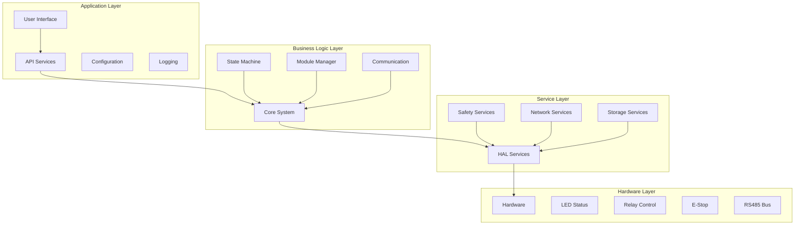

# System Design - OHT-50 Master Module (Phiên bản 2.0)

**Phiên bản:** v2.0  
**Ngày tạo:** 2025-01-28  
**Team:** System Team  
**Trạng thái:** 🏗️ PRODUCTION READY

---

## 🎯 **TỔNG QUAN THIẾT KẾ HỆ THỐNG**

### **Mục tiêu:**
- Thiết kế hệ thống tổng thể cho OHT-50 Master Module
- Đảm bảo tính ổn định, khả năng mở rộng và bảo trì
- Tối ưu hóa hiệu suất và tài nguyên
- Hỗ trợ PM lên task cho các team

### **Nguyên tắc thiết kế:**
- Modular architecture
- Layered design
- Separation of concerns
- Fault tolerance
- Scalability

---

## 🏗️ **SYSTEM ARCHITECTURE OVERVIEW**

### **System Layers:**


---

## 🔧 **SYSTEM COMPONENTS**

### **1. Core System Component**
```c
// Core System Configuration
typedef struct {
    uint32_t system_id;                     // System ID
    char system_name[32];                   // System name
    uint8_t version_major;                  // Major version
    uint8_t version_minor;                  // Minor version
    uint8_t version_patch;                  // Patch version
    uint32_t build_number;                  // Build number
    uint32_t uptime_ms;                     // System uptime
    uint32_t restart_count;                 // Restart count
} core_system_config_t;

// Core System Functions
int core_system_init(core_system_config_t *config);
int core_system_start(void);
int core_system_stop(void);
int core_system_restart(void);
int core_system_get_status(core_system_config_t *status);
```

### **2. Module Management Component**
```c
// Module Management Configuration
typedef struct {
    uint8_t max_modules;                    // Maximum modules
    uint32_t discovery_timeout_ms;          // Discovery timeout
    uint32_t heartbeat_interval_ms;         // Heartbeat interval
    uint8_t auto_discovery_enabled;         // Auto discovery
    uint8_t health_monitoring_enabled;      // Health monitoring
} module_mgmt_config_t;

// Module Management Functions
int module_mgmt_init(module_mgmt_config_t *config);
int module_mgmt_discover_modules(void);
int module_mgmt_get_module_count(uint8_t *count);
int module_mgmt_get_module_info(uint8_t address, module_info_t *info);
int module_mgmt_send_command(uint8_t address, uint8_t *command, uint16_t length);
```

### **3. Communication Component**
```c
// Communication Configuration
typedef struct {
    uint32_t rs485_baudrate;                // RS485 baudrate
    uint8_t rs485_data_bits;                // RS485 data bits
    uint8_t rs485_stop_bits;                // RS485 stop bits
    uint8_t rs485_parity;                   // RS485 parity
    uint32_t network_timeout_ms;            // Network timeout
    uint8_t network_retry_count;            // Network retry count
} comm_config_t;

// Communication Functions
int comm_init(comm_config_t *config);
int comm_send_rs485(uint8_t *data, uint16_t length);
int comm_receive_rs485(uint8_t *data, uint16_t *length);
int comm_send_network(uint8_t *data, uint16_t length);
int comm_receive_network(uint8_t *data, uint16_t *length);
```

---

## 🔌 **HARDWARE INTEGRATION**

### **1. GPIO Management**
```c
// GPIO Configuration
typedef struct {
    uint8_t led_power_pin;                  // Power LED pin
    uint8_t led_system_pin;                 // System LED pin
    uint8_t led_comm_pin;                   // Communication LED pin
    uint8_t led_network_pin;                // Network LED pin
    uint8_t led_error_pin;                  // Error LED pin
    uint8_t relay1_pin;                     // Relay 1 pin
    uint8_t relay2_pin;                     // Relay 2 pin
    uint8_t estop_pin1;                     // E-Stop pin 1
    uint8_t estop_pin2;                     // E-Stop pin 2
} gpio_config_t;

// GPIO Functions
int gpio_init(gpio_config_t *config);
int gpio_set_led(uint8_t led_pin, uint8_t state);
int gpio_set_relay(uint8_t relay_pin, uint8_t state);
int gpio_get_estop_status(uint8_t *status);
```

### **2. RS485 Communication**
```c
// RS485 Configuration
typedef struct {
    uint32_t baudrate;                      // Baudrate
    uint8_t data_bits;                      // Data bits
    uint8_t stop_bits;                      // Stop bits
    uint8_t parity;                         // Parity
    uint8_t de_pin;                         // DE pin
    uint8_t re_pin;                         // RE pin
    uint32_t timeout_ms;                    // Timeout
} rs485_config_t;

// RS485 Functions
int rs485_init(rs485_config_t *config);
int rs485_send(uint8_t *data, uint16_t length);
int rs485_receive(uint8_t *data, uint16_t *length);
int rs485_set_de(uint8_t state);
int rs485_set_re(uint8_t state);
```

---

## 🌐 **NETWORK SERVICES**

### **1. Network Management**
```c
// Network Configuration
typedef struct {
    char ip_address[16];                    // IP address
    char netmask[16];                       // Netmask
    char gateway[16];                       // Gateway
    char dns[16];                           // DNS server
    uint8_t dhcp_enabled;                   // DHCP enabled
    uint16_t http_port;                     // HTTP port
    uint16_t websocket_port;                // WebSocket port
} network_config_t;

// Network Functions
int network_init(network_config_t *config);
int network_start_services(void);
int network_stop_services(void);
int network_get_status(uint8_t *status);
int network_set_config(network_config_t *config);
```

### **2. HTTP Server**
```c
// HTTP Server Configuration
typedef struct {
    uint16_t port;                          // Server port
    uint8_t max_connections;                // Max connections
    uint32_t timeout_ms;                    // Request timeout
    char root_path[64];                     // Root path
} http_server_config_t;

// HTTP Server Functions
int http_server_init(http_server_config_t *config);
int http_server_start(void);
int http_server_stop(void);
int http_server_register_handler(const char *path, void (*handler)(void));
```

### **3. WebSocket Server**
```c
// WebSocket Configuration
typedef struct {
    uint16_t port;                          // Server port
    uint8_t max_connections;                // Max connections
    uint32_t ping_interval_ms;              // Ping interval
    uint32_t pong_timeout_ms;               // Pong timeout
} websocket_config_t;

// WebSocket Functions
int websocket_init(websocket_config_t *config);
int websocket_start(void);
int websocket_stop(void);
int websocket_broadcast_message(ws_message_t *message);
```

---

## 💾 **STORAGE SERVICES**

### **1. Configuration Storage**
```c
// Configuration Storage
typedef struct {
    char config_file[64];                   // Config file path
    uint32_t max_config_size;               // Max config size
    uint8_t auto_backup_enabled;            // Auto backup
    uint8_t versioning_enabled;             // Versioning
} config_storage_t;

// Configuration Functions
int config_storage_init(config_storage_t *config);
int config_storage_save(const char *key, void *data, uint32_t size);
int config_storage_load(const char *key, void *data, uint32_t *size);
int config_storage_delete(const char *key);
int config_storage_backup(void);
```

### **2. Log Storage**
```c
// Log Storage Configuration
typedef struct {
    char log_file[64];                      // Log file path
    uint32_t max_log_size;                  // Max log size
    uint8_t log_rotation_enabled;           // Log rotation
    uint8_t log_compression_enabled;        // Log compression
} log_storage_t;

// Log Storage Functions
int log_storage_init(log_storage_t *config);
int log_storage_write(log_entry_t *entry);
int log_storage_read(log_entry_t *entries, uint16_t count);
int log_storage_clear(void);
int log_storage_export(const char *filename);
```

---

## 🔍 **MONITORING & DIAGNOSTICS**

### **1. System Monitoring**
```c
// System Monitoring Data
typedef struct {
    uint32_t timestamp;                     // Timestamp
    float cpu_usage;                        // CPU usage
    float memory_usage;                     // Memory usage
    float temperature;                      // Temperature
    uint32_t uptime_ms;                     // Uptime
    uint8_t module_count;                   // Module count
    uint8_t error_count;                    // Error count
    system_state_t system_state;            // System state
} system_monitoring_data_t;

// Monitoring Functions
int system_monitor_init(void);
int system_monitor_start(void);
int system_monitor_stop(void);
int system_monitor_get_data(system_monitoring_data_t *data);
int system_monitor_set_callback(void (*callback)(system_monitoring_data_t *));
```

### **2. Performance Monitoring**
```c
// Performance Metrics
typedef struct {
    uint32_t response_time_avg;             // Average response time
    uint32_t response_time_max;             // Maximum response time
    uint32_t throughput_avg;                // Average throughput
    uint32_t error_rate;                    // Error rate
    uint32_t uptime_percentage;             // Uptime percentage
} performance_metrics_t;

// Performance Functions
int performance_monitor_init(void);
int performance_monitor_start(void);
int performance_monitor_stop(void);
int performance_monitor_get_metrics(performance_metrics_t *metrics);
```

---

## 🔧 **CONFIGURATION MANAGEMENT**

### **1. System Configuration**
```c
// System Configuration
typedef struct {
    core_system_config_t core_config;       // Core system config
    module_mgmt_config_t module_config;     // Module management config
    comm_config_t comm_config;              // Communication config
    network_config_t network_config;        // Network config
    gpio_config_t gpio_config;              // GPIO config
    rs485_config_t rs485_config;            // RS485 config
    safety_config_t safety_config;          // Safety config
} system_config_t;

// Configuration Functions
int system_config_init(void);
int system_config_load(system_config_t *config);
int system_config_save(system_config_t *config);
int system_config_validate(system_config_t *config);
int system_config_reset(void);
```

### **2. Configuration Validation**
```c
// Configuration Validation
typedef struct {
    uint8_t validate_network;               // Validate network
    uint8_t validate_hardware;              // Validate hardware
    uint8_t validate_safety;                // Validate safety
    uint8_t validate_modules;               // Validate modules
} config_validation_t;

// Validation Functions
int config_validate_network(network_config_t *config);
int config_validate_hardware(gpio_config_t *config);
int config_validate_safety(safety_config_t *config);
int config_validate_modules(module_mgmt_config_t *config);
```

---

## 🔄 **SYSTEM INTEGRATION**

### **1. Service Integration**
```c
// Service Integration
typedef struct {
    uint8_t core_service_enabled;           // Core service
    uint8_t module_service_enabled;         // Module service
    uint8_t comm_service_enabled;           // Communication service
    uint8_t network_service_enabled;        // Network service
    uint8_t safety_service_enabled;         // Safety service
    uint8_t storage_service_enabled;        // Storage service
    uint8_t monitoring_service_enabled;     // Monitoring service
} service_integration_t;

// Integration Functions
int service_integration_init(service_integration_t *config);
int service_integration_start(void);
int service_integration_stop(void);
int service_integration_get_status(service_integration_t *status);
```

### **2. API Integration**
```c
// API Integration
typedef struct {
    uint8_t rest_api_enabled;               // REST API
    uint8_t websocket_api_enabled;          // WebSocket API
    uint8_t modbus_api_enabled;             // Modbus API
    uint8_t mqtt_api_enabled;               // MQTT API
} api_integration_t;

// API Integration Functions
int api_integration_init(api_integration_t *config);
int api_integration_start(void);
int api_integration_stop(void);
int api_integration_register_handlers(void);
```

---

## 📊 **PERFORMANCE OPTIMIZATION**

### **1. Resource Management**
```c
// Resource Management
typedef struct {
    uint32_t max_memory_usage;              // Max memory usage
    uint32_t max_cpu_usage;                 // Max CPU usage
    uint32_t max_disk_usage;                // Max disk usage
    uint32_t max_network_bandwidth;         // Max network bandwidth
} resource_limits_t;

// Resource Management Functions
int resource_manager_init(resource_limits_t *limits);
int resource_manager_monitor(void);
int resource_manager_get_usage(resource_limits_t *usage);
int resource_manager_set_limits(resource_limits_t *limits);
```

### **2. Caching Strategy**
```c
// Cache Configuration
typedef struct {
    uint32_t cache_size;                    // Cache size
    uint32_t cache_timeout_ms;              // Cache timeout
    uint8_t cache_enabled;                  // Cache enabled
    uint8_t cache_persistence;              // Cache persistence
} cache_config_t;

// Cache Functions
int cache_init(cache_config_t *config);
int cache_set(const char *key, void *data, uint32_t size);
int cache_get(const char *key, void *data, uint32_t *size);
int cache_delete(const char *key);
int cache_clear(void);
```

---

## 📋 **TASK MAPPING CHO PM**

### **EMBED Team Tasks:**
- [ ] Implement GPIO management
- [ ] Implement RS485 communication
- [ ] Implement hardware integration
- [ ] Hardware validation tests
- [ ] Performance optimization

### **Firmware Team Tasks:**
- [ ] Implement core system component
- [ ] Implement module management
- [ ] Implement communication component
- [ ] Implement state machine integration
- [ ] Unit tests cho tất cả components

### **Backend Team Tasks:**
- [ ] Implement network services
- [ ] Implement storage services
- [ ] Implement monitoring services
- [ ] Implement configuration management
- [ ] API integration testing

### **Frontend Team Tasks:**
- [ ] Implement user interface
- [ ] Implement real-time monitoring
- [ ] Implement configuration interface
- [ ] System integration testing

### **System Integration Tasks:**
- [ ] System integration testing
- [ ] End-to-end testing
- [ ] Performance testing
- [ ] Stress testing
- [ ] Documentation review

---

## 📚 **REFERENCES**

### **Related Documents:**
- `architecture.md` - Overall firmware architecture
- `interfaces.md` - Interface definitions
- `safety_architecture.md` - Safety system design
- `state_machine.md` - State machine design

### **Design Patterns:**
- Layered Architecture
- Service-Oriented Architecture
- Event-Driven Architecture
- Microservices Pattern

---

## 📝 **CHANGELOG**

### **v2.0 (2025-01-28):**
- ✅ Added comprehensive system design
- ✅ Added system components
- ✅ Added hardware integration
- ✅ Added network services
- ✅ Added storage services
- ✅ Added monitoring & diagnostics
- ✅ Added configuration management
- ✅ Added system integration
- ✅ Added performance optimization
- ✅ Added task mapping for PM

### **v1.0 (2025-01-27):**
- ✅ Initial system design document
- ✅ Basic system architecture

---

**🚨 Lưu ý:** Thiết kế hệ thống phải đảm bảo tính ổn định, khả năng mở rộng và bảo trì.
