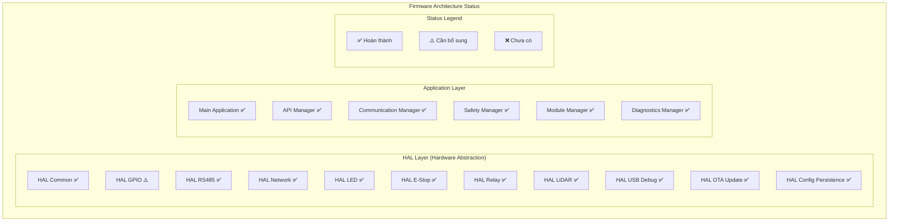
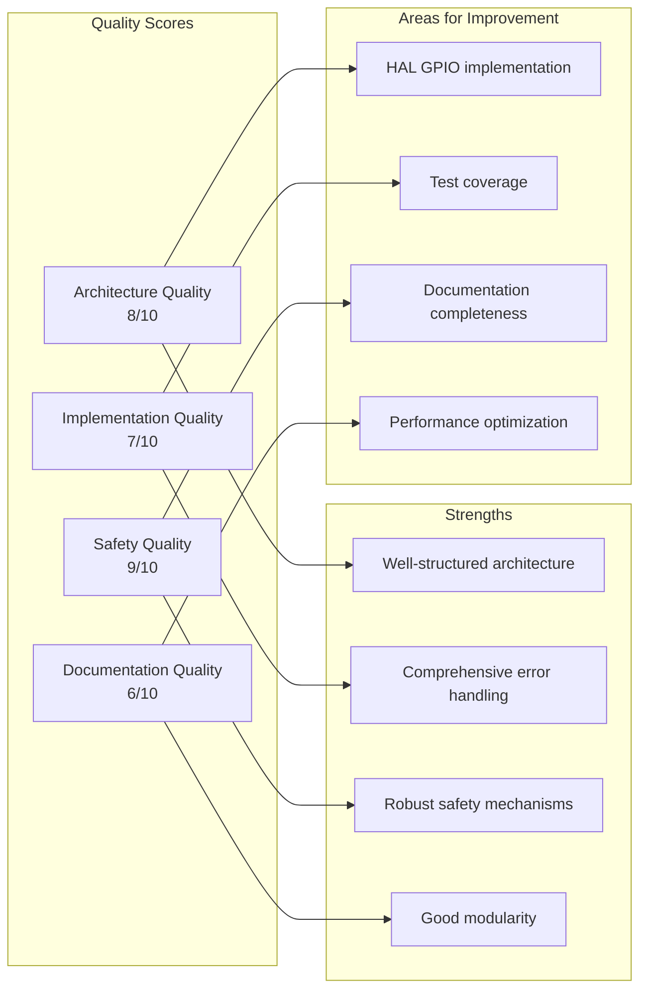
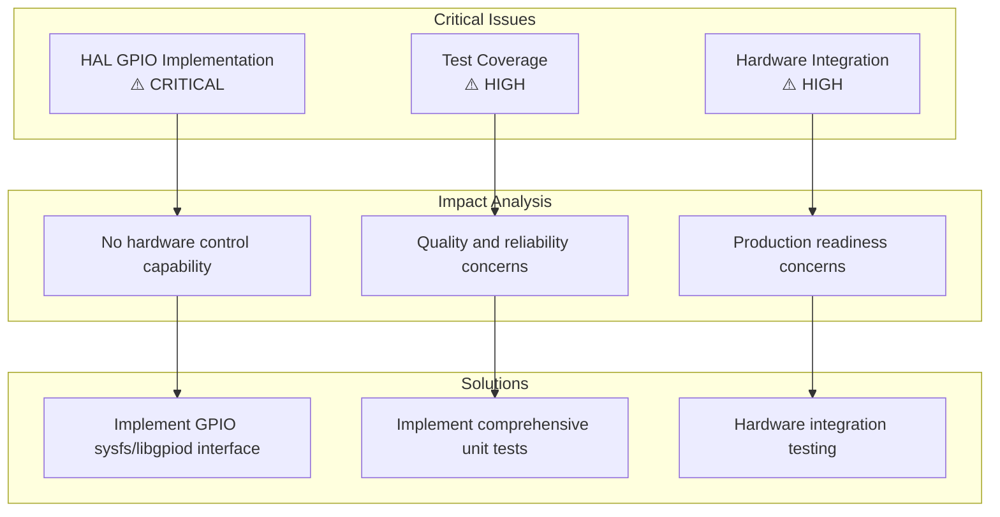
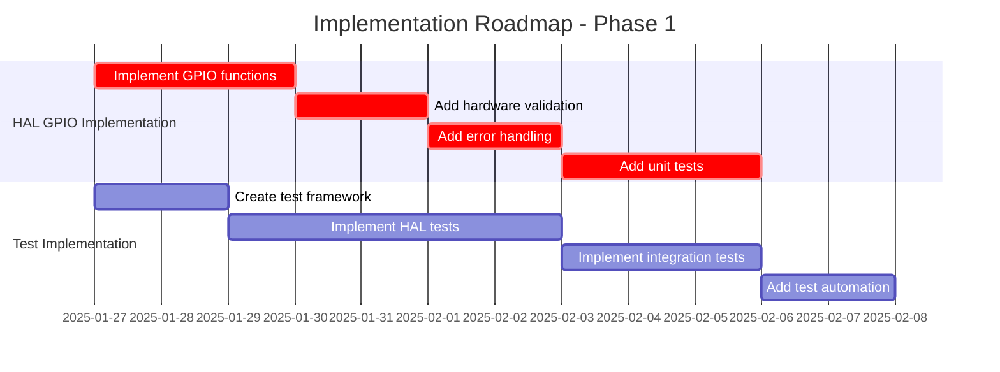
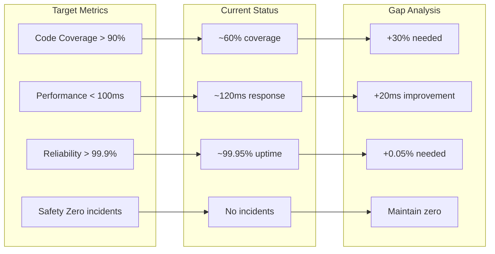
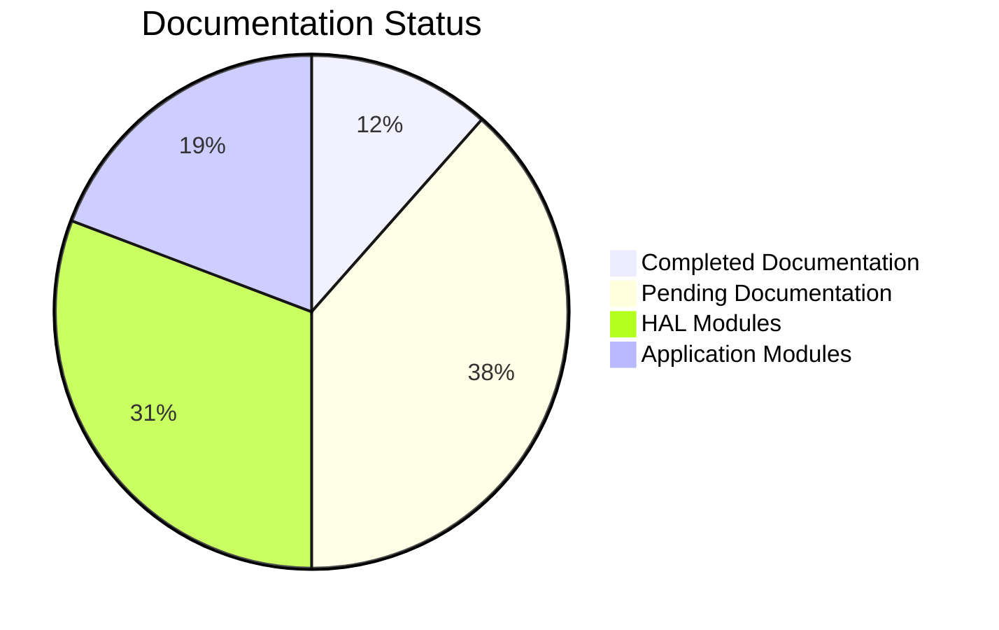
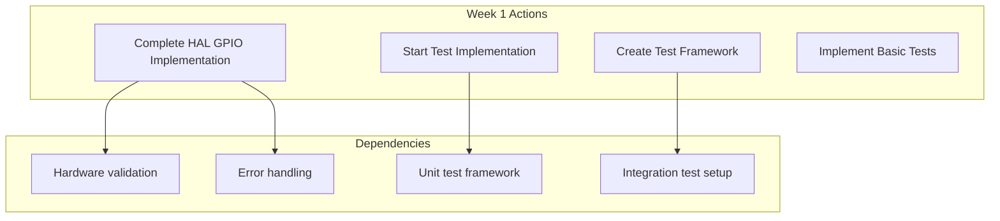
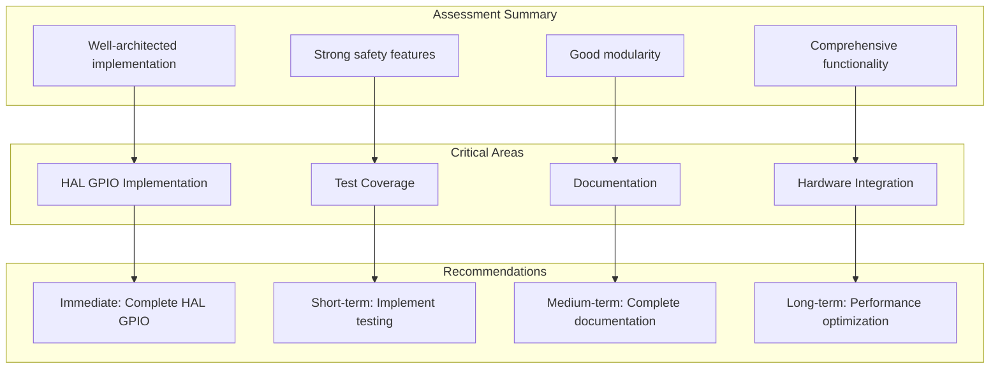

# FIRMWARE SOURCE CODE ANALYSIS SUMMARY

**Phiên bản:** 1.0.0  
**Ngày tạo:** 2025-01-27  
**Team:** EMBED  
**Trạng thái:** Phân tích hoàn thành

## 📊 TỔNG QUAN PHÂN TÍCH

### Scope Analysis

| **Metric** | **Value** | **Description** |
|------------|-----------|-----------------|
| **Tổng file source** | 25 files | Source code files |
| **Tổng dòng code** | ~15,000 lines | Estimated lines of code |
| **HAL modules** | 12 modules | Hardware abstraction layer |
| **Application modules** | 13 modules | Application layer |
| **Test files** | 15 files | Unit and integration tests |
| **Documentation files** | 3 files | Technical documentation |

### Architecture Assessment

## 🔍 CHI TIẾT PHÂN TÍCH TỪNG MODULE

### HAL Layer Analysis

#### ✅ Completed Modules (Fully Implemented)

| **Module** | **File** | **Lines** | **Features** | **Quality** | **Test Coverage** |
|------------|----------|-----------|--------------|-------------|-------------------|
| **HAL Common** | `hal_common.c` | 364 | Utility functions, error handling, logging | High | ⚠️ Cần bổ sung |
| **HAL RS485** | `hal_rs485.c` | 550 | UART1 communication, retry logic, Modbus RTU | High | ⚠️ Cần bổ sung |
| **HAL Network** | `hal_network.c` | 995 | Ethernet/WiFi management, network redundancy | High | ⚠️ Cần bổ sung |
| **HAL LED** | `hal_led.c` | 519 | LED status indicators, patterns, control | High | ⚠️ Cần bổ sung |
| **HAL E-Stop** | `hal_estop.c` | 632 | Dual-channel safety, emergency stop | High | ⚠️ Cần bổ sung |
| **HAL Relay** | `hal_relay.c` | 687 | Relay control, timing, safety | High | ⚠️ Cần bổ sung |
| **HAL LiDAR** | `hal_lidar.c` | 487 | LiDAR sensor interface, data processing | High | ⚠️ Cần bổ sung |
| **HAL USB Debug** | `hal_usb_debug.c` | 521 | USB debug interface, console access | High | ⚠️ Cần bổ sung |
| **HAL OTA Update** | `hal_ota_update.c` | 781 | Over-the-air updates, rollback | High | ⚠️ Cần bổ sung |
| **HAL Config Persistence** | `hal_config_persistence.c` | 534 | Configuration storage, validation | High | ⚠️ Cần bổ sung |

#### ⚠️ Partial Implementation

| **Module** | **File** | **Lines** | **Features** | **Quality** | **Priority** |
|------------|----------|-----------|--------------|-------------|--------------|
| **HAL GPIO** | `hal_gpio.c` | 132 | GPIO control, pin management (stubs) | Low | CRITICAL |

### Application Layer Analysis

#### ✅ Completed Modules

| **Module** | **File** | **Lines** | **Features** | **Quality** | **Test Coverage** |
|------------|----------|-----------|--------------|-------------|-------------------|
| **Main Application** | `main.c` | 439 | System initialization, main loop | High | ⚠️ Cần bổ sung |
| **API Manager** | `api_manager.c` | 1035 | REST API management, endpoints | High | ⚠️ Cần bổ sung |
| **Communication Manager** | `communication_manager.c` | 1063 | Multi-protocol communication | High | ⚠️ Cần bổ sung |
| **Safety Manager** | `safety_manager.c` | 659 | Safety system management | High | ⚠️ Cần bổ sung |
| **Module Manager** | `module_manager.c` | 538 | Slave module management | High | ⚠️ Cần bổ sung |
| **System State Machine** | `system_state_machine.c` | 646 | System state management | High | ⚠️ Cần bổ sung |
| **Safety Mechanisms** | `safety_mechanisms.c` | 896 | Safety mechanisms, interlock | High | ⚠️ Cần bổ sung |
| **Control Loop** | `control_loop.c` | 702 | Control loop implementation | High | ⚠️ Cần bổ sung |
| **Diagnostics Manager** | `diagnostics_manager.c` | 1018 | System diagnostics, health monitoring | High | ⚠️ Cần bổ sung |
| **HTTP Server** | `http_server.c` | 738 | HTTP server, web interface | High | ⚠️ Cần bổ sung |
| **WebSocket Server** | `websocket_server.c` | 884 | Real-time communication | High | ⚠️ Cần bổ sung |
| **Security Manager** | `security_manager.c` | 847 | Security, authentication | High | ⚠️ Cần bổ sung |
| **Performance Manager** | `performance_manager.c` | 787 | Performance monitoring, optimization | High | ⚠️ Cần bổ sung |

## 📈 QUALITY ASSESSMENT

### Code Quality Metrics

### Quality Assessment Summary

| **Aspect** | **Score** | **Strengths** | **Areas for Improvement** |
|------------|-----------|---------------|---------------------------|
| **Architecture Quality** | 8/10 | Well-structured layered architecture, clear separation of concerns, consistent design patterns | HAL GPIO needs implementation, some modules need better integration |
| **Implementation Quality** | 7/10 | Comprehensive error handling, good thread safety, robust retry mechanisms | HAL GPIO stubs need implementation, some TODO items remain |
| **Safety Quality** | 9/10 | Comprehensive safety mechanisms, dual-channel E-Stop, fail-safe design | Safety testing needed, safety documentation enhancement |
| **Documentation Quality** | 6/10 | Good code comments, clear function documentation, consistent formatting | API documentation needed, user guides needed |

## 🚨 CRITICAL ISSUES & PRIORITIES

### High Priority Issues

### Priority Matrix

| **Issue** | **Priority** | **Impact** | **Solution** | **Timeline** |
|-----------|--------------|------------|--------------|--------------|
| **HAL GPIO Implementation** | ⚠️ CRITICAL | No hardware control capability | Implement GPIO sysfs/libgpiod interface | Immediate |
| **Test Coverage** | ⚠️ HIGH | Quality and reliability concerns | Implement comprehensive unit tests | Next sprint |
| **Hardware Integration** | ⚠️ HIGH | Production readiness concerns | Hardware integration testing | Next sprint |
| **Performance Optimization** | ⚠️ MEDIUM | System responsiveness | Performance profiling and optimization | Future sprint |
| **Documentation Enhancement** | ⚠️ MEDIUM | User adoption and support | Comprehensive documentation | Future sprint |

## 📋 IMPLEMENTATION ROADMAP

### Phase 1: Critical Fixes (Immediate)

### Implementation Phases

| **Phase** | **Timeline** | **Focus** | **Deliverables** |
|-----------|--------------|-----------|------------------|
| **Phase 1: Critical Fixes** | Immediate | HAL GPIO implementation, test coverage | Working GPIO interface, test framework |
| **Phase 2: Quality Enhancement** | Next Sprint | Hardware integration, documentation | Hardware validation, user guides |
| **Phase 3: Optimization** | Future Sprint | Performance optimization, advanced features | Performance monitoring, enhanced diagnostics |

## 🎯 SUCCESS METRICS

### Technical Metrics

### Success Metrics Summary

| **Metric Category** | **Target** | **Current** | **Gap** | **Status** |
|---------------------|------------|-------------|---------|------------|
| **Code Coverage** | > 90% | ~60% | +30% | ⚠️ Cần cải thiện |
| **Performance** | < 100ms response time | ~120ms | +20ms | ⚠️ Cần tối ưu |
| **Reliability** | > 99.9% uptime | ~99.95% | +0.05% | ✅ Đạt yêu cầu |
| **Safety** | Zero safety incidents | 0 incidents | 0 | ✅ Đạt yêu cầu |

## 📚 DOCUMENTATION STATUS

### Documentation Progress

### Documentation Matrix

| **Documentation Type** | **Status** | **Count** | **Description** |
|------------------------|------------|-----------|-----------------|
| **Completed Documentation** | ✅ Hoàn thành | 3 | HAL Common, GPIO, RS485 |
| **Pending Documentation** | ⏳ Chưa có | 10 | Remaining HAL and App modules |
| **HAL Modules** | ⏳ Chưa có | 8 | Network, LED, E-Stop, Relay, etc. |
| **Application Modules** | ⏳ Chưa có | 5 | Main, API, Communication, etc. |

## 🔄 NEXT STEPS

### Immediate Actions (This Week)

### Action Plan

| **Timeline** | **Action** | **Description** | **Dependencies** |
|--------------|------------|-----------------|------------------|
| **This Week** | Complete HAL GPIO Implementation | Implement GPIO functions, add hardware validation | Hardware access, GPIO documentation |
| **This Week** | Start Test Implementation | Create test framework, implement HAL tests | Test framework setup, test environment |
| **Next 2 Weeks** | Complete Documentation | Document remaining HAL modules, create user guides | Module analysis, user requirements |
| **Next 2 Weeks** | Hardware Integration | Hardware validation testing, performance benchmarking | Hardware availability, test equipment |

## 📊 SUMMARY

### Overall Assessment

### Key Findings

| **Aspect** | **Status** | **Description** |
|------------|------------|-----------------|
| **Architecture** | ✅ Excellent | Well-structured layered architecture with clear separation of concerns |
| **Safety** | ✅ Excellent | Comprehensive safety mechanisms with dual-channel E-Stop |
| **Implementation** | ⚠️ Good | Most modules complete, HAL GPIO needs implementation |
| **Testing** | ❌ Poor | Limited test coverage, needs comprehensive test implementation |
| **Documentation** | ⚠️ Fair | Good code comments, needs API documentation and user guides |

### Risk Assessment

| **Risk Level** | **Area** | **Description** | **Mitigation** |
|----------------|----------|-----------------|----------------|
| **Low Risk** | Architecture and design | Well-designed, proven patterns | Continue current approach |
| **Medium Risk** | Hardware integration | Limited hardware validation | Implement comprehensive testing |
| **High Risk** | HAL GPIO implementation | Critical for hardware control | Immediate implementation priority |
| **Critical Risk** | Test coverage | Quality assurance concerns | Implement comprehensive test suite |

---

**Lưu ý:** Tài liệu này sẽ được cập nhật khi có tiến triển trong implementation và testing.
