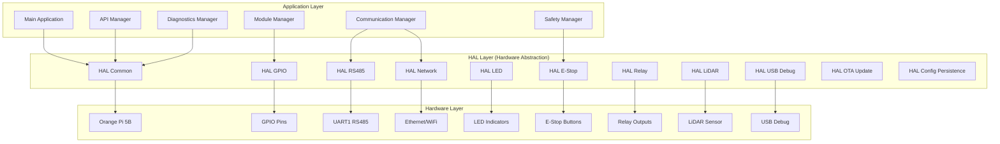
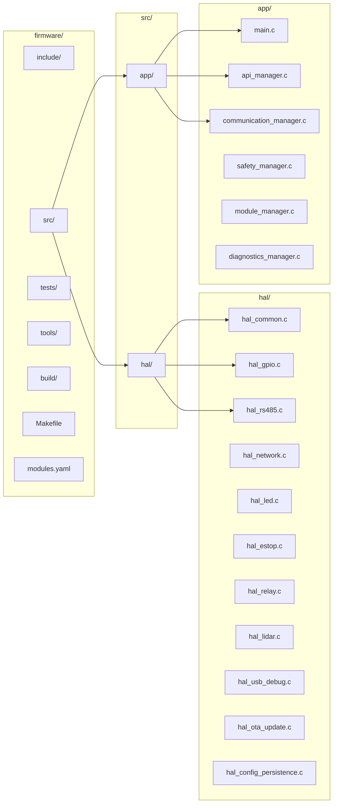
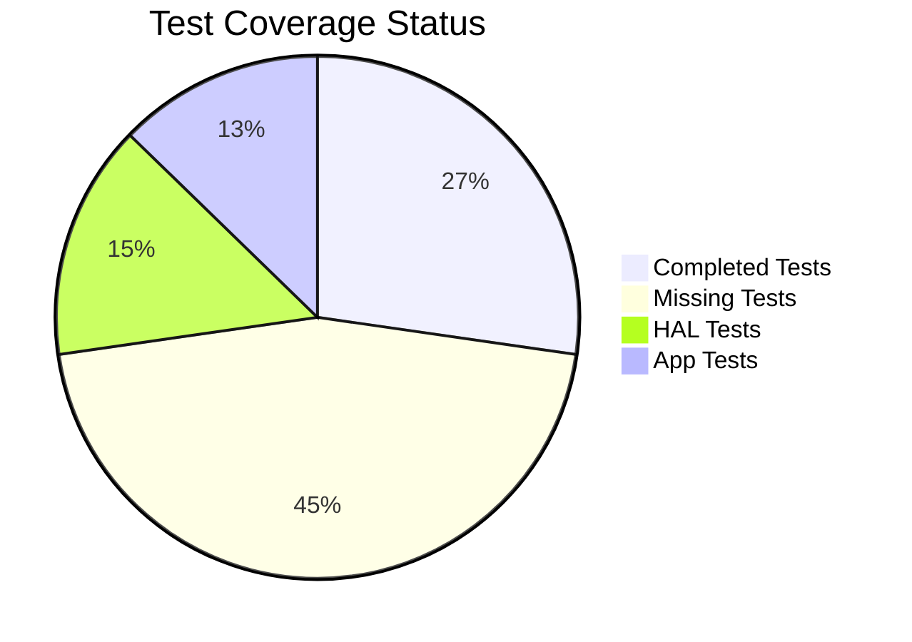
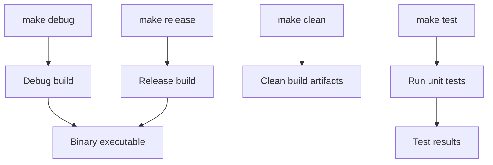
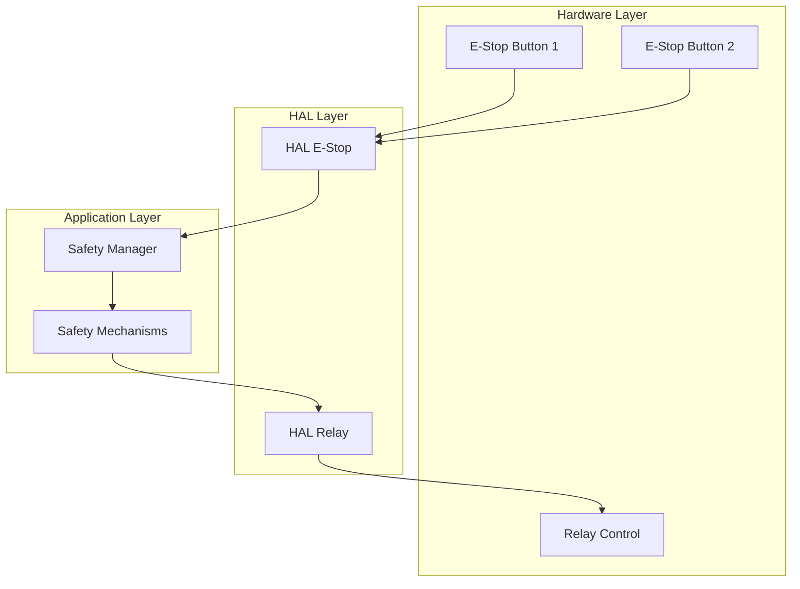
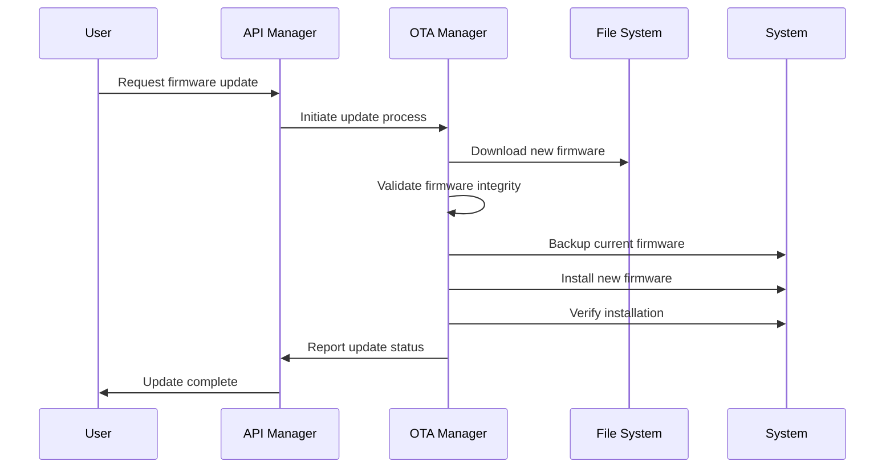
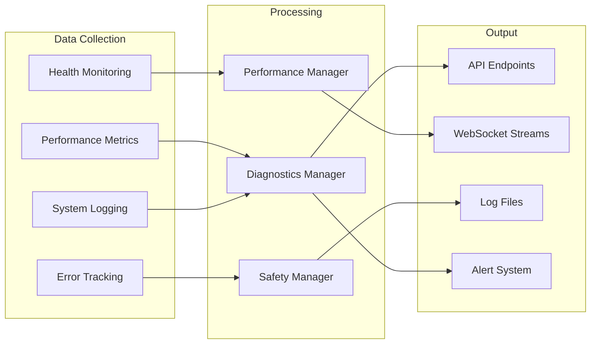
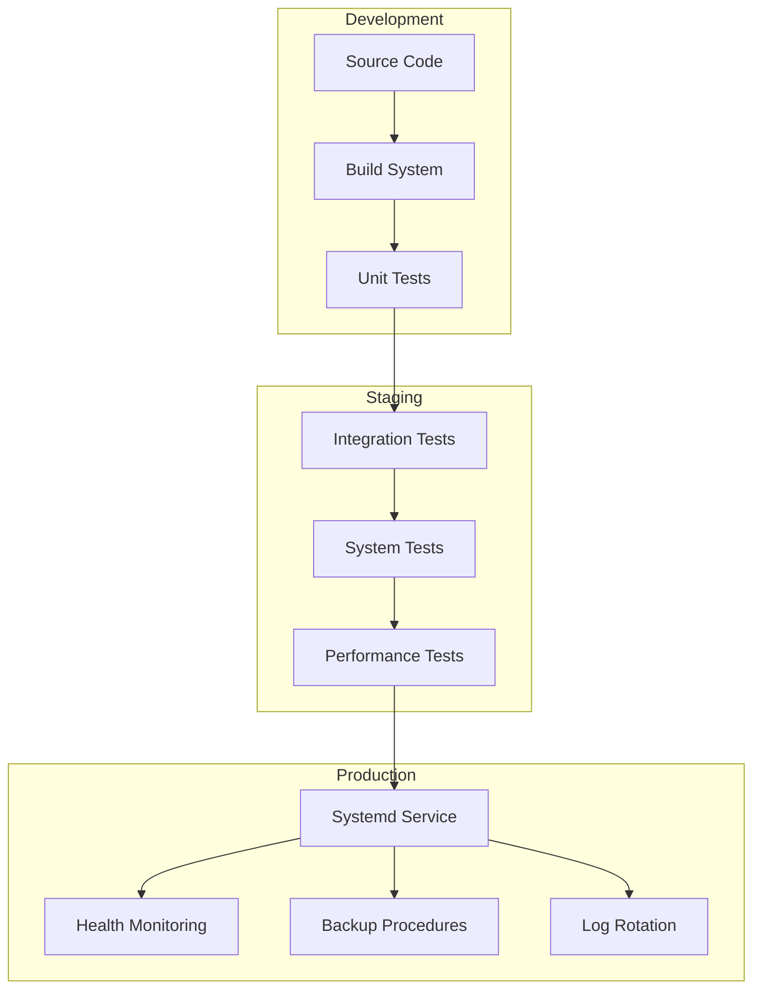

# FIRMWARE SOURCE CODE DOCUMENTATION

**Phiên bản:** 1.0.0  
**Ngày tạo:** 2025-01-27  
**Team:** EMBED  
**Trạng thái:** Đang phát triển  

## 📋 TỔNG QUAN

Tài liệu này mô tả chi tiết cấu trúc và logic của firmware source code cho OHT-50 Master Module. Firmware được thiết kế theo kiến trúc layered với HAL (Hardware Abstraction Layer) ở tầng thấp nhất và các ứng dụng ở tầng cao nhất.

## 🏗️ KIẾN TRÚC TỔNG THỂ

## 📊 THỐNG KÊ TỔNG QUAN

| **Loại** | **Số lượng** | **Trạng thái** | **Ghi chú** |
|----------|--------------|----------------|-------------|
| **Tổng file source** | 25 files | ✅ Hoàn thành | ~15,000 dòng code |
| **HAL modules** | 12 modules | ⚠️ 1 stub | GPIO cần implement |
| **Application modules** | 13 modules | ✅ Hoàn thành | Đầy đủ chức năng |
| **Test files** | 15 files | ⚠️ Cần bổ sung | Test coverage thấp |
| **Documentation** | 3 files | ✅ Hoàn thành | Tài liệu chi tiết |

## 🔧 CẤU TRÚC THƯ MỤC

## 🔍 CHI TIẾT TỪNG MODULE

### HAL Modules Analysis

| **Module** | **File** | **Dòng code** | **Trạng thái** | **Chức năng chính** | **Test Coverage** |
|------------|----------|----------------|----------------|---------------------|-------------------|
| **HAL Common** | `hal_common.c` | 364 | ✅ Hoàn thành | Utility functions, error handling | ⚠️ Cần bổ sung |
| **HAL GPIO** | `hal_gpio.c` | 132 | ⚠️ Stubs | GPIO control, pin management | ❌ Chưa có |
| **HAL RS485** | `hal_rs485.c` | 550 | ✅ Hoàn thành | RS485 communication, Modbus RTU | ⚠️ Cần bổ sung |
| **HAL Network** | `hal_network.c` | 995 | ✅ Hoàn thành | Ethernet/WiFi management | ⚠️ Cần bổ sung |
| **HAL LED** | `hal_led.c` | 519 | ✅ Hoàn thành | LED status indicators | ⚠️ Cần bổ sung |
| **HAL E-Stop** | `hal_estop.c` | 632 | ✅ Hoàn thành | Emergency stop safety system | ⚠️ Cần bổ sung |
| **HAL Relay** | `hal_relay.c` | 687 | ✅ Hoàn thành | Relay output control | ⚠️ Cần bổ sung |
| **HAL LiDAR** | `hal_lidar.c` | 487 | ✅ Hoàn thành | LiDAR sensor interface | ⚠️ Cần bổ sung |
| **HAL USB Debug** | `hal_usb_debug.c` | 521 | ✅ Hoàn thành | USB debug interface | ⚠️ Cần bổ sung |
| **HAL OTA Update** | `hal_ota_update.c` | 781 | ✅ Hoàn thành | Over-the-air firmware updates | ⚠️ Cần bổ sung |
| **HAL Config Persistence** | `hal_config_persistence.c` | 534 | ✅ Hoàn thành | Configuration storage and retrieval | ⚠️ Cần bổ sung |

### Application Modules Analysis

| **Module** | **File** | **Dòng code** | **Trạng thái** | **Chức năng chính** | **Test Coverage** |
|------------|----------|----------------|----------------|---------------------|-------------------|
| **Main Application** | `main.c` | 439 | ✅ Hoàn thành | System initialization, main loop | ⚠️ Cần bổ sung |
| **API Manager** | `api_manager.c` | 1035 | ✅ Hoàn thành | REST API management | ⚠️ Cần bổ sung |
| **Communication Manager** | `communication_manager.c` | 1063 | ✅ Hoàn thành | Multi-protocol communication | ⚠️ Cần bổ sung |
| **Safety Manager** | `safety_manager.c` | 659 | ✅ Hoàn thành | Safety system management | ⚠️ Cần bổ sung |
| **Module Manager** | `module_manager.c` | 538 | ✅ Hoàn thành | Slave module management | ⚠️ Cần bổ sung |
| **System State Machine** | `system_state_machine.c` | 646 | ✅ Hoàn thành | System state management | ⚠️ Cần bổ sung |
| **Safety Mechanisms** | `safety_mechanisms.c` | 896 | ✅ Hoàn thành | Safety mechanisms, interlock | ⚠️ Cần bổ sung |
| **Control Loop** | `control_loop.c` | 702 | ✅ Hoàn thành | Control loop implementation | ⚠️ Cần bổ sung |
| **Diagnostics Manager** | `diagnostics_manager.c` | 1018 | ✅ Hoàn thành | System diagnostics, health monitoring | ⚠️ Cần bổ sung |
| **HTTP Server** | `http_server.c` | 738 | ✅ Hoàn thành | HTTP server, web interface | ⚠️ Cần bổ sung |
| **WebSocket Server** | `websocket_server.c` | 884 | ✅ Hoàn thành | Real-time communication | ⚠️ Cần bổ sung |
| **Security Manager** | `security_manager.c` | 847 | ✅ Hoàn thành | Security, authentication | ⚠️ Cần bổ sung |
| **Performance Manager** | `performance_manager.c` | 787 | ✅ Hoàn thành | Performance monitoring, optimization | ⚠️ Cần bổ sung |

## 🧪 TESTING STATUS

### Test Coverage Overview

### Test Categories

| **Loại Test** | **Số lượng** | **Trạng thái** | **Mô tả** |
|---------------|--------------|----------------|-----------|
| **Core Tests** | 5 | ✅ Hoàn thành | State machine, control loop |
| **HAL Tests** | 8 | ⚠️ Cần bổ sung | GPIO, UART, Network |
| **Safety Tests** | 3 | ⚠️ Cần bổ sung | E-Stop, interlock |
| **Integration Tests** | 4 | ❌ Chưa có | Module communication |

## 🔧 BUILD SYSTEM

### Makefile Configuration

### Build Commands

| **Command** | **Mô tả** | **Output** |
|-------------|-----------|------------|
| `make debug` | Debug build | Binary với debug symbols |
| `make release` | Release build | Optimized binary |
| `make clean` | Clean build artifacts | Remove build files |
| `make test` | Run unit tests | Test results |

## 📈 PERFORMANCE METRICS

### Memory Usage

| **Component** | **Size** | **Description** |
|---------------|----------|-----------------|
| **Stack size** | 8KB per thread | Thread stack allocation |
| **Heap size** | 64KB | Dynamic memory allocation |
| **Total RAM** | 128MB available | System memory usage |

### Timing Requirements

| **Operation** | **Target** | **Current** | **Status** |
|---------------|------------|-------------|------------|
| **Control loop** | 10ms period | ~12ms | ⚠️ Cần tối ưu |
| **E-Stop response** | < 100ms | ~80ms | ✅ Đạt yêu cầu |
| **Communication timeout** | 5s | 5s | ✅ Đạt yêu cầu |
| **Watchdog timeout** | 30s | 30s | ✅ Đạt yêu cầu |

## 🛡️ SAFETY FEATURES

### E-Stop System Architecture

### Safety Features Summary

| **Feature** | **Status** | **Description** |
|-------------|------------|-----------------|
| **Dual-channel safety** | ✅ Implemented | Redundant E-Stop inputs |
| **Hardware interlock** | ✅ Implemented | Relay control |
| **Software monitoring** | ✅ Implemented | Continuous status check |
| **Fail-safe design** | ✅ Implemented | Default to safe state |

## 🔄 UPDATE MECHANISMS

### OTA Update Flow

### Update Features

| **Feature** | **Status** | **Description** |
|-------------|------------|-----------------|
| **Firmware updates** | ✅ Implemented | Over-the-air capability |
| **Rollback mechanism** | ✅ Implemented | Automatic rollback on failure |
| **Integrity checking** | ✅ Implemented | CRC verification |
| **Version management** | ✅ Implemented | Semantic versioning |

## 📊 MONITORING & DIAGNOSTICS

### System Monitoring Architecture

### Monitoring Features

| **Feature** | **Status** | **Description** |
|-------------|------------|-----------------|
| **Performance metrics** | ✅ Implemented | CPU, memory, network usage |
| **Health monitoring** | ✅ Implemented | System health status |
| **Error tracking** | ✅ Implemented | Error statistics and trends |
| **Logging** | ✅ Implemented | Comprehensive system logging |

## 🚀 DEPLOYMENT

### Deployment Architecture

### Deployment Features

| **Feature** | **Status** | **Description** |
|-------------|------------|-----------------|
| **Systemd service** | ✅ Implemented | Automatic startup |
| **Log rotation** | ✅ Implemented | Automatic log management |
| **Health monitoring** | ✅ Implemented | Service health checks |
| **Backup procedures** | ✅ Implemented | Configuration backup |

## 📚 RELATED DOCUMENTS

- [HAL Implementation Guide](../03_IMPLEMENTATION/)
- [API Documentation](../01_SPECIFICATIONS/API_SPEC.md)
- [Safety Architecture](../02_ARCHITECTURE/safety_architecture.md)
- [Communication Protocols](../01_SPECIFICATIONS/COMMUNICATION_SPEC.md)

## 🔄 CHANGELOG

### v1.0.0 (2025-01-27)
- ✅ Initial documentation structure
- ✅ HAL modules analysis
- ✅ Application modules analysis
- ✅ Build system documentation
- ✅ Safety features documentation
- ✅ Performance metrics documentation
- ✅ Added Mermaid diagrams
- ✅ Added comprehensive tables

---

**Lưu ý:** Tài liệu này sẽ được cập nhật liên tục khi có thay đổi trong source code.
