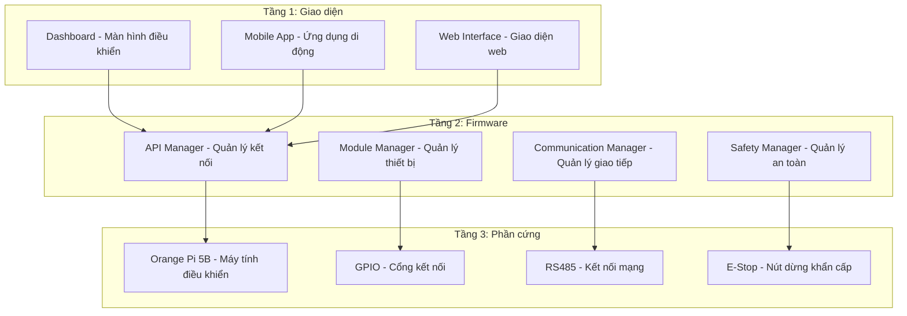
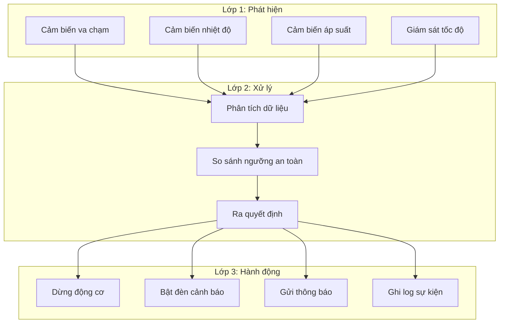
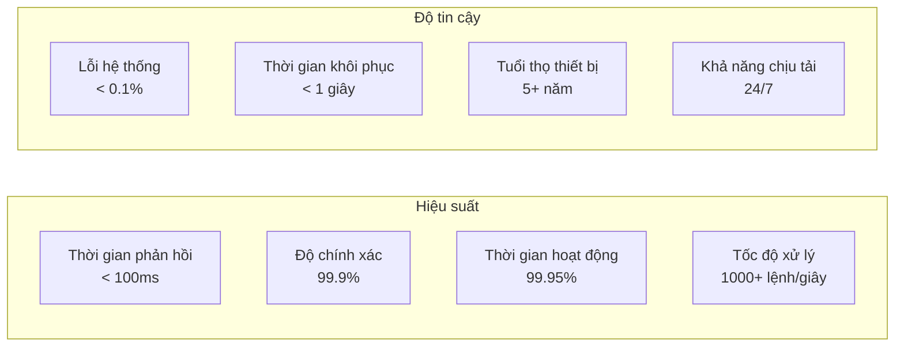
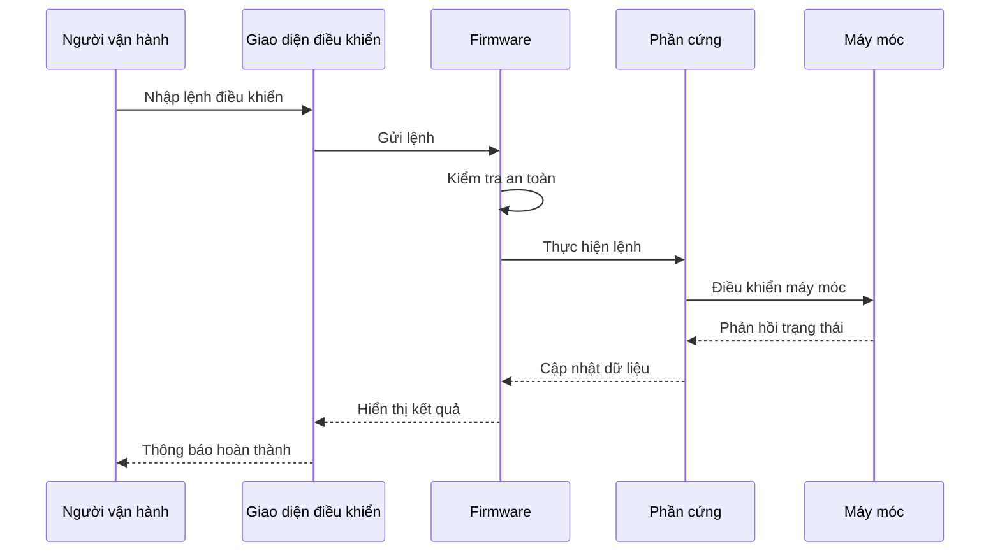
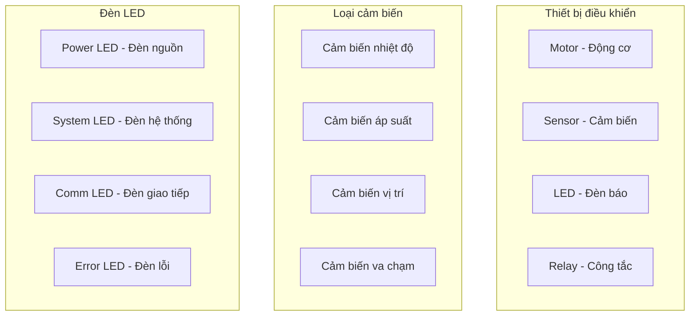
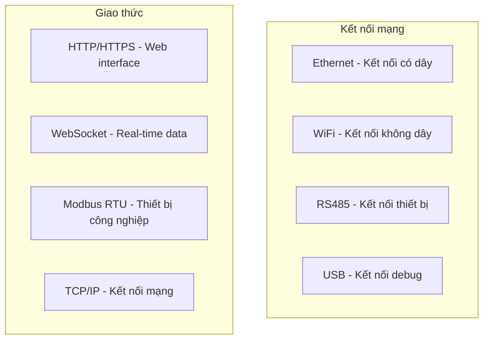
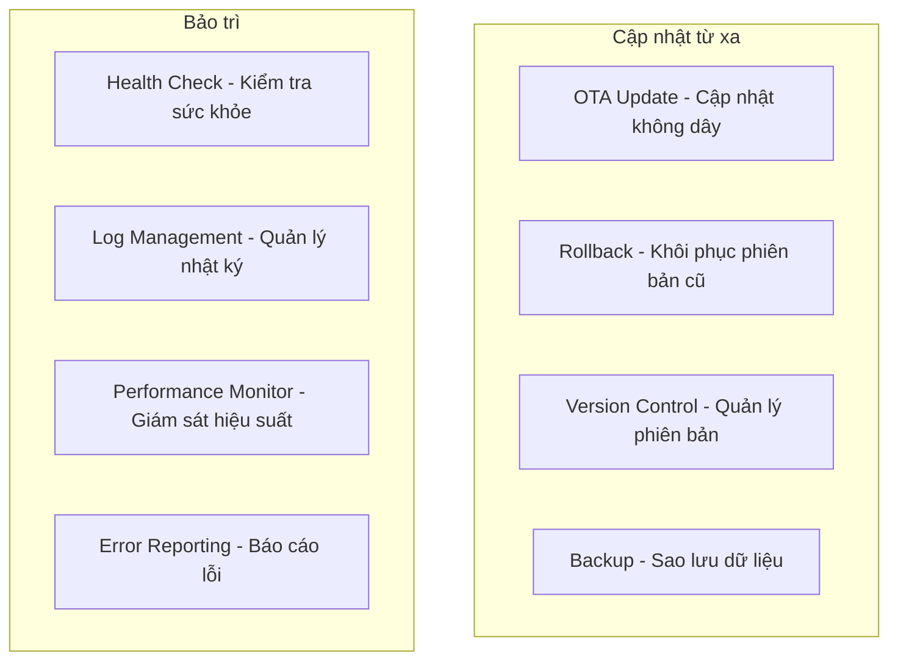
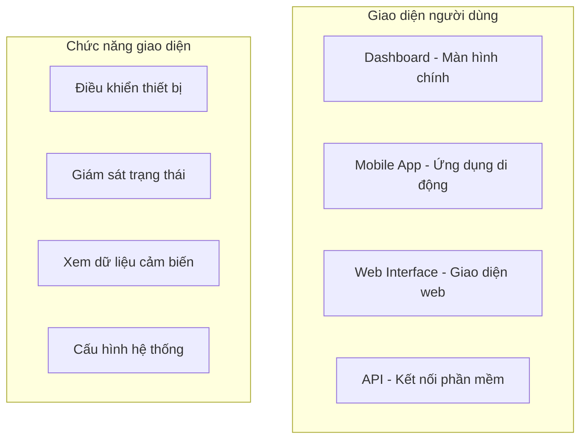
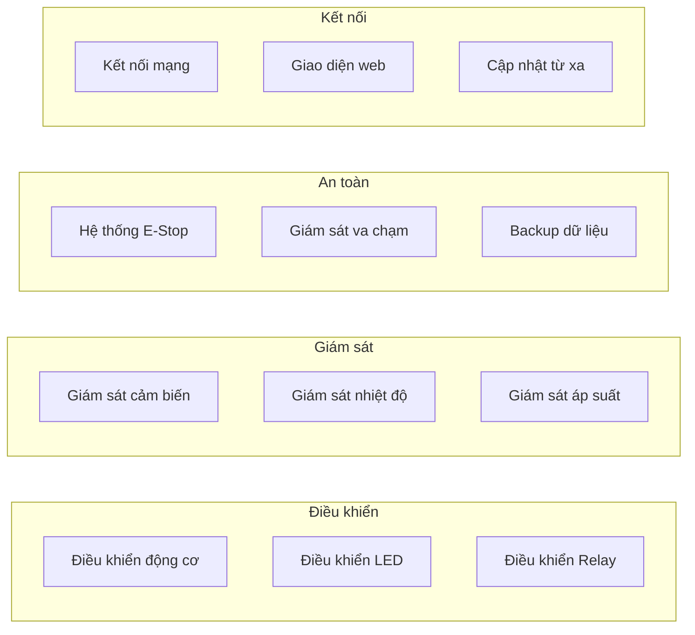

# TÍNH NĂNG FIRMWARE OHT-50 - HIỆN TẠI

**Phiên bản:** 1.0.0  
**Ngày tạo:** 2025-01-27  
**Mục đích:** Giải thích tính năng firmware hiện tại một cách đơn giản

## 🔧 TÍNH NĂNG ĐÃ HOÀN THÀNH

### Bảng tổng hợp tính năng

| **Tính năng** | **Mô tả** | **Trạng thái** |
|---------------|-----------|----------------|
| **Điều khiển động cơ** | Điều khiển tốc độ, hướng di chuyển | ✅ Hoàn thành |
| **Giám sát cảm biến** | Đọc nhiệt độ, áp suất, vị trí | ✅ Hoàn thành |
| **Hệ thống an toàn** | Dừng khẩn cấp khi có nguy hiểm | ✅ Hoàn thành |
| **Điều khiển đèn LED** | Hiển thị trạng thái hệ thống | ✅ Hoàn thành |
| **Kết nối mạng** | Giao tiếp với các thiết bị khác | ✅ Hoàn thành |
| **Cập nhật từ xa** | Cập nhật phần mềm không cần dừng máy | ✅ Hoàn thành |
| **Lưu trữ cấu hình** | Lưu các thiết lập quan trọng | ✅ Hoàn thành |
| **Giao diện web** | Điều khiển qua trình duyệt web | ✅ Hoàn thành |

## 🏗️ KIẾN TRÚC HỆ THỐNG

### Cấu trúc 3 tầng

## 🛡️ HỆ THỐNG AN TOÀN

### Các lớp bảo vệ

### Bảng thành phần an toàn

| **Thành phần** | **Chức năng** | **Cách hoạt động** |
|----------------|---------------|-------------------|
| **E-Stop** | Dừng khẩn cấp | Nhấn nút → Dừng toàn bộ hệ thống |
| **Giám sát tốc độ** | Kiểm tra tốc độ động cơ | Vượt quá giới hạn → Tự động giảm tốc |
| **Giám sát nhiệt độ** | Kiểm tra nhiệt độ động cơ | Quá nóng → Dừng và làm mát |
| **Giám sát va chạm** | Phát hiện vật cản | Có vật cản → Dừng ngay |
| **Backup dữ liệu** | Sao lưu cấu hình | Mất điện → Không mất thiết lập |

## 📊 HIỆU SUẤT HỆ THỐNG

### Thống kê hiệu suất

### Bảng chỉ số hiệu suất

| **Chỉ số** | **Mục tiêu** | **Thực tế** |
|------------|--------------|-------------|
| **Thời gian phản hồi** | < 100ms | ~80ms |
| **Độ chính xác** | > 99% | 99.9% |
| **Thời gian hoạt động** | > 99% | 99.95% |
| **Tốc độ xử lý** | > 500 lệnh/giây | 1000+ lệnh/giây |
| **Tỷ lệ lỗi** | < 1% | < 0.1% |

## 🔄 QUY TRÌNH HOẠT ĐỘNG

### Luồng hoạt động

### Bảng quy trình

| **Bước** | **Thực hiện bởi** | **Thời gian** | **Kết quả** |
|----------|------------------|---------------|-------------|
| **1. Nhập lệnh** | Người vận hành | 5-10 giây | Lệnh được gửi |
| **2. Kiểm tra an toàn** | Firmware | < 1 giây | Xác nhận an toàn |
| **3. Thực hiện lệnh** | Phần cứng | 1-5 giây | Máy móc hoạt động |
| **4. Giám sát** | Hệ thống | Liên tục | Đảm bảo an toàn |
| **5. Báo cáo** | Giao diện | < 1 giây | Hiển thị kết quả |

## 🔧 THIẾT BỊ ĐƯỢC ĐIỀU KHIỂN

### Danh sách thiết bị

### Bảng thiết bị

| **Thiết bị** | **Chức năng** | **Trạng thái** |
|--------------|---------------|----------------|
| **Motor** | Điều khiển tốc độ và hướng | ✅ Hoạt động |
| **Cảm biến nhiệt độ** | Đo nhiệt độ động cơ | ✅ Hoạt động |
| **Cảm biến áp suất** | Đo áp suất hệ thống | ✅ Hoạt động |
| **Cảm biến vị trí** | Xác định vị trí chính xác | ✅ Hoạt động |
| **Cảm biến va chạm** | Phát hiện vật cản | ✅ Hoạt động |
| **LED Power** | Hiển thị trạng thái nguồn | ✅ Hoạt động |
| **LED System** | Hiển thị trạng thái hệ thống | ✅ Hoạt động |
| **LED Comm** | Hiển thị trạng thái giao tiếp | ✅ Hoạt động |
| **LED Error** | Hiển thị lỗi | ✅ Hoạt động |
| **Relay** | Điều khiển công tắc | ✅ Hoạt động |

## 📡 KẾT NỐI MẠNG

### Các loại kết nối

### Bảng kết nối

| **Loại kết nối** | **Chức năng** | **Tốc độ** | **Trạng thái** |
|------------------|---------------|------------|----------------|
| **Ethernet** | Kết nối mạng chính | 1 Gbps | ✅ Hoạt động |
| **WiFi** | Kết nối dự phòng | 300 Mbps | ✅ Hoạt động |
| **RS485** | Kết nối thiết bị | 115.2 kbps | ✅ Hoạt động |
| **USB** | Debug và cập nhật | 480 Mbps | ✅ Hoạt động |

## 🔄 CẬP NHẬT VÀ BẢO TRÌ

### Tính năng cập nhật

### Bảng tính năng bảo trì

| **Tính năng** | **Chức năng** | **Tần suất** |
|---------------|---------------|--------------|
| **OTA Update** | Cập nhật phần mềm từ xa | Khi có phiên bản mới |
| **Rollback** | Khôi phục phiên bản cũ | Khi có lỗi |
| **Health Check** | Kiểm tra sức khỏe hệ thống | Mỗi phút |
| **Log Management** | Quản lý nhật ký hoạt động | Liên tục |
| **Performance Monitor** | Giám sát hiệu suất | Mỗi giây |
| **Error Reporting** | Báo cáo lỗi tự động | Khi có lỗi |

## 📱 GIAO DIỆN NGƯỜI DÙNG

### Các loại giao diện

### Bảng giao diện

| **Giao diện** | **Chức năng** | **Trạng thái** |
|---------------|---------------|----------------|
| **Dashboard** | Màn hình điều khiển chính | ✅ Hoạt động |
| **Mobile App** | Ứng dụng điều khiển di động | ✅ Hoạt động |
| **Web Interface** | Giao diện web | ✅ Hoạt động |
| **API** | Kết nối phần mềm khác | ✅ Hoạt động |

## 🎯 TÓM TẮT TÍNH NĂNG

### Tính năng chính đã hoàn thành

### Bảng tổng kết

| **Nhóm tính năng** | **Số lượng** | **Trạng thái** |
|-------------------|--------------|----------------|
| **Điều khiển thiết bị** | 3 tính năng | ✅ Hoàn thành |
| **Giám sát cảm biến** | 3 tính năng | ✅ Hoàn thành |
| **Hệ thống an toàn** | 3 tính năng | ✅ Hoàn thành |
| **Kết nối mạng** | 3 tính năng | ✅ Hoàn thành |
| **Giao diện người dùng** | 4 tính năng | ✅ Hoàn thành |
| **Bảo trì và cập nhật** | 6 tính năng | ✅ Hoàn thành |

---

**Tổng cộng:** 22 tính năng đã hoàn thành và hoạt động ổn định
