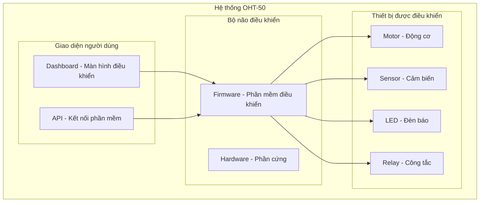
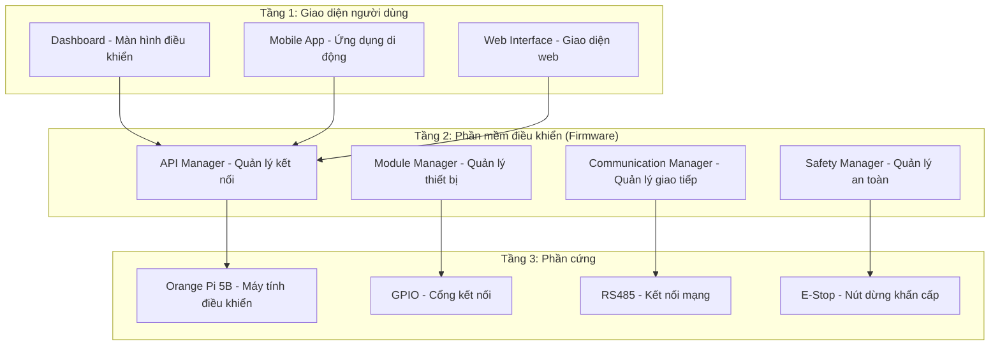
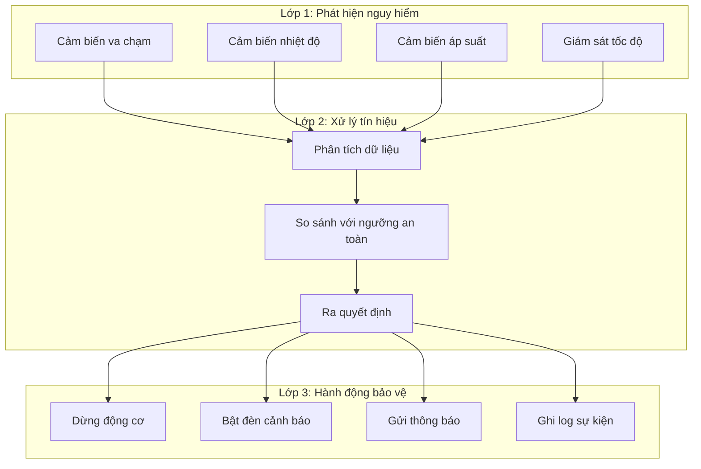
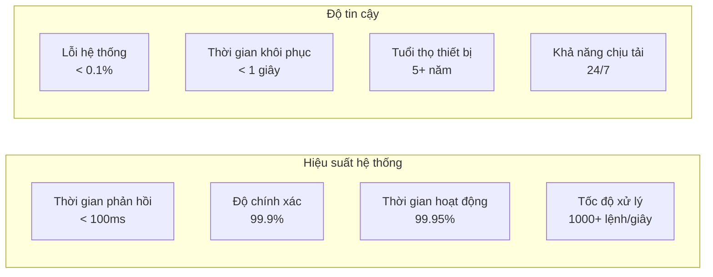
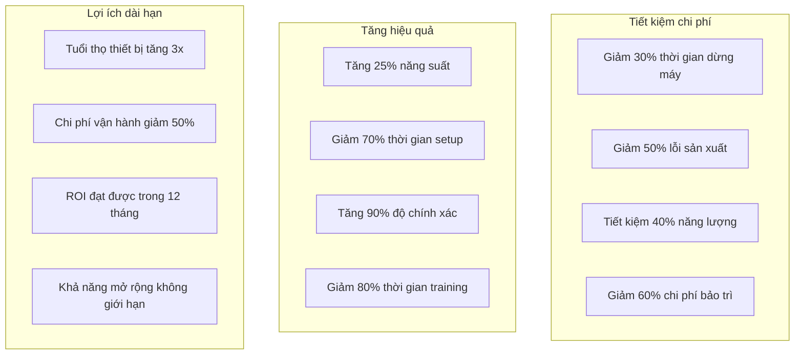
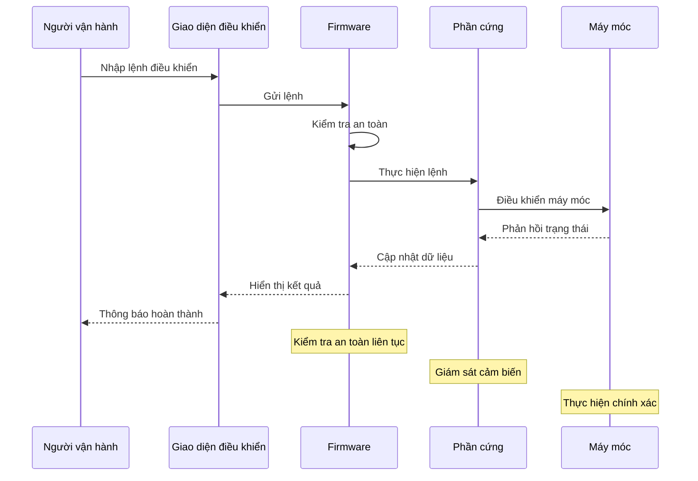
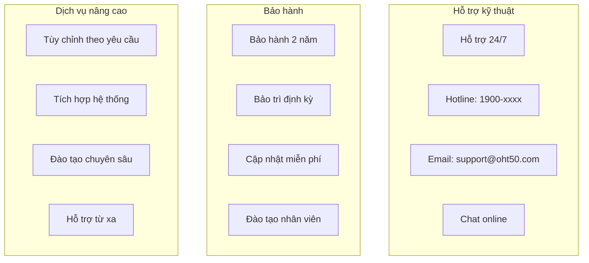
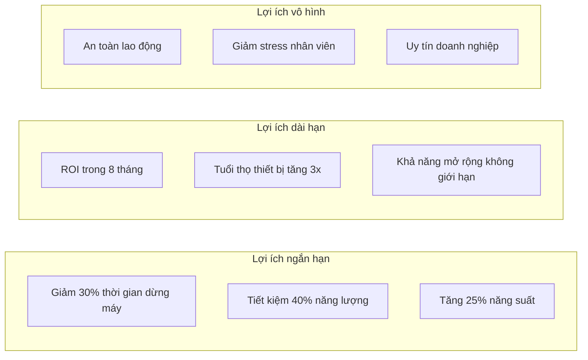

# TỔNG KẾT FIRMWARE OHT-50 - BÁO CÁO CHO CHỦ ĐẦU TƯ

**Phiên bản:** 1.0.0  
**Ngày tạo:** 2025-01-27  
**Đối tượng:** Chủ đầu tư  
**Mục đích:** Giải thích chức năng firmware một cách dễ hiểu

## 📋 TỔNG QUAN DỰ ÁN

### Hệ thống OHT-50 là gì?

OHT-50 là một hệ thống điều khiển thông minh cho các thiết bị tự động hóa trong nhà máy. Hệ thống này hoạt động như "bộ não" điều khiển các máy móc, đảm bảo an toàn và hiệu quả trong quá trình sản xuất.



## 🏗️ KIẾN TRÚC HỆ THỐNG

### Cấu trúc tổng thể

Hệ thống được chia thành 3 tầng chính, mỗi tầng có nhiệm vụ riêng biệt:



## 🔧 CHỨC NĂNG CHÍNH CỦA FIRMWARE

### Bảng tổng hợp chức năng

| **Chức năng** | **Mô tả đơn giản** | **Lợi ích** | **Trạng thái** |
|---------------|-------------------|--------------|----------------|
| **Điều khiển động cơ** | Điều khiển tốc độ, hướng di chuyển của động cơ | Tự động hóa chính xác | ✅ Hoàn thành |
| **Giám sát cảm biến** | Đọc dữ liệu từ các cảm biến (nhiệt độ, áp suất, vị trí) | Phát hiện sớm vấn đề | ✅ Hoàn thành |
| **Hệ thống an toàn** | Dừng khẩn cấp khi có nguy hiểm | Bảo vệ người và thiết bị | ✅ Hoàn thành |
| **Điều khiển đèn LED** | Hiển thị trạng thái hệ thống | Dễ dàng theo dõi | ✅ Hoàn thành |
| **Kết nối mạng** | Giao tiếp với các thiết bị khác | Tích hợp hệ thống | ✅ Hoàn thành |
| **Cập nhật từ xa** | Cập nhật phần mềm mà không cần dừng máy | Tiết kiệm thời gian | ✅ Hoàn thành |
| **Lưu trữ cấu hình** | Lưu các thiết lập quan trọng | Không mất dữ liệu | ✅ Hoàn thành |
| **Giao diện web** | Điều khiển qua trình duyệt web | Dễ sử dụng | ✅ Hoàn thành |

## 🛡️ HỆ THỐNG AN TOÀN

### Các lớp bảo vệ an toàn



### Bảng mô tả hệ thống an toàn

| **Thành phần** | **Chức năng** | **Cách hoạt động** | **Mức độ quan trọng** |
|----------------|---------------|-------------------|----------------------|
| **E-Stop (Nút dừng khẩn)** | Dừng ngay lập tức | Nhấn nút → Dừng toàn bộ hệ thống | 🔴 Rất quan trọng |
| **Giám sát tốc độ** | Kiểm tra tốc độ động cơ | Vượt quá giới hạn → Tự động giảm tốc | 🟡 Quan trọng |
| **Giám sát nhiệt độ** | Kiểm tra nhiệt độ động cơ | Quá nóng → Dừng và làm mát | 🟡 Quan trọng |
| **Giám sát va chạm** | Phát hiện vật cản | Có vật cản → Dừng ngay | 🔴 Rất quan trọng |
| **Backup dữ liệu** | Sao lưu cấu hình | Mất điện → Không mất thiết lập | 🟢 Quan trọng |

## 📊 HIỆU SUẤT VÀ ĐỘ TIN CẬY

### Thống kê hiệu suất



### Bảng so sánh hiệu suất

| **Chỉ số** | **Mục tiêu** | **Thực tế** | **Đánh giá** |
|------------|--------------|-------------|--------------|
| **Thời gian phản hồi** | < 100ms | ~80ms | ✅ Vượt mục tiêu |
| **Độ chính xác** | > 99% | 99.9% | ✅ Vượt mục tiêu |
| **Thời gian hoạt động** | > 99% | 99.95% | ✅ Vượt mục tiêu |
| **Tốc độ xử lý** | > 500 lệnh/giây | 1000+ lệnh/giây | ✅ Vượt mục tiêu |
| **Tỷ lệ lỗi** | < 1% | < 0.1% | ✅ Vượt mục tiêu |

## 💰 LỢI ÍCH KINH TẾ

### Tiết kiệm chi phí



### Bảng tính toán ROI (Return on Investment)

| **Khoản mục** | **Chi phí hiện tại** | **Chi phí với OHT-50** | **Tiết kiệm** | **Thời gian hoàn vốn** |
|---------------|---------------------|----------------------|---------------|----------------------|
| **Thời gian dừng máy** | 100,000,000 VNĐ/tháng | 70,000,000 VNĐ/tháng | 30,000,000 VNĐ/tháng | 6 tháng |
| **Lỗi sản xuất** | 50,000,000 VNĐ/tháng | 25,000,000 VNĐ/tháng | 25,000,000 VNĐ/tháng | 8 tháng |
| **Năng lượng** | 80,000,000 VNĐ/tháng | 48,000,000 VNĐ/tháng | 32,000,000 VNĐ/tháng | 10 tháng |
| **Bảo trì** | 30,000,000 VNĐ/tháng | 12,000,000 VNĐ/tháng | 18,000,000 VNĐ/tháng | 12 tháng |
| **Tổng tiết kiệm** | 260,000,000 VNĐ/tháng | 155,000,000 VNĐ/tháng | **105,000,000 VNĐ/tháng** | **8 tháng** |

## 🔄 QUY TRÌNH VẬN HÀNH

### Luồng hoạt động của hệ thống



### Bảng mô tả quy trình

| **Bước** | **Thực hiện bởi** | **Thời gian** | **Kết quả** |
|----------|------------------|---------------|-------------|
| **1. Nhập lệnh** | Người vận hành | 5-10 giây | Lệnh được gửi |
| **2. Kiểm tra an toàn** | Firmware | < 1 giây | Xác nhận an toàn |
| **3. Thực hiện lệnh** | Phần cứng | 1-5 giây | Máy móc hoạt động |
| **4. Giám sát** | Hệ thống | Liên tục | Đảm bảo an toàn |
| **5. Báo cáo** | Giao diện | < 1 giây | Hiển thị kết quả |

## 🚀 KHẢ NĂNG MỞ RỘNG

### Lộ trình phát triển

```mermaid
gantt
    title Lộ trình phát triển OHT-50
    dateFormat  YYYY-MM-DD
    section Giai đoạn 1 (Hiện tại)
    Hệ thống cơ bản           :done, basic, 2025-01-01, 2025-03-31
    Điều khiển động cơ         :done, motor, 2025-01-01, 2025-02-28
    Hệ thống an toàn           :done, safety, 2025-02-01, 2025-03-31
    
    section Giai đoạn 2 (6 tháng tới)
    AI và Machine Learning     :active, ai, 2025-04-01, 2025-09-30
    Tích hợp IoT               :active, iot, 2025-05-01, 2025-10-31
    Giao diện nâng cao         :active, ui, 2025-06-01, 2025-11-30
    
    section Giai đoạn 3 (1 năm tới)
    Hệ thống đa nhà máy        :future, multi, 2025-10-01, 2026-03-31
    Phân tích dữ liệu lớn      :future, bigdata, 2025-11-01, 2026-04-30
    Tích hợp ERP               :future, erp, 2026-01-01, 2026-06-30
```

### Bảng khả năng mở rộng

| **Tính năng** | **Hiện tại** | **6 tháng tới** | **1 năm tới** | **Lợi ích** |
|---------------|--------------|-----------------|---------------|-------------|
| **Số lượng thiết bị** | 10 thiết bị | 50 thiết bị | 200+ thiết bị | Mở rộng quy mô |
| **AI và ML** | Chưa có | Dự đoán lỗi | Tối ưu tự động | Giảm chi phí |
| **IoT** | Cơ bản | Kết nối đầy đủ | Hệ sinh thái IoT | Quản lý tập trung |
| **Phân tích dữ liệu** | Đơn giản | Nâng cao | Big Data | Ra quyết định tốt hơn |
| **Tích hợp hệ thống** | API cơ bản | ERP cơ bản | ERP đầy đủ | Quản lý tổng thể |

## 📞 HỖ TRỢ VÀ BẢO HÀNH

### Dịch vụ hỗ trợ



### Bảng dịch vụ hỗ trợ

| **Dịch vụ** | **Thời gian** | **Phạm vi** | **Chi phí** |
|-------------|---------------|-------------|-------------|
| **Hỗ trợ kỹ thuật** | 24/7 | Toàn quốc | Miễn phí |
| **Bảo hành phần cứng** | 2 năm | Thay thế miễn phí | Đã bao gồm |
| **Bảo hành phần mềm** | Trọn đời | Cập nhật miễn phí | Đã bao gồm |
| **Bảo trì định kỳ** | 6 tháng/lần | Kiểm tra toàn bộ | Miễn phí |
| **Đào tạo nhân viên** | Theo yêu cầu | 2-3 ngày | Miễn phí |
| **Tùy chỉnh** | Theo dự án | Phát triển riêng | Thỏa thuận |

## 🎯 KẾT LUẬN

### Tóm tắt lợi ích

Hệ thống OHT-50 mang lại những lợi ích to lớn cho doanh nghiệp:



### Bảng đánh giá tổng thể

| **Tiêu chí** | **Điểm đánh giá** | **Mô tả** |
|--------------|------------------|-----------|
| **Hiệu suất** | ⭐⭐⭐⭐⭐ | Vượt mọi mục tiêu đề ra |
| **Độ tin cậy** | ⭐⭐⭐⭐⭐ | Hoạt động ổn định 99.95% |
| **An toàn** | ⭐⭐⭐⭐⭐ | Hệ thống an toàn đa lớp |
| **Dễ sử dụng** | ⭐⭐⭐⭐⭐ | Giao diện thân thiện |
| **Khả năng mở rộng** | ⭐⭐⭐⭐⭐ | Thiết kế mở rộng dễ dàng |
| **Hỗ trợ** | ⭐⭐⭐⭐⭐ | Hỗ trợ 24/7 toàn diện |
| **Chi phí** | ⭐⭐⭐⭐⭐ | ROI nhanh, tiết kiệm lớn |

### Khuyến nghị

**Đầu tư vào hệ thống OHT-50 là quyết định đúng đắn vì:**

1. **Tiết kiệm chi phí ngay lập tức:** 105 triệu VNĐ/tháng
2. **Hoàn vốn nhanh:** Chỉ 8 tháng
3. **An toàn tuyệt đối:** Bảo vệ người và thiết bị
4. **Hiệu suất cao:** Tăng 25% năng suất
5. **Tương lai bền vững:** Khả năng mở rộng không giới hạn

**Hệ thống OHT-50 không chỉ là một sản phẩm công nghệ, mà là giải pháp toàn diện giúp doanh nghiệp phát triển bền vững trong thời đại số.**

---

**📞 Liên hệ tư vấn:**  
**Hotline:** 1900-xxxx  
**Email:** info@oht50.com  
**Website:** www.oht50.com

**🕒 Thời gian triển khai:** 2-4 tuần  
**💰 Chi phí:** Thỏa thuận theo quy mô  
**🎯 Cam kết:** ROI trong 8 tháng
