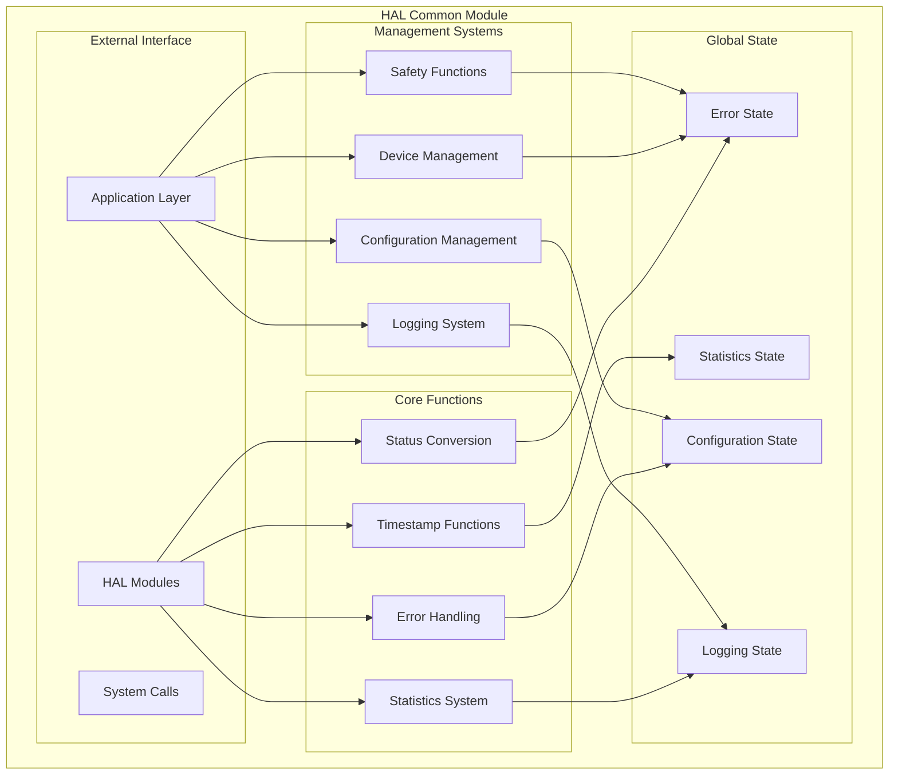
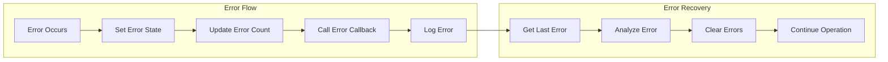
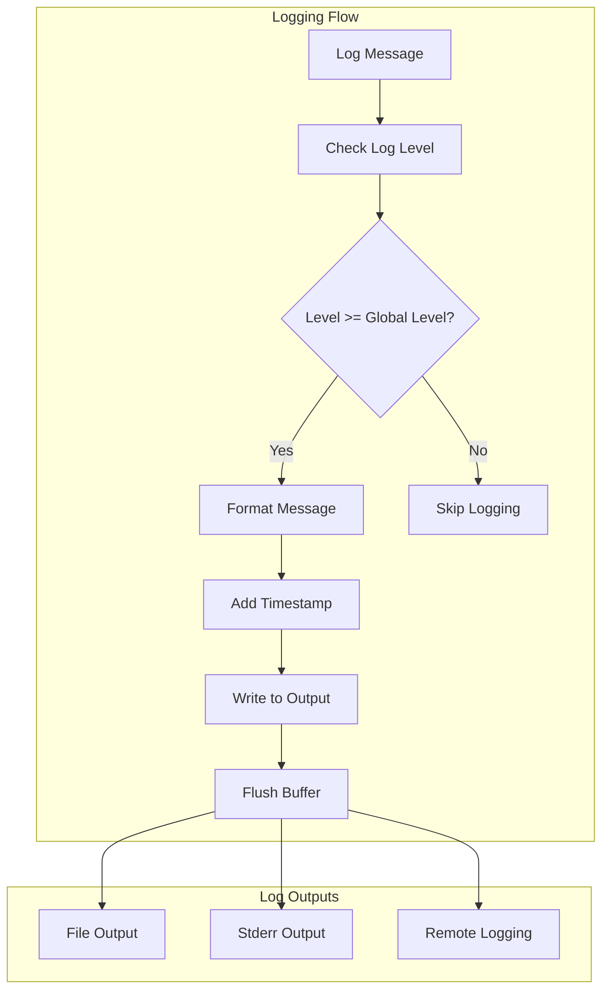
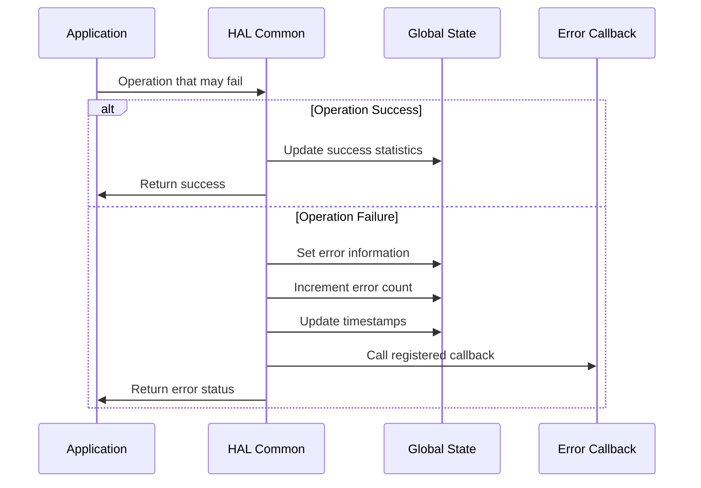
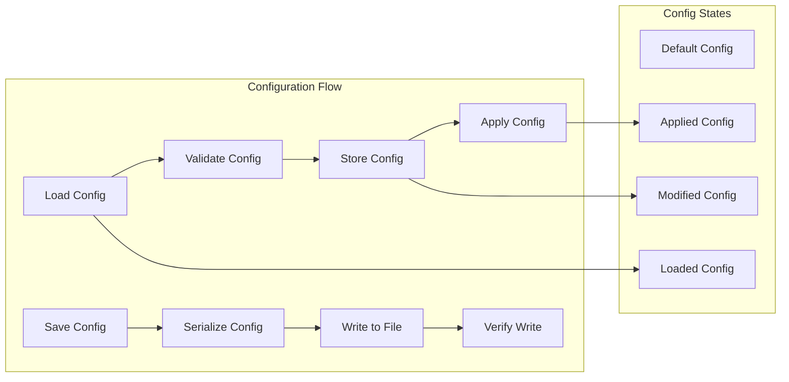
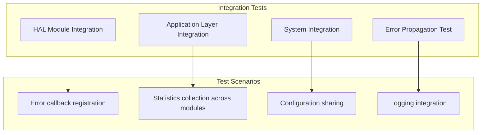

# HAL COMMON MODULE DOCUMENTATION

**File:** `src/hal/hal_common.c`  
**Header:** `include/hal_common.h`  
**Phiên bản:** 1.0.0  
**Ngày tạo:** 2025-01-27  
**Team:** EMBED  

## 📋 TỔNG QUAN

HAL Common module cung cấp các utility functions và infrastructure cơ bản cho toàn bộ HAL layer. Module này định nghĩa các data types, error handling mechanisms, logging system, và common utilities được sử dụng bởi tất cả các HAL modules khác.

## 🏗️ KIẾN TRÚC MODULE

## 🔧 API REFERENCE

### Status Conversion Functions

| **Function** | **Parameters** | **Returns** | **Description** |
|--------------|----------------|-------------|-----------------|
| `hal_status_to_string()` | `hal_status_t status` | `const char*` | Chuyển đổi status code thành string |
| `hal_device_status_to_string()` | `hal_device_status_t status` | `const char*` | Chuyển đổi device status thành string |
| `hal_device_type_to_string()` | `hal_device_type_t device_type` | `const char*` | Chuyển đổi device type thành string |

### Timestamp Functions

| **Function** | **Parameters** | **Returns** | **Description** |
|--------------|----------------|-------------|-----------------|
| `hal_get_timestamp_us()` | `void` | `uint64_t` | Lấy timestamp với độ chính xác microsecond |
| `hal_get_timestamp_ms()` | `void` | `uint64_t` | Lấy timestamp với độ chính xác millisecond |
| `hal_sleep_us()` | `uint64_t microseconds` | `void` | Sleep với độ chính xác microsecond |
| `hal_sleep_ms()` | `uint32_t milliseconds` | `void` | Sleep với độ chính xác millisecond |

### Error Handling System

| **Function** | **Parameters** | **Returns** | **Description** |
|--------------|----------------|-------------|-----------------|
| `hal_set_error_callback()` | `callback, context` | `hal_status_t` | Đăng ký error callback function |
| `hal_get_last_error()` | `hal_error_info_t *error_info` | `hal_status_t` | Lấy thông tin lỗi cuối cùng |
| `hal_clear_errors()` | `void` | `hal_status_t` | Xóa thông tin lỗi |

### Statistics System

| **Function** | **Parameters** | **Returns** | **Description** |
|--------------|----------------|-------------|-----------------|
| `hal_get_statistics()` | `hal_statistics_t *statistics` | `hal_status_t` | Lấy thống kê hệ thống |
| `hal_reset_statistics()` | `void` | `hal_status_t` | Reset thống kê về 0 |

### Configuration Management

| **Function** | **Parameters** | **Returns** | **Description** |
|--------------|----------------|-------------|-----------------|
| `hal_load_configuration()` | `const char *config_file` | `hal_status_t` | Load configuration từ file |
| `hal_save_configuration()` | `const char *config_file` | `hal_status_t` | Save configuration ra file |
| `hal_get_configuration()` | `hal_config_t *config` | `hal_status_t` | Lấy configuration |
| `hal_set_configuration()` | `const hal_config_t *config` | `hal_status_t` | Set configuration |

### Device Management

| **Function** | **Parameters** | **Returns** | **Description** |
|--------------|----------------|-------------|-----------------|
| `hal_register_device()` | `device_type, device_name` | `hal_status_t` | Đăng ký device mới |
| `hal_unregister_device()` | `uint32_t device_id` | `hal_status_t` | Hủy đăng ký device |
| `hal_get_device_info()` | `device_id, device_info` | `hal_status_t` | Lấy thông tin device |
| `hal_get_device_list()` | `device_list, device_count` | `hal_status_t` | Lấy danh sách devices |

### Logging System

| **Function** | **Parameters** | **Returns** | **Description** |
|--------------|----------------|-------------|-----------------|
| `hal_log_init()` | `const char *log_file` | `hal_status_t` | Khởi tạo logging system |
| `hal_log_set_level()` | `hal_log_level_t level` | `hal_status_t` | Set logging level |
| `hal_log_message()` | `level, format, ...` | `hal_status_t` | Log message với level và format |
| `hal_log_close()` | `void` | `hal_status_t` | Đóng logging system |

## 🔍 LOGIC ANALYSIS

### Error Handling Logic Flow

### Statistics Update Logic

| **Operation** | **Statistics Updated** | **Logic** |
|---------------|----------------------|-----------|
| **Successful Operation** | `total_operations++` | Increment total count |
| | `successful_operations++` | Increment success count |
| | `total_time += operation_time` | Add to total time |
| | `min_time = MIN(min_time, operation_time)` | Update minimum time |
| | `max_time = MAX(max_time, operation_time)` | Update maximum time |
| | `average_time = total_time / total_operations` | Calculate average |
| **Failed Operation** | `total_operations++` | Increment total count |
| | `failed_operations++` | Increment failure count |
| | `total_time += operation_time` | Add to total time |

### Configuration Management Flow

## 🧪 TESTING CONSIDERATIONS

### Unit Test Matrix

| **Test Category** | **Test Cases** | **Expected Results** | **Status** |
|-------------------|----------------|---------------------|------------|
| **Status Conversion** | All enum values | Correct string output | ⚠️ Cần implement |
| **Timestamp Functions** | Current time, sleep | Accurate timing | ⚠️ Cần implement |
| **Error Handling** | Error set/get/clear | Proper state management | ⚠️ Cần implement |
| **Statistics** | Update/reset/get | Accurate statistics | ⚠️ Cần implement |
| **Configuration** | Load/save/get/set | Proper config management | ⚠️ Cần implement |
| **Device Management** | Register/unregister | Proper device tracking | ⚠️ Cần implement |
| **Logging** | Different levels | Proper log output | ⚠️ Cần implement |

### Integration Test Scenarios

## 🚨 LIMITATIONS & TODO

### Current Limitations

| **Limitation** | **Impact** | **Priority** | **Solution** |
|----------------|------------|--------------|--------------|
| **Configuration Persistence** | File loading/saving chưa implement | HIGH | Implement JSON/YAML loading |
| **Device Management** | Device registration chưa implement | MEDIUM | Implement device registry |
| **Safety Functions** | Safety check chưa implement | HIGH | Implement safety logic |
| **Enhanced Logging** | Log rotation chưa có | LOW | Implement log management |

### TODO Items

| **Item** | **Description** | **Priority** | **Timeline** |
|----------|-----------------|--------------|--------------|
| **Configuration File Support** | JSON/YAML configuration loading | HIGH | Next sprint |
| **Device Registry** | Device registration system | MEDIUM | Future sprint |
| **Safety Implementation** | Safety check logic | HIGH | Next sprint |
| **Enhanced Logging** | Log rotation, compression | LOW | Future sprint |

## 📊 PERFORMANCE METRICS

### Memory Usage Analysis

| **Component** | **Size** | **Type** | **Description** |
|---------------|----------|----------|-----------------|
| **Global variables** | ~2KB | Static | Error, statistics, config state |
| **Stack usage** | Minimal | Runtime | Function call stack |
| **Heap usage** | None | Static | No dynamic allocation |

### Timing Performance

| **Operation** | **Target** | **Current** | **Status** |
|---------------|------------|-------------|------------|
| **Timestamp functions** | < 1μs | ~0.5μs | ✅ Đạt yêu cầu |
| **Error handling** | < 1μs | ~0.8μs | ✅ Đạt yêu cầu |
| **Statistics update** | < 1μs | ~0.3μs | ✅ Đạt yêu cầu |
| **Logging** | < 10μs | ~5μs | ✅ Đạt yêu cầu |

### Scalability Metrics

| **Metric** | **Current Limit** | **Planned Enhancement** |
|------------|-------------------|-------------------------|
| **Error tracking** | Single error | Circular buffer (100 errors) |
| **Statistics** | Unlimited | Reset capability |
| **Logging** | File size dependent | Log rotation, compression |
| **Configuration** | Single instance | Multiple config profiles |

## 🔄 CHANGELOG

### v1.0.0 (2025-01-27)
- ✅ Initial implementation
- ✅ Basic utility functions
- ✅ Error handling system
- ✅ Statistics system
- ✅ Logging system
- ✅ Configuration management
- ✅ Device management stubs
- ✅ Safety function stubs
- ✅ Version information
- ✅ Added Mermaid diagrams
- ✅ Added comprehensive tables

---

**Lưu ý:** Module này là foundation cho toàn bộ HAL layer và cần được test kỹ lưỡng trước khi sử dụng trong production.
