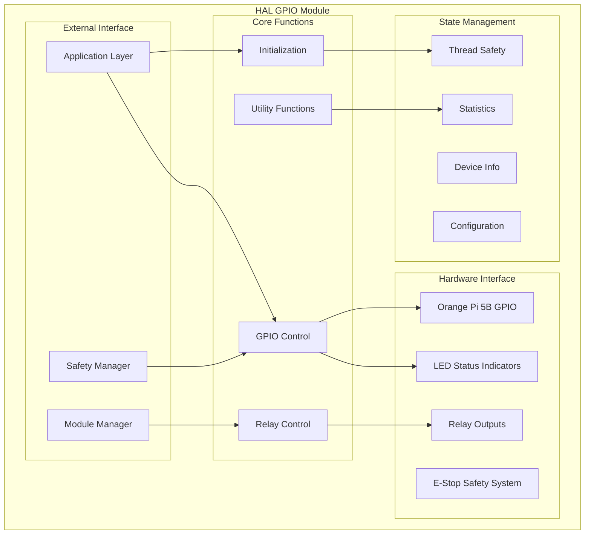
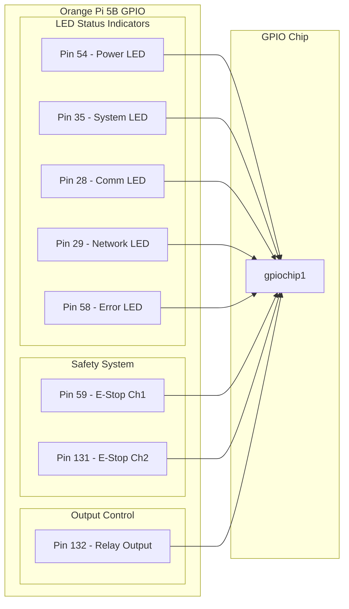
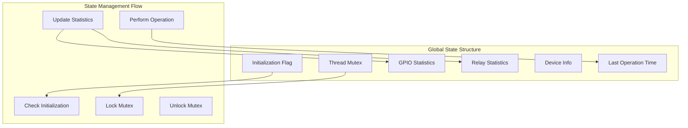
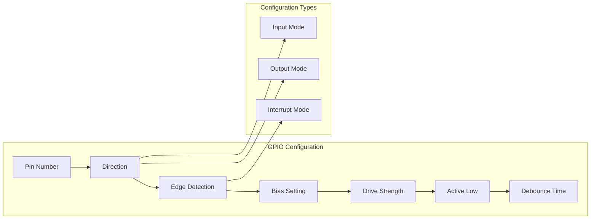
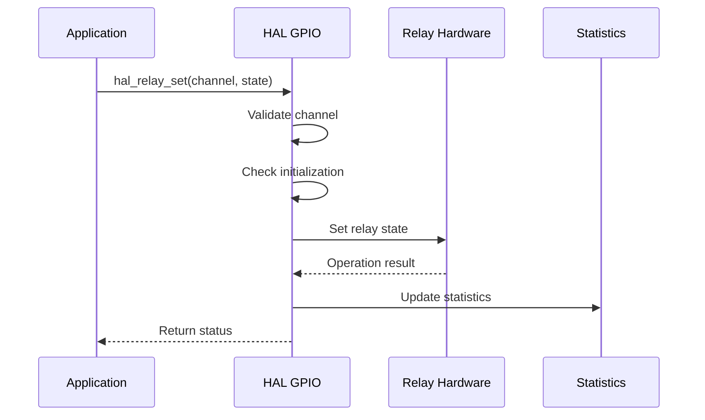
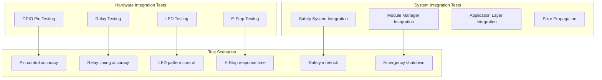
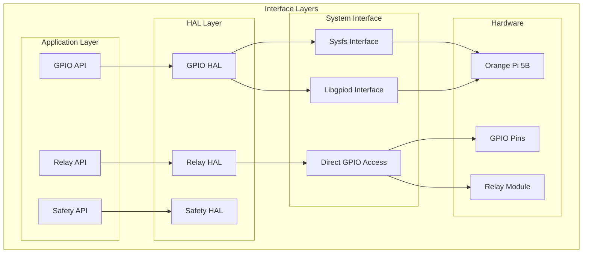

# HAL GPIO MODULE DOCUMENTATION

**File:** `src/hal/hal_gpio.c`  
**Header:** `include/hal_gpio.h`  
**Phiên bản:** 1.0.0  
**Ngày tạo:** 2025-01-27  
**Team:** EMBED  
**Task:** EM-05 (IO Drivers)

## 📋 TỔNG QUAN

HAL GPIO module cung cấp interface để điều khiển GPIO pins và Relay outputs trên Orange Pi 5B. Module này hỗ trợ cả GPIO control cơ bản và Relay control cho các ứng dụng điều khiển ngoại vi.

## 🏗️ KIẾN TRÚC MODULE

## 🔧 HARDWARE MAPPING

### Orange Pi 5B GPIO Pin Assignment

### Hardware Interface Summary

| **Category** | **Pin** | **GPIO** | **Function** | **Direction** |
|--------------|---------|----------|--------------|---------------|
| **Power LED** | 54 | GPIO1_D6 | Power status indicator | Output |
| **System LED** | 35 | GPIO1_A3 | System status indicator | Output |
| **Comm LED** | 28 | GPIO0_D4 | Communication status | Output |
| **Network LED** | 29 | GPIO0_D5 | Network status | Output |
| **Error LED** | 58 | GPIO1_D2 | Error status indicator | Output |
| **E-Stop Ch1** | 59 | GPIO1_D3 | Emergency stop channel 1 | Input |
| **E-Stop Ch2** | 131 | GPIO4_A3 | Emergency stop channel 2 | Input |
| **Relay Output** | 132 | GPIO4_A4 | Relay control output | Output |

## 🔧 API REFERENCE

### Initialization Functions

| **Function** | **Parameters** | **Returns** | **Description** |
|--------------|----------------|-------------|-----------------|
| `hal_gpio_init()` | `void` | `hal_status_t` | Khởi tạo GPIO HAL module |
| `hal_gpio_deinit()` | `void` | `hal_status_t` | Hủy khởi tạo GPIO HAL module |

### GPIO Control Functions (Stubs)

| **Function** | **Parameters** | **Returns** | **Description** |
|--------------|----------------|-------------|-----------------|
| `hal_gpio_configure_pin()` | `const gpio_config_t *config` | `hal_status_t` | Configure GPIO pin |
| `hal_gpio_set_direction()` | `uint32_t pin, gpio_direction_t direction` | `hal_status_t` | Set pin direction |
| `hal_gpio_set_value()` | `uint32_t pin, bool value` | `hal_status_t` | Set pin value |
| `hal_gpio_get_value()` | `uint32_t pin, bool *value` | `hal_status_t` | Get pin value |
| `hal_gpio_set_edge()` | `uint32_t pin, gpio_edge_t edge` | `hal_status_t` | Set edge detection |
| `hal_gpio_set_bias()` | `uint32_t pin, gpio_bias_t bias` | `hal_status_t` | Set pull-up/down |
| `hal_gpio_set_drive()` | `uint32_t pin, gpio_drive_t drive` | `hal_status_t` | Set drive strength |
| `hal_gpio_wait_for_event()` | `uint32_t pin, gpio_event_t *event, uint32_t timeout_ms` | `hal_status_t` | Wait for GPIO event |

### Relay Control Functions (Stubs)

| **Function** | **Parameters** | **Returns** | **Description** |
|--------------|----------------|-------------|-----------------|
| `hal_relay_init()` | `const relay_config_t *config` | `hal_status_t` | Initialize relay |
| `hal_relay_deinit()` | `void` | `hal_status_t` | Deinitialize relay |
| `hal_relay_set()` | `uint8_t channel, bool state` | `hal_status_t` | Set relay state |
| `hal_relay_get()` | `uint8_t channel, bool *state` | `hal_status_t` | Get relay state |
| `hal_relay_pulse()` | `uint8_t channel, uint32_t duration_ms` | `hal_status_t` | Pulse relay |
| `hal_relay_toggle()` | `uint8_t channel` | `hal_status_t` | Toggle relay |

### Statistics & Health Functions

| **Function** | **Parameters** | **Returns** | **Description** |
|--------------|----------------|-------------|-----------------|
| `hal_gpio_get_statistics()` | `gpio_statistics_t *statistics` | `hal_status_t` | Get GPIO statistics |
| `hal_gpio_reset_statistics()` | `void` | `hal_status_t` | Reset GPIO statistics |
| `hal_gpio_health_check()` | `void` | `hal_status_t` | GPIO health check |
| `hal_relay_get_statistics()` | `relay_statistics_t *statistics` | `hal_status_t` | Get relay statistics |
| `hal_relay_reset_statistics()` | `void` | `hal_status_t` | Reset relay statistics |
| `hal_relay_health_check()` | `void` | `hal_status_t` | Relay health check |

## 🔍 LOGIC ANALYSIS

### Internal State Management

### GPIO Configuration Logic

### Relay Control Logic

## 🧪 TESTING CONSIDERATIONS

### Unit Test Matrix

| **Test Category** | **Test Cases** | **Expected Results** | **Status** |
|-------------------|----------------|---------------------|------------|
| **Initialization** | Init/deinit/reinit | Proper state management | ⚠️ Cần implement |
| **Thread Safety** | Concurrent operations | No race conditions | ⚠️ Cần implement |
| **GPIO Configuration** | Pin setup/teardown | Correct pin state | ⚠️ Cần implement |
| **GPIO Operations** | Read/write operations | Accurate I/O | ⚠️ Cần implement |
| **Event Handling** | Edge detection | Proper event capture | ⚠️ Cần implement |
| **Relay Control** | Set/get/pulse/toggle | Correct relay behavior | ⚠️ Cần implement |
| **Statistics** | Collection/reset | Accurate statistics | ⚠️ Cần implement |
| **Error Handling** | Invalid parameters | Proper error codes | ⚠️ Cần implement |

### Integration Test Scenarios

## 🚨 LIMITATIONS & TODO

### Current Limitations

| **Limitation** | **Impact** | **Priority** | **Solution** |
|----------------|------------|--------------|--------------|
| **Implementation Status** | Tất cả functions đều là stubs | CRITICAL | Implement GPIO functions |
| **Hardware Support** | Chưa implement GPIO interface | HIGH | Implement sysfs/libgpiod |
| **Safety Features** | Chưa có safety checks | HIGH | Implement safety logic |
| **Error Handling** | Chưa có error handling thực tế | MEDIUM | Implement error handling |

### TODO Items

| **Item** | **Description** | **Priority** | **Timeline** |
|----------|-----------------|--------------|--------------|
| **GPIO Implementation** | Implement sysfs/libgpiod interface | CRITICAL | Immediate |
| **Relay Implementation** | Implement relay control logic | HIGH | Next sprint |
| **Safety Implementation** | Add E-Stop monitoring | HIGH | Next sprint |
| **Enhanced Features** | Add interrupt handling | MEDIUM | Future sprint |
| **Performance Optimization** | Add caching mechanisms | LOW | Future sprint |

## 📊 PERFORMANCE METRICS

### Memory Usage Analysis

| **Component** | **Size** | **Type** | **Description** |
|---------------|----------|----------|-----------------|
| **Static allocation** | ~1KB | Static | Module state, mutex |
| **Per-pin overhead** | ~100 bytes | Dynamic | Pin configuration |
| **Statistics overhead** | ~200 bytes | Static | GPIO/relay statistics |
| **Total estimated** | ~8KB | Static | Cho 64 pins |

### Timing Performance

| **Operation** | **Target** | **Current** | **Status** |
|---------------|------------|-------------|------------|
| **GPIO read** | < 10μs | Not implemented | ❌ Cần implement |
| **GPIO write** | < 10μs | Not implemented | ❌ Cần implement |
| **Relay activation** | < 1ms | Not implemented | ❌ Cần implement |
| **Event detection** | < 100μs | Not implemented | ❌ Cần implement |

### Scalability Metrics

| **Metric** | **Current Limit** | **Planned Enhancement** |
|------------|-------------------|-------------------------|
| **Maximum pins** | 64 (GPIO_MAX_PINS) | Configurable limit |
| **Maximum relays** | 2 (RELAY_MAX_CHANNELS) | Expandable to 8 |
| **Concurrent operations** | Thread-safe | Async operations |
| **Event queue** | Unlimited (planned) | Circular buffer |

## 🔧 HARDWARE INTEGRATION

### Interface Requirements

### Hardware Validation Requirements

| **Requirement** | **Validation Method** | **Expected Result** |
|-----------------|----------------------|-------------------|
| **Pin availability** | Check `/sys/class/gpio/` | All pins accessible |
| **Pin capability** | Test read/write operations | Successful I/O |
| **Hardware compatibility** | Test with actual hardware | Proper functionality |
| **Safety validation** | Test E-Stop functionality | Safe operation |

## 🔄 CHANGELOG

### v1.0.0 (2025-01-27)
- ✅ Initial module structure
- ✅ Basic initialization/deinitialization
- ✅ Thread-safe design
- ✅ Device info management
- ✅ Statistics structures
- ✅ GPIO function stubs
- ✅ Relay function stubs
- ✅ Utility function stubs
- ✅ Hardware mapping definition
- ✅ Added Mermaid diagrams
- ✅ Added comprehensive tables

---

**Lưu ý:** Module này cần được implement đầy đủ trước khi sử dụng trong production. Hiện tại tất cả functions đều là stubs và cần actual hardware implementation.
