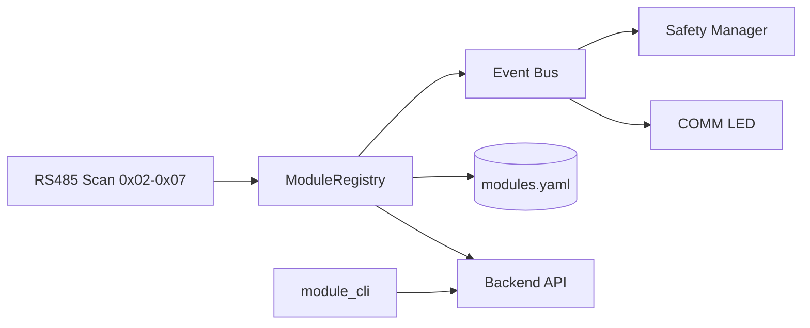

# MODULE MANAGEMENT SPEC – Dynamic + Managed (RS485/Modbus)

Version: 1.0 • Date: 2025-01-28 • Owner: CTO • Status: Approved for implementation (Phase 1 → Phase 2)

---

## 1) Mục tiêu
- Tự phát hiện (discover) module RS485 dải 0x02–0x07 khi khởi động, không cần sửa code khi thay phần cứng cùng loại
- Quản lý danh sách module và “points” (điểm đọc/ghi) theo kiểu registry có persist file `modules.yaml`
- Event-driven: phát/nhận sự kiện MODULE_(DISCOVERED|ONLINE|OFFLINE|UPDATED|TIMEOUT)
- An toàn: COMM LED phản ánh trạng thái; Safety nhận event offline/timeout với module critical để degrade/stop

---

## 2) Kiến trúc tổng quan
- ModuleRegistry (RAM + persist): { addr, type, name, status, last_seen, caps, points }
- Event Bus nội bộ (FW): emit/broadcast sự kiện, handlers theo type (plugin-like)
- Backend API: GET /modules, POST /modules/scan, PUT /modules/{addr}, GET /modules/{addr}/points
- CLI: module_cli scan|list|save|ping --addr 0xNN



---

## 3) Thuật toán scan & merge
1. Quét địa chỉ 0x02–0x07 (Modbus ping/read ID)
2. Tạo snapshot hiện tại (now)
3. Đọc `modules.yaml` (persist)
4. Merge: ưu tiên thực tế (now) → giữ metadata (name/labels) từ persist
5. Phát sự kiện: DISCOVERED/ONLINE/OFFLINE/UPDATED/TIMEOUT
6. Ghi lại `modules.yaml` (versioned) nếu có thay đổi

Timeout/debounce: 2 lần miss liên tiếp mới coi là OFFLINE; retry=3; backoff 50→100→200ms

---

## 4) Data model
```yaml
# modules.yaml (versioned)
version: 1
generated_at: 2025-01-28T00:00:00Z
modules:
  - addr: 0x02
    type: power
    name: PWR-Left
    status: online   # online|offline|timeout
    last_seen: 2025-01-28T00:00:00Z
    caps: [voltage,current,temp]
    points:
      - key: voltage
        rw: r
      - key: relay1
        rw: w
  - addr: 0x03
    type: motor
    name: MTR-X
    status: online
    caps: [speed,pos,enable]
    points:
      - key: speed
        rw: rw
      - key: enable
        rw: w
```

Registry (RAM):
```c
typedef struct {
  uint8_t addr;           // 0x02..0x07
  uint8_t type;           // enum module_type_t
  char name[32];
  uint8_t status;         // enum module_status_t
  uint64_t last_seen_ms;
  uint32_t caps_mask;     // capabilities bitmask
} module_info_t;
```

---

## 5) Event bus (FW)
Events: MODULE_DISCOVERED, MODULE_ONLINE, MODULE_OFFLINE, MODULE_UPDATED, MODULE_TIMEOUT

Handlers theo type (motor/io/dock/...):
- on_online: init defaults, sync points
- on_offline/timeout: release outputs, publish safety event nếu critical
- on_frame: route frame tới handler

API nội bộ (FW):
- registry_get_all(out list)
- registry_get(addr)
- registry_set_meta(addr, name/labels)
- registry_save_yaml(path)

---

## 6) COMM LED & Safety hook
- COMM LED: blinking khi scan; solid khi ≥ 1 online; warning pattern khi thiếu module đã lưu
- Safety: nếu type ∈ {motor, io_safety} offline/timeout → emit SAFETY_EVENT_DEGRADE/STOP

---

## 7) Backend API (Phase 1)
- GET /api/v1/modules → danh sách hiện tại (merge view)
- POST /api/v1/modules/scan → trigger discover, trả {new, changed, lost}
- PUT /api/v1/modules/{addr} → cập nhật name/labels (persist)
- GET /api/v1/modules/{addr}/points → danh sách points

Auth: basic auth (local). Rate-limit nhẹ.

---

## 8) CLI
```
module_cli scan
module_cli list
module_cli save
module_cli ping --addr 0x03
```

---

## 9) Acceptance criteria
- Scan hoàn tất ≤ 10s; `modules.yaml` cập nhật khi thay đổi
- API `/modules` trả đúng; `/scan` trả số lượng new/changed/lost
- COMM LED phản ánh scan/online/warning
- Safety nhận event khi module critical offline và degrade/stop
- Thêm/bớt module cùng loại không cần build lại code

---

## 10) Rủi ro & biện pháp
- Trùng địa chỉ: detect & báo lỗi; không tự gán
- Nhiễu/timeout: retry + debounce + metrics
- Lệch config-thực tế: ưu tiên thực tế, confirm trước khi ghi

---

## 11) Lộ trình
- Phase 1 (48h): FW scan+registry+persist+event bus+COMM LED; Backend GET/POST scan; CLI scan/list/ping
- Phase 2 (72–96h): FW handlers theo type, debounce nâng cao, metrics; Backend points/audit; UI page (Modules)

---

## 12) Mapping code (khởi tạo)
- `firmware/src/app/module_registry.c/h` (mới)
- `firmware/src/app/communication_manager.c` (mở rộng scan+emit+route)
- `tools/module_cli.py` (scan/list/save/ping)
- `services/backend/oht50/main.py` (endpoints modules)


