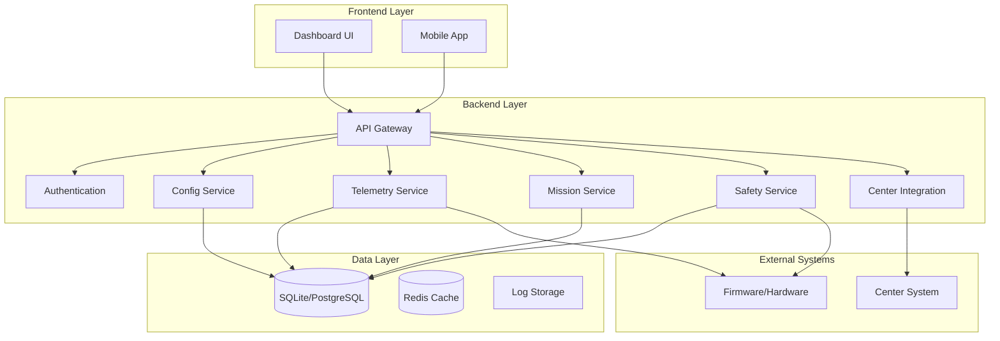

# System Architecture - OHT-50 Backend

## 📋 Tổng quan
Tài liệu này mô tả kiến trúc tổng thể của OHT-50 Backend, bao gồm các component chính, luồng dữ liệu và tương tác giữa các hệ thống.

## 🏗️ Kiến trúc tổng thể



## 🔧 Core Components

### 1. API Gateway
- **Chức năng**: Entry point cho tất cả requests
- **Responsibility**: 
  - Route requests đến services phù hợp
  - Rate limiting và throttling
  - Request/Response logging
  - CORS handling
- **Technology**: FastAPI với middleware

### 2. Authentication Service
- **Chức năng**: Xác thực và phân quyền
- **Responsibility**:
  - Token validation (Bearer token)
  - Role-based access control
  - Session management
  - Security audit logging
- **Technology**: JWT tokens, Pydantic models

### 3. Configuration Service
- **Chức năng**: Quản lý cấu hình hệ thống
- **Responsibility**:
  - CRUD operations cho system config
  - Version control và rollback
  - Validation và schema management
  - Configuration distribution
- **Technology**: Pydantic models, JSON/YAML storage

### 4. Telemetry Service
- **Chức năng**: Thu thập và xử lý dữ liệu telemetry
- **Responsibility**:
  - Real-time data collection
  - WebSocket streaming
  - Data aggregation và analysis
  - Performance metrics
- **Technology**: WebSocket, async processing

### 5. Mission Service
- **Chức năng**: Quản lý nhiệm vụ và lập kế hoạch
- **Responsibility**:
  - Mission creation và scheduling
  - Path planning và optimization
  - Progress tracking
  - Mission history
- **Technology**: Graph algorithms, state machines

### 6. Safety Service
- **Chức năng**: Đảm bảo an toàn hệ thống
- **Responsibility**:
  - E-Stop handling
  - Safety zone monitoring
  - Collision detection
  - Emergency procedures
- **Technology**: Real-time monitoring, safety protocols

### 7. Center Integration Service
- **Chức năng**: Tích hợp với hệ thống Center
- **Responsibility**:
  - Mission reception
  - Status reporting
  - Permission requests
  - Data synchronization
- **Technology**: HTTP client, async communication

## 📊 Data Flow

### 1. Configuration Flow
```
User Request → API Gateway → Auth → Config Service → Database
                                    ↓
                              Response ← Config Data
```

### 2. Telemetry Flow
```
Firmware → Telemetry Service → Database
                ↓
        WebSocket → Frontend (Real-time)
                ↓
        Analytics → Performance Monitoring
```

### 3. Mission Flow
```
Center → Mission Service → Safety Check → Firmware
                ↓
        Progress Tracking → Database
                ↓
        Status Updates → Center
```

### 4. Safety Flow
```
Firmware → Safety Service → Emergency Actions
                ↓
        Alert System → Frontend/Center
                ↓
        Logging → Audit Trail
```

## 🔐 Security Architecture

### Authentication Layers
1. **API Level**: Bearer token validation
2. **Service Level**: Internal service authentication
3. **Data Level**: Database access control
4. **Network Level**: HTTPS/TLS encryption

### Authorization Model
- **Role-based**: Admin, Operator, Viewer
- **Resource-based**: API endpoints, data access
- **Context-based**: Time, location, mission status

## 📈 Performance Architecture

### Scalability Patterns
- **Horizontal Scaling**: Multiple backend instances
- **Load Balancing**: API Gateway distribution
- **Caching**: Redis for frequently accessed data
- **Async Processing**: Background tasks và queues

### Monitoring Points
- **API Response Times**: P95 < 100ms
- **Database Performance**: Query optimization
- **Memory Usage**: Resource monitoring
- **Network Latency**: Connection quality

## 🗄️ Data Architecture

### Storage Strategy
- **Configuration**: JSON/YAML files với versioning
- **Telemetry**: Time-series database
- **Missions**: Relational database
- **Logs**: Structured logging với rotation

### Data Models
- **System Config**: Hardware, safety, telemetry settings
- **Telemetry Data**: Position, velocity, status, metrics
- **Mission Data**: Tasks, progress, results
- **Safety Data**: Events, alerts, audit trail

## 🔄 Integration Patterns

### External Systems
1. **Firmware**: RS485/Modbus RTU communication
2. **Center**: HTTP REST API integration
3. **Frontend**: WebSocket real-time updates
4. **Mobile**: REST API với push notifications

### Internal Services
1. **Service-to-Service**: Internal API calls
2. **Event-driven**: Async event processing
3. **Database**: Shared data access
4. **Cache**: Distributed caching

## 🚀 Deployment Architecture

### Environment Strategy
- **Development**: Local development với hot reload
- **Staging**: Production-like testing environment
- **Production**: High availability với redundancy

### Infrastructure
- **Containerization**: Docker containers
- **Orchestration**: Docker Compose/Kubernetes
- **Monitoring**: Health checks và metrics
- **Backup**: Automated backup procedures

## 📋 Technology Stack

### Backend Framework
- **FastAPI**: High-performance web framework
- **Pydantic**: Data validation và serialization
- **SQLAlchemy**: Database ORM
- **WebSocket**: Real-time communication

### Data Storage
- **SQLite**: Development database
- **PostgreSQL**: Production database
- **Redis**: Caching và session storage
- **File System**: Configuration files

### Communication
- **HTTP/REST**: API endpoints
- **WebSocket**: Real-time streaming
- **RS485/Modbus**: Hardware communication
- **JSON**: Data serialization

## 🔧 Configuration Management

### Environment Variables
- `DEBUG`: Development mode flag
- `SECRET_KEY`: Authentication secret
- `DATABASE_URL`: Database connection
- `CENTER_URL`: Center system URL

### Configuration Files
- `config/development.yaml`: Development settings
- `config/production.yaml`: Production settings
- `config/security.yaml`: Security configuration

## 📊 Monitoring & Observability

### Metrics Collection
- **Application Metrics**: Response times, error rates
- **System Metrics**: CPU, memory, disk usage
- **Business Metrics**: Mission completion, safety events
- **Custom Metrics**: Hardware status, communication quality

### Logging Strategy
- **Structured Logging**: JSON format với correlation IDs
- **Log Levels**: DEBUG, INFO, WARNING, ERROR
- **Log Rotation**: Automated log management
- **Centralized Logging**: ELK stack integration

## 🚨 Error Handling

### Error Categories
1. **Validation Errors**: Invalid input data
2. **Authentication Errors**: Invalid credentials
3. **Authorization Errors**: Insufficient permissions
4. **System Errors**: Internal failures
5. **External Errors**: Third-party service failures

### Error Response Format
```json
{
  "success": false,
  "error_code": "VALIDATION_ERROR",
  "message": "Invalid configuration data",
  "details": {
    "field": "motor.vmax_mms",
    "value": -100,
    "constraint": "must be positive"
  }
}
```

## 🔄 Future Enhancements

### Planned Improvements
1. **Microservices**: Service decomposition
2. **Event Sourcing**: Event-driven architecture
3. **CQRS**: Command Query Responsibility Segregation
4. **GraphQL**: Flexible data querying
5. **Machine Learning**: Predictive analytics

### Scalability Roadmap
1. **Horizontal Scaling**: Load balancer implementation
2. **Database Sharding**: Data distribution
3. **Caching Strategy**: Multi-level caching
4. **CDN Integration**: Content delivery optimization
