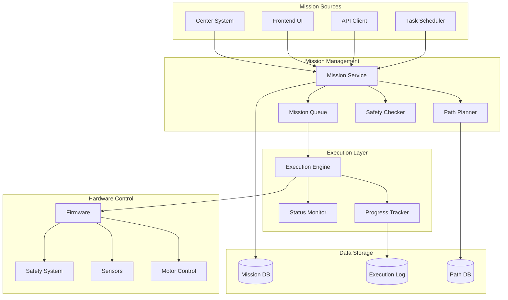
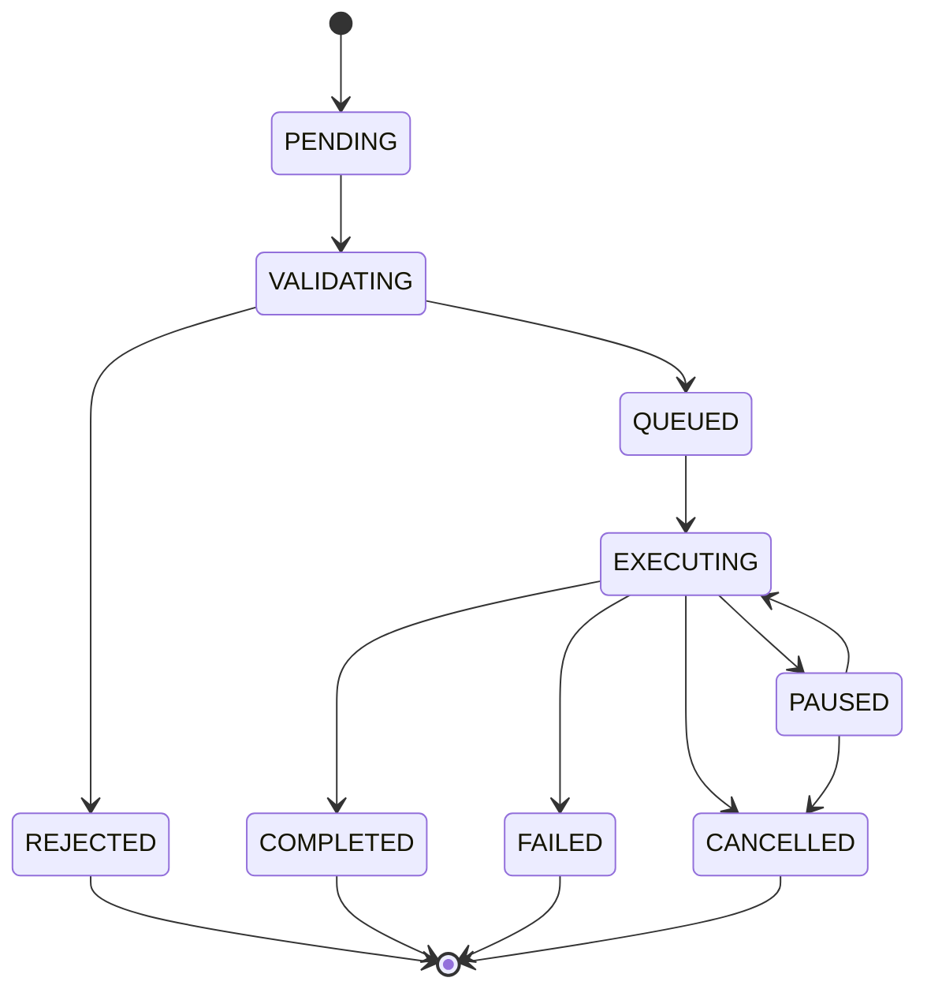

# Mission Management System - OHT-50 Backend

## 📋 Tổng quan
Hệ thống quản lý nhiệm vụ (Mission Management) cho OHT-50, bao gồm tạo lập, lập kế hoạch, thực thi và theo dõi các nhiệm vụ di chuyển và vận chuyển.

## 🎯 Mission Architecture



## 🚀 Mission Types

### 1. Move To Mission
```json
{
  "mission_id": "move_001",
  "mission_type": "move_to",
  "target_position": {
    "x": 1000.0,
    "y": 2000.0,
    "z": 0.0,
    "theta": 0.0
  },
  "parameters": {
    "speed": 500.0,
    "acceleration": 300.0,
    "precision": 2.0
  },
  "priority": 1,
  "timeout": 300
}
```

### 2. Docking Mission
```json
{
  "mission_id": "dock_001",
  "mission_type": "dock",
  "target_station": "station_A",
  "parameters": {
    "approach_speed": 100.0,
    "docking_speed": 50.0,
    "retry_attempts": 3
  },
  "priority": 2,
  "timeout": 180
}
```

### 3. Transport Mission
```json
{
  "mission_id": "transport_001",
  "mission_type": "transport",
  "route": {
    "pickup": {"x": 0, "y": 0, "z": 0},
    "delivery": {"x": 1000, "y": 1000, "z": 0}
  },
  "cargo": {
    "type": "box",
    "weight": 50.0,
    "dimensions": {"length": 300, "width": 200, "height": 150}
  },
  "priority": 1,
  "timeout": 600
}
```

### 4. Patrol Mission
```json
{
  "mission_id": "patrol_001",
  "mission_type": "patrol",
  "waypoints": [
    {"x": 0, "y": 0, "z": 0},
    {"x": 500, "y": 0, "z": 0},
    {"x": 500, "y": 500, "z": 0},
    {"x": 0, "y": 500, "z": 0}
  ],
  "parameters": {
    "cycle_count": 5,
    "speed": 300.0,
    "pause_at_waypoints": true
  },
  "priority": 3,
  "timeout": 1200
}
```

## 📊 Mission States



### State Definitions

#### 1. PENDING
- **Description**: Mission được tạo nhưng chưa được xử lý
- **Actions**: Validation, safety check
- **Duration**: < 1 second

#### 2. VALIDATING
- **Description**: Kiểm tra tính hợp lệ của mission
- **Actions**: Path validation, safety zone check
- **Duration**: 1-5 seconds

#### 3. QUEUED
- **Description**: Mission đã được chấp nhận, chờ thực thi
- **Actions**: Priority sorting, resource allocation
- **Duration**: Variable

#### 4. EXECUTING
- **Description**: Mission đang được thực thi
- **Actions**: Path following, progress tracking
- **Duration**: Mission dependent

#### 5. PAUSED
- **Description**: Mission tạm dừng
- **Actions**: Emergency stop, manual intervention
- **Duration**: Variable

#### 6. COMPLETED
- **Description**: Mission hoàn thành thành công
- **Actions**: Final position check, result logging
- **Duration**: N/A

#### 7. FAILED
- **Description**: Mission thất bại
- **Actions**: Error logging, recovery procedures
- **Duration**: N/A

#### 8. CANCELLED
- **Description**: Mission bị hủy
- **Actions**: Cleanup, resource release
- **Duration**: N/A

#### 9. REJECTED
- **Description**: Mission bị từ chối
- **Actions**: Error reporting, reason logging
- **Duration**: N/A

## 🛣️ Path Planning

### 1. Path Planning Algorithm
```python
class PathPlanner:
    def plan_path(self, start: Position, goal: Position, constraints: Constraints):
        """
        Lập kế hoạch đường đi từ start đến goal
        """
        # 1. Check safety zones
        if not self.check_safety_zones(start, goal):
            raise SafetyViolationError("Path violates safety zones")
        
        # 2. Generate waypoints
        waypoints = self.generate_waypoints(start, goal)
        
        # 3. Optimize path
        optimized_path = self.optimize_path(waypoints, constraints)
        
        # 4. Validate path
        if not self.validate_path(optimized_path):
            raise PathValidationError("Invalid path generated")
        
        return optimized_path
```

### 2. Path Optimization
- **Smooth Curves**: Sử dụng S-curve hoặc trapezoidal profiles
- **Obstacle Avoidance**: Tránh chướng ngại vật động và tĩnh
- **Energy Efficiency**: Tối ưu hóa tiêu thụ năng lượng
- **Time Optimization**: Giảm thiểu thời gian di chuyển

### 3. Safety Constraints
```json
{
  "safety_zones": [
    {
      "id": "zone_1",
      "type": "forbidden",
      "boundary": [
        {"x": 0, "y": 0},
        {"x": 100, "y": 0},
        {"x": 100, "y": 100},
        {"x": 0, "y": 100}
      ]
    }
  ],
  "speed_limits": {
    "default": 500.0,
    "zones": {
      "zone_1": 200.0,
      "zone_2": 300.0
    }
  },
  "acceleration_limits": {
    "default": 300.0,
    "emergency": 1000.0
  }
}
```

## 📈 Mission Execution

### 1. Execution Engine
```python
class MissionExecutor:
    def execute_mission(self, mission: Mission):
        """
        Thực thi mission
        """
        try:
            # 1. Pre-execution checks
            self.pre_execution_check(mission)
            
            # 2. Start execution
            self.start_execution(mission)
            
            # 3. Monitor progress
            while mission.status == MissionStatus.EXECUTING:
                self.update_progress(mission)
                self.check_safety(mission)
                await asyncio.sleep(0.1)
            
            # 4. Post-execution
            self.post_execution(mission)
            
        except Exception as e:
            self.handle_execution_error(mission, e)
```

### 2. Progress Tracking
```json
{
  "mission_id": "move_001",
  "status": "executing",
  "progress": {
    "percentage": 65.5,
    "current_position": {"x": 650.0, "y": 1300.0, "z": 0.0},
    "target_position": {"x": 1000.0, "y": 2000.0, "z": 0.0},
    "current_speed": 450.0,
    "estimated_completion": "2024-01-15T10:30:00Z"
  },
  "metrics": {
    "distance_traveled": 1450.0,
    "time_elapsed": 120.5,
    "energy_consumed": 2.3,
    "safety_events": 0
  }
}
```

### 3. Real-time Monitoring
- **Position Tracking**: Theo dõi vị trí thực tế
- **Speed Monitoring**: Giám sát tốc độ di chuyển
- **Safety Monitoring**: Kiểm tra an toàn liên tục
- **Performance Metrics**: Thu thập metrics hiệu suất

## 🔄 Mission Queue Management

### 1. Priority System
```python
class MissionPriority:
    EMERGENCY = 0    # E-Stop, safety events
    HIGH = 1         # Critical missions
    NORMAL = 2       # Regular missions
    LOW = 3          # Background tasks
    MAINTENANCE = 4  # Maintenance tasks
```

### 2. Queue Management
```python
class MissionQueue:
    def add_mission(self, mission: Mission):
        """
        Thêm mission vào queue
        """
        # 1. Validate mission
        self.validate_mission(mission)
        
        # 2. Calculate priority
        priority = self.calculate_priority(mission)
        
        # 3. Insert into queue
        self.queue.insert(priority, mission)
        
        # 4. Trigger execution if needed
        if self.should_start_execution():
            self.start_next_mission()
```

### 3. Resource Management
- **Single Mission**: Chỉ một mission được thực thi tại một thời điểm
- **Resource Allocation**: Phân bổ tài nguyên cho mission
- **Conflict Resolution**: Giải quyết xung đột tài nguyên
- **Resource Cleanup**: Dọn dẹp tài nguyên sau khi hoàn thành

## 📊 Mission Analytics

### 1. Performance Metrics
```json
{
  "mission_analytics": {
    "total_missions": 150,
    "successful_missions": 142,
    "failed_missions": 8,
    "success_rate": 94.67,
    "average_execution_time": 180.5,
    "average_energy_consumption": 3.2,
    "safety_violations": 0
  }
}
```

### 2. Mission History
```json
{
  "mission_history": [
    {
      "mission_id": "move_001",
      "type": "move_to",
      "status": "completed",
      "start_time": "2024-01-15T10:00:00Z",
      "end_time": "2024-01-15T10:03:00Z",
      "duration": 180.0,
      "distance": 2000.0,
      "energy": 2.5,
      "safety_events": 0
    }
  ]
}
```

### 3. Trend Analysis
- **Success Rate Trends**: Phân tích tỷ lệ thành công theo thời gian
- **Performance Trends**: Phân tích hiệu suất theo thời gian
- **Failure Analysis**: Phân tích nguyên nhân thất bại
- **Optimization Opportunities**: Cơ hội tối ưu hóa

## 🔧 API Endpoints

### 1. Mission Management

#### POST /api/v1/missions/
```http
POST /api/v1/missions/
Content-Type: application/json

{
  "mission_type": "move_to",
  "target_position": {
    "x": 1000.0,
    "y": 2000.0,
    "z": 0.0,
    "theta": 0.0
  },
  "parameters": {
    "speed": 500.0,
    "acceleration": 300.0
  },
  "priority": 1
}
```

#### GET /api/v1/missions/
```http
GET /api/v1/missions/?status=executing&limit=10
```

#### GET /api/v1/missions/{mission_id}
```http
GET /api/v1/missions/move_001
```

#### PUT /api/v1/missions/{mission_id}/pause
```http
PUT /api/v1/missions/move_001/pause
```

#### PUT /api/v1/missions/{mission_id}/resume
```http
PUT /api/v1/missions/move_001/resume
```

#### DELETE /api/v1/missions/{mission_id}
```http
DELETE /api/v1/missions/move_001
```

### 2. Mission Analytics

#### GET /api/v1/missions/analytics
```http
GET /api/v1/missions/analytics?period=7d
```

#### GET /api/v1/missions/history
```http
GET /api/v1/missions/history?start_date=2024-01-01&end_date=2024-01-15
```

## 🚨 Error Handling

### 1. Mission Failures
```json
{
  "error": {
    "type": "mission_failure",
    "code": "PATH_PLANNING_FAILED",
    "message": "Unable to plan safe path to target",
    "details": {
      "reason": "Target position in forbidden zone",
      "suggestions": ["Choose different target", "Modify safety zones"]
    }
  }
}
```

### 2. Recovery Procedures
- **Automatic Retry**: Tự động thử lại với tham số khác
- **Manual Intervention**: Yêu cầu can thiệp thủ công
- **Fallback Actions**: Hành động dự phòng
- **Error Reporting**: Báo cáo lỗi chi tiết

### 3. Safety Violations
- **Immediate Stop**: Dừng ngay lập tức
- **Safety Check**: Kiểm tra an toàn
- **Manual Override**: Ghi đè thủ công
- **Audit Logging**: Ghi log kiểm toán

## 📋 Configuration

### Environment Variables
```bash
# Mission Management
MISSION_QUEUE_SIZE=100
MISSION_TIMEOUT_DEFAULT=300
MISSION_RETRY_ATTEMPTS=3
MISSION_PRIORITY_LEVELS=5

# Path Planning
PATH_PLANNING_TIMEOUT=30
PATH_OPTIMIZATION_ENABLED=true
PATH_SMOOTHING_ENABLED=true

# Safety
SAFETY_CHECK_INTERVAL=0.1
SAFETY_VIOLATION_ACTION=stop
SAFETY_ZONE_BUFFER=50.0
```

### Mission Templates
```json
{
  "templates": {
    "quick_move": {
      "speed": 800.0,
      "acceleration": 500.0,
      "precision": 5.0
    },
    "precise_move": {
      "speed": 200.0,
      "acceleration": 100.0,
      "precision": 1.0
    },
    "safe_move": {
      "speed": 300.0,
      "acceleration": 200.0,
      "precision": 2.0
    }
  }
}
```

## 🔄 Integration Points

### 1. Center Integration
- **Mission Reception**: Nhận mission từ Center
- **Status Reporting**: Báo cáo trạng thái mission
- **Permission Requests**: Yêu cầu quyền thực thi
- **Result Reporting**: Báo cáo kết quả mission

### 2. Firmware Integration
- **Command Execution**: Thực thi lệnh điều khiển
- **Status Monitoring**: Giám sát trạng thái hardware
- **Safety Integration**: Tích hợp hệ thống an toàn
- **Error Handling**: Xử lý lỗi hardware

### 3. Frontend Integration
- **Mission Creation**: Tạo mission từ UI
- **Real-time Updates**: Cập nhật thời gian thực
- **Progress Visualization**: Hiển thị tiến độ
- **Manual Control**: Điều khiển thủ công

## 📈 Future Enhancements

### Planned Features
1. **Multi-Mission Support**: Thực thi nhiều mission đồng thời
2. **Advanced Path Planning**: AI-based path optimization
3. **Predictive Analytics**: Dự đoán thời gian hoàn thành
4. **Mission Templates**: Templates cho mission phổ biến
5. **Batch Operations**: Xử lý hàng loạt mission

### Scalability Improvements
1. **Distributed Execution**: Phân tán thực thi mission
2. **Load Balancing**: Cân bằng tải cho mission queue
3. **Caching Strategy**: Cache cho path planning
4. **Database Optimization**: Tối ưu hóa database cho mission data
