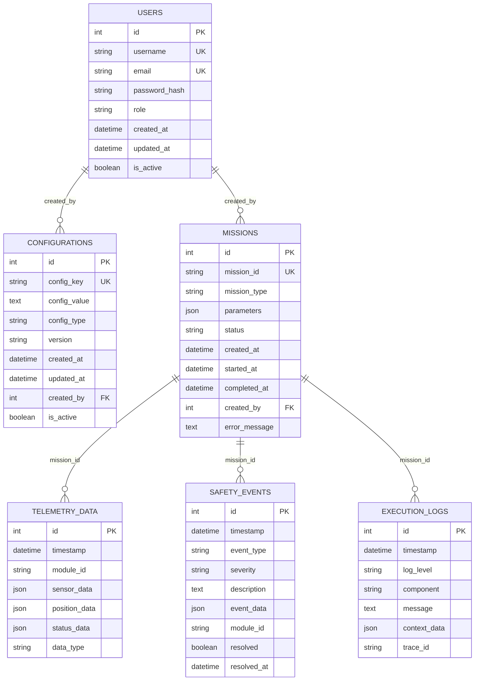

# Database Schema - OHT-50 Backend

## 📋 Tổng quan
Tài liệu này mô tả schema cơ sở dữ liệu cho OHT-50 Backend, bao gồm các bảng, relationships và constraints.

## 🗄️ Database Architecture



## 📊 Table Definitions

### 1. USERS Table
```sql
CREATE TABLE users (
    id INTEGER PRIMARY KEY AUTOINCREMENT,
    username VARCHAR(50) UNIQUE NOT NULL,
    email VARCHAR(100) UNIQUE NOT NULL,
    password_hash VARCHAR(255) NOT NULL,
    role VARCHAR(20) NOT NULL DEFAULT 'viewer',
    created_at TIMESTAMP DEFAULT CURRENT_TIMESTAMP,
    updated_at TIMESTAMP DEFAULT CURRENT_TIMESTAMP,
    is_active BOOLEAN DEFAULT TRUE,
    
    CHECK (role IN ('super_admin', 'admin', 'operator', 'viewer', 'system')),
    CHECK (email LIKE '%@%')
);

-- Indexes
CREATE INDEX idx_users_username ON users(username);
CREATE INDEX idx_users_email ON users(email);
CREATE INDEX idx_users_role ON users(role);
CREATE INDEX idx_users_active ON users(is_active);
```

### 2. CONFIGURATIONS Table
```sql
CREATE TABLE configurations (
    id INTEGER PRIMARY KEY AUTOINCREMENT,
    config_key VARCHAR(100) UNIQUE NOT NULL,
    config_value TEXT NOT NULL,
    config_type VARCHAR(20) NOT NULL DEFAULT 'string',
    version VARCHAR(20) NOT NULL DEFAULT '1.0',
    created_at TIMESTAMP DEFAULT CURRENT_TIMESTAMP,
    updated_at TIMESTAMP DEFAULT CURRENT_TIMESTAMP,
    created_by INTEGER,
    is_active BOOLEAN DEFAULT TRUE,
    
    FOREIGN KEY (created_by) REFERENCES users(id),
    CHECK (config_type IN ('string', 'number', 'boolean', 'json', 'yaml')),
    CHECK (version LIKE '%.%.%')
);

-- Indexes
CREATE INDEX idx_configs_key ON configurations(config_key);
CREATE INDEX idx_configs_type ON configurations(config_type);
CREATE INDEX idx_configs_version ON configurations(version);
CREATE INDEX idx_configs_active ON configurations(is_active);
```

### 3. MISSIONS Table
```sql
CREATE TABLE missions (
    id INTEGER PRIMARY KEY AUTOINCREMENT,
    mission_id VARCHAR(50) UNIQUE NOT NULL,
    mission_type VARCHAR(30) NOT NULL,
    parameters JSON NOT NULL,
    status VARCHAR(20) NOT NULL DEFAULT 'pending',
    created_at TIMESTAMP DEFAULT CURRENT_TIMESTAMP,
    started_at TIMESTAMP,
    completed_at TIMESTAMP,
    created_by INTEGER,
    error_message TEXT,
    
    FOREIGN KEY (created_by) REFERENCES users(id),
    CHECK (mission_type IN ('move_to', 'dock', 'undock', 'emergency_stop', 'calibrate')),
    CHECK (status IN ('pending', 'running', 'completed', 'failed', 'cancelled'))
);

-- Indexes
CREATE INDEX idx_missions_id ON missions(mission_id);
CREATE INDEX idx_missions_type ON missions(mission_type);
CREATE INDEX idx_missions_status ON missions(status);
CREATE INDEX idx_missions_created_at ON missions(created_at);
```

### 4. TELEMETRY_DATA Table
```sql
CREATE TABLE telemetry_data (
    id INTEGER PRIMARY KEY AUTOINCREMENT,
    timestamp TIMESTAMP NOT NULL DEFAULT CURRENT_TIMESTAMP,
    module_id VARCHAR(50) NOT NULL,
    sensor_data JSON,
    position_data JSON,
    status_data JSON,
    data_type VARCHAR(20) NOT NULL DEFAULT 'sensor',
    
    CHECK (data_type IN ('sensor', 'position', 'status', 'combined'))
);

-- Indexes
CREATE INDEX idx_telemetry_timestamp ON telemetry_data(timestamp);
CREATE INDEX idx_telemetry_module ON telemetry_data(module_id);
CREATE INDEX idx_telemetry_type ON telemetry_data(data_type);
CREATE INDEX idx_telemetry_timestamp_module ON telemetry_data(timestamp, module_id);
```

### 5. SAFETY_EVENTS Table
```sql
CREATE TABLE safety_events (
    id INTEGER PRIMARY KEY AUTOINCREMENT,
    timestamp TIMESTAMP NOT NULL DEFAULT CURRENT_TIMESTAMP,
    event_type VARCHAR(50) NOT NULL,
    severity VARCHAR(20) NOT NULL,
    description TEXT NOT NULL,
    event_data JSON,
    module_id VARCHAR(50),
    resolved BOOLEAN DEFAULT FALSE,
    resolved_at TIMESTAMP,
    
    CHECK (severity IN ('low', 'medium', 'high', 'critical')),
    CHECK (event_type IN ('e_stop', 'collision', 'timeout', 'communication_error', 'hardware_error'))
);

-- Indexes
CREATE INDEX idx_safety_timestamp ON safety_events(timestamp);
CREATE INDEX idx_safety_type ON safety_events(event_type);
CREATE INDEX idx_safety_severity ON safety_events(severity);
CREATE INDEX idx_safety_resolved ON safety_events(resolved);
```

### 6. EXECUTION_LOGS Table
```sql
CREATE TABLE execution_logs (
    id INTEGER PRIMARY KEY AUTOINCREMENT,
    timestamp TIMESTAMP NOT NULL DEFAULT CURRENT_TIMESTAMP,
    log_level VARCHAR(10) NOT NULL,
    component VARCHAR(50) NOT NULL,
    message TEXT NOT NULL,
    context_data JSON,
    trace_id VARCHAR(50),
    
    CHECK (log_level IN ('DEBUG', 'INFO', 'WARNING', 'ERROR', 'CRITICAL'))
);

-- Indexes
CREATE INDEX idx_logs_timestamp ON execution_logs(timestamp);
CREATE INDEX idx_logs_level ON execution_logs(log_level);
CREATE INDEX idx_logs_component ON execution_logs(component);
CREATE INDEX idx_logs_trace ON execution_logs(trace_id);
```

## 🔗 Relationships & Constraints

### Foreign Key Relationships
```sql
-- Users -> Configurations
ALTER TABLE configurations 
ADD CONSTRAINT fk_config_created_by 
FOREIGN KEY (created_by) REFERENCES users(id) ON DELETE SET NULL;

-- Users -> Missions
ALTER TABLE missions 
ADD CONSTRAINT fk_mission_created_by 
FOREIGN KEY (created_by) REFERENCES users(id) ON DELETE SET NULL;
```

### Data Integrity Constraints
```sql
-- Mission status transitions
CREATE TRIGGER mission_status_check
BEFORE UPDATE ON missions
FOR EACH ROW
BEGIN
    SELECT CASE
        WHEN OLD.status = 'completed' AND NEW.status != 'completed'
        THEN RAISE(ABORT, 'Cannot change status of completed mission')
        WHEN OLD.status = 'failed' AND NEW.status NOT IN ('failed', 'pending')
        THEN RAISE(ABORT, 'Cannot change status of failed mission')
    END;
END;

-- Safety event resolution
CREATE TRIGGER safety_resolution_check
BEFORE UPDATE ON safety_events
FOR EACH ROW
BEGIN
    SELECT CASE
        WHEN NEW.resolved = 1 AND NEW.resolved_at IS NULL
        THEN RAISE(ABORT, 'Resolved events must have resolution timestamp')
    END;
END;
```

## 📈 Performance Optimization

### Partitioning Strategy
```sql
-- Partition telemetry data by date (monthly)
CREATE TABLE telemetry_data_2024_01 PARTITION OF telemetry_data
FOR VALUES FROM ('2024-01-01') TO ('2024-02-01');

CREATE TABLE telemetry_data_2024_02 PARTITION OF telemetry_data
FOR VALUES FROM ('2024-02-01') TO ('2024-03-01');
```

### Archival Strategy
```sql
-- Archive old telemetry data (older than 6 months)
CREATE TABLE telemetry_data_archive AS
SELECT * FROM telemetry_data 
WHERE timestamp < datetime('now', '-6 months');

-- Archive old logs (older than 1 year)
CREATE TABLE execution_logs_archive AS
SELECT * FROM execution_logs 
WHERE timestamp < datetime('now', '-1 year');
```

## 🔒 Security Considerations

### Data Encryption
```sql
-- Encrypt sensitive configuration values
CREATE TABLE encrypted_configs (
    id INTEGER PRIMARY KEY AUTOINCREMENT,
    config_key VARCHAR(100) UNIQUE NOT NULL,
    encrypted_value BLOB NOT NULL,
    encryption_algorithm VARCHAR(20) NOT NULL,
    created_at TIMESTAMP DEFAULT CURRENT_TIMESTAMP
);
```

### Access Control
```sql
-- Row-level security for user data
CREATE POLICY user_data_policy ON users
    FOR ALL
    USING (id = current_user_id() OR current_user_role() IN ('admin', 'super_admin'));

-- Audit trail for configuration changes
CREATE TABLE config_audit_log (
    id INTEGER PRIMARY KEY AUTOINCREMENT,
    config_id INTEGER NOT NULL,
    action VARCHAR(20) NOT NULL,
    old_value TEXT,
    new_value TEXT,
    changed_by INTEGER NOT NULL,
    changed_at TIMESTAMP DEFAULT CURRENT_TIMESTAMP,
    
    FOREIGN KEY (config_id) REFERENCES configurations(id),
    FOREIGN KEY (changed_by) REFERENCES users(id)
);
```

## 📊 Data Retention Policy

### Retention Periods
- **Telemetry Data**: 6 months (live), 2 years (archived)
- **Safety Events**: 5 years (all severity levels)
- **Execution Logs**: 1 year (live), 3 years (archived)
- **Mission History**: 3 years
- **Configuration History**: 1 year
- **User Activity**: 2 years

### Cleanup Procedures
```sql
-- Monthly cleanup job
CREATE PROCEDURE cleanup_old_data()
BEGIN
    -- Archive old telemetry data
    INSERT INTO telemetry_data_archive
    SELECT * FROM telemetry_data 
    WHERE timestamp < datetime('now', '-6 months');
    
    DELETE FROM telemetry_data 
    WHERE timestamp < datetime('now', '-6 months');
    
    -- Archive old logs
    INSERT INTO execution_logs_archive
    SELECT * FROM execution_logs 
    WHERE timestamp < datetime('now', '-1 year');
    
    DELETE FROM execution_logs 
    WHERE timestamp < datetime('now', '-1 year');
END;
```

## 🧪 Database Testing

### Test Data Generation
```sql
-- Generate test users
INSERT INTO users (username, email, password_hash, role) VALUES
('admin', 'admin@oht50.local', 'hashed_password', 'admin'),
('operator', 'operator@oht50.local', 'hashed_password', 'operator'),
('viewer', 'viewer@oht50.local', 'hashed_password', 'viewer');

-- Generate test configurations
INSERT INTO configurations (config_key, config_value, config_type) VALUES
('system.max_speed', '500.0', 'number'),
('system.max_acceleration', '300.0', 'number'),
('safety.e_stop_timeout', '100', 'number'),
('communication.retry_attempts', '3', 'number');
```

### Performance Testing
```sql
-- Test telemetry data insertion performance
EXPLAIN QUERY PLAN
INSERT INTO telemetry_data (module_id, sensor_data, data_type)
VALUES ('module_001', '{"temp": 25.5, "humidity": 60}', 'sensor');

-- Test mission query performance
EXPLAIN QUERY PLAN
SELECT * FROM missions 
WHERE status = 'running' 
AND created_at > datetime('now', '-1 day');
```

---

**Changelog v1.0:**
- ✅ Created comprehensive database schema
- ✅ Added all core tables with proper relationships
- ✅ Implemented data integrity constraints
- ✅ Added performance optimization strategies
- ✅ Included security considerations
- ✅ Defined data retention policies
- ✅ Added testing procedures
