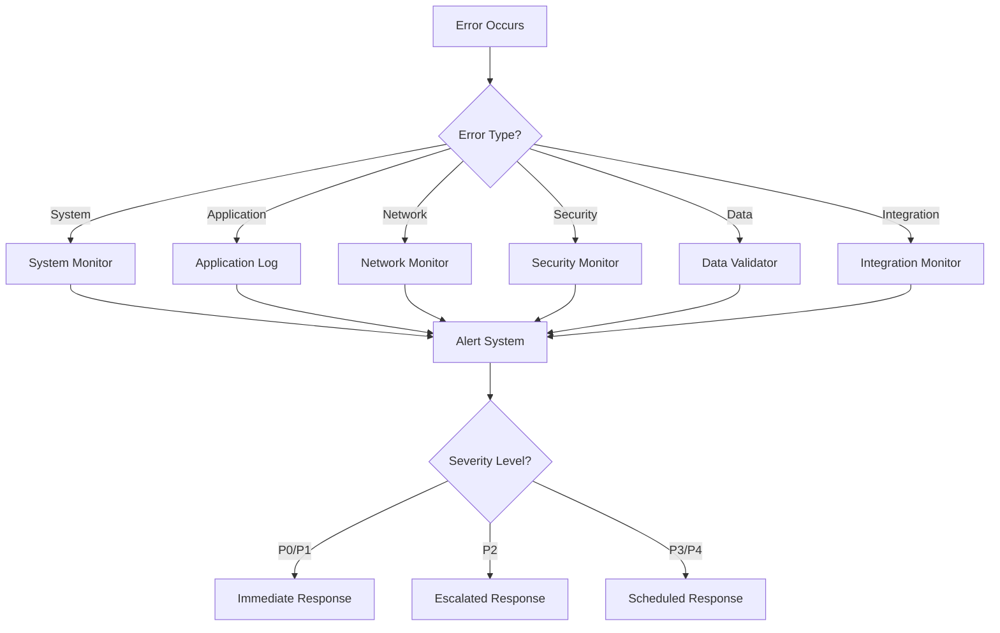

# ERROR MATRIX - OHT-50 Backend

**Phiên bản:** v1.0  
**Phạm vi:** Quản lý lỗi hệ thống backend OHT-50  
**Cập nhật:** 2024-12-19

---

## 📋 **Tổng quan**

Tài liệu này định nghĩa ma trận lỗi cho hệ thống backend OHT-50, bao gồm phân loại lỗi, mức độ nghiêm trọng, quy trình xử lý, và biện pháp khắc phục.

---

## 🚨 **1. Phân loại lỗi**

### **1.1 Mức độ nghiêm trọng (Severity Levels)**

| Level | Mô tả | Thời gian phản hồi | Ví dụ |
|-------|-------|-------------------|-------|
| **P0** | Critical - Hệ thống không hoạt động | < 15 phút | Database down, API không phản hồi |
| **P1** | High - Chức năng chính bị ảnh hưởng | < 1 giờ | Telemetry không gửi, config không lưu |
| **P2** | Medium - Chức năng phụ bị ảnh hưởng | < 4 giờ | Log không ghi, monitoring bị gián đoạn |
| **P3** | Low - Chức năng không quan trọng | < 24 giờ | UI warning, performance degradation |
| **P4** | Info - Cải thiện, không phải lỗi | < 1 tuần | Code optimization, documentation |

### **1.2 Loại lỗi (Error Categories)**

| Category | Mô tả | Ví dụ |
|----------|-------|-------|
| **System** | Lỗi hệ thống, infrastructure | Database connection, memory leak |
| **Application** | Lỗi logic ứng dụng | Business logic error, validation fail |
| **Network** | Lỗi kết nối, communication | Timeout, connection refused |
| **Security** | Lỗi bảo mật, authentication | Unauthorized access, token expired |
| **Data** | Lỗi dữ liệu, corruption | Data validation, schema mismatch |
| **Integration** | Lỗi tích hợp với hệ thống khác | Center API, firmware communication |

---

## 📊 **2. Error Matrix**

### **2.1 System Errors**

| Error Code | Error Name | Severity | Description | Root Cause | Resolution |
|------------|------------|----------|-------------|------------|------------|
| `SYS-001` | Database Connection Failed | P0 | Không thể kết nối database | Network issue, DB down | Restart DB, check network |
| `SYS-002` | Memory Exhaustion | P1 | Hết bộ nhớ RAM | Memory leak, high load | Restart service, optimize code |
| `SYS-003` | Disk Space Full | P1 | Hết dung lượng ổ cứng | Log accumulation, backup | Clean logs, expand storage |
| `SYS-004` | Service Crash | P0 | Service tự động tắt | Unhandled exception | Restart service, fix bug |
| `SYS-005` | Configuration Load Failed | P1 | Không load được config | File corruption, permission | Restore config, fix permissions |

### **2.2 Application Errors**

| Error Code | Error Name | Severity | Description | Root Cause | Resolution |
|------------|------------|----------|-------------|------------|------------|
| `APP-001` | Invalid Configuration | P2 | Config không hợp lệ | Schema validation fail | Fix config format |
| `APP-002` | Mission Validation Failed | P2 | Mission data không hợp lệ | Business rule violation | Review mission data |
| `APP-003` | State Machine Error | P1 | Lỗi chuyển trạng thái | Invalid state transition | Check state logic |
| `APP-004` | Telemetry Processing Error | P2 | Lỗi xử lý telemetry | Data format issue | Fix data format |
| `APP-005` | WebSocket Connection Error | P2 | Lỗi kết nối WebSocket | Client disconnect | Handle reconnection |

### **2.3 Network Errors**

| Error Code | Error Name | Severity | Description | Root Cause | Resolution |
|------------|------------|----------|-------------|------------|------------|
| `NET-001` | Center API Timeout | P2 | Timeout khi gọi Center API | Network latency, Center down | Retry, check Center status |
| `NET-002` | RS485 Communication Error | P1 | Lỗi giao tiếp RS485 | Hardware issue, protocol error | Check hardware, restart |
| `NET-003` | WebSocket Disconnect | P2 | Client disconnect WebSocket | Network issue, client close | Handle reconnection |
| `NET-004` | DNS Resolution Failed | P2 | Không resolve được domain | DNS server issue | Check DNS config |
| `NET-005` | SSL Certificate Expired | P1 | SSL certificate hết hạn | Certificate expired | Renew certificate |

### **2.4 Security Errors**

| Error Code | Error Name | Severity | Description | Root Cause | Resolution |
|------------|------------|----------|-------------|------------|------------|
| `SEC-001` | Authentication Failed | P2 | Xác thực thất bại | Invalid token, expired | Refresh token, re-login |
| `SEC-002` | Authorization Denied | P2 | Không có quyền truy cập | Insufficient permissions | Check user roles |
| `SEC-003` | Rate Limit Exceeded | P3 | Vượt quá giới hạn request | Too many requests | Wait, reduce frequency |
| `SEC-004` | Invalid API Key | P2 | API key không hợp lệ | Key expired, invalid | Regenerate key |
| `SEC-005` | CORS Error | P3 | CORS policy violation | Origin not allowed | Update CORS config |

### **2.5 Data Errors**

| Error Code | Error Name | Severity | Description | Root Cause | Resolution |
|------------|------------|----------|-------------|------------|------------|
| `DATA-001` | Database Schema Mismatch | P1 | Schema không khớp | Migration failed | Run migration |
| `DATA-002` | Data Validation Failed | P2 | Dữ liệu không hợp lệ | Invalid format, constraint | Fix data format |
| `DATA-003` | Data Corruption | P1 | Dữ liệu bị hỏng | Hardware issue, bug | Restore from backup |
| `DATA-004` | Backup Failed | P2 | Backup thất bại | Storage issue, permission | Check storage, permissions |
| `DATA-005` | Data Export Failed | P3 | Export dữ liệu thất bại | Format issue, size limit | Check format, size |

### **2.6 Integration Errors**

| Error Code | Error Name | Severity | Description | Root Cause | Resolution |
|------------|------------|----------|-------------|------------|------------|
| `INT-001` | Center API Error | P2 | Lỗi khi gọi Center API | Center service down | Check Center status |
| `INT-002` | Firmware Communication Error | P1 | Lỗi giao tiếp firmware | Hardware issue, protocol | Check hardware, restart |
| `INT-003` | Module Discovery Failed | P2 | Không tìm thấy module | Network issue, module down | Check network, module |
| `INT-004` | External Service Timeout | P2 | Timeout external service | Service slow, network | Retry, check service |
| `INT-005` | Webhook Delivery Failed | P3 | Gửi webhook thất bại | Endpoint down, format | Check endpoint, format |

---

## 🔧 **3. Quy trình xử lý lỗi**

### **3.1 Error Detection**



### **3.2 Response Procedures**

#### **P0 - Critical (Immediate)**
1. **Immediate Actions:**
   - Alert on-call engineer
   - Assess system impact
   - Implement emergency procedures
   - Communicate to stakeholders

2. **Resolution Steps:**
   - Identify root cause
   - Apply immediate fix
   - Verify system recovery
   - Document incident

3. **Post-Incident:**
   - Root cause analysis
   - Process improvement
   - Update runbook
   - Team review

#### **P1 - High (1 hour)**
1. **Immediate Actions:**
   - Alert relevant team
   - Assess business impact
   - Begin investigation
   - Update status page

2. **Resolution Steps:**
   - Investigate root cause
   - Apply fix
   - Test resolution
   - Monitor recovery

3. **Post-Incident:**
   - Document resolution
   - Update procedures
   - Prevent recurrence

#### **P2 - Medium (4 hours)**
1. **Actions:**
   - Assign to appropriate team
   - Investigate during business hours
   - Apply fix in next release
   - Update documentation

2. **Resolution:**
   - Code fix
   - Testing
   - Deployment
   - Verification

#### **P3/P4 - Low/Info (24 hours/1 week)**
1. **Actions:**
   - Add to backlog
   - Prioritize with other tasks
   - Implement in regular sprint
   - Update documentation

---

## 📈 **4. Monitoring & Alerting**

### **4.1 Error Metrics**

| Metric | Description | Threshold | Alert |
|--------|-------------|-----------|-------|
| **Error Rate** | Tỷ lệ lỗi trên tổng request | > 5% | P1 |
| **Response Time** | Thời gian phản hồi API | > 2s | P2 |
| **System Uptime** | Thời gian hoạt động hệ thống | < 99.9% | P0 |
| **Database Connections** | Số kết nối database | > 80% | P2 |
| **Memory Usage** | Sử dụng bộ nhớ | > 85% | P1 |
| **Disk Usage** | Sử dụng ổ cứng | > 90% | P1 |

### **4.2 Alert Channels**

| Severity | Channel | Response Time |
|----------|---------|---------------|
| **P0** | Phone, SMS, Email, Slack | < 5 phút |
| **P1** | SMS, Email, Slack | < 15 phút |
| **P2** | Email, Slack | < 1 giờ |
| **P3** | Email, Slack | < 4 giờ |
| **P4** | Email | < 24 giờ |

---

## 📋 **5. Error Tracking**

### **5.1 Error Log Format**

```json
{
  "timestamp": "2024-12-19T10:30:00Z",
  "error_code": "SYS-001",
  "error_name": "Database Connection Failed",
  "severity": "P0",
  "category": "System",
  "description": "Cannot connect to PostgreSQL database",
  "root_cause": "Database service down",
  "resolution": "Restart database service",
  "affected_services": ["api", "telemetry"],
  "user_impact": "All API endpoints unavailable",
  "stack_trace": "...",
  "context": {
    "request_id": "req-123",
    "user_id": "user-456",
    "endpoint": "/api/v1/config"
  }
}
```

### **5.2 Error Dashboard**

| Metric | Current | Target | Status |
|--------|---------|--------|--------|
| **P0 Errors** | 0 | 0 | ✅ |
| **P1 Errors** | 2 | < 5 | ✅ |
| **P2 Errors** | 8 | < 20 | ✅ |
| **Error Rate** | 2.1% | < 5% | ✅ |
| **MTTR** | 45 min | < 1 hour | ✅ |

---

## 🔄 **6. Continuous Improvement**

### **6.1 Error Analysis**

#### **Monthly Review**
- Top error patterns
- Root cause analysis
- Resolution effectiveness
- Process improvements

#### **Quarterly Review**
- Error trend analysis
- System reliability metrics
- Team performance
- Tool effectiveness

### **6.2 Process Improvements**

#### **Automation**
- Auto-recovery procedures
- Self-healing mechanisms
- Predictive monitoring
- Automated testing

#### **Documentation**
- Updated runbooks
- Knowledge base
- Best practices
- Training materials

---

## 📞 **7. Escalation Matrix**

### **7.1 On-Call Schedule**

| Week | Primary | Secondary | Manager |
|------|---------|-----------|---------|
| Week 1 | Engineer A | Engineer B | Tech Lead |
| Week 2 | Engineer B | Engineer C | Tech Lead |
| Week 3 | Engineer C | Engineer A | Tech Lead |
| Week 4 | Engineer A | Engineer B | Tech Lead |

### **7.2 Escalation Levels**

| Level | Role | Response Time | Contact Method |
|-------|------|---------------|----------------|
| **L1** | On-call Engineer | < 15 phút | Phone, SMS |
| **L2** | Tech Lead | < 30 phút | Phone, SMS |
| **L3** | Engineering Manager | < 1 giờ | Phone, Email |
| **L4** | CTO | < 2 giờ | Phone, Email |

---

## 📚 **8. References**

### **8.1 Related Documents**
- [Runbook](RUNBOOK.md) - Quy trình vận hành
- [SLO/SLA](SLO_SLA.md) - Service level objectives
- [Security Guide](SECURITY_GUIDE.md) - Hướng dẫn bảo mật

### **8.2 Tools & Resources**
- **Monitoring:** Prometheus, Grafana
- **Logging:** ELK Stack, Fluentd
- **Alerting:** PagerDuty, OpsGenie
- **Incident Management:** Jira, ServiceNow

---

**Changelog v1.0:**
- ✅ Created comprehensive error matrix
- ✅ Defined error categories and severity levels
- ✅ Added detailed error codes and resolutions
- ✅ Included response procedures and escalation matrix
- ✅ Added monitoring metrics and alerting channels
- ✅ Referenced related documents and tools
