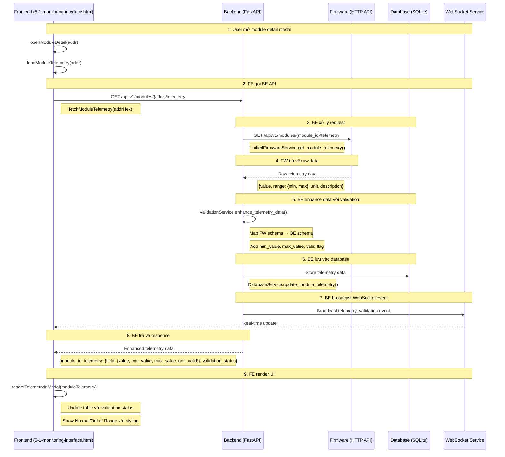

# 🔄 OHT-50 Data Flow: FE → BE → FW

## 📊 **Sơ đồ quy trình dữ liệu**



## 🔧 **Chi tiết từng bước:**

### **1. Frontend (FE) - User Interface**
- **File:** `superdesign/design_iterations/functional_pages/5-1-monitoring-interface.html`
- **Function:** `openModuleDetail(addr)` → `loadModuleTelemetry(addr)`
- **API Call:** `fetchModuleTelemetry(addrHex)` → `GET /api/v1/modules/{addr}/telemetry`

### **2. Backend (BE) - API Layer**
- **File:** `backend/app/api/v1/module_telemetry.py`
- **Endpoint:** `GET /api/v1/modules/{module_id}/telemetry`
- **Service:** `UnifiedFirmwareService.get_module_telemetry(module_id)`

### **3. Firmware (FW) - Hardware Interface**
- **URL:** `http://localhost:8080/api/v1/modules/{module_id}/telemetry`
- **Response:** Raw telemetry data với FW schema
- **Format:** `{value, range: {min, max}, unit, description}`

### **4. Backend Processing - Data Enhancement**
- **Service:** `ValidationService.enhance_telemetry_data()`
- **Mapping:** FW schema → BE schema
- **Validation:** Check value trong range [min_value, max_value]
- **Output:** Enhanced data với `valid` flag

### **5. Database Storage**
- **Service:** `DatabaseService.update_module_telemetry()`
- **Storage:** SQLite database
- **Tables:** `telemetry_data`, `validation_status_summary`

### **6. WebSocket Broadcasting**
- **Service:** `WebSocketService.broadcast_message()`
- **Event:** `telemetry_validation`
- **Payload:** Enhanced telemetry data
- **Real-time:** Frontend nhận updates ngay lập tức

### **7. Frontend Rendering**
- **Function:** `renderTelemetryInModal(moduleTelemetry)`
- **UI Updates:** Table với validation status
- **Styling:** Red background cho invalid values
- **Tooltips:** Show min/max ranges

## 📋 **Data Schema Mapping:**

### **FW Schema (Firmware):**
```json
{
  "voltage": {
    "value": 24.1,
    "range": {"min": 0.0, "max": 30.0},
    "unit": "V",
    "description": "Supply voltage"
  }
}
```

### **BE Schema (Backend):**
```json
{
  "voltage": {
    "value": 24.1,
    "min_value": 0.0,
    "max_value": 30.0,
    "unit": "V",
    "description": "Supply voltage",
    "valid": true
  }
}
```

## 🔄 **Real-time Updates:**

### **WebSocket Events:**
- **Type:** `telemetry_validation`
- **Trigger:** Sau mỗi GET/POST API call
- **Payload:** Complete ModuleTelemetry object
- **Frontend Handler:** `RS485WebSocketClient.handleMessage()`

### **Frontend WebSocket Handler:**
```javascript
RS485WebSocketClient.prototype.handleMessage = function(message) {
    const data = JSON.parse(message.data);
    
    if (data.type === 'telemetry_validation') {
        renderTelemetryInModal(data.data);
    }
};
```

## 🎯 **Kết quả cuối cùng:**

### **Frontend UI hiển thị:**
- ✅ **Table với telemetry data**
- ✅ **Validation status** (Normal/Out of Range)
- ✅ **Real-time updates** qua WebSocket
- ✅ **Visual indicators** (red background cho invalid)
- ✅ **Tooltips** với min/max ranges

### **Backend API responses:**
- ✅ **GET /api/v1/modules/{id}/telemetry** - Enhanced data
- ✅ **POST /api/v1/modules/{id}/telemetry/validate** - Validation results
- ✅ **WebSocket events** - Real-time broadcasting

---

**📝 Lưu ý:** Quy trình này đảm bảo data integrity, real-time updates, và user experience tốt cho monitoring interface.
