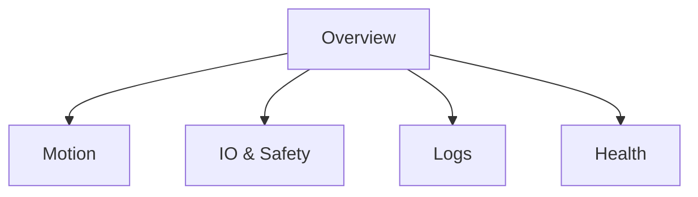

# 11) UI Local Dashboard (Thiết kế giao diện & tính năng)

## 0) Nguồn thiết kế Figma & MCP
- Thiết lập kết nối MCP ↔ Figma theo `12_figma_mcp_setup.md`.
- Khi đã kết nối, dùng link Figma của UI để trích danh sách frame cho các tab: Overview, Motion, IO & Safety, Logs, Health; đồng bộ tokens (màu/chữ) nếu có.

## 1) Bối cảnh & mục tiêu
- Mục tiêu: Cung cấp giao diện cục bộ trên Radxa S0 để chẩn đoán, giám sát và thực hiện lệnh cơ bản mà không phụ thuộc Center.
- Phạm vi MVP: hiển thị trạng thái hệ thống, đồ thị telemetry, điều khiển lệnh cơ bản an toàn; không chặn vòng điều khiển.

## 2) Giả định & thông số còn thiếu (tạm)
- Nguồn dữ liệu: API cục bộ (`GET /health`, `GET /status`, `POST /command`, WS `/telemetry`).
- Tần số telemetry: 20 Hz mặc định (10–50 Hz theo cấu hình).
- Quyền truy cập: cục bộ (LAN), chưa bật xác thực cho giai đoạn đầu.
- E‑Stop phần mềm chỉ hiển thị; thao tác E‑Stop thực hiện bằng phần cứng.

## 3) Danh sách tính năng (MVP trước, nâng cao sau)
- MVP:
  - Trang Tổng quan: trạng thái State machine, `s_on_rail`, vận tốc, lỗi/sự kiện gần nhất.
  - Đồ thị thời gian thực: vị trí/tốc độ (v‑x), dòng lệnh và phản hồi cơ bản.
  - Điều khiển cơ bản: `moveTo(s)`, `stop`, `doorOpen/doorClose`, `liftUp/liftDown` (nếu có), `resetLatch`.
  - I/O & Safety: hiển thị DI/DO/AI/AO, trạng thái Safety (estop/interlock/latched).
  - Nhật ký: dòng log gần nhất (tail), lọc theo mức.
  - Health: phiên bản, uptime, nhiệt độ (nếu có), thông số bus (RTT, retry, CRC lỗi).
- Nâng cao (sau):
  - Cấu hình tham số (đọc/ghi có kiểm soát), backup/restore cấu hình.
  - Test diode/relay/driver nhanh (maintenance mode).
  - Hiệu chuẩn encoder/điểm mốc.

## 4) Kiến trúc & công nghệ UI (đề xuất)
- Giao diện: SPA nhẹ (HTML/CSS/JS thuần hoặc một thư viện gọn) chạy trong trình duyệt nội bộ.
- Render đồ thị: Chart.js hoặc uPlot (nhẹ, hiệu năng tốt).
- Phục vụ tĩnh: do FastAPI (nhúng static) hoặc Nginx (tùy chọn giai đoạn sau).
- Kết nối dữ liệu: HTTP (status, health) + WebSocket (telemetry).

```mermaid
flowchart LR
  subgraph Device[Radxa S0]
    API[Local API FastAPI]\nGET /health\nGET /status\nPOST /command\nWS /telemetry
    CTRL[Control Loop]\n(dt=20 ms)
    HAL[HAL RS485]
  end
  UI[Browser UI] -- HTTP/WS --> API
  API -- queue/non-blocking --> CTRL
  CTRL -- feedback --> HAL
```

## 5) Thông tin hiển thị & bố cục màn hình
- Header: tên robot, trạng thái tổng (Idle/Move/Dock/Fault/E‑Stop), đèn cảnh báo.
- Khối thông tin nhanh: `s_on_rail`, `v`, trạng thái cửa, tải hàng, estop/interlock.
- Tabs/Sections:
  - Overview: số liệu nhanh + nút lệnh cơ bản.
  - Motion: đồ thị v‑x, mục tiêu hiện tại, lỗi theo dõi.
  - I/O & Safety: bảng bitmask DI/DO, AI/AO, trạng thái safety.
  - Logs: tail 200 dòng gần nhất, bộ lọc mức.
  - Health: version, uptime, bus RTT/CRC/retry counters.



## 6) Ánh xạ API ↔ UI (tối thiểu)
- `GET /health` → trang Health.
- `GET /status` → Overview, Motion, IO & Safety.
- `WS /telemetry` → đồ thị thời gian thực (buffer 2–5 s, downsample nếu cần).
- `POST /command` → các lệnh:
  - `{type: "moveTo", s: <m>}`
  - `{type: "stop"}`
  - `{type: "door", action: "open"|"close"}`
  - `{type: "lift", action: "up"|"down"}` (nếu có)
  - `{type: "resetLatch"}`
- Quy tắc an toàn:
  - Validate đầu vào: giới hạn `s` theo `rail_length`, chặn khi `estop`/`fault`.
  - Hiển thị cảnh báo khi lệnh bị từ chối do permit/safety.

## 7) Telemetry & Status schema (gợi ý)
- Telemetry frame (WS):
  - `t` (ms), `s_on_rail`, `v`, `a`, `axis_drive`{`pos`,`vel`}, `io`{DI,DO,AI}, `safety`{estop,interlock,latched}.
- Status (HTTP):
  - `state`, `goal`, `last_error`, `mission_ctx?`, counters chẩn đoán bus (`rtt_ms`, `crc_fail`, `retry_count`, `timeout_count`).

## 8) Tiêu chí chấp nhận
- Màn hình Overview cập nhật ≤ 200 ms, đồ thị 20 Hz không lag đáng kể trên Radxa.
- Lệnh `moveTo`/`stop` phản hồi HTTP ≤ 200 ms; lệnh bị chặn đúng luật an toàn.
- Không chặn vòng điều khiển; khi mất WS, UI tự reconnect và hiển thị degraded state.

## 9) Rủi ro & biện pháp
- Jitter và giật đồ thị: downsample client, worker vẽ riêng, giới hạn điểm.
- Quá tải API: hạn mức request, cache status ngắn (100–200 ms), tách tác vụ đọc/ghi.
- Sai lệch thời gian client: hiển thị theo `t` từ device.

## 10) Bước tiếp theo
1. Chốt danh sách trường `status` và `telemetry` (theo mục 7) → cập nhật `08_logging_telemetry.md` nếu thay đổi.
2. Phác thảo wireframe chi tiết cho từng tab (Figma hoặc mô tả markdown) → duyệt.
3. Tạo skeleton `services/local_api/api.py` (chỉ stub trả dữ liệu giả) + HTML tĩnh tối giản (Overview + Motion).
4. Kịch bản test UI: latency, mất kết nối WS, lệnh bị chặn bởi safety.

