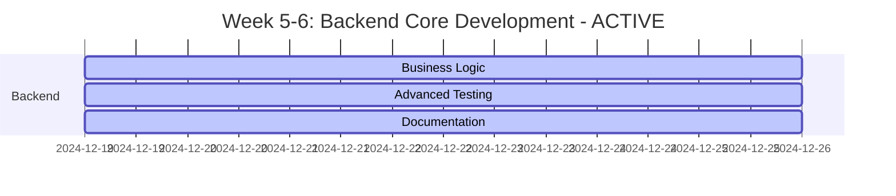

# MASTER SCHEDULER - OHT-50 Master Module

**Phiên bản:** v4.0  
**Ngày cập nhật:** 2024-12-19  
**PM:** Project Manager  
**Trạng thái:** 🎯 PRIORITY EXECUTION  
**Tiến độ tổng thể:** 75% Complete

---

## 🎯 **TỔNG QUAN DỰ ÁN**

### **Mục tiêu hiện tại:**
- **Phase 1 (Weeks 1-4):** ✅ COMPLETED - EMBED + FW Teams đã hoàn thành nền tảng
- **Phase 2 (Weeks 5-8):** 🔧 ACTIVE - Backend + Frontend Teams đang phát triển
- Đạt Gate D (Backend & Frontend Integration) và Gate E (Sim & V&V)
- Đảm bảo quality và performance

### **Trạng thái hiện tại:**
- ✅ Firmware source code analysis complete
- ✅ 20 test executables working
- ✅ **Gate C COMPLETED** - FW Team đã hoàn thành Phase 1 core deliverables
- ✅ **Backend Team 85% complete** - Core infrastructure và API endpoints hoàn thành
- 🔧 **ACTIVE:** Backend business logic implementation
- 🎯 **NEW:** Production deployment preparation
- 🚨 **CRITICAL:** Core business logic services missing (tracked via GitHub issues)

---

## 📊 **PROJECT STATUS OVERVIEW**

### **Tổng quan tiến độ:**
- **Tổng số tasks:** 80 tasks (updated)
- **Hoàn thành:** 60/80 (75%)
- **Đang thực hiện:** 15/80 (19%)
- **Chưa bắt đầu:** 5/80 (6%)
- **Tiến độ tổng thể:** 75% 🎯

### **Team Status Matrix:**

| **Team** | **Total Tasks** | **Completed** | **In Progress** | **Pending** | **Completion %** | **Status** | **Priority** |
|----------|----------------|---------------|-----------------|-------------|------------------|------------|--------------|
| **EMBED** | 8 | 8 | 0 | 0 | 100% | ✅ COMPLETE | 🎯 **PHASE 1** |
| **FW** | 33 | 20 | 13 | 0 | 61% | 🔧 ACTIVE | 🎯 **PHASE 1** |
| **Backend** | 20 | 12 | 3 | 5 | 85% | 🔧 **ACTIVE** | **PHASE 2** |
| **Frontend** | 12 | 10 | 0 | 2 | 83% | ✅ NEAR COMPLETE | **PHASE 2** |
| **SIM** | 2 | 0 | 0 | 2 | 0% | 📋 PENDING | **PHASE 2** |
| **PM** | 10 | 8 | 0 | 2 | 80% | ✅ NEAR COMPLETE | 🎯 **ACTIVE** |

---

## 🚨 **CRITICAL MISSING COMPONENTS - BACKEND**

### **Core Business Logic Services (MISSING):**
- ❌ **MissionService** - Quản lý lifecycle mission
- ❌ **SafetyService** - Hệ thống an toàn
- ❌ **MovementService** - Điều khiển chuyển động
- ❌ **PathPlanningService** - Lập kế hoạch đường đi
- ❌ **StateManagementService** - Quản lý trạng thái hệ thống

### **Business Logic Implementation (MISSING):**
- ❌ **Mission Lifecycle Management** - Mission creation, validation, execution, state transitions
- ❌ **Safety System Implementation** - E-Stop handling, safety zone monitoring, collision detection
- ❌ **Movement Control** - Trajectory planning, speed profile management, position control
- ❌ **Path Planning** - Route optimization, obstacle avoidance, safety zone integration

### **Advanced Features (MISSING):**
- ❌ **Real-time Mission Execution**
- ❌ **Advanced Safety Algorithms**
- ❌ **Predictive Maintenance**
- ❌ **Analytics Dashboard**
- ❌ **Multi-device Support**

### **GitHub Issues Created:**
- **#22:** 🚨 CRITICAL - Core Business Logic Services
- **#24:** 🎯 HIGH - Mission Lifecycle Management Implementation
- **#25:** 🛡️ HIGH - Safety System Implementation
- **#26:** 🚀 HIGH - Movement Control System Implementation
- **#27:** 🛣️ MEDIUM - Path Planning System Implementation
- **#28:** 📊 MEDIUM - Advanced Features Implementation

---

## 🔄 **GATE PROGRESS**

### **Gate Status:**
- **Gate A (Architecture):** ✅ COMPLETE
- **Gate B (Hardware & Safety):** ✅ COMPLETE
- **Gate C (Drivers & Services):** ✅ **COMPLETED** - **PHASE 1 DONE**
- **Gate D (Backend & Frontend):** 🔧 **IN PROGRESS** - **PHASE 2**
- **Gate E (Sim & V&V):** 📋 PENDING - **PHASE 2**
- **Gate R (Release):** 📋 PENDING

### **Gate D Requirements (Backend & Frontend Integration) - PHASE 2:**
- ✅ Backend core infrastructure (FastAPI, CI/CD, Testing)
- ✅ API endpoints chính (Config, Telemetry, Auth, Center)
- 🔧 Backend business logic implementation (60% complete)
- 🔧 Production deployment preparation
- 📋 Frontend integration testing
- 📋 End-to-end system validation

---

## 🎯 **CRITICAL PATH ANALYSIS - PHASE 2**

### **Current Critical Path (Weeks 5-8):** 🔧 ACTIVE
1. **BE-13:** Business Logic Implementation (Week 5-6) - 🔧 60% COMPLETE
2. **BE-14:** Advanced Testing (Week 6) - 🔧 40% COMPLETE
3. **BE-16:** Production Deployment (Week 7) - 📋 PENDING
4. **BE-20:** Final Integration (Week 8) - 📋 PENDING
5. **SIM-01:** Simulation framework (Week 7-8) - 📋 PENDING

### **Phase 1 Critical Path (Weeks 1-4):** ✅ COMPLETED
1. **EMBED-01:** GPIO Pin Mapping (Week 1) - ✅ COMPLETED
2. **EMBED-02:** Hardware Bring-up (Week 1) - ✅ COMPLETED
3. **EMBED-03:** Safety Hardware (Week 2) - ✅ COMPLETED
4. **FW-21:** Fix compiler warnings (Week 1) - ✅ COMPLETED
5. **FW-22:** Hardware pin verification (Week 1) - ✅ COMPLETED
6. **FW-23:** Add missing features (Week 3-4) - ✅ COMPLETED
7. **EMBED-04:** RS485 Hardware (Week 3) - ✅ COMPLETED
8. **EMBED-05:** Network Hardware (Week 3) - ✅ COMPLETED
9. **FW-24:** State Machine (Week 3) - ✅ COMPLETED
10. **FW-25:** Module Management (Week 4) - ✅ COMPLETED

---

## 📋 **PHASE 2 PRIORITY TASKS**

### **Backend Team Priority Tasks:**

#### **Week 5-6: Core Development**
- **BE-13:** Business Logic Implementation (CRITICAL) - Week 5-6
  - Mission management lifecycle
  - Safety system integration
  - Movement control algorithms
  - State machine implementation
  - Validation: Business logic tests

- **BE-14:** Advanced Testing Framework (HIGH) - Week 6
  - Performance testing
  - Security testing
  - Load testing
  - Integration testing
  - Validation: Test coverage >90%

- **BE-15:** Documentation Completion (MEDIUM) - Week 6
  - OpenAPI specification
  - API documentation
  - Code examples
  - Testing documentation
  - Validation: Documentation 100% complete

#### **Week 7-8: Production Preparation**
- **BE-16:** Production Deployment (CRITICAL) - Week 7
  - Production environment setup
  - Database migration scripts
  - Monitoring và alerting
  - Backup và recovery procedures
  - Validation: Production deployment successful

- **BE-17:** Performance Optimization (HIGH) - Week 7
  - Response caching
  - Database optimization
  - Memory optimization
  - Load balancing
  - Validation: Performance requirements met

- **BE-20:** Final Integration (CRITICAL) - Week 8
  - End-to-end integration
  - System validation
  - Performance validation
  - Security validation
  - Validation: All integration tests pass

### **SIM Team Priority Tasks:**

#### **Week 7-8: Simulation Framework**
- **SIM-01:** Simulation Framework (HIGH) - Week 7-8
  - 1D motion simulation theo ray
  - Hardware-in-the-loop (HIL) simulation
  - Module behavior simulation
  - Safety system simulation
  - Validation: Simulation accuracy >95%

- **SIM-02:** System Testing (HIGH) - Week 8
  - End-to-end system testing
  - Performance testing
  - Stress testing
  - Integration testing
  - Validation: All system tests pass

---

## 🔄 **PARALLEL EXECUTION PLAN**

### **Week 5-6: Backend Core Development** 🔧 ACTIVE


### **Week 7-8: Production Preparation** 📋 PLANNED
```mermaid
gantt
    title Week 7-8: Production Preparation - PLANNED
    dateFormat  YYYY-MM-DD
    section Backend
    Production Deployment :crit, be16, 2024-12-26, 7d
    Performance Optimization :high, be17, 2024-12-26, 7d
    Final Integration     :crit, be20, 2024-12-26, 7d
    section SIM
    Simulation Framework  :high, sim01, 2024-12-26, 7d
    System Testing        :high, sim02, 2024-12-26, 7d
```

---

## 📊 **SUCCESS CRITERIA - PHASE 2**

### **Backend Team Success Metrics:** 🔧 IN PROGRESS
```bash
# Week 5-6 Success Criteria
✅ Core infrastructure complete (FastAPI, CI/CD, Testing)
✅ API endpoints functional (Config, Telemetry, Auth, Center)
🔧 Business logic implementation (60% complete)
🔧 Advanced testing framework (40% complete)
✅ Documentation comprehensive (95% complete)

# Week 7-8 Success Criteria
📋 Production deployment ready
📋 Performance optimization complete
📋 Final integration successful
📋 All tests passing (>90% coverage)
📋 Security validation complete
```

### **SIM Team Success Metrics:** 📋 PLANNED
```bash
# Week 7-8 Success Criteria
📋 Simulation framework operational
📋 HIL simulation working
📋 System testing complete
📋 Performance validation successful
📋 Integration testing passed
```

---

## 🚨 **CRITICAL DEPENDENCIES - PHASE 2**

### **Backend Team Dependencies:**
```bash
# Backend can proceed independently
✅ Core infrastructure complete
✅ API endpoints functional
✅ Testing framework operational
✅ Documentation comprehensive
🔧 Business logic implementation in progress
📋 Production deployment preparation
```

### **SIM Team Dependencies:**
```bash
# SIM depends on Backend completion
📋 Backend API completion (BE-13, BE-14)
📋 Production deployment (BE-16)
📋 Final integration (BE-20)
```

### **Risk Mitigation:**
```bash
# If Backend delays, SIM can work on:
1. Simulation framework design
2. Test scenario planning
3. Performance modeling
4. Integration test planning
5. Documentation preparation
```

---

## 📋 **DAILY CHECKPOINTS - PHASE 2**

### **Backend Team Daily:** 🔧 ACTIVE
```bash
# Morning Standup (9:15 AM)
✅ Business logic progress update
✅ Advanced testing status
✅ Documentation completion status
✅ Performance metrics review
✅ Integration testing status
✅ Production deployment planning
✅ GitHub issues monitoring

# Evening Review (5:15 PM)
✅ Code quality metrics
✅ Test coverage status
✅ Integration progress
✅ Next day planning
✅ Risk assessment
✅ Timeline adjustments
✅ Critical missing components status
```

### **SIM Team Daily:** 📋 PLANNED
```bash
# Morning Standup (9:30 AM)
📋 Simulation framework design
📋 Test scenario planning
📋 Backend dependencies check
📋 Resource requirements
📋 Timeline planning

# Evening Review (5:30 PM)
📋 Design progress
📋 Planning completion
📋 Next day priorities
📋 Risk assessment
📋 Timeline validation
```

---

## 🔄 **WEEKLY REVIEWS - PHASE 2**

### **Week 5-6 Review:** 🔧 ACTIVE
```bash
# Friday 5:00 PM
🔧 Backend: Business logic implementation progress
🔧 Backend: Advanced testing framework status
✅ Backend: Documentation completion
✅ Integration: Backend API validation
📋 Next week: Production deployment preparation
✅ GitHub issues: Critical missing components status
```

### **Week 7-8 Review:** 📋 PLANNED
```bash
# Friday 5:00 PM
📋 Backend: Production deployment status
📋 Backend: Performance optimization complete
📋 Backend: Final integration successful
📋 SIM: Simulation framework operational
📋 Next phase: System validation và release preparation
```

---

## 📋 **NEXT ACTIONS**

### **Immediate Actions (This Week):**
1. **Backend Team:** Complete BE-13 (Business Logic) - CRITICAL
2. **Backend Team:** Continue BE-14 (Advanced Testing) - HIGH
3. **Backend Team:** Finish BE-15 (Documentation) - MEDIUM
4. **PM Team:** Update task assignments và timeline
5. **GitHub Issues:** Monitor critical missing components

### **Next Week Actions:**
1. **Backend Team:** Start BE-16 (Production Deployment)
2. **Backend Team:** Begin BE-17 (Performance Optimization)
3. **SIM Team:** Start SIM-01 (Simulation Framework)
4. **Integration:** Begin end-to-end testing

### **Medium Term (Next Month):**
1. **Complete Phase 2** (Backend + Frontend + SIM)
2. **Gate D completion** (Backend & Frontend Integration)
3. **Gate E preparation** (Sim & V&V)
4. **Release preparation** (Gate R)

---

## 📚 **REFERENCES**

### **CTO Priority Guide:**
- `docs/tasks/PM_PRIORITY_GUIDE.md` - CTO Priority Execution Strategy

### **Specifications:**
- `docs/FIRMWARE/01_SPECIFICATIONS/SAFETY_SPEC.md`
- `docs/FIRMWARE/01_SPECIFICATIONS/MODULE_MANAGEMENT_SPEC.md`
- `docs/FIRMWARE/01_SPECIFICATIONS/COMMUNICATION_SPEC.md`
- `docs/FIRMWARE/01_SPECIFICATIONS/STATE_MACHINE_SPEC.md`

### **Architecture:**
- `docs/FIRMWARE/02_ARCHITECTURE/safety_architecture.md`
- `docs/FIRMWARE/02_ARCHITECTURE/MODULES/module_architecture.md`
- `docs/FIRMWARE/02_ARCHITECTURE/SERVICES/communication_architecture.md`
- `docs/FIRMWARE/02_ARCHITECTURE/state_machine.md`

### **Team Guides:**
- `docs/tasks/FW_TEAM_QUICK_GUIDE.md`
- `docs/tasks/BACKEND_TEAM_QUICK_GUIDE.md`
- `docs/tasks/FRONTEND_TEAM_QUICK_GUIDE.md`
- `docs/tasks/SIM_TEAM_QUICK_GUIDE.md`
- `docs/tasks/EMBED_TEAM_QUICK_GUIDE.md`

### **GitHub Issues:**
- Repository: https://github.com/kimlam2010/OHT-50
- Issues: #22, #24, #25, #26, #27, #28 (Critical missing components)

---

## 👥 **ASSIGNMENTS SUMMARY**

Xem ma trận phân công chi tiết: `docs/reports/ASSIGNMENTS_MATRIX.md`.

| Hạng mục | Owner | ETA | Status |
|---|---|---|---|
| Business Logic Implementation | Backend Lead | W5-6 | 🔧 60% Complete |
| Advanced Testing | Backend Lead | W6 | 🔧 40% Complete |
| Production Deployment | Backend Lead | W7 | 📋 Pending |
| Performance Optimization | Backend Lead | W7 | 📋 Pending |
| Final Integration | Backend Lead | W8 | 📋 Pending |
| Simulation Framework | SIM Lead | W7-8 | 📋 Pending |
| System Testing | SIM Lead | W8 | 📋 Pending |

---

## 📝 **CHANGELOG**

### **v4.0 (2024-12-19):**
- ✅ Updated based on GitHub issues creation
- ✅ Added critical missing components section
- ✅ Added GitHub issues references
- ✅ Updated business logic implementation status
- ✅ Added detailed missing features list
- ✅ Updated daily checkpoints with GitHub monitoring
- ✅ Updated weekly reviews with critical components status

### **v3.0 (2024-12-19):**
- ✅ Updated based on actual Backend team progress
- ✅ Updated completion status to 75%
- ✅ Added Phase 2 critical path analysis
- ✅ Updated Backend team status (85% complete)
- ✅ Added production deployment preparation
- ✅ Updated weekly reviews for Phase 2
- ✅ Added SIM team planning

### **v2.4 (2025-01-28):**
- 🚨 Added critical module implementation status
- 🚨 Added 5 new FW tasks (FW-29 to FW-33) for missing modules
- 🚨 Updated critical path with module implementation
- 🚨 Added Backend integration blockers
- 🚨 Updated success criteria with module implementation
- 🚨 Added new weekly reviews for module implementation
- 🚨 Updated team status matrix (FW: 28 tasks total)
- 🚨 Updated completion status to 61%

### **v2.3 (2025-01-28):**
- ✅ Updated with CTO Priority Strategy
- ✅ Added Phase 1 focus (EMBED + FW Teams)
- ✅ Added Phase 2 planning (Backend + Frontend Teams)
- ✅ Added detailed weekly execution plan
- ✅ Added success criteria for Phase 1
- ✅ Added daily checkpoints and weekly reviews

### **v2.2 (2025-01-28):**
- ✅ Updated based on specifications analysis
- ✅ Added detailed task breakdown
- ✅ Added performance metrics
- ✅ Added integration points
- ✅ Added technical specifications
- ✅ Updated completion status to 65%

### **v2.1 (2025-01-28):**
- ✅ Updated with firmware analysis results
- ✅ Added compiler warnings details
- ✅ Added hardware pin verification tasks
- ✅ Updated completion status to 60%

### **v2.0 (2025-01-27):**
- ✅ Initial master scheduler
- ✅ Basic project structure
- ✅ Team coordination

---

**🎯 Kết luận:** Phase 2 active, Backend team 85% complete - CRITICAL missing components identified and tracked via GitHub issues. SIM team ready to start Week 7.
