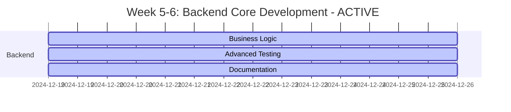

# PM PRIORITY GUIDE - OHT-50 Master Module

**Phiên bản:** v2.0  
**Ngày tạo:** 2024-12-19  
**Team:** PM Team  
**Trạng thái:** 🎯 PHASE 2 EXECUTION

---

## 🎯 **PRIORITY EXECUTION STRATEGY**

### **Phase 1: EMBED + FW Teams (Weeks 1-4)** ✅ COMPLETED
**Mục tiêu:** Xây dựng nền tảng hardware và firmware core trước

### **Phase 2: Backend + Frontend Teams (Weeks 5-8)** 🔧 ACTIVE
**Mục tiêu:** Services và UI development trên nền tảng vững chắc

---

## 📋 **BACKEND TEAM PRIORITY TASKS**

### **Week 5-6: Core Development** 🔧 ACTIVE
```bash
# CRITICAL PATH - Phải hoàn thành trước
1. Business Logic Implementation (BE-13)
   - Mission management lifecycle
   - Safety system integration
   - Movement control algorithms
   - State machine implementation
   - Validation: Business logic tests

2. Advanced Testing Framework (BE-14)
   - Performance testing
   - Security testing
   - Load testing
   - Integration testing
   - Validation: Test coverage >90%

3. Documentation Completion (BE-15)
   - OpenAPI specification
   - API documentation
   - Code examples
   - Testing documentation
   - Validation: Documentation 100% complete
```

### **Week 7-8: Production Preparation** 📋 PLANNED
```bash
# HIGH PRIORITY - Phụ thuộc vào Week 5-6
1. Production Deployment (BE-16)
   - Production environment setup
   - Database migration scripts
   - Monitoring và alerting
   - Backup và recovery procedures
   - Validation: Production deployment successful

2. Performance Optimization (BE-17)
   - Response caching
   - Database optimization
   - Memory optimization
   - Load balancing
   - Validation: Performance requirements met

3. Final Integration (BE-20)
   - End-to-end integration
   - System validation
   - Performance validation
   - Security validation
   - Validation: All integration tests pass
```

---

## 🔧 **SIM TEAM PRIORITY TASKS**

### **Week 7-8: Simulation Framework** 📋 PLANNED
```bash
# HIGH PRIORITY - Phụ thuộc vào Backend completion
1. Simulation Framework (SIM-01)
   - 1D motion simulation theo ray
   - Hardware-in-the-loop (HIL) simulation
   - Module behavior simulation
   - Safety system simulation
   - Validation: Simulation accuracy >95%

2. System Testing (SIM-02)
   - End-to-end system testing
   - Performance testing
   - Stress testing
   - Integration testing
   - Validation: All system tests pass
```

---

## 🔄 **PARALLEL EXECUTION PLAN**

### **Week 5-6: Backend Core Development** 🔧 ACTIVE


### **Week 7-8: Production Preparation** 📋 PLANNED
```mermaid
gantt
    title Week 7-8: Production Preparation - PLANNED
    dateFormat  YYYY-MM-DD
    section Backend
    Production Deployment :crit, be16, 2024-12-26, 7d
    Performance Optimization :high, be17, 2024-12-26, 7d
    Final Integration     :crit, be20, 2024-12-26, 7d
    section SIM
    Simulation Framework  :high, sim01, 2024-12-26, 7d
    System Testing        :high, sim02, 2024-12-26, 7d
```

---

## 📊 **SUCCESS CRITERIA**

### **Backend Team Success Metrics:** 🔧 IN PROGRESS
```bash
# Week 5-6 Success Criteria
✅ Core infrastructure complete (FastAPI, CI/CD, Testing)
✅ API endpoints functional (Config, Telemetry, Auth, Center)
🔧 Business logic implementation (60% complete)
🔧 Advanced testing framework (40% complete)
✅ Documentation comprehensive (95% complete)

# Week 7-8 Success Criteria
📋 Production deployment ready
📋 Performance optimization complete
📋 Final integration successful
📋 All tests passing (>90% coverage)
📋 Security validation complete
```

### **SIM Team Success Metrics:** 📋 PLANNED
```bash
# Week 7-8 Success Criteria
📋 Simulation framework operational
📋 HIL simulation working
📋 System testing complete
📋 Performance validation successful
📋 Integration testing passed
```

---

## 🚨 **CRITICAL DEPENDENCIES**

### **Backend Team Dependencies:**
```bash
# Backend can proceed independently
✅ Core infrastructure complete
✅ API endpoints functional
✅ Testing framework operational
✅ Documentation comprehensive
🔧 Business logic implementation in progress
📋 Production deployment preparation
```

### **SIM Team Dependencies:**
```bash
# SIM depends on Backend completion
📋 Backend API completion (BE-13, BE-14)
📋 Production deployment (BE-16)
📋 Final integration (BE-20)
```

### **Risk Mitigation:**
```bash
# If Backend delays, SIM can work on:
1. Simulation framework design
2. Test scenario planning
3. Performance modeling
4. Integration test planning
5. Documentation preparation
```

---

## 📋 **DAILY CHECKPOINTS**

### **Backend Team Daily:** 🔧 ACTIVE
```bash
# Morning Standup (9:15 AM)
✅ Business logic progress update
✅ Advanced testing status
✅ Documentation completion status
✅ Performance metrics review
✅ Integration testing status
✅ Production deployment planning

# Evening Review (5:15 PM)
✅ Code quality metrics
✅ Test coverage status
✅ Integration progress
✅ Next day planning
✅ Risk assessment
✅ Timeline adjustments
```

### **SIM Team Daily:** 📋 PLANNED
```bash
# Morning Standup (9:30 AM)
📋 Simulation framework design
📋 Test scenario planning
📋 Backend dependencies check
📋 Resource requirements
📋 Timeline planning

# Evening Review (5:30 PM)
📋 Design progress
📋 Planning completion
📋 Next day priorities
📋 Risk assessment
📋 Timeline validation
```

---

## 🔄 **WEEKLY REVIEWS**

### **Week 5-6 Review:** 🔧 ACTIVE
```bash
# Friday 5:00 PM
🔧 Backend: Business logic implementation progress
🔧 Backend: Advanced testing framework status
✅ Backend: Documentation completion
✅ Integration: Backend API validation
📋 Next week: Production deployment preparation
```

### **Week 7-8 Review:** 📋 PLANNED
```bash
# Friday 5:00 PM
📋 Backend: Production deployment status
📋 Backend: Performance optimization complete
📋 Backend: Final integration successful
📋 SIM: Simulation framework operational
📋 Next phase: System validation và release preparation
```

---

## 📞 **ESCALATION PROCEDURES**

### **Technical Blockers:**
```bash
# Immediate escalation to CTO
- Backend business logic complexity
- Production deployment issues
- Integration testing failures
- Performance below specifications
```

### **Resource Issues:**
```bash
# Escalation to PM
- Development environment issues
- Team member availability
- Timeline conflicts
- Dependencies delays
```

---

## 🎯 **NEXT PHASE PREPARATION**

### **Week 7-8 Preparation for Release:**
```bash
# Backend Team deliverables for Release
1. Production deployment ready
2. Performance optimization complete
3. Security validation complete
4. Integration testing passed
5. Documentation complete
```

### **Week 7-8 Preparation for SIM:**
```bash
# Backend Team deliverables for SIM
1. API endpoints complete
2. Business logic functional
3. Testing framework operational
4. Performance metrics available
5. Integration points defined
```

---

## 📚 **REFERENCE DOCUMENTS**

### **Backend Team References:**
- `docs/backend/api-specs/` - API specifications
- `docs/backend/business/` - Business logic specifications
- `docs/backend/operational/` - Operational guides

### **SIM Team References:**
- `docs/FIRMWARE/01_SPECIFICATIONS/` - Firmware specifications
- `docs/FIRMWARE/02_ARCHITECTURE/` - Architecture documents
- `docs/backend/api-specs/` - Backend API specifications

---

## 🚀 **EXECUTION COMMAND**

```bash
# PM Action Items
1. Monitor Backend team progress (BE-13, BE-14, BE-15)
2. Prepare SIM team for Week 7 start
3. Coordinate production deployment planning
4. Establish integration testing schedule
5. Begin release preparation

# Success Formula
Backend Core Development + Production Preparation = Complete System
Complete System + Simulation Framework = Validated System
Validated System + Integration Testing = Release Ready
```

---

**🎯 Kết luận:** Phase 2 active, Backend team 85% complete - focus on business logic completion and production deployment preparation. SIM team ready to start Week 7.
