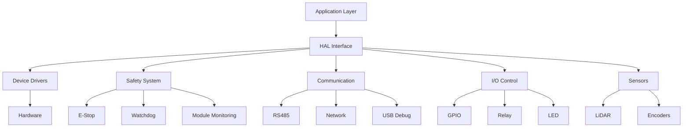

# HAL Architecture Documentation

**Phiên bản:** 1.0.0  
**Ngày cập nhật:** 2025-01-27  
**Team:** EMBED  
**Task:** EM-15 (HAL Architecture Documentation)

## Tổng quan

HAL (Hardware Abstraction Layer) cung cấp interface thống nhất cho việc tương tác với phần cứng trong hệ thống OHT-50 Master Module. HAL được thiết kế theo nguyên tắc modular, có khả năng mở rộng và tuân thủ các tiêu chuẩn an toàn SIL2.

## Cấu trúc thư mục

```
firmware/
├── include/02-HAL/
│   ├── hal_common.h          # Common definitions và types
│   ├── hal_watchdog.h        # Watchdog system interface
│   ├── hal_estop.h           # E-Stop safety interface
│   ├── hal_rs485.h           # RS485 communication interface
│   ├── hal_relay.h           # Relay control interface
│   ├── hal_gpio.h            # GPIO control interface
│   ├── hal_led.h             # LED status interface
│   ├── hal_network.h         # Network interface
│   ├── hal_lidar.h           # LiDAR sensor interface
│   ├── hal_usb_debug.h       # USB debug interface
│   ├── hal_config_persistence.h # Configuration persistence
│   └── hal_ota_update.h      # OTA update interface
├── src/02-HAL/
│   ├── 02-01-Communication/  # Communication drivers
│   ├── 02-02-IO-Devices/     # I/O device drivers
│   ├── 02-03-Sensors/        # Sensor drivers
│   ├── 02-04-Safety/         # Safety system drivers
│   └── 02-05-System/         # System drivers
└── tests/hal/                # HAL unit tests
```

## Kiến trúc tổng thể



## Safety System Architecture

### E-Stop System
- **Single channel hardware** với **software redundancy**
- **Module monitoring** để detect mất kết nối
- **Heartbeat mechanism** cho module communication
- **Response time** < 100ms

### Watchdog System
- **Software watchdog** với configurable timeout
- **Auto-feed mechanism** cho normal operation
- **Timeout callback** cho safety actions
- **Statistics tracking** cho monitoring

### Module Monitoring
- **Heartbeat registration** cho từng module
- **Communication timeout detection**
- **Health status tracking**
- **Automatic safety trigger** khi module mất kết nối

## Interface Design Principles

### 1. Consistency
- Tất cả HAL functions trả về `hal_status_t`
- Consistent naming convention: `hal_<module>_<function>`
- Standardized error codes và status enums

### 2. Safety First
- **Fail-safe design**: Mọi lỗi đều dẫn đến safe state
- **Redundancy**: Software redundancy cho critical functions
- **Timeout protection**: Tất cả operations có timeout
- **Error recovery**: Automatic error recovery mechanisms

### 3. Modularity
- **Independent modules**: Mỗi module có thể hoạt động độc lập
- **Clear interfaces**: Well-defined API boundaries
- **Loose coupling**: Minimal dependencies giữa modules

### 4. Performance
- **Minimal overhead**: Efficient implementation
- **Non-blocking operations**: Async operations khi có thể
- **Resource optimization**: Efficient memory và CPU usage

## Error Handling Strategy

### Error Categories
1. **HAL_STATUS_OK**: Operation successful
2. **HAL_STATUS_ERROR**: General error
3. **HAL_STATUS_INVALID_PARAMETER**: Invalid parameters
4. **HAL_STATUS_NOT_INITIALIZED**: Module not initialized
5. **HAL_STATUS_TIMEOUT**: Operation timeout
6. **HAL_STATUS_BUSY**: Resource busy
7. **HAL_STATUS_NOT_SUPPORTED**: Feature not supported
8. **HAL_STATUS_IO_ERROR**: I/O error
9. **HAL_STATUS_NO_MEMORY**: Memory allocation failed
10. **HAL_STATUS_INVALID_STATE**: Invalid state

### Error Recovery
- **Automatic retry**: Configurable retry mechanism
- **Graceful degradation**: Fallback to safe mode
- **Error logging**: Comprehensive error logging
- **Status reporting**: Real-time status reporting

## Configuration Management

### Configuration Structure
```c
typedef struct {
    uint32_t config_id;        // Configuration ID
    uint32_t version;          // Configuration version
    uint64_t timestamp_us;     // Configuration timestamp
    bool enabled;              // Device enabled
    uint32_t timeout_ms;       // Operation timeout
    uint32_t retry_count;      // Retry count
} hal_config_t;
```

### Configuration Persistence
- **File-based storage**: JSON/YAML configuration files
- **Version control**: Configuration versioning
- **Validation**: Configuration validation
- **Backup/restore**: Configuration backup mechanism

## Testing Strategy

### Unit Tests
- **Function-level testing**: Test từng HAL function
- **Error condition testing**: Test error scenarios
- **Boundary testing**: Test boundary conditions
- **Mock testing**: Mock hardware dependencies

### Integration Tests
- **Module integration**: Test module interactions
- **Safety system integration**: Test safety scenarios
- **End-to-end testing**: Test complete workflows
- **Performance testing**: Test performance requirements

### Test Coverage
- **Code coverage**: > 90% code coverage
- **Function coverage**: 100% function coverage
- **Error path coverage**: 100% error path coverage
- **Safety scenario coverage**: 100% safety scenario coverage

## Performance Requirements

### Response Times
- **E-Stop response**: < 100ms
- **Watchdog timeout**: Configurable (1-30s)
- **Module heartbeat**: < 2s
- **Communication timeout**: < 3s

### Resource Usage
- **Memory usage**: < 1MB cho HAL layer
- **CPU usage**: < 5% cho normal operation
- **Stack usage**: < 8KB per thread
- **Heap usage**: < 64KB total

## Safety Compliance

### SIL2 Requirements
- **Fail-safe operation**: Mọi lỗi đều dẫn đến safe state
- **Redundancy**: Software redundancy cho critical functions
- **Error detection**: Comprehensive error detection
- **Error reporting**: Real-time error reporting

### Safety Functions
- **E-Stop handling**: Emergency stop functionality
- **Watchdog monitoring**: System health monitoring
- **Module monitoring**: Module communication monitoring
- **Error recovery**: Automatic error recovery

## Development Guidelines

### Coding Standards
- **MISRA C:2012**: Tuân thủ MISRA C guidelines
- **AUTOSAR**: Tuân thủ AUTOSAR standards
- **Static analysis**: Sử dụng static analysis tools
- **Code review**: Mandatory code review

### Documentation
- **API documentation**: Complete API documentation
- **Design documentation**: Architecture design docs
- **User guides**: User operation guides
- **Maintenance guides**: Maintenance procedures

### Version Control
- **Semantic versioning**: Follow semantic versioning
- **Change tracking**: Track all changes
- **Release notes**: Comprehensive release notes
- **Backward compatibility**: Maintain backward compatibility

## Future Enhancements

### Planned Features
- **Real-time OS support**: RTOS integration
- **Multi-core support**: Multi-core architecture
- **Advanced diagnostics**: Advanced diagnostic features
- **Remote monitoring**: Remote monitoring capabilities

### Scalability
- **Modular expansion**: Easy module addition
- **Performance optimization**: Continuous optimization
- **Feature enhancement**: Feature enhancement roadmap
- **Technology updates**: Technology update planning

---

## Changelog

### v1.0.0 (2025-01-27)
- ✅ Initial HAL architecture design
- ✅ Safety system integration
- ✅ Watchdog system implementation
- ✅ Module monitoring system
- ✅ Comprehensive testing framework
- ✅ Documentation structure

---

**Lưu ý:** Tài liệu này cần được cập nhật khi có thay đổi trong kiến trúc HAL.
