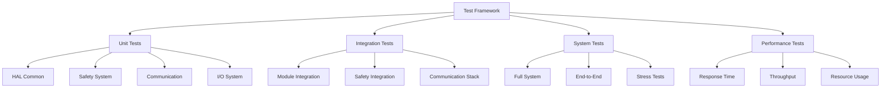
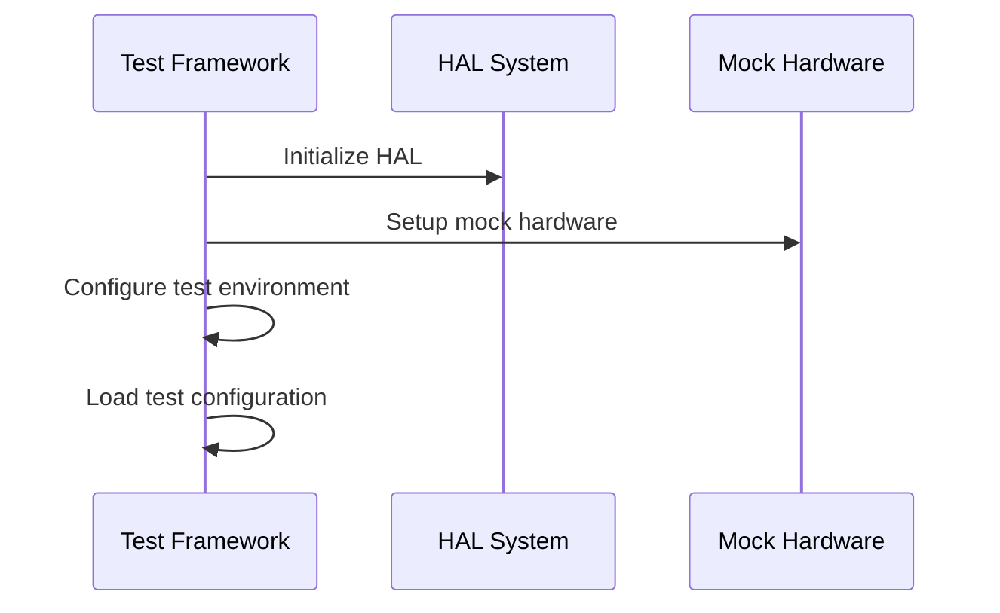
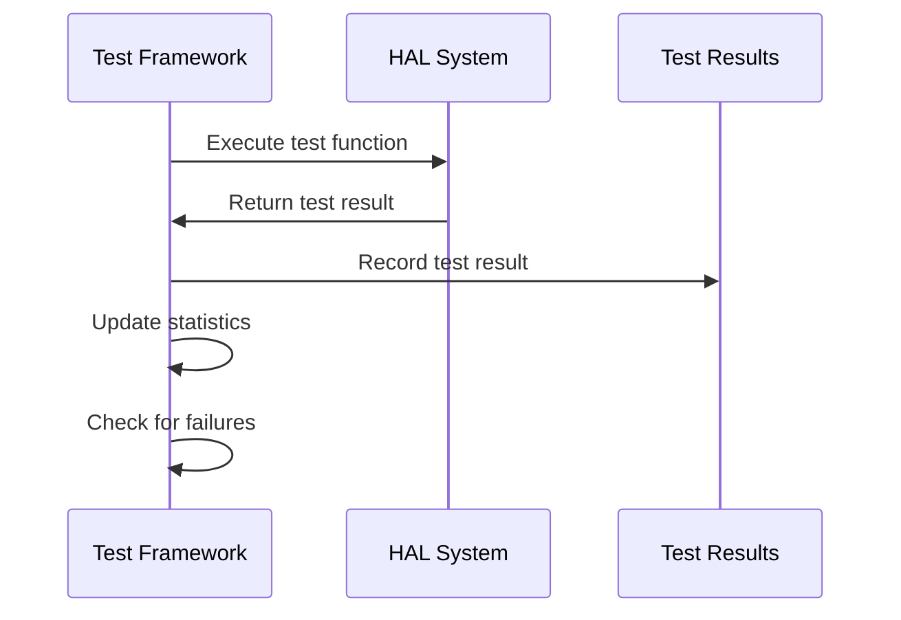
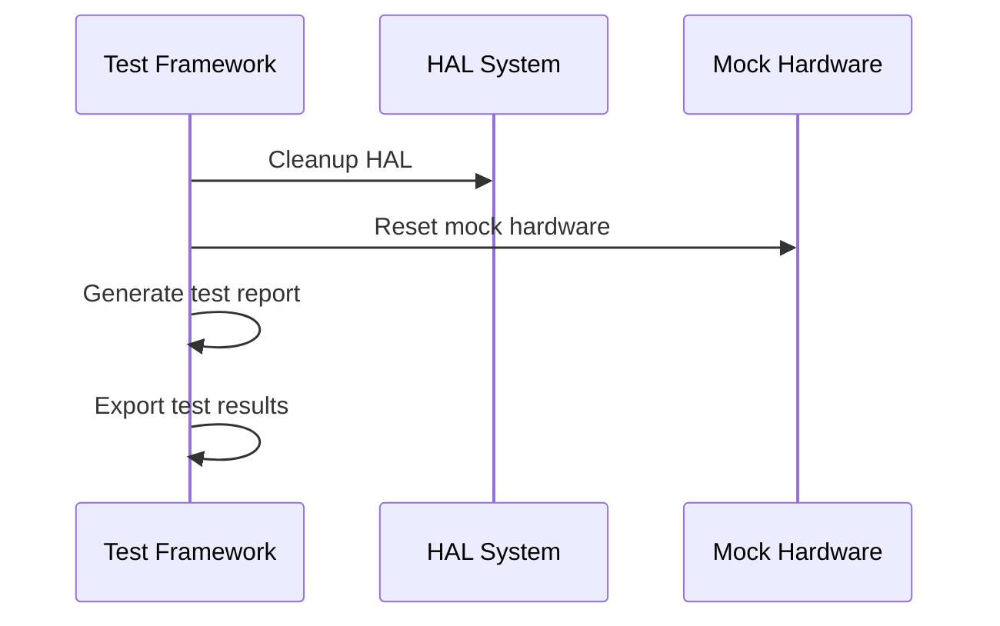

# Testing Strategy Documentation

**Phiên bản:** 1.0.0  
**Ngày cập nhật:** 2025-01-27  
**Team:** EMBED  
**Task:** EM-15 (Testing Strategy Documentation)

## Tổng quan

Testing Strategy cho hệ thống OHT-50 Master Module được thiết kế để đảm bảo chất lượng, độ tin cậy và tuân thủ các tiêu chuẩn an toàn SIL2. Strategy này bao gồm unit testing, integration testing, system testing và performance testing.

## Kiến trúc Testing

### **Testing Framework Architecture:**


### **Test Categories:**

#### **1. Unit Tests (TEST_LEVEL_UNIT)**
- **Mục tiêu:** Test từng function/module độc lập
- **Coverage:** > 90% code coverage
- **Scope:** Individual HAL functions, utility functions
- **Tools:** Custom test framework, assertion macros

#### **2. Integration Tests (TEST_LEVEL_INTEGRATION)**
- **Mục tiêu:** Test tương tác giữa các modules
- **Coverage:** 100% module interfaces
- **Scope:** Module communication, safety system integration
- **Tools:** Mock hardware, simulation environment

#### **3. System Tests (TEST_LEVEL_SYSTEM)**
- **Mục tiêu:** Test toàn bộ hệ thống
- **Coverage:** End-to-end workflows
- **Scope:** Complete system operation, safety scenarios
- **Tools:** Real hardware, test fixtures

#### **4. Performance Tests (TEST_LEVEL_PERFORMANCE)**
- **Mục tiêu:** Đảm bảo performance requirements
- **Coverage:** Response time, throughput, resource usage
- **Scope:** Critical performance paths
- **Tools:** Performance profiling, benchmarking

#### **5. Stress Tests (TEST_LEVEL_STRESS)**
- **Mục tiêu:** Test system behavior dưới stress
- **Coverage:** Boundary conditions, error scenarios
- **Scope:** High load, error injection
- **Tools:** Stress testing framework, fault injection

## Test Framework Design

### **Core Components:**

#### **1. Test Helpers (`test_helpers.h/c`)**
```c
// Test configuration
typedef struct {
    bool verbose_output;
    bool color_output;
    bool stop_on_failure;
    uint32_t timeout_ms;
    uint32_t retry_count;
    const char *log_file;
    test_level_t min_level;
    test_category_t categories[10];
    uint32_t category_count;
} test_config_t;

// Test result tracking
typedef struct {
    char name[TEST_MAX_NAME_LENGTH];
    char description[TEST_MAX_DESCRIPTION_LENGTH];
    test_status_t status;
    test_level_t level;
    test_category_t category;
    uint64_t start_time_us;
    uint64_t end_time_us;
    uint64_t duration_us;
    char error_message[TEST_MAX_ERROR_MESSAGE_LENGTH];
    uint32_t line_number;
    const char *file_name;
    const char *function_name;
} test_result_t;
```

#### **2. Assertion Macros**
```c
#define TEST_ASSERT(condition)
#define TEST_ASSERT_EQUAL(expected, actual)
#define TEST_ASSERT_STR_EQUAL(expected, actual)
#define TEST_ASSERT_NULL(ptr)
#define TEST_ASSERT_NOT_NULL(ptr)
#define TEST_ASSERT_STATUS(expected_status, actual_status)
```

#### **3. Test Execution Functions**
```c
bool test_run(const char *test_name, const char *description, bool (*test_func)(void));
bool test_run_with_timeout(const char *test_name, const char *description, bool (*test_func)(void), uint32_t timeout_ms);
void test_skip(const char *reason);
```

### **Test Categories:**

#### **1. Safety Tests (TEST_CATEGORY_SAFETY)**
- E-Stop functionality
- Watchdog timeout
- Module monitoring
- Safety system integration
- Error recovery

#### **2. Communication Tests (TEST_CATEGORY_COMMUNICATION)**
- RS485 communication
- Network interfaces
- USB debug interface
- Protocol validation
- Error handling

#### **3. I/O Tests (TEST_CATEGORY_IO)**
- GPIO control
- Relay operation
- LED status
- Sensor interfaces
- Interrupt handling

#### **4. Sensor Tests (TEST_CATEGORY_SENSORS)**
- LiDAR operation
- Encoder reading
- Sensor calibration
- Data validation
- Fault detection

#### **5. System Tests (TEST_CATEGORY_SYSTEM)**
- System initialization
- Configuration management
- OTA updates
- Logging system
- Error handling

## Testing Standards

### **Code Quality Standards:**

#### **1. Test Coverage Requirements**
- **Unit Tests:** > 90% code coverage
- **Function Coverage:** 100% function coverage
- **Branch Coverage:** > 80% branch coverage
- **Error Path Coverage:** 100% error path coverage

#### **2. Test Quality Standards**
- **Test Independence:** Mỗi test phải độc lập
- **Test Repeatability:** Tests phải chạy được nhiều lần
- **Test Clarity:** Test names và descriptions rõ ràng
- **Test Maintenance:** Tests dễ maintain và update

#### **3. Performance Standards**
- **Test Execution Time:** < 5 seconds cho unit tests
- **Memory Usage:** < 1MB cho test framework
- **Resource Cleanup:** Proper cleanup sau mỗi test

### **Safety Testing Standards:**

#### **1. SIL2 Compliance**
- **Fail-safe Testing:** Test tất cả fail-safe scenarios
- **Error Injection:** Inject errors để test error handling
- **Safety Validation:** Validate safety system behavior
- **Compliance Verification:** Verify SIL2 requirements

#### **2. Safety Test Scenarios**
- **E-Stop Trigger:** Test E-Stop functionality
- **Watchdog Timeout:** Test watchdog timeout handling
- **Module Failure:** Test module failure scenarios
- **Communication Loss:** Test communication failure
- **System Crash:** Test system crash recovery

## Test Execution Strategy

### **Test Execution Flow:**

#### **1. Pre-test Setup**


#### **2. Test Execution**


#### **3. Post-test Cleanup**


### **Test Execution Modes:**

#### **1. Development Mode**
- **Verbose Output:** Detailed test information
- **Color Output:** Color-coded test results
- **Stop on Failure:** Stop khi có test fail
- **Debug Information:** Additional debug info

#### **2. CI/CD Mode**
- **Minimal Output:** Essential information only
- **XML Reports:** Machine-readable reports
- **Coverage Reports:** Code coverage information
- **Performance Metrics:** Performance data

#### **3. Production Mode**
- **Silent Mode:** Minimal output
- **Log Files:** Detailed logging to files
- **Error Reporting:** Error reporting only
- **Performance Monitoring:** Performance tracking

## Test Data Management

### **Test Data Strategy:**

#### **1. Test Fixtures**
```c
// Test fixture setup
void test_fixture_setup(void) {
    // Initialize HAL modules for testing
    test_log_message("INFO", "Setting up test fixture");
}

// Test fixture teardown
void test_fixture_teardown(void) {
    // Cleanup HAL modules after testing
    test_log_message("INFO", "Tearing down test fixture");
}
```

#### **2. Mock Data**
```c
// Mock hardware simulation
void test_mock_init(void);
void test_mock_cleanup(void);
void test_mock_set_return_value(const char *function, int return_value);
void test_mock_verify_call(const char *function, int expected_calls);
```

#### **3. Test Data Validation**
- **Input Validation:** Validate test inputs
- **Output Validation:** Validate test outputs
- **State Validation:** Validate system state
- **Error Validation:** Validate error conditions

## Performance Testing

### **Performance Metrics:**

#### **1. Response Time Testing**
- **E-Stop Response:** < 100ms
- **Watchdog Timeout:** Configurable (1-30s)
- **Module Heartbeat:** < 2s
- **Communication Timeout:** < 3s

#### **2. Throughput Testing**
- **RS485 Communication:** > 115200 bps
- **Network Communication:** > 100 Mbps
- **Data Processing:** > 1000 operations/second
- **Log Generation:** > 1000 log entries/second

#### **3. Resource Usage Testing**
- **Memory Usage:** < 1MB cho HAL layer
- **CPU Usage:** < 5% cho normal operation
- **Stack Usage:** < 8KB per thread
- **Heap Usage:** < 64KB total

### **Performance Test Scenarios:**

#### **1. Load Testing**
- **Normal Load:** Normal operation conditions
- **High Load:** Maximum load conditions
- **Peak Load:** Peak performance conditions
- **Stress Load:** Beyond normal capacity

#### **2. Endurance Testing**
- **Long-term Operation:** 24/7 operation
- **Memory Leak Testing:** Memory usage over time
- **Resource Exhaustion:** Resource limit testing
- **Stability Testing:** System stability over time

## Error Handling Testing

### **Error Test Scenarios:**

#### **1. Hardware Error Simulation**
```c
// Simulate hardware errors
void test_io_simulate_fault(uint8_t pin);
void test_sensor_simulate_fault(uint32_t sensor_id);
void test_comm_simulate_error(void);
void test_system_simulate_crash(void);
```

#### **2. Communication Error Testing**
- **Network Timeout:** Network communication timeout
- **Protocol Errors:** Invalid protocol data
- **Connection Loss:** Connection interruption
- **Data Corruption:** Corrupted data handling

#### **3. System Error Testing**
- **Memory Allocation Failure:** Memory allocation errors
- **File System Errors:** File system failures
- **Configuration Errors:** Invalid configuration
- **Initialization Errors:** System initialization failures

## Test Reporting

### **Test Report Formats:**

#### **1. Console Output**
```
=== HAL Common Tests ===
Test Framework Version: 1.0.0
Date: Jan 27 2025

  [  1/ 14] Status String Conversion: [PASS] (1234 us)
  [  2/ 14] Device Status String Conversion: [PASS] (567 us)
  [  3/ 14] Device Type String Conversion: [PASS] (890 us)
  ...

=== Test Summary ===
Suite: HAL Common Tests
Description: Unit tests for hal_common functions
Total Tests: 14
Passed: 14
Failed: 0
Skipped: 0
Errors: 0
Total Duration: 45678 us (45.68 ms)
All tests passed!
```

#### **2. XML Report**
```xml
<?xml version="1.0" encoding="UTF-8"?>
<testsuite name="HAL Common Tests" tests="14" failures="0" errors="0" skipped="0" time="0.045678">
  <testcase name="Status String Conversion" classname="HAL Common" time="0.001234">
  </testcase>
  <testcase name="Device Status String Conversion" classname="HAL Common" time="0.000567">
  </testcase>
  ...
</testsuite>
```

#### **3. CSV Report**
```csv
Test Name,Status,Duration (us),Category,Level
Status String Conversion,PASS,1234,6,0
Device Status String Conversion,PASS,567,6,0
Device Type String Conversion,PASS,890,6,0
...
```

### **Test Statistics:**

#### **1. Coverage Statistics**
- **Code Coverage:** Percentage of code covered
- **Function Coverage:** Percentage of functions tested
- **Branch Coverage:** Percentage of branches tested
- **Line Coverage:** Percentage of lines executed

#### **2. Performance Statistics**
- **Average Test Time:** Average test execution time
- **Total Test Time:** Total test suite execution time
- **Memory Usage:** Memory usage during testing
- **CPU Usage:** CPU usage during testing

## Continuous Integration

### **CI/CD Integration:**

#### **1. Automated Testing**
- **Build Verification:** Test sau mỗi build
- **Code Review:** Test trước khi merge
- **Release Validation:** Test trước khi release
- **Regression Testing:** Test để detect regressions

#### **2. Test Automation**
- **Scheduled Testing:** Automated testing theo schedule
- **Trigger-based Testing:** Testing based on events
- **Parallel Testing:** Parallel test execution
- **Distributed Testing:** Distributed test execution

#### **3. Quality Gates**
- **Test Coverage Gate:** Minimum test coverage requirement
- **Performance Gate:** Performance requirement validation
- **Safety Gate:** Safety requirement validation
- **Quality Gate:** Overall quality assessment

## Maintenance and Evolution

### **Test Maintenance:**

#### **1. Test Updates**
- **API Changes:** Update tests khi API thay đổi
- **Feature Additions:** Add tests cho new features
- **Bug Fixes:** Update tests cho bug fixes
- **Refactoring:** Update tests cho code refactoring

#### **2. Test Optimization**
- **Performance Optimization:** Optimize test performance
- **Resource Optimization:** Optimize resource usage
- **Maintenance Optimization:** Reduce maintenance overhead
- **Execution Optimization:** Optimize test execution

#### **3. Framework Evolution**
- **Feature Enhancements:** Add new testing features
- **Tool Integration:** Integrate với external tools
- **Standard Compliance:** Ensure compliance với standards
- **Best Practices:** Follow testing best practices

---

## Changelog

### v1.0.0 (2025-01-27)
- ✅ Initial testing strategy design
- ✅ Test framework architecture
- ✅ Testing standards definition
- ✅ Performance testing strategy
- ✅ Error handling testing
- ✅ Test reporting framework
- ✅ CI/CD integration plan

---

**Lưu ý:** Testing Strategy này cần được cập nhật khi có thay đổi trong system architecture hoặc requirements.
