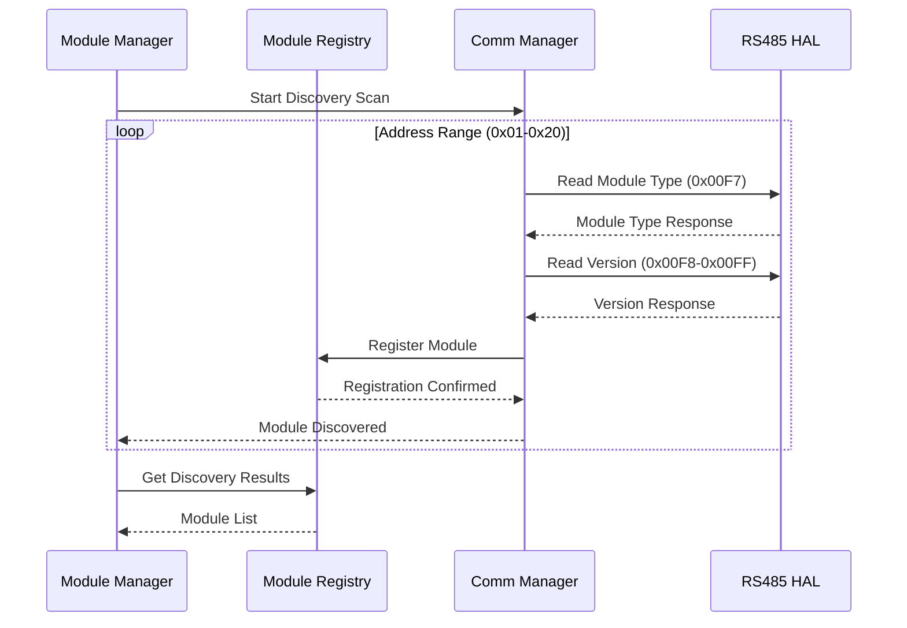

# MODULE DISCOVERY SYSTEM SPECIFICATION - OHT-50 Master Module

**Phiên bản:** v1.0.0  
**Ngày tạo:** 2025-01-28  
**Team:** FW Team  
**Trạng thái:** ✅ IMPLEMENTED (cơ bản)  
**Mục tiêu:** Định nghĩa chi tiết yêu cầu kỹ thuật và chức năng của Module Discovery system

---

## 🎯 **TỔNG QUAN**

### **Mục tiêu:**
- Tự động phát hiện và đăng ký các slave modules trên RS485 bus
- Hỗ trợ hot-swap capability cho modules
- Cung cấp real-time module status monitoring
- Đảm bảo reliable module identification và registration

### **Phạm vi:**
- Auto-discovery protocol implementation
- Module registry management
- Health monitoring và status tracking
- Event handling và notification system

---

## 🔧 **KIẾN TRÚC KỸ THUẬT**

### **1. Discovery Architecture**

#### **System Components:**
```
┌─────────────────────────────────────┐
│         Module Manager              │
│     (Discovery Coordinator)         │
├─────────────────────────────────────┤
│         Module Registry             │
│     (Module Database)              │
├─────────────────────────────────────┤
│      Communication Manager          │
│     (RS485/Modbus Interface)       │
├─────────────────────────────────────┤
│         RS485 HAL Layer             │
│     (Hardware Interface)           │
└─────────────────────────────────────┘
```

#### **Discovery Flow:**


### **2. Module Identification Protocol**

#### **2.1 Modbus Register Map (Standard)**
```c
// System Identification Registers (0x00F0-0x00FF)
#define MODULE_REG_DEVICE_ID             0x00F0  // Device ID
#define MODULE_REG_MODULE_TYPE           0x00F7  // Module Type
#define MODULE_REG_FIRMWARE_VERSION      0x00F8  // Firmware Version
#define MODULE_REG_HARDWARE_VERSION      0x00F9  // Hardware Version
#define MODULE_REG_SERIAL_NUMBER         0x00FA  // Serial Number
#define MODULE_REG_BUILD_DATE            0x00FB  // Build Date
#define MODULE_REG_CHECKSUM              0x00FF  // Register Checksum
```

#### **2.2 Module Type Definitions**
```c
// Module Type Enumeration
typedef enum {
    MODULE_TYPE_UNKNOWN = 0x0000,
    MODULE_TYPE_POWER = 0x0002,              // Power Management Module
    MODULE_TYPE_SAFETY = 0x0003,             // Safety & E-Stop Module
    MODULE_TYPE_TRAVEL_MOTOR = 0x0004,       // Travel Motor Control Module
    MODULE_TYPE_DOCK = 0x0005,               // Docking & Location Module
    MODULE_TYPE_LIFTER_MOTOR = 0x0006,       // Lifter Motor Module (Optional)
    MODULE_TYPE_CARGO_DOOR = 0x0007,         // Cargo Door Module (Optional)
    MODULE_TYPE_SAFETY_EXTENDED = 0x0008,    // Extended Safety Module (Optional)
    MODULE_TYPE_RFID_READER = 0x0009,        // RFID Reader Module (Plug-and-Play)
    MODULE_TYPE_CUSTOM_START = 0x000C,       // Custom Modules Start
    MODULE_TYPE_MAX = 0x00FF
} module_type_t;
```

---

## 📋 **YÊU CẦU CHỨC NĂNG**

### **1. Auto-Discovery Protocol**

#### **1.1 Discovery Algorithm**
```c
// Discovery Configuration
typedef struct {
    uint8_t start_address;           // Start address (default: 0x01)
    uint8_t end_address;             // End address (default: 0x20)
    uint32_t timeout_ms;             // Per-module timeout (default: 1000ms)
    uint32_t retry_count;            // Retry attempts (default: 3)
    uint32_t discovery_interval_ms;  // Discovery interval (default: 5000ms)
    bool auto_discovery_enabled;     // Auto-discovery enabled
    bool hot_swap_enabled;           // Hot-swap capability
} discovery_config_t;
```

#### **1.2 Discovery Process**
```c
// Discovery Process Steps
1. Initialize discovery scan
2. Scan address range (0x01-0x20)
3. For each address:
   a. Send Modbus read request (0x00F7)
   b. Validate module type response
   c. Read version information (0x00F8-0x00FF)
   d. Register module in registry
   e. Trigger discovery event
4. Update discovery statistics
5. Schedule next discovery cycle
```

#### **Yêu cầu:**
- ✅ **Address Scanning:** Scan 0x01-0x20 address range
- ✅ **Module Type Detection:** Read và validate module type
- ✅ **Version Reading:** Read firmware version information
- ✅ **Capability Detection:** Read module capabilities
- ✅ **Registration:** Auto-register discovered modules

### **2. Module Registry Management**

#### **2.1 Registry Structure**
```c
// Module Information Structure
typedef struct {
    uint8_t address;                 // Modbus/RS485 address
    module_type_t type;              // Module type
    char name[32];                   // Friendly name
    char version[16];                // Firmware version
    char serial_number[32];          // Serial number
    module_status_t status;          // Online/Offline status
    uint64_t last_seen_ms;           // Last seen timestamp
    uint32_t capabilities;           // Module capabilities bitmap
    uint32_t config_flags;           // Configuration flags
    uint8_t health_percentage;       // Health percentage (0-100)
} module_info_t;
```

#### **2.2 Registry Operations**
```c
// Registry Management Functions
int registry_init(void);
int registry_add_or_update(const module_info_t *info);
int registry_mark_online(uint8_t address, module_type_t type, const char *version);
int registry_mark_offline(uint8_t address);
int registry_get(uint8_t address, module_info_t *out);
int registry_get_all(module_info_t *out_array, size_t max_items, size_t *actual_count);
size_t registry_count_online(void);
bool registry_all_mandatory_online(void);
```

#### **Yêu cầu:**
- ✅ **Module Registration:** Add/update module information
- ✅ **Status Tracking:** Track online/offline status
- ✅ **Health Monitoring:** Monitor module health
- ✅ **Capability Management:** Track module capabilities
- ✅ **Event Notification:** Notify on status changes

### **3. Health Monitoring System**

#### **3.1 Health Check Protocol**
```c
// Health Check Configuration
typedef struct {
    uint32_t health_check_interval_ms;   // Health check interval
    uint32_t health_check_timeout_ms;    // Health check timeout
    uint32_t offline_timeout_ms;         // Offline timeout
    uint8_t health_threshold;            // Health threshold percentage
    bool auto_health_check_enabled;      // Auto health check enabled
} health_check_config_t;
```

#### **3.2 Health Assessment**
```c
// Health Assessment Criteria
typedef enum {
    MODULE_HEALTH_UNKNOWN = 0,
    MODULE_HEALTH_EXCELLENT,       // 100% healthy
    MODULE_HEALTH_GOOD,            // 80-99% healthy
    MODULE_HEALTH_FAIR,            // 60-79% healthy
    MODULE_HEALTH_POOR,            // 40-59% healthy
    MODULE_HEALTH_CRITICAL,        // 20-39% healthy
    MODULE_HEALTH_FAILED           // 0-19% healthy
} module_health_t;
```

#### **Yêu cầu:**
- ✅ **Periodic Health Checks:** Regular health monitoring
- ✅ **Response Time Monitoring:** Track response times
- ✅ **Error Rate Tracking:** Monitor error rates
- ✅ **Health Assessment:** Calculate health percentage
- ✅ **Health Thresholds:** Configurable health thresholds

### **4. Event Handling System**

#### **4.1 Module Events**
```c
// Module Event Types
typedef enum {
    MODULE_EVENT_NONE = 0,
    MODULE_EVENT_DISCOVERED,       // New module discovered
    MODULE_EVENT_REGISTERED,       // Module registered successfully
    MODULE_EVENT_ONLINE,           // Module came online
    MODULE_EVENT_OFFLINE,          // Module went offline
    MODULE_EVENT_ERROR,            // Module error detected
    MODULE_EVENT_WARNING,          // Module warning detected
    MODULE_EVENT_HEALTH_CHANGE,    // Module health changed
    MODULE_EVENT_CONFIG_CHANGE,    // Module configuration changed
    MODULE_EVENT_UPDATED,          // Module updated
    MODULE_EVENT_TIMEOUT,          // Module timeout
    MODULE_EVENT_MAX
} module_event_t;
```

#### **4.2 Event Callback System**
```c
// Event Callback Function
typedef void (*module_event_callback_t)(module_event_t event, uint8_t module_id, const void *data);

// Event Registration
hal_status_t module_manager_set_callback(module_event_callback_t callback);
```

#### **Yêu cầu:**
- ✅ **Event Detection:** Detect module events
- ✅ **Event Notification:** Notify registered callbacks
- ✅ **Event Logging:** Log all module events
- ✅ **Event Filtering:** Filter events by type
- ✅ **Event History:** Maintain event history

---

## 🔒 **YÊU CẦU AN TOÀN**

### **1. Thread Safety**
- ✅ **Mutex Protection:** All registry operations protected
- ✅ **Atomic Updates:** Atomic module status updates
- ✅ **Deadlock Prevention:** Proper mutex ordering
- ✅ **Resource Management:** Proper resource cleanup

### **2. Error Recovery**
- ✅ **Graceful Degradation:** Continue operation on errors
- ✅ **Automatic Recovery:** Self-healing mechanisms
- ✅ **Error Isolation:** Prevent error propagation
- ✅ **Safe Defaults:** Safe default values

### **3. Data Integrity**
- ✅ **Data Validation:** Validate all module data
- ✅ **Consistency Checking:** Ensure data consistency
- ✅ **Backup Mechanisms:** Backup critical data
- ✅ **Recovery Procedures:** Data recovery procedures

---

## 📊 **YÊU CẦU HIỆU NĂNG**

### **1. Discovery Performance**
```c
// Performance Requirements
#define DISCOVERY_MAX_ADDRESSES       32      // Maximum addresses to scan
#define DISCOVERY_TIMEOUT_MS          1000    // Per-module timeout
#define DISCOVERY_RETRY_COUNT         3       // Retry attempts
#define DISCOVERY_INTERVAL_MS         5000    // Discovery interval
#define HEALTH_CHECK_INTERVAL_MS      10000   // Health check interval
```

### **2. Response Time Requirements**
- **Discovery Scan:** < 5 seconds for full scan
- **Module Registration:** < 100ms per module
- **Health Check:** < 500ms per module
- **Event Notification:** < 10ms event delivery

### **3. Reliability Requirements**
- **Discovery Accuracy:** 99.9% accurate module detection
- **False Positive Rate:** < 0.1% false positives
- **False Negative Rate:** < 0.1% false negatives
- **Uptime:** 99.9% system availability

---

## 🔧 **CONFIGURATION MANAGEMENT**

### **1. Discovery Configuration**
```c
// Discovery Configuration Structure
typedef struct {
    uint8_t start_address;           // Start address
    uint8_t end_address;             // End address
    uint32_t timeout_ms;             // Timeout per module
    uint32_t retry_count;            // Retry count
    uint32_t discovery_interval_ms;  // Discovery interval
    bool auto_discovery_enabled;     // Auto-discovery enabled
    bool hot_swap_enabled;           // Hot-swap enabled
    uint32_t health_check_interval_ms; // Health check interval
    uint32_t offline_timeout_ms;     // Offline timeout
} discovery_config_t;
```

### **2. Module Configuration**
```c
// Module Configuration Structure
typedef struct {
    uint8_t module_id;               // Module ID
    uint32_t discovery_timeout_ms;   // Discovery timeout
    uint32_t health_check_interval_ms; // Health check interval
    uint32_t response_timeout_ms;    // Response timeout
    uint32_t retry_count;            // Retry count
    uint32_t config_flags;           // Configuration flags
} module_config_t;
```

### **3. Configuration Persistence**
- ✅ **Configuration Storage:** Persistent configuration storage
- ✅ **Configuration Loading:** Load configuration on startup
- ✅ **Configuration Validation:** Validate configuration data
- ✅ **Configuration Backup:** Backup configuration data

---

## 🧪 **TESTING REQUIREMENTS**

### **1. Unit Testing**
- ✅ **Discovery Algorithm:** Test discovery algorithm
- ✅ **Registry Operations:** Test registry operations
- ✅ **Health Monitoring:** Test health monitoring
- ✅ **Event Handling:** Test event handling

### **2. Integration Testing**
- ✅ **Hardware Integration:** Test with actual modules
- ✅ **Protocol Testing:** Test Modbus protocol
- ✅ **Multi-module Testing:** Test with multiple modules
- ✅ **Stress Testing:** Test under load conditions

### **3. Validation Testing**
- ✅ **Discovery Accuracy:** Test discovery accuracy
- ✅ **Performance Testing:** Test performance requirements
- ✅ **Reliability Testing:** Test long-term reliability
- ✅ **Error Handling:** Test error conditions

---

## 📚 **DOCUMENTATION REQUIREMENTS**

### **1. API Documentation**
- ✅ **Function Documentation:** Complete function documentation
- ✅ **Parameter Documentation:** Parameter descriptions
- ✅ **Return Value Documentation:** Return value descriptions
- ✅ **Error Code Documentation:** Error code descriptions

### **2. Usage Examples**
- ✅ **Basic Usage:** Basic usage examples
- ✅ **Advanced Usage:** Advanced usage examples
- ✅ **Error Handling:** Error handling examples
- ✅ **Best Practices:** Best practices documentation

### **3. Troubleshooting Guide**
- ✅ **Common Issues:** Common issues và solutions
- ✅ **Debug Procedures:** Debug procedures
- ✅ **Performance Tuning:** Performance tuning guide
- ✅ **Maintenance Procedures:** Maintenance procedures

---

## 🔄 **MAINTENANCE & SUPPORT**

### **1. Version Management**
- ✅ **Version Control:** Proper version control
- ✅ **Backward Compatibility:** Maintain backward compatibility
- ✅ **Migration Guide:** Provide migration guides
- ✅ **Deprecation Policy:** Clear deprecation policy

### **2. Support Requirements**
- ✅ **Technical Support:** Technical support procedures
- ✅ **Bug Reporting:** Bug reporting procedures
- ✅ **Feature Requests:** Feature request procedures
- ✅ **Documentation Updates:** Documentation update procedures

---

## 📋 **IMPLEMENTATION STATUS**

### **✅ COMPLETED FEATURES:**
- ✅ Auto-discovery algorithm implementation
- ✅ Module registry management
- ✅ Health monitoring system
- ✅ Event handling system
- ✅ Thread-safe operations
- ✅ Configuration management
- ✅ Error handling và recovery
- ✅ Statistics collection
- ✅ Module type detection
- ✅ Version reading

### **⚠️ PARTIALLY IMPLEMENTED:**
- ⚠️ Advanced health assessment
- ⚠️ Performance optimization
- ⚠️ Comprehensive testing
- ⚠️ Advanced monitoring

### **❌ NOT IMPLEMENTED:**
- ❌ Advanced analytics
- ❌ Performance profiling
- ❌ Advanced debugging tools
- ❌ Comprehensive documentation

---

## 🎯 **KẾT LUẬN**

### **Trạng thái hiện tại:** ✅ **IMPLEMENTED (cơ bản)**

**Điểm mạnh:**
- ✅ Core discovery functionality hoàn thiện
- ✅ Module registry management
- ✅ Health monitoring system
- ✅ Event handling system
- ✅ Thread-safe implementation

**Cần cải thiện:**
- ⚠️ Advanced health assessment
- ⚠️ Performance optimization
- ⚠️ Comprehensive testing
- ⚠️ Advanced monitoring

**Khuyến nghị:**
1. **Ưu tiên testing** - Complete comprehensive testing
2. **Performance optimization** - Optimize discovery performance
3. **Advanced monitoring** - Add advanced monitoring features
4. **Documentation** - Complete API documentation

---

**📅 Next Review:** Sau khi hoàn thành testing phase  
**👥 Responsible:** FW Team  
**📊 Success Metrics:** 100% test coverage, < 5s discovery time, 99.9% accuracy
