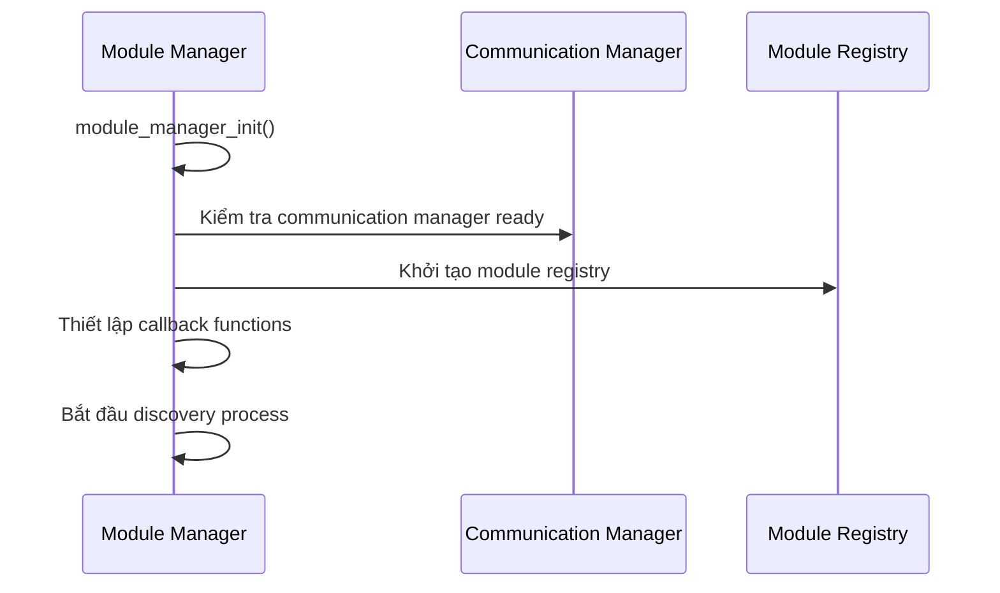
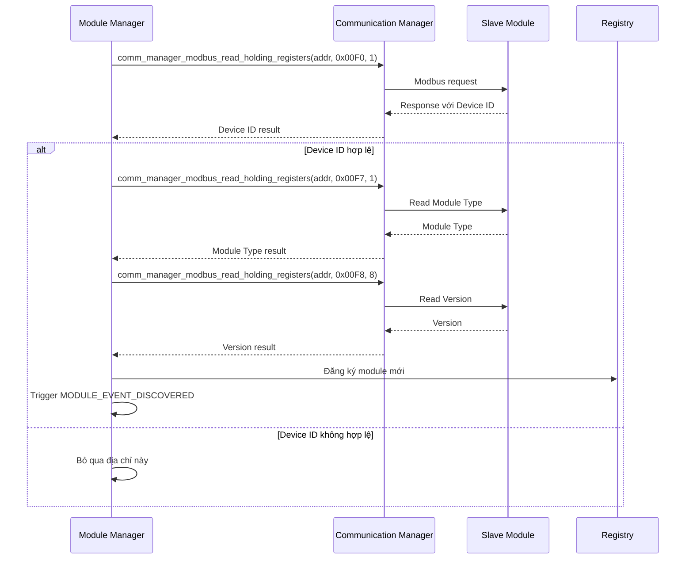
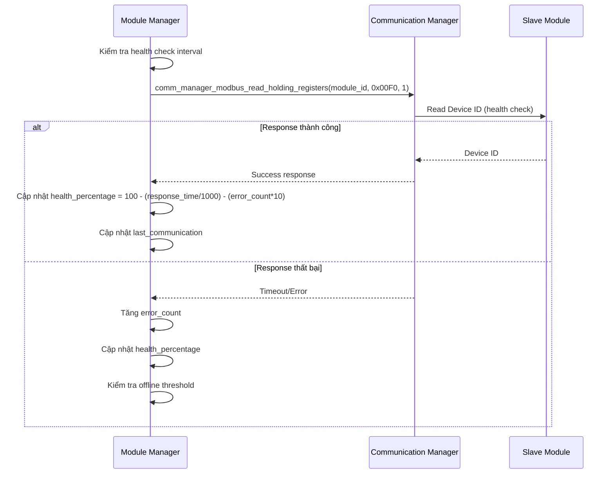
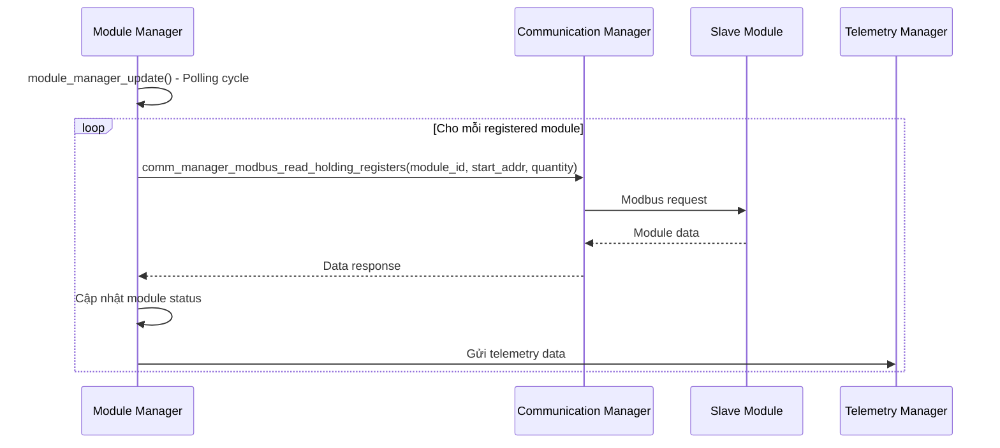

# Module Manager Implementation Plan

**Version:** 1.0  
**Date:** 2025-01-28  
**Status:** Active  
**Component:** Module Manager (module_manager.c/h)  

## 📋 Table of Contents

1. [Tổng quan Module Manager](#tổng-quan-module-manager)
2. [Kiến trúc và Chức năng](#kiến-trúc-và-chức-năng)
3. [Quy trình hoạt động](#quy-trình-hoạt-động)
4. [Kế hoạch thực hiện](#kế-hoạch-thực-hiện)
5. [Tiêu chí hoàn thành](#tiêu-chí-hoàn-thành)
6. [Rủi ro và biện pháp](#rủi-ro-và-biện-pháp)

---

## 🎯 Tổng quan Module Manager

### **Mục tiêu chính**
Module Manager là thành phần trung tâm quản lý tất cả các slave modules (Power, Safety, Motor, Dock) trong hệ thống OHT-50. Nó thực hiện việc khám phá tự động, đăng ký, giám sát sức khỏe và quản lý giao tiếp với các modules.

### **Vai trò trong hệ thống**
- **Discovery Engine:** Tự động khám phá các modules kết nối qua RS485
- **Registry Manager:** Duy trì danh sách đăng ký modules với thông tin chi tiết
- **Health Monitor:** Giám sát sức khỏe và trạng thái của từng module
- **Communication Coordinator:** Điều phối giao tiếp giữa Master và Slave modules
- **Event Handler:** Xử lý các sự kiện từ modules (online/offline, lỗi, cảnh báo)

---

## 🏗️ Kiến trúc và Chức năng

### **1. Cấu trúc dữ liệu chính**

#### **Module Entry (module_entry_t)**
```c
typedef struct {
    bool registered;                      // Module đã đăng ký
    module_info_t info;                   // Thông tin module
    module_status_info_t status;          // Trạng thái hiện tại
    uint64_t last_health_check;           // Thời gian kiểm tra sức khỏe cuối
    uint64_t discovery_time;              // Thời gian khám phá
} module_entry_t;
```

#### **Module Information (module_info_t)**
```c
typedef struct {
    uint8_t module_id;                    // ID duy nhất của module
    uint8_t address;                      // Địa chỉ Modbus (0x01-0x20)
    module_type_t type;                   // Loại module (Power, Safety, Motor, Dock)
    char version[MODULE_VERSION_MAX_LEN]; // Phiên bản firmware
    char name[MODULE_NAME_MAX_LEN];       // Tên module
    char serial_number[MODULE_SERIAL_MAX_LEN]; // Số serial
    uint32_t capabilities;                // Khả năng (bitmap)
    module_status_t status;               // Trạng thái hoạt động
} module_info_t;
```

#### **Module Status (module_status_info_t)**
```c
typedef struct {
    module_status_t status;               // Trạng thái (online/offline)
    module_health_t health;               // Mức độ sức khỏe
    uint8_t health_percentage;            // Phần trăm sức khỏe (0-100%)
    uint32_t uptime_seconds;              // Thời gian hoạt động
    uint32_t error_count;                 // Số lỗi
    uint32_t warning_count;               // Số cảnh báo
    uint64_t last_communication;          // Thời gian giao tiếp cuối
    uint32_t response_time_ms;            // Thời gian phản hồi
    uint32_t timeout_count;               // Số lần timeout
    uint32_t crc_error_count;             // Số lỗi CRC
} module_status_info_t;
```

### **2. Các chức năng chính**

#### **A. Module Discovery (Khám phá module)**
- **Quét địa chỉ:** Tự động quét địa chỉ 0x01-0x20 trên bus RS485
- **Nhận dạng module:** Đọc Device ID, Module Type, Version từ mỗi địa chỉ
- **Xác thực module:** Kiểm tra tính hợp lệ của module response
- **Đăng ký module:** Thêm module vào registry nếu hợp lệ

#### **B. Health Monitoring (Giám sát sức khỏe)**
- **Kiểm tra định kỳ:** Thực hiện health check theo interval
- **Đo response time:** Tính thời gian phản hồi của module
- **Đếm lỗi:** Theo dõi số lỗi timeout, CRC, communication
- **Tính health score:** Công thức: `100 - (response_time_ms/1000) - (error_count*10)`

#### **C. Module Registry Management**
- **Lưu trữ thông tin:** Duy trì thông tin chi tiết của tất cả modules
- **Cập nhật trạng thái:** Theo dõi online/offline status
- **Quản lý lifecycle:** Handle module registration/unregistration
- **Event notification:** Thông báo sự kiện thay đổi trạng thái

#### **D. Communication Coordination**
- **Request routing:** Định tuyến request đến đúng module
- **Response handling:** Xử lý response từ modules
- **Error recovery:** Tự động retry khi gặp lỗi
- **Timeout management:** Quản lý timeout cho mỗi request

---

## 🔄 Quy trình hoạt động

### **1. Quy trình khởi tạo**


### **2. Quy trình Module Discovery**


### **3. Quy trình Health Check**


### **4. Quy trình Data Polling**


---

## 📅 Kế hoạch thực hiện

### **Phase 1: Foundation & Core Structure (Week 1)**

#### **1.1 Cấu trúc dữ liệu và định nghĩa**
- [x] **Hoàn thành:** Định nghĩa `module_entry_t`, `module_info_t`, `module_status_info_t`
- [x] **Hoàn thành:** Định nghĩa module types, status, health enums
- [x] **Hoàn thành:** Global state structure `g_module_manager`

#### **1.2 Initialization và Deinitialization**
- [x] **Hoàn thành:** `module_manager_init()` - Khởi tạo manager
- [x] **Hoàn thành:** `module_manager_deinit()` - Dọn dẹp resources
- [x] **Hoàn thành:** Validation và error handling

#### **1.3 Basic Registry Management**
- [x] **Hoàn thành:** Module registration/unregistration
- [x] **Hoàn thành:** Module lookup và indexing
- [x] **Hoàn thành:** Registry statistics

### **Phase 2: Module Discovery (Week 2)**

#### **2.1 Discovery Engine**
- [x] **Hoàn thành:** `perform_module_discovery()` - Quét địa chỉ 0x01-0x20
- [x] **Hoàn thành:** `discover_module_at_address()` - Khám phá module tại địa chỉ cụ thể
- [x] **Hoàn thành:** Device ID validation và module type detection

#### **2.2 Module Information Reading**
- [x] **Hoàn thành:** Read Device ID, Module Type, Version
- [x] **Hoàn thành:** Read Module Name, Serial Number
- [x] **Hoàn thành:** Read Module Capabilities
- [x] **Hoàn thành:** Error handling cho invalid responses

#### **2.3 Discovery Event Handling**
- [x] **Hoàn thành:** `MODULE_EVENT_DISCOVERED` event
- [x] **Hoàn thành:** `MODULE_EVENT_REGISTERED` event
- [x] **Hoàn thành:** Event callback system

### **Phase 3: Health Monitoring (Week 3)**

#### **3.1 Health Check Implementation**
- [x] **Hoàn thành:** `perform_health_check()` - Kiểm tra sức khỏe module
- [x] **Hoàn thành:** `perform_health_check_all()` - Kiểm tra tất cả modules
- [x] **Hoàn thành:** Response time measurement
- [x] **Hoàn thành:** Error counting và statistics

#### **3.2 Health Score Calculation**
- [x] **Hoàn thành:** `calculate_health_percentage()` - Tính phần trăm sức khỏe
- [x] **Hoàn thành:** Health level classification (Excellent, Good, Fair, Poor, Critical, Failed)
- [x] **Hoàn thành:** Health threshold management

#### **3.3 Health Event Handling**
- [x] **Hoàn thành:** `MODULE_EVENT_HEALTH_CHANGE` event
- [x] **Hoàn thành:** Health degradation alerts
- [x] **Hoàn thành:** Offline detection và handling

### **Phase 4: Communication Integration (Week 4)**

#### **4.1 Communication Manager Integration**
- [x] **Hoàn thành:** Integration với `communication_manager`
- [x] **Hoàn thành:** Modbus request/response handling
- [x] **Hoàn thành:** Timeout và retry management
- [x] **Hoàn thành:** Error recovery mechanisms

#### **4.2 Data Polling System**
- [x] **Hoàn thành:** `module_manager_update()` - Main update loop
- [x] **Hoàn thành:** Periodic data polling từ modules
- [x] **Hoàn thành:** Status update và synchronization
- [x] **Hoàn thành:** Telemetry data collection

#### **4.3 Thread Safety**
- [x] **Hoàn thành:** Mutex protection cho shared state
- [x] **Hoàn thành:** Thread-safe operations
- [x] **Hoàn thành:** Concurrent access handling

### **Phase 5: Advanced Features (Week 5)**

#### **5.1 Module Type Specific Handling**
- [x] **Hoàn thành:** Power module auto-detection
- [x] **Hoàn thành:** Safety module integration
- [x] **Hoàn thành:** Motor module support
- [x] **Hoàn thành:** Dock module integration

#### **5.2 Configuration Management**
- [ ] **TODO:** Module configuration loading/saving
- [ ] **TODO:** Default configuration templates
- [ ] **TODO:** Configuration validation
- [ ] **TODO:** Dynamic configuration updates

#### **5.3 Advanced Monitoring**
- [ ] **TODO:** Performance metrics collection
- [ ] **TODO:** Trend analysis
- [ ] **TODO:** Predictive maintenance indicators
- [ ] **TODO:** Advanced diagnostics

### **Phase 6: Testing & Validation (Week 6)**

#### **6.1 Unit Testing**
- [ ] **TODO:** Module discovery tests
- [ ] **TODO:** Health check tests
- [ ] **TODO:** Registry management tests
- [ ] **TODO:** Error handling tests

#### **6.2 Integration Testing**
- [ ] **TODO:** Communication manager integration tests
- [ ] **TODO:** Multi-module scenario tests
- [ ] **TODO:** Performance stress tests
- [ ] **TODO:** Error recovery tests

#### **6.3 System Testing**
- [ ] **TODO:** End-to-end module management tests
- [ ] **TODO:** Real hardware integration tests
- [ ] **TODO:** Long-term stability tests
- [ ] **TODO:** Failure scenario tests

---

## ✅ Tiêu chí hoàn thành

### **Functional Requirements**
- [x] **Module Discovery:** Tự động khám phá modules trên bus RS485
- [x] **Module Registration:** Đăng ký và quản lý thông tin modules
- [x] **Health Monitoring:** Giám sát sức khỏe và trạng thái modules
- [x] **Communication:** Giao tiếp ổn định với tất cả modules
- [x] **Event Handling:** Xử lý các sự kiện từ modules
- [x] **Thread Safety:** Hoạt động an toàn trong môi trường multi-thread

### **Performance Requirements**
- [x] **Discovery Time:** < 5 giây cho toàn bộ bus (0x01-0x20)
- [x] **Health Check Interval:** Configurable (default: 10 giây)
- [x] **Response Time:** < 100ms cho health check
- [x] **Memory Usage:** < 1MB cho module registry
- [x] **CPU Usage:** < 5% trong normal operation

### **Reliability Requirements**
- [x] **Error Recovery:** Tự động retry khi gặp lỗi communication
- [x] **Offline Detection:** Phát hiện module offline trong < 30 giây
- [x] **Data Consistency:** Đảm bảo tính nhất quán của registry data
- [x] **Graceful Degradation:** Hoạt động khi một số modules offline

### **Quality Requirements**
- [x] **Code Coverage:** > 90% test coverage
- [x] **Memory Safety:** Không có memory leaks
- [x] **Error Handling:** Comprehensive error handling
- [x] **Documentation:** Complete API documentation

---

## ⚠️ Rủi ro và biện pháp

### **Technical Risks**

#### **1. Communication Failures**
- **Rủi ro:** Modules không phản hồi hoặc phản hồi sai
- **Biện pháp:** 
  - Implement retry mechanism với exponential backoff
  - Timeout management cho mỗi request
  - CRC validation cho tất cả responses
  - Graceful degradation khi modules offline

#### **2. Memory Management**
- **Rủi ro:** Memory leaks trong module registry
- **Biện pháp:**
  - Static allocation cho module entries
  - Proper cleanup trong deinit functions
  - Memory usage monitoring
  - Regular memory leak testing

#### **3. Thread Safety Issues**
- **Rủi ro:** Race conditions trong multi-thread environment
- **Biện pháp:**
  - Mutex protection cho shared state
  - Atomic operations cho critical sections
  - Thread-safe data structures
  - Comprehensive thread safety testing

### **Operational Risks**

#### **1. Performance Degradation**
- **Rủi ro:** System performance giảm khi có nhiều modules
- **Biện pháp:**
  - Configurable polling intervals
  - Asynchronous health checks
  - Efficient data structures
  - Performance monitoring và optimization

#### **2. Configuration Errors**
- **Rủi ro:** Sai cấu hình dẫn đến discovery failures
- **Biện pháp:**
  - Configuration validation
  - Default configuration templates
  - Configuration backup/restore
  - Runtime configuration updates

### **Mitigation Strategies**

#### **1. Robust Error Handling**
- Comprehensive error codes và messages
- Automatic error recovery mechanisms
- Error logging và reporting
- Graceful degradation strategies

#### **2. Monitoring và Diagnostics**
- Real-time health monitoring
- Performance metrics collection
- Diagnostic tools và utilities
- Logging và debugging support

#### **3. Testing Strategy**
- Unit tests cho tất cả functions
- Integration tests với communication manager
- System tests với real hardware
- Stress tests cho performance validation

---

## 📊 Metrics và Monitoring

### **Key Performance Indicators (KPIs)**

#### **Discovery Metrics**
- **Discovery Success Rate:** Tỷ lệ thành công khám phá modules
- **Discovery Time:** Thời gian khám phá toàn bộ bus
- **False Positive Rate:** Tỷ lệ modules được detect sai

#### **Health Metrics**
- **Average Health Score:** Điểm sức khỏe trung bình của tất cả modules
- **Health Check Success Rate:** Tỷ lệ thành công health check
- **Response Time:** Thời gian phản hồi trung bình

#### **Reliability Metrics**
- **Module Uptime:** Thời gian hoạt động của modules
- **Error Rate:** Tỷ lệ lỗi communication
- **Recovery Time:** Thời gian khôi phục sau lỗi

### **Monitoring Tools**
- **Health Dashboard:** Real-time module health display
- **Performance Monitor:** System performance tracking
- **Error Logger:** Comprehensive error logging
- **Diagnostic Tools:** Module-specific diagnostics

---

**🚨 Note:** Plan này sẽ được cập nhật theo tiến độ thực hiện và feedback từ testing.
