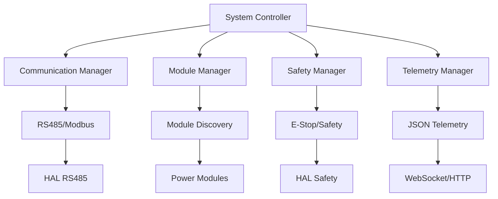
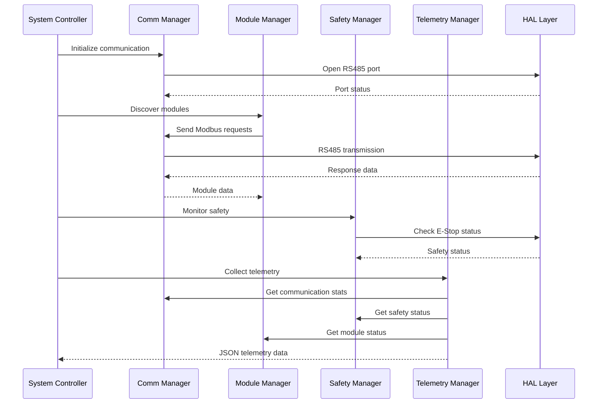

# OHT-50 Firmware Managers Documentation

**Version:** 1.0  
**Date:** 2025-01-28  
**Status:** Active  

## Table of Contents

1. [Overview](#overview)
2. [Architecture](#architecture)
3. [Manager Components](#manager-components)
4. [API Reference](#api-reference)
5. [Diagnostics & Troubleshooting](#diagnostics--troubleshooting)
6. [Integration Guide](#integration-guide)
7. [Performance Monitoring](#performance-monitoring)
8. [Safety Considerations](#safety-considerations)

---

## Overview

The OHT-50 firmware managers provide a modular, thread-safe architecture for handling communication, module management, safety systems, and telemetry. This document provides comprehensive documentation for all manager components.

### Key Features

- **Thread-Safe Operations:** All managers use mutex protection for shared state
- **HAL Integration:** Proper integration with Hardware Abstraction Layer
- **Memory Management:** Automatic cleanup and leak prevention
- **Error Recovery:** Comprehensive error handling and recovery mechanisms
- **Real-time Communication:** Modbus/RS485 communication with slave modules
- **Safety Compliance:** E-Stop and safety circuit monitoring

---

## Architecture

### Manager Hierarchy



### Data Flow



---

## Manager Components

### 1. Communication Manager (`communication_manager.c`)

**Purpose:** Handles RS485/Modbus communication with slave modules

**Key Features:**
- Modbus RTU protocol implementation
- Thread-safe request/response handling
- Automatic retry and timeout management
- Statistics tracking and monitoring
- Event callback system

**Configuration:**
```c
typedef struct {
    uint8_t slave_id;           // 1-247
    uint16_t start_address;     // Register address
    uint16_t quantity;          // Number of registers
    uint32_t timeout_ms;        // Response timeout
} comm_mgr_config_t;
```

**Thread Safety:**
- Uses `pthread_mutex_t g_comm_manager_mutex`
- Protects: `waiting_for_response`, `response_timeout`, `event_callback`, statistics
- Lock macros: `COMM_LOCK()` / `COMM_UNLOCK()`

### 2. Module Manager (`module_manager.c`)

**Purpose:** Manages module discovery, health monitoring, and communication

**Key Features:**
- Automatic module discovery (addresses 0x01-0x20)
- Health monitoring with response time tracking
- Module registration and status tracking
- Power module auto-detection
- Bounds checking and validation

**Module Types:**
- Power Modules (auto-detected)
- Safety Modules
- Motor Control Modules
- Dock Modules

**Health Check Algorithm:**
```c
health_percentage = 100 - (response_time_ms / 1000) - (error_count * 10);
if (health_percentage < 0) health_percentage = 0;
```

### 3. Safety Manager (`safety_manager.c`)

**Purpose:** Manages E-Stop, safety circuits, and emergency procedures

**Key Features:**
- E-Stop button monitoring
- Safety circuit validation
- Emergency stop procedures
- Fault detection and reporting
- LED status indicators

**Safety States:**
- `SAFETY_STATE_NORMAL`: System operational
- `SAFETY_STATE_ESTOP`: Emergency stop activated
- `SAFETY_STATE_FAULT`: Safety fault detected
- `SAFETY_STATE_MAINTENANCE`: Maintenance mode

**E-Stop Response Time:** < 100ms

### 4. Telemetry Manager (`telemetry_manager.c`)

**Purpose:** Collects and serializes system telemetry data

**Key Features:**
- Real-time data collection from all managers
- JSON serialization with buffer overflow protection
- System status monitoring
- Location and navigation data
- Dock status tracking

**Telemetry Categories:**
- System Status
- Location Data
- Navigation Data
- Dock Status
- Safety Status
- Communication Statistics

**JSON Structure:**
```json
{
  "timestamp": 1234567890,
  "system": {
    "status": "operational",
    "uptime": 3600,
    "version": "1.0.0"
  },
  "location": {
    "x": 100.5,
    "y": 200.3,
    "heading": 45.0
  },
  "safety": {
    "estop": false,
    "circuit_ok": true,
    "faults": []
  }
}
```

---

## API Reference

### Communication Manager API

#### Initialization
```c
hal_status_t comm_manager_init(const comm_mgr_config_t* config);
```
- **Parameters:** `config` - Communication configuration
- **Returns:** `HAL_STATUS_OK` on success
- **Thread Safety:** Yes

#### Modbus Operations
```c
hal_status_t comm_manager_modbus_read_holding_registers(
    uint8_t slave_id, uint16_t start_address, 
    uint16_t quantity, uint16_t* data);
```
- **Parameters:** 
  - `slave_id`: 1-247
  - `start_address`: Register address
  - `quantity`: Number of registers (1-125)
  - `data`: Output buffer
- **Returns:** `HAL_STATUS_OK` on success
- **Thread Safety:** Yes

```c
hal_status_t comm_manager_modbus_write_multiple_registers(
    uint8_t slave_id, uint16_t start_address, 
    uint16_t quantity, const uint16_t* data);
```
- **Parameters:** Same as read, but `data` is input
- **Returns:** `HAL_STATUS_OK` on success
- **Thread Safety:** Yes

#### Status and Statistics
```c
const comm_manager_status_t* comm_manager_get_status(void);
```
- **Returns:** Pointer to status structure
- **Thread Safety:** Yes

### Module Manager API

#### Discovery
```c
hal_status_t perform_module_discovery(void);
```
- **Returns:** `HAL_STATUS_OK` on success
- **Thread Safety:** Yes

#### Health Monitoring
```c
hal_status_t perform_health_check(uint8_t module_id);
```
- **Parameters:** `module_id` - Module identifier
- **Returns:** `HAL_STATUS_OK` on success
- **Thread Safety:** Yes

#### Module Information
```c
hal_status_t module_manager_get_registered_modules(
    uint8_t* module_ids, uint8_t* actual_count, uint8_t max_count);
```
- **Parameters:**
  - `module_ids`: Output array for module IDs
  - `actual_count`: Number of modules found
  - `max_count`: Maximum array size
- **Returns:** `HAL_STATUS_OK` on success
- **Thread Safety:** Yes

### Safety Manager API

#### Initialization
```c
hal_status_t safety_manager_init(const safety_config_t* config);
```
- **Parameters:** `config` - Safety configuration
- **Returns:** `HAL_STATUS_OK` on success
- **Thread Safety:** Yes

#### Status Monitoring
```c
const safety_status_t* safety_manager_get_status(void);
```
- **Returns:** Pointer to safety status
- **Thread Safety:** Yes

#### E-Stop Control
```c
hal_status_t safety_manager_trigger_estop(void);
```
- **Returns:** `HAL_STATUS_OK` on success
- **Thread Safety:** Yes

### Telemetry Manager API

#### Initialization
```c
hal_status_t telemetry_manager_init(const telemetry_config_t* config);
```
- **Parameters:** `config` - Telemetry configuration
- **Returns:** `HAL_STATUS_OK` on success
- **Thread Safety:** Yes

#### Data Collection
```c
hal_status_t telemetry_manager_collect_data(telemetry_data_t* data);
```
- **Parameters:** `data` - Output telemetry data
- **Returns:** `HAL_STATUS_OK` on success
- **Thread Safety:** Yes

#### JSON Serialization
```c
hal_status_t telemetry_manager_serialize_json(
    const telemetry_data_t* data, char* buffer, size_t buffer_size);
```
- **Parameters:**
  - `data` - Telemetry data to serialize
  - `buffer` - Output JSON buffer
  - `buffer_size` - Buffer size (minimum 2048 bytes)
- **Returns:** `HAL_STATUS_OK` on success
- **Thread Safety:** Yes

---

## Diagnostics & Troubleshooting

### Common Issues and Solutions

#### 1. Communication Issues

**Symptoms:**
- Modbus timeouts
- High error rates
- No response from modules

**Diagnostics:**
```bash
# Check RS485 port
ls -l /dev/ttyOHT485

# Check port permissions
sudo chmod 666 /dev/ttyOHT485

# Test RS485 loopback
./tools/rs485_test --loopback

# Monitor communication statistics
./tools/comm_monitor --stats
```

**Solutions:**
- Verify RS485 wiring and termination
- Check baud rate and parity settings
- Ensure proper grounding
- Verify module addresses

#### 2. Module Discovery Issues

**Symptoms:**
- No modules found during discovery
- Inconsistent module detection
- Health check failures

**Diagnostics:**
```bash
# Run module discovery test
./tests/test_managers_integration --test=module_discovery

# Check module addresses
./tools/module_scan --range=1-20

# Monitor discovery process
./tools/module_monitor --verbose
```

**Solutions:**
- Verify module power supply
- Check RS485 bus connections
- Validate module addresses
- Review module firmware versions

#### 3. Safety System Issues

**Symptoms:**
- False E-Stop triggers
- Safety circuit faults
- LED indicator problems

**Diagnostics:**
```bash
# Check E-Stop status
./tools/safety_test --estop

# Monitor safety circuit
./tools/safety_monitor --circuit

# Test LED indicators
./tools/led_test --all
```

**Solutions:**
- Check E-Stop button wiring
- Verify safety circuit connections
- Test LED connections
- Review safety configuration

#### 4. Telemetry Issues

**Symptoms:**
- Missing telemetry data
- JSON serialization errors
- Buffer overflow warnings

**Diagnostics:**
```bash
# Test telemetry collection
./tests/test_managers_integration --test=telemetry

# Monitor JSON serialization
./tools/telemetry_monitor --json

# Check buffer usage
./tools/telemetry_monitor --buffer
```

**Solutions:**
- Increase telemetry buffer size
- Check data validation
- Verify manager integration
- Review JSON formatting

### Debug Commands

#### Communication Debug
```bash
# Enable debug logging
export COMM_DEBUG=1

# Monitor Modbus traffic
./tools/comm_monitor --modbus --verbose

# Test specific slave
./tools/comm_test --slave=1 --read --address=0 --quantity=10
```

#### Module Debug
```bash
# Enable module debug
export MODULE_DEBUG=1

# Test specific module
./tools/module_test --id=1 --health

# Monitor module communication
./tools/module_monitor --id=1 --verbose
```

#### Safety Debug
```bash
# Enable safety debug
export SAFETY_DEBUG=1

# Test E-Stop functionality
./tools/safety_test --estop --trigger

# Monitor safety events
./tools/safety_monitor --events --verbose
```

#### Telemetry Debug
```bash
# Enable telemetry debug
export TELEMETRY_DEBUG=1

# Test JSON serialization
./tools/telemetry_test --json --validate

# Monitor telemetry flow
./tools/telemetry_monitor --flow --verbose
```

### Performance Monitoring

#### Key Metrics

**Communication Performance:**
- Response time (p95 < 100ms)
- Error rate (< 1%)
- Throughput (messages/second)
- Retry count

**Module Performance:**
- Discovery time (< 5 seconds)
- Health check frequency
- Module availability
- Response time per module

**Safety Performance:**
- E-Stop response time (< 100ms)
- Safety circuit monitoring frequency
- Fault detection time
- Recovery time

**Telemetry Performance:**
- Data collection frequency
- JSON serialization time
- Buffer utilization
- Memory usage

#### Monitoring Commands

```bash
# Real-time performance monitoring
./tools/performance_monitor --all

# Communication performance
./tools/performance_monitor --comm

# Module performance
./tools/performance_monitor --modules

# Safety performance
./tools/performance_monitor --safety

# Telemetry performance
./tools/performance_monitor --telemetry
```

---

## Integration Guide

### Initialization Sequence

```c
// 1. Initialize HAL layer
hal_status_t hal_status = hal_init();
if (hal_status != HAL_STATUS_OK) {
    printf("HAL initialization failed\n");
    return -1;
}

// 2. Initialize communication manager
comm_mgr_config_t comm_config = {
    .slave_id = 1,
    .start_address = 0,
    .quantity = 10,
    .timeout_ms = 1000
};
hal_status = comm_manager_init(&comm_config);
if (hal_status != HAL_STATUS_OK) {
    printf("Communication manager initialization failed\n");
    return -1;
}

// 3. Initialize safety manager
safety_config_t safety_config = {
    .estop_pin = GPIO_ESTOP,
    .led_pin = GPIO_LED_ERROR,
    .timeout_ms = 100
};
hal_status = safety_manager_init(&safety_config);
if (hal_status != HAL_STATUS_OK) {
    printf("Safety manager initialization failed\n");
    return -1;
}

// 4. Initialize module manager
module_config_t module_config = {
    .discovery_timeout_ms = 5000,
    .health_check_interval_ms = 1000
};
hal_status = module_manager_init(&module_config);
if (hal_status != HAL_STATUS_OK) {
    printf("Module manager initialization failed\n");
    return -1;
}

// 5. Initialize telemetry manager
telemetry_config_t telemetry_config = {
    .collection_interval_ms = 100,
    .json_buffer_size = 2048
};
hal_status = telemetry_manager_init(&telemetry_config);
if (hal_status != HAL_STATUS_OK) {
    printf("Telemetry manager initialization failed\n");
    return -1;
}
```

### Error Handling

```c
// Example: Robust error handling
hal_status_t status = comm_manager_modbus_read_holding_registers(
    slave_id, address, quantity, data);
    
switch (status) {
    case HAL_STATUS_OK:
        // Success - process data
        break;
        
    case HAL_STATUS_TIMEOUT:
        // Handle timeout - retry or fail
        printf("Modbus timeout for slave %d\n", slave_id);
        break;
        
    case HAL_STATUS_INVALID_PARAMETER:
        // Handle invalid parameters
        printf("Invalid parameters for Modbus request\n");
        break;
        
    case HAL_STATUS_NOT_INITIALIZED:
        // Handle uninitialized manager
        printf("Communication manager not initialized\n");
        break;
        
    default:
        // Handle unknown errors
        printf("Unknown error: %d\n", status);
        break;
}
```

### Thread Safety Usage

```c
// Example: Thread-safe manager usage
void* telemetry_thread(void* arg) {
    telemetry_data_t data;
    char json_buffer[2048];
    
    while (running) {
        // Collect telemetry data (thread-safe)
        hal_status_t status = telemetry_manager_collect_data(&data);
        if (status == HAL_STATUS_OK) {
            // Serialize to JSON (thread-safe)
            status = telemetry_manager_serialize_json(&data, json_buffer, sizeof(json_buffer));
            if (status == HAL_STATUS_OK) {
                // Send JSON data
                send_telemetry_data(json_buffer);
            }
        }
        
        usleep(100000); // 100ms interval
    }
    
    return NULL;
}
```

---

## Performance Monitoring

### Real-time Monitoring

The managers provide comprehensive performance monitoring through:

1. **Statistics Tracking:** Each manager maintains detailed statistics
2. **Performance Metrics:** Response times, error rates, throughput
3. **Health Monitoring:** System health indicators
4. **Resource Usage:** Memory and CPU utilization

### Monitoring Tools

```bash
# Comprehensive monitoring dashboard
./tools/monitor_dashboard --all

# Real-time statistics
./tools/stats_monitor --realtime

# Performance alerts
./tools/alert_monitor --threshold=90
```

### Performance Optimization

1. **Communication Optimization:**
   - Use appropriate timeout values
   - Implement request batching
   - Optimize Modbus frame size

2. **Module Management:**
   - Adjust discovery intervals
   - Optimize health check frequency
   - Implement caching for module data

3. **Safety System:**
   - Minimize E-Stop response time
   - Optimize safety circuit monitoring
   - Implement efficient fault detection

4. **Telemetry:**
   - Optimize data collection frequency
   - Implement data compression
   - Use efficient JSON serialization

---

## Safety Considerations

### Critical Safety Features

1. **E-Stop System:**
   - Hardware E-Stop button
   - Software E-Stop monitoring
   - Automatic system shutdown
   - LED status indicators

2. **Safety Circuit:**
   - Continuous monitoring
   - Fault detection
   - Automatic fault reporting
   - Safety state management

3. **Emergency Procedures:**
   - Immediate stop on E-Stop
   - Safe shutdown procedures
   - Fault recovery mechanisms
   - Manual override capabilities

### Safety Compliance

- **Response Time:** E-Stop response < 100ms
- **Fault Detection:** Continuous monitoring
- **Recovery:** Automatic recovery when safe
- **Documentation:** Complete safety procedures

### Safety Testing

```bash
# Safety system validation
./tests/safety_validation --comprehensive

# E-Stop response time test
./tests/estop_response_test --measure

# Fault injection testing
./tests/fault_injection_test --all
```

---

## Changelog

### Version 1.0 (2025-01-28)
- ✅ Initial documentation creation
- ✅ Complete API reference
- ✅ Diagnostics and troubleshooting guide
- ✅ Integration examples
- ✅ Performance monitoring guidelines
- ✅ Safety considerations
- ✅ Thread safety documentation
- ✅ Error handling examples

---

**Note:** This documentation is maintained by the firmware team and should be updated whenever manager implementations change.
