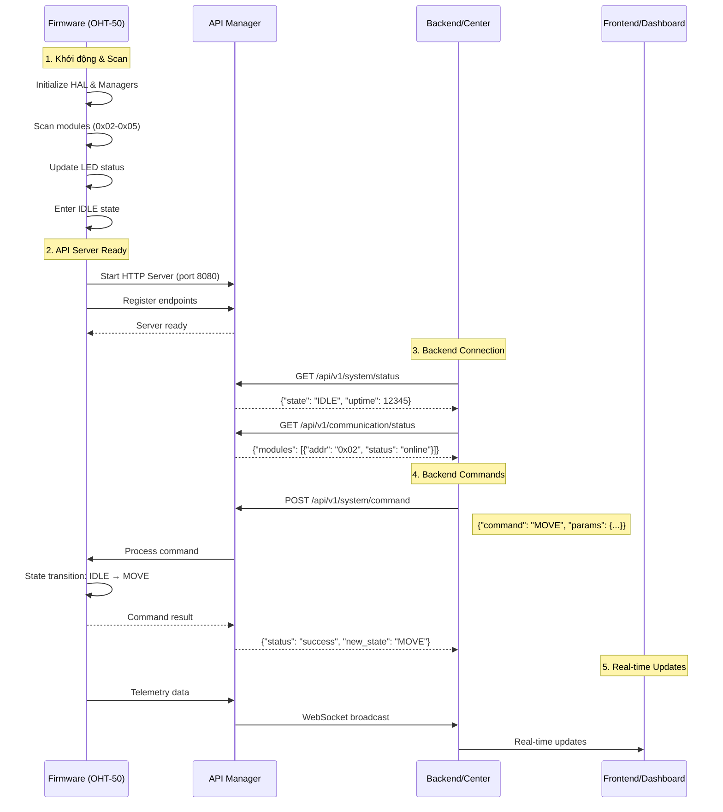

# FW ↔ Backend Communication Flow

## 📋 **Tổng quan**

Sau khi FW hoàn thành scan module, hệ thống chuyển sang chế độ **IDLE** và chờ lệnh từ Backend thông qua API endpoints.

## 🔄 **Flow chính**



## 🎯 **API Endpoints Available**

### **System Endpoints**
- `GET /api/v1/system/status` - Trạng thái hệ thống
- `GET /api/v1/system/health` - Health check

### **Network Endpoints**
- `GET /api/v1/network/status` - Trạng thái mạng
- `GET /api/v1/network/config` - Cấu hình mạng
- `POST /api/v1/network/config` - Cập nhật cấu hình mạng

### **Communication Endpoints**
- `GET /api/v1/communication/status` - Trạng thái module

### **Safety Endpoints**
- `GET /api/v1/safety/status` - Trạng thái an toàn

### **Configuration Endpoints**
- `GET /api/v1/config` - Lấy cấu hình
- `POST /api/v1/config` - Cập nhật cấu hình

## 📊 **System States & Commands**

### **Available States:**
- **IDLE** - Chờ lệnh từ Backend
- **MOVE** - Di chuyển theo lệnh
- **DOCK** - Dock vào vị trí
- **ESTOP** - Dừng khẩn cấp
- **FAULT** - Lỗi hệ thống

### **Backend Commands:**
```json
{
  "command": "MOVE",
  "params": {
    "target_position": 100,
    "speed": 50,
    "acceleration": 10
  }
}
```

```json
{
  "command": "DOCK",
  "params": {
    "dock_id": "DOCK_001",
    "approach_speed": 25
  }
}
```

```json
{
  "command": "STOP",
  "params": {
    "emergency": false
  }
}
```

## 🔧 **Implementation Details**

### **API Manager Initialization:**
```c
// In main.c
api_mgr_config_t api_config = {
    .http_port = API_HTTP_PORT,           // 8080
    .websocket_port = API_WEBSOCKET_PORT, // 8081
    .http_enabled = true,
    .websocket_enabled = true,
    .cors_enabled = true,
    .cors_origin = "*",
    .authentication_required = false      // Disable for testing
};

api_manager_init(&api_config);
api_manager_start_http_server();
```

### **Main Loop Processing:**
```c
while (g_should_run) {
    // Process API requests (handled by API Manager)
    system_state_machine_update();
    safety_manager_update();
    
    // Periodic tasks
    // - LED heartbeat
    // - Power module polling
    // - E-Stop monitoring
    
    hal_sleep_ms(10);
}
```

## 🚀 **Deployment Flow**

### **1. FW Startup:**
1. Initialize HAL layers
2. Scan modules (0x02-0x05)
3. Update LED status
4. Start API server
5. Enter IDLE state

### **2. Backend Connection:**
1. Backend connects to `http://OHT-50-IP:8080`
2. Poll system status
3. Monitor module status
4. Send commands when needed

### **3. Command Processing:**
1. Backend sends command via HTTP POST
2. API Manager validates command
3. System State Machine processes command
4. FW executes action
5. Response sent back to Backend

## 📈 **Monitoring & Telemetry**

### **Real-time Data:**
- System state changes
- Module status updates
- Safety events
- Performance metrics

### **WebSocket Events:**
```json
{
  "event": "state_change",
  "data": {
    "old_state": "IDLE",
    "new_state": "MOVE",
    "timestamp": 1234567890
  }
}
```

## 🔒 **Security Considerations**

### **Current (Testing):**
- Authentication disabled
- CORS enabled for all origins
- HTTP (not HTTPS)

### **Production:**
- Enable authentication
- Restrict CORS origins
- Enable SSL/TLS
- API rate limiting

---

**Changelog v1.0:**
- ✅ Created FW ↔ Backend communication flow documentation
- ✅ Documented API endpoints
- ✅ Explained system states and commands
- ✅ Added implementation details
- ✅ Included deployment flow
- ✅ Added security considerations

