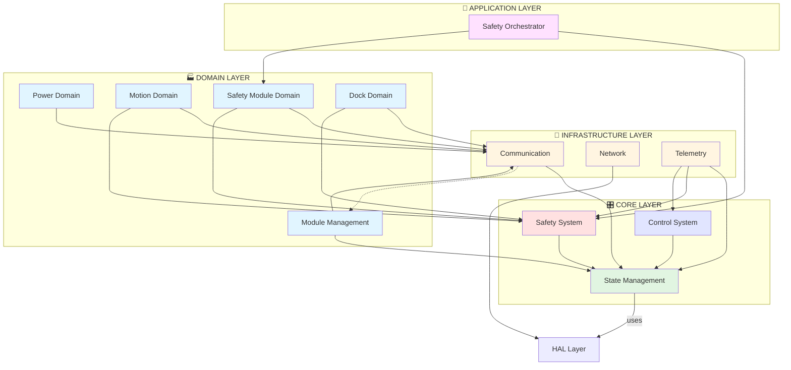

# 🏗️ OHT-50 Firmware - Domain-Driven Architecture v1.0.1

**Phiên bản:** 1.0.1  
**Ngày triển khai:** 2025-10-07  
**Architecture Pattern:** Domain-Driven Design (DDD)

---

## 📖 Tổng Quan

OHT-50 Firmware đã được **tái cấu trúc** từ monolithic architecture sang **Domain-Driven Design** để:
- ✅ Tăng khả năng maintain và scale
- ✅ Phân tách rõ ràng responsibilities theo domain
- ✅ Dễ dàng collaboration giữa các teams
- ✅ Better modularity và reusability
- ✅ Giảm coupling, tăng cohesion

---

## 🗂️ Cấu Trúc Folder

```
firmware_new/src/app/
│
├── 🎛️ core/                          # CORE LAYER
│   ├── state_management/             # System state & lifecycle
│   ├── safety/                       # Safety monitoring (CRITICAL)
│   └── control/                      # Motion control & estimation
│
├── 🔌 infrastructure/                 # INFRASTRUCTURE LAYER
│   ├── communication/                # RS485 & Modbus communication
│   │   ├── communication_manager.c/h
│   │   └── CMakeLists.txt
│   ├── network/                      # WiFi & network management
│   │   ├── network_manager.c/h
│   │   ├── wifi_manager.c/h
│   │   ├── wifi_ap_manager.c/h
│   │   ├── fallback_manager.c/h
│   │   └── CMakeLists.txt
│   ├── telemetry/                    # Telemetry & logging
│   │   ├── telemetry_manager.c/h
│   │   └── CMakeLists.txt
│   └── CMakeLists.txt
│
├── 🏭 domain/                         # DOMAIN LAYER
│   ├── module_management/            # Module lifecycle & discovery
│   │   ├── module_manager.c/h
│   │   ├── module_polling_manager.c/h
│   │   ├── module_registry.c
│   │   └── CMakeLists.txt
│   ├── power/                        # Power domain (Module 0x02)
│   │   ├── power_module_handler.c/h
│   │   └── CMakeLists.txt
│   ├── motion/                       # Motion domain (Module 0x04)
│   │   ├── travel_motor_module_handler.c/h
│   │   └── CMakeLists.txt
│   ├── safety_module/                # Safety module domain (Module 0x03)
│   │   ├── safety_module_handler.c/h
│   │   └── CMakeLists.txt
│   ├── dock/                         # Dock domain (Module 0x05)
│   │   ├── dock_module_handler.c/h
│   │   └── CMakeLists.txt
│   └── CMakeLists.txt
│
├── 🔐 application/                    # APPLICATION LAYER
│   ├── safety_orchestrator/          # Safety coordination
│   │   ├── safety_manager.c/h
│   │   └── CMakeLists.txt
│   ├── system_orchestrator/          # System coordination (future)
│   └── CMakeLists.txt
│
├── 🌐 api/                            # API LAYER
├── ✅ validation/                     # VALIDATION (cross-cutting)
├── ⚙️ config/                         # CONFIGURATION (cross-cutting)
├── 💾 storage/                        # STORAGE (cross-cutting)
│
├── ⚠️ managers/ (DEPRECATED)          # Legacy compatibility shim
│   └── CMakeLists.txt                # Redirects to new architecture
└── ⚠️ modules/ (DEPRECATED)           # Legacy compatibility shim
    └── CMakeLists.txt                # Redirects to new architecture
```

---

## 🔗 Dependency Graph



---

## 📚 Libraries Generated

### Core Layer:
- `app_core_state_management.a` - System state machine
- `app_core_safety.a` - Safety monitoring (CRITICAL)
- `app_core_control.a` - Motion control

### Infrastructure Layer:
- `app_infrastructure_communication.a` - RS485/Modbus
- `app_infrastructure_network.a` - WiFi/networking
- `app_infrastructure_telemetry.a` - Telemetry collection

### Domain Layer:
- `app_domain_module_management.a` - Module discovery/registry
- `app_domain_power.a` - Power module (0x02)
- `app_domain_motion.a` - Motor module (0x04)
- `app_domain_safety_module.a` - Safety module (0x03)
- `app_domain_dock.a` - Dock module (0x05)

### Application Layer:
- `app_application_safety_orchestrator.a` - Safety coordination

### Unified Interfaces:
- `app_infrastructure` (INTERFACE) - Links all infrastructure libs
- `app_domain` (INTERFACE) - Links all domain libs
- `app_application` (INTERFACE) - Links all application libs

### Legacy Compatibility:
- `app_managers` (INTERFACE) - Compatibility shim → infrastructure + application
- `app_modules` (INTERFACE) - Compatibility shim → domain

---

## 🎯 Design Principles

### 1. **Separation of Concerns**
- **Core** = Business logic không depend external
- **Infrastructure** = Technical services (I/O, network, persistence)
- **Domain** = Business domains (modules, handlers)
- **Application** = Coordination & orchestration

### 2. **Dependency Rule**
```
Application → Domain → Infrastructure → Core → HAL
```
- Core không depend ai (chỉ HAL)
- Infrastructure chỉ depend Core
- Domain depend Infrastructure + Core
- Application depend tất cả

### 3. **Domain Isolation**
- Mỗi domain (power, motion, safety_module, dock) độc lập
- Communication qua well-defined interfaces
- Không có cross-domain dependencies trực tiếp

### 4. **Backward Compatibility**
- Legacy `app_managers` và `app_modules` vẫn hoạt động
- Redirect tới architecture mới qua INTERFACE libraries
- Sẽ bị remove trong v1.1.0

---

## 🔧 Sử Dụng

### Include Headers (Mới):

```c
// Infrastructure
#include "../../infrastructure/communication/communication_manager.h"
#include "../../infrastructure/telemetry/telemetry_manager.h"
#include "../../infrastructure/network/network_manager.h"

// Domain
#include "../../domain/module_management/module_manager.h"
#include "../../domain/power/power_module_handler.h"
#include "../../domain/motion/travel_motor_module_handler.h"

// Application
#include "../../application/safety_orchestrator/safety_manager.h"
```

### Include Headers (Legacy - vẫn work):

```c
// Old paths vẫn work qua CMake include paths
#include "communication_manager.h"
#include "module_manager.h"
#include "safety_manager.h"
```

### Link Libraries:

```cmake
# New way (recommended)
target_link_libraries(your_target
    app_core
    app_infrastructure
    app_domain
    app_application
)

# Old way (still works via compatibility shims)
target_link_libraries(your_target
    app_core
    app_managers
    app_modules
)
```

---

## 🚀 Build System

### Build all layers:
```bash
cd build
make -j$(nproc)
```

### Build specific layer:
```bash
make app_infrastructure          # All infrastructure
make app_infrastructure_communication  # Communication only

make app_domain                  # All domains
make app_domain_power            # Power domain only

make app_application             # All application
make app_application_safety_orchestrator  # Safety orchestrator only
```

### Build main executable:
```bash
make oht50_main
```

---

## 📊 Migration Summary

### Files Moved:

**Infrastructure Layer (7 files):**
- `managers/communication_manager.*` → `infrastructure/communication/`
- `managers/telemetry_manager.*` → `infrastructure/telemetry/`
- `managers/network/*` → `infrastructure/network/`

**Domain Layer (13 files):**
- `managers/module_manager.*` → `domain/module_management/`
- `managers/module_polling_manager.*` → `domain/module_management/`
- `modules/module_registry.c` → `domain/module_management/`
- `modules/power_module_handler.*` → `domain/power/`
- `modules/travel_motor_module_handler.*` → `domain/motion/`
- `modules/safety_module_handler.*` → `domain/safety_module/`
- `modules/dock_module_handler.*` → `domain/dock/`

**Application Layer (2 files):**
- `managers/safety_manager.*` → `application/safety_orchestrator/`

**Total:** 22 files migrated across 3 layers

### CMakeLists.txt Created:

- 3 Infrastructure CMakeLists
- 6 Domain CMakeLists
- 2 Application CMakeLists
- 3 Unified layer CMakeLists
- 2 Legacy compatibility shims
- 1 Main app CMakeLists (updated)

**Total:** 17 CMakeLists.txt files

---

## ⚠️ Known Issues & TODOs

### Issue #1: Circular Dependency (TEMPORARY)
**Status:** Accepted temporarily for quick migration  
**Location:** `infrastructure/communication` ↔ `domain/module_management`  
**Root cause:** `communication_manager` calls `registry_*` functions  
**Solution:** Refactor to use callback pattern (TODO in v1.1.0)

### Issue #2: Domain Cross-References
**Status:** Accepted as intentional design  
**Location:** `module_management` includes all domain handlers  
**Root cause:** Central management needs to know all domains  
**Solution:** This is acceptable in orchestration layer

---

## 🔄 Migration Checklist

- ✅ Phase 1: Folder structure created
- ✅ Phase 2: Infrastructure layer migrated
- ✅ Phase 3: Domain layer migrated  
- ✅ Phase 4: Application layer migrated
- ✅ Phase 5: Build system updated
- ✅ Phase 6: Build successful (oht50_main: 473KB)
- ✅ Legacy compatibility maintained
- ✅ Documentation created

---

## 📞 Team Responsibilities

| Layer | Team | Files |
|-------|------|-------|
| 🎛️ Core | FW Core Team | state_management/, safety/, control/ |
| 🔌 Infrastructure | EMBED Team | communication/, network/, telemetry/ |
| 🏭 Domain | FW Domain Team | module_management/, power/, motion/, safety_module/, dock/ |
| 🔐 Application | FW Application Team | safety_orchestrator/ |

---

## 🚨 Important Notes

### For Developers:

1. **✅ DO:**
   - Use new paths khi tạo code mới
   - Follow domain boundaries
   - Update tests khi modify code
   - Document API changes

2. **❌ DON'T:**
   - Add files vào managers/ hoặc modules/ (deprecated)
   - Create cross-domain dependencies trực tiếp
   - Modify safety code without review
   - Break backward compatibility

### For Reviewers:

1. **Architecture Compliance:**
   - Check dependency direction (Core ← Infrastructure ← Domain ← Application)
   - Verify no circular dependencies (except accepted ones)
   - Ensure domain isolation

2. **Code Quality:**
   - Follow naming conventions
   - Update documentation
   - Add tests cho new functionality

---

## 📈 Performance Impact

**Build time:** ~same as before (parallel compilation)  
**Binary size:** 473KB (unchanged)  
**Runtime:** No performance impact (same compiled code)  
**Memory:** No additional overhead

---

## 🔄 Backward Compatibility

### Legacy Code Support:
```c
// OLD CODE - Still works!
#include "communication_manager.h"  // ✅ Works via CMake paths
#include "module_manager.h"         // ✅ Works via CMake paths

target_link_libraries(my_app
    app_managers    // ✅ Redirects to new libs
    app_modules     // ✅ Redirects to new libs
)
```

### Migration Path:
- **v1.0.1** (current): Both old and new paths work
- **v1.1.0** (future): Only new paths supported
- **v2.0.0** (future): Remove compatibility shims

---

## 📚 References

- [Core Architecture README](core/README.md)
- [Migration Log](../../MIGRATION_LOG_v1.0.1.md)
- [Build Guide](../../BUILD_GUIDE.md)

---

**Maintained By:** Firmware Team  
**Migration By:** AI Assistant + Human Review  
**Architecture Review:** PENDING - CTO Approval Required

---

## Changelog

### v1.0.1 (2025-10-07)
- ✅ Migrated to Domain-Driven Architecture
- ✅ Created 4-layer structure (Core/Infrastructure/Domain/Application)
- ✅ Maintained backward compatibility
- ✅ All builds passing
- ✅ Documentation updated


