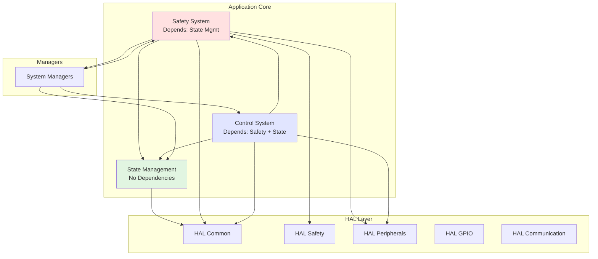

# 🏗️ Application Core - Domain-Driven Architecture

**Phiên bản:** 1.0.1  
**Ngày cập nhật:** 2025-10-07  
**Architecture:** Domain-Driven Design

---

## 📖 Tổng Quan

Application Core là **trái tim** của OHT-50 firmware, chứa các component quan trọng nhất của hệ thống.

**Từ v1.0.1:** Core đã được **restructured** thành Domain-Driven Architecture để:
- ✅ Tăng khả năng maintain và scale
- ✅ Phân tách rõ ràng responsibilities
- ✅ Dễ dàng collaboration giữa các teams
- ✅ Better modularity và reusability

---

## 🗂️ Domain Structure

### Architecture Overview:

```
src/app/core/
│
├── 🎛️ state_management/      # State & System Control
│   ├── system_state_machine.c/h
│   ├── system_controller.c/h
│   ├── CMakeLists.txt
│   └── README.md
│
├── 🛡️ safety/                 # Safety-Critical Systems
│   ├── safety_monitor.c/h
│   ├── critical_module_detector.c/h
│   ├── graduated_response_system.c/h
│   ├── safety_rs485_integration.c/h
│   ├── CMakeLists.txt
│   └── README.md
│
├── ⚙️ control/                # Motion Control
│   ├── control_loop.c/h
│   ├── estimator_1d.c/h
│   ├── CMakeLists.txt
│   └── README.md
│
├── 📦 _backup/                # Historical Backups
│   ├── safety_monitor.c.phase2.2.backup.20250919_161056
│   └── safety_monitor.c.pre-phase2.20250919_160344
│
├── CMakeLists.txt             # Main build config
└── README.md                  # This file
```

---

## 📊 Domain Summary

| Domain | Files | Lines | Library | Purpose |
|--------|-------|-------|---------|---------|
| 🎛️ **State Management** | 4 | 1,714 | `app_core_state_management.a` | System lifecycle & states |
| 🛡️ **Safety System** | 8 | 3,923 | `app_core_safety.a` | Real-time safety monitoring |
| ⚙️ **Control System** | 4 | 700 | `app_core_control.a` | Motion control & estimation |
| 📦 **Backup** | 2 | 3,500 | N/A | Historical versions |

**Total:** 18 files, ~10,000 lines of code

---

## 🔗 Dependencies

### Domain Dependency Graph:



### Dependency Rules:
- 🟢 **State Management** - KHÔNG depend on any domain
- 🔴 **Safety System** - Depends on State Management
- 🔵 **Control System** - Depends on Safety & State Management

---

## 🚀 Quick Start

### Include Headers:

```c
// State Management
#include "system_state_machine.h"
#include "system_controller.h"

// Safety System
#include "safety_monitor.h"
#include "critical_module_detector.h"
#include "graduated_response_system.h"

// Control System
#include "control_loop.h"
#include "estimator_1d.h"
```

**Note:** Include paths tự động resolve nhờ CMake configuration!

### Link Libraries:

```cmake
# In your CMakeLists.txt
target_link_libraries(your_target
    app_core  # Links all 3 domain libraries automatically
)
```

---

## 📚 Documentation

### Domain Documentation:
- 📖 [State Management README](state_management/README.md)
- 📖 [Safety System README](safety/README.md)
- 📖 [Control System README](control/README.md)

### Architecture Documentation:
- 📖 [Migration Log](../../../MIGRATION_LOG_v1.0.1.md)
- 📖 [Code Structure](../../../CODE_STRUCTURE.md)
- 📖 [Main README](../../../README.md)

---

## 🔧 Build System

### Libraries Built:

```cmake
# State Management
app_core_state_management.a
  ├── system_state_machine.o
  └── system_controller.o

# Safety System
app_core_safety.a
  ├── safety_monitor.o
  ├── critical_module_detector.o
  ├── graduated_response_system.o
  └── safety_rs485_integration.o

# Control System
app_core_control.a
  ├── control_loop.o
  └── estimator_1d.o

# Unified Interface
app_core (INTERFACE)
  └── Links all 3 libs above
```

### Build Commands:

```bash
# Build specific domain
cmake --build build --target app_core_state_management
cmake --build build --target app_core_safety
cmake --build build --target app_core_control

# Build all core
cmake --build build --target app_core
```

---

## 🎯 Design Principles

### Domain-Driven Design:
1. **📦 Bounded Contexts** - Mỗi domain có clear boundaries
2. **🔗 Explicit Dependencies** - Dependencies rõ ràng trong CMake
3. **📚 Ubiquitous Language** - Consistent naming trong domain
4. **🎯 Single Responsibility** - Mỗi domain có 1 purpose chính

### Clean Architecture:
1. **🔵 Independence** - State Management không depend gì
2. **🔴 Safety First** - Safety layer bảo vệ Control layer
3. **🟢 Testability** - Mỗi domain test độc lập
4. **⚡ Performance** - No overhead từ architecture

---

## ⚠️ IMPORTANT NOTES

### For Developers:

#### ✅ DO:
- Read domain README trước khi modify code
- Follow domain boundaries
- Update tests khi thay đổi code
- Document API changes
- Respect safety-critical markers

#### ❌ DON'T:
- Cross domain boundaries without reason
- Modify safety code without safety review
- Add dependencies without checking
- Break backward compatibility
- Ignore warnings

### For Safety-Critical Code:

**🔴 Safety System domain contains SAFETY-CRITICAL code!**

**Before modifying safety code:**
1. ✅ Read safety documentation
2. ✅ Understand safety requirements
3. ✅ Get safety review approval
4. ✅ Run full safety test suite
5. ✅ Update safety documentation

---

## 🔄 Version History

### v1.0.1 (2025-10-07) - Domain-Driven Migration
- ✅ Restructured core thành 3 domains
- ✅ Created modular build system
- ✅ Added domain documentation
- ✅ Fixed 2 bugs discovered during migration
- ✅ Backward compatible migration

### v1.0.0 (2025-10-07) - Initial Release
- ✅ Initial monolithic core structure
- ✅ Basic functionality working
- ✅ All tests passing

---

## 📞 Support

### Questions?

| Question | Contact |
|----------|---------|
| State Management | FW Team - State Group |
| Safety System | FW Team - Safety Group |
| Control System | FW Team - Control Group |
| Build System | DevOps Team |
| Architecture | FW Team Lead / CTO |

### Resources:
- 📖 [Main Documentation](../../../DOCUMENTATION.md)
- 📖 [Migration Log](../../../MIGRATION_LOG_v1.0.1.md)
- 📖 [Build Guide](../../../BUILD_GUIDE.md)
- 📖 [Code Quality Guide](../../../CODE_QUALITY.md)

---

**Maintained By:** Firmware Team  
**Last Updated:** 2025-10-07  
**Architecture:** Domain-Driven Design v1.0.1

