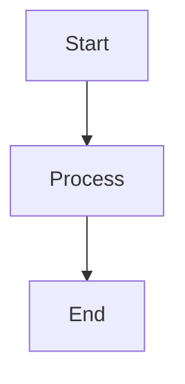
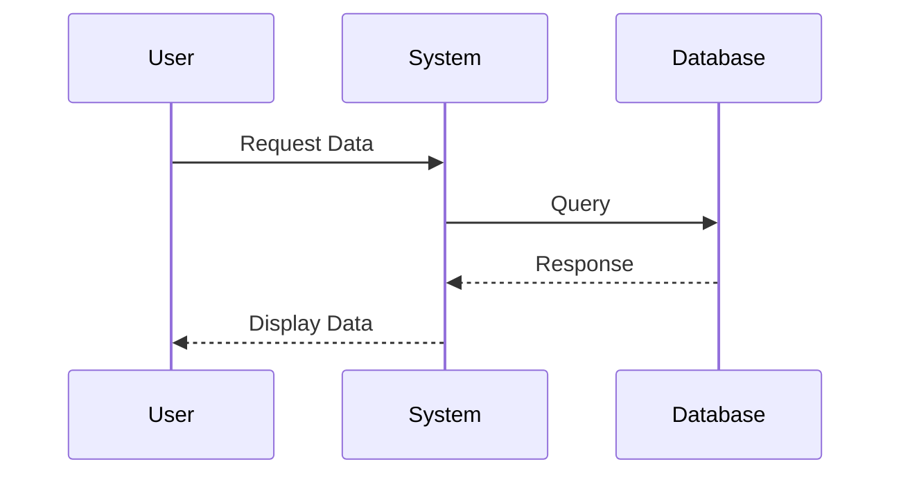
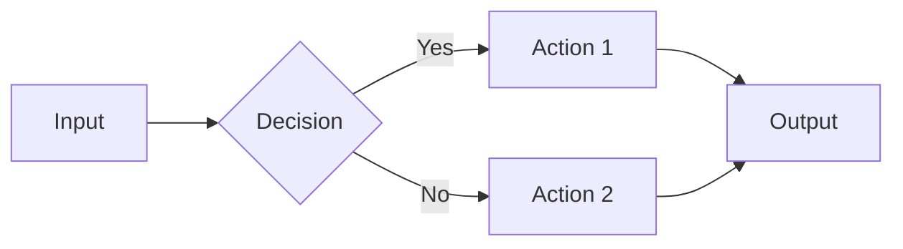

# Test Mermaid Diagram

## Sơ đồ đơn giản

```mermaid
graph TD
    A[Start] --> B[Process]
    B --> C[End]
```

## Sơ đồ phức tạp hơn

```mermaid
sequenceDiagram
    participant User
    participant System
    participant Database
    
    User->>System: Request Data
    System->>Database: Query
    Database-->>System: Response
    System-->>User: Display Data
```

## Flowchart

```mermaid
flowchart LR
    A[Input] --> B{Decision}
    B -->|Yes| C[Action 1]
    B -->|No| D[Action 2]
    C --> E[Output]
    D --> E
```
